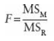
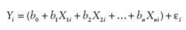
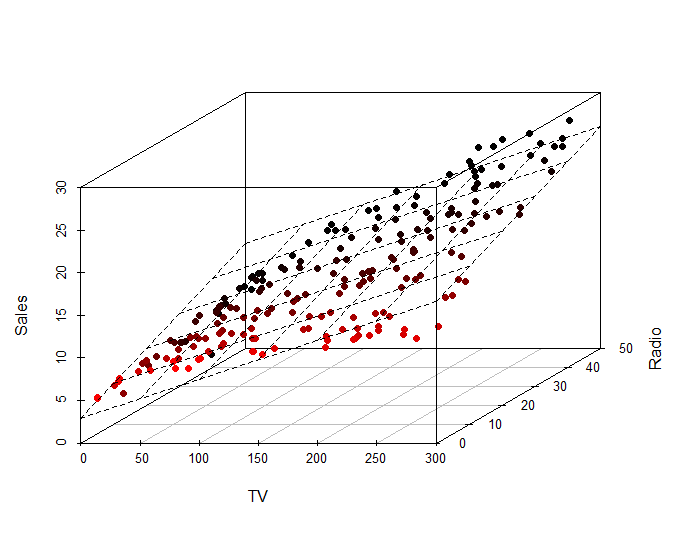
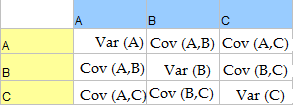
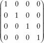
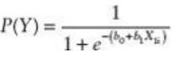
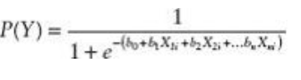
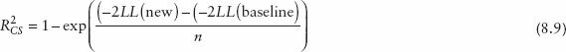

# FOGALOMTÁR A LINEÁRIS REGRESSZIÓHOZ {-}

## Hasznos linkek

Markdown dokumentum az explorátoros modellépítésről R-ben egy egyszerű
példán keresztül:

[[https://htmlpreview.github.io/?https://github.com/nthun/courses-multivariate-statistics-in-R-2017-fall/blob/master/wine_linear_regression_solution.nb.html]](https://htmlpreview.github.io/?https://github.com/nthun/courses-multivariate-statistics-in-R-2017-fall/blob/master/wine_linear_regression_solution.nb.html)

15 regresszió-típus

[[https://www.r-bloggers.com/15-types-of-regression-you-should-know/]](https://www.r-bloggers.com/15-types-of-regression-you-should-know/)


## A regresszióról általánosságban

A regresszió egy statisztikai eljárás, melynek során egy adott változó
értékeit megpróbáljuk **bejósolni** egy vagy több másik változó értékei
alapján. A változót, amit bejósolni próbálunk **kimeneti** (outcome)
vagy **függő** (dependent) változónak hívjuk, a többi változót, amelyek
alapján a becslést végezzük pedig **prediktor** (predictor) vagy
**független** (independent) változóknak. Ezt úgy tesszük, hogy egy
modellt illesztünk az adatokra, ami a kimeneti változó értékeit a
prediktor változók értékei alapján becsli meg, majd megnézzük, hogy a
modellünk mennyire illeszkedik az adatokhoz, azaz a modell által becsült
értékek mennyire vannak közel a tényleges értékekhez. A regresszió a
korrelációval ellentétben lehetőséget ad **ok-okozati kapcsolatok**
statisztikai kimutatására is.

Forrás: Field, A., Miles, J. and Field, Z. (2012). *Discovering
statistics using R*. London: Sage. (7.2.)

## Legkisebb négyzetek módszere

A legkisebb négyzetek módszerével azt az egyenest találhatjuk meg, amely
a **legjobban illeszkedik** az adatainkra, azaz az egyenes és a kapott
adatok közötti távolság összege a legkisebb az összes lehetséges egyenes
közül. Egy modell illeszkedésének a pontosságát megvizsgálhatjuk úgy,
hogy megnézzünk minden kapott adat vertikális távolságát az egyenestől
(azaz a modell által jósolthoz képest mekkora az eltérés/pontatlanság).
Regresszióban ezeket a különbségeket **reziduálisoknak/maradék
hibáknak** nevezzük. Ezek a hibák egyes esetekben pozitív értéket
vesznek fel (az adat az egyenes fölé esik), máskor negatívat (az egyenes
alá esik). Ha ezeket a reziduálisokat összeadnánk, kiegyenlítenék
egymást, ezért azokat négyzetre emeljük, és ezeket adjuk össze. Minél
kisebb ezeknek az összege, a modellünk (az egyenes) annál jobban
reprezentálja az adatokat, így az az egyenes a legjobb, amely esetében a
legkisebb a reziduálisok négyzetösszege - a legkisebb négyzetek módszere
pedig ezt az egyenest találja meg számunkra.

[[Ezen a linken]](http://www.dangoldstein.com/regression.html)
játékosan is ki lehet próbálni hogyan működik a legkisebb négyzetek
módszere.

Forrás: Field, A., Miles, J. and Field, Z. (2012). *Discovering
statistics using R*. London: Sage. (7.2.2.)

## R és R^2^

Ahhoz, hogy megmondjuk, mennyire hatékony a legjobb modell, amit
találtunk az adataink bejóslásához, össze kell hasonlítanunk a
megmagyarázandó variancia mennyiségét a megmagyarázottal. Az előbbit
számszerűsíthetjük a lehető legegyszerűbb modell (az átlag)
reziduális-összegeként. Az utóbbit pedig jelzi a legjobb modellünk
reziduális összege. Az utóbbit osztva az előbbivel megkapjuk az R^2^-et.
Ennek a négyzetgyöke a Pearson féle korrelációs koefficiens (r).

A többszörös regressziónál konceptuálisan hasonlóan állítjuk elő a
megmagyarázandó és a megmagyarázott értékeket, az R^2^ helyett viszont
többszörös R^2^-et számolunk, ami a modell által bejósolt és a
megfigyelt értekek között fennálló korrelációs értéket jelzi.

(Field 7.2.3.)

## F statisztika

Minél nagyobb az R^2^, annál nagyobb a megmagyarázott variancia, azonban
az R^2^ segítségével másképp is értékelhetjük a modellünket: az
F-statisztikával. Az F-statisztika egyéb teszt statisztikákhoz hasonlóan
a szisztematikus (megmagyarázott) variancia és a nem szisztematikus
variancia hányadosa - azaz a modell és a modellben található hiba
aránya. Tehát egy jó modellnek nagy F-ratio-val kell rendelkeznie
(legalább F = 1), míg egy kevésbé jobb modellnek kisebbel.

{width="0.8333333333333334in" height="0.625in"}

MS~M~ = mean squares of the model = a modelltől való eltérések négyzetre
emelve és összeadva, majd átlagolva

MS~R~ = residual mean squares

## A prediktorok hatékonyságának megítélése

### A regressziós koefficiensek/ béták (hiányzik)

A regressziós modellben minden prediktornak van egy regressziós
együtthatója (béta), ami az egyszerű regressziónál a regressziós egyenes
meredekségét jelöli. Béta értéke megmutatja, hogy a prediktorban
létrejött egységnyi változás hatására mennyit változik a kimeneti
változó.

A lineáris regressziós modellek jóságának méréséhez a kiindulópontot, az
"abszolút nullát" az a modell adja, amelyik a prediktor változótól
függetlenül mindig a minta átlagát adja vissza. Ezt egy regressziós
grafikonon egy vízszintes egyenessel lehetne ábrázolni, mivel a
prediktor változó (vízszintes tengely) változásának hatására a bejósolt
érték (függőleges tengely) nem változik, mivel mindig a minta átlaga
lesz a "jóslás" eredménye. Ebben az esetben a regressziós együttható
(*b*) és ezáltal a regressziós egyenes meredeksége 0. Ez nyilvánvalóan
nem egy hatékony bejóslás, de jó kiindulópont a regressziós modellek
megítéléséhez.

Ahhoz hogy egy modell hasznos legyen, a regressziós együtthatónak (*b*)
szignifikánsan különböznie kell 0-tól. Ennek eldöntésére t-tesztet
használunk. Nullhipotézisnek az előzőek alapján az az esetet választjuk,
amikor *b* nulla. Ha a teszt szignifikáns, akkor valószínűsíthető, hogy
*b* nem nulla, tehát a prediktor változó hasznosan hozzájárul a
predikcióhoz.

Amire ténylegesen kíváncsiak vagyunk, az az, hogy a *b* értéke magas -e
a hibához képest. A hibát úgy kapjuk meg, hogy megnézzük mekkora a
különböző mintákban b értéke. Ha ábrázoljuk ezeknek a mintáknak a
gyakorisága eloszlását, akkor a standard hiba, az eloszlás szórása. A
t-teszt képlete:

$t = \frac{b{}_{\text{observed}}}{\text{SE}{{\text{\ b}_{}}_{}}_{}}$

(Andy Field könyv 7.2.4 fejezet)

## Többváltozós regresszió

A többváltozós lineáris regresszió az egyszerű lineáris regresszió
logikai kiterjesztése arra az esetre, amikor több prediktor változónk
van. A regressziós egyenlet a következő:

{width="3.2291666666666665in"
height="0.5208333333333334in"}

Ahol, Y a függő változó, b1 az első prediktor (X1i) együtthatója, b2 a
második prediktor (X2i) együtthatója, bn az n-ik prediktoré (Xni), b0 az
intercept, $\varepsilon i$ pedig Y prediktált és megfigyelt értéke közti
különbség az i-ik résztvevő esetén. Így az egyenlet lényegében azonos az
egyszerű lineáris regresszió egyenletével, csak most minden további
prediktor változóhoz hozzárendelünk egy együtthatót. Az együtthatók
keresése itt is a legkisebb négyzetek elve alapján történik.
Algebrailag, a prediktor változók olyan lineáris kombinációját keressük,
ami maximálisan korrelál a függő változóval. Geometriailag (amíg
egyszerű lineáris regressziónál az adatokra legjobban illeszkedő egyenes
megtalálása volt a cél), most az n+1 dimenziós térben adott pontokhoz
legjobban illeszkedő hipersíkot keressük (ahol n a prediktor változók
számát jelöli).

Az következő ábra egy két prediktor változóból álló három dimenziós
modellt ábrázol (szaggatott vonal jelöli a regressziós síkot):

{width="3.910617891513561in"
height="3.0781255468066493in"}

## Regressziós módszerek

Amennyiben komplex regressziós modellt szeretnénk felállítani több
prediktor (független) változóval, felmerül a kérdés, hogy pontosan mely
változókat alkalmazzuk. Mivel a regressziós együttható értéke a bevitt
változóktól függ, különös megfontolást igényel, hogy mely változókat
vigyük be a modellbe. A már meglévő modellekbe új változókat az elméleti
háttér figyelembevételével érdemes beilleszteni.

### Hierarchikus módszer

A hierarchikus módszer lényege, hogy a módszert alkalmazó kutató a
korábbi munkákra alapozva választja ki, hogy mely független változókat
milyen sorrendben viszi be a modellbe. Általában véve a már ismert
független változók prioritást élveznek, ezután következnek az újak,
amelyek hatása még nem ismert. Ezen új változók bevihetők egyszerre,
lépésenként, vagy hierarchikusan (azaz a becsült hatásnagyság
alapján).

### Kényszerített bevitel ("forced entry")

Ebben a módszerben a független változók egyszerre kerülnek a modellbe,
ez esetben a hierarchikus módszerhez képest a kutató nem hoz döntést a
prediktorok sorrendjéről, viszont fontos, hogy a változók bevitelét
itt is az elméleti háttér indokolja. Egyes kutatók szerint az egyetlen
helyes módja az elméleti tesztelésnek, mivel a lépésenkénti bevitelt
az adatok random variációja oly módon befolyásolja, hogy az eredmény
ritkán lesz replikálható.

### Lépésről lépésre történő regresszió (Stepwise methods)

Ebben a regressziós módszerben a független változók sorrendjét pusztán
matematikai szempontok alapján döntjük el. Ennek a sorrendnek három
fajtája lehet: előrefele történő (forward) hátrafele történő
(backward) és mindkét irányba történő (both).

Az **előre fele történő** regresszió során a modellbe először a
konstans (b0) kerül be. Ezután a program megkeresi azt a független
változót ami a legjobban bejósolja a függő változót. Ezt úgy teszi
meg, hogy azt választja ki, amelyiknek a legnagyobb korrelációja van a
függő változóval. Ha ez a változó ténylegesen fejleszti a modell
képességét, hogy bejósolja a függő változót, akkor ezt a független
változót megtartja, és keres egy második változót. A feltétele ennek a
változónak a kiválasztására, hogy ennek legyen a legnagyobb
fél-parciális (semi partial) korrelációja a függő változóval.
Képzeljük el, hogy az első változó 40%-át megmagyarázza a függő
változó varianciájának, tehát 60% még megmagyarázásra vár. A program
azt a változót keresi meg, amelyik a legjobban meg tudja magyarázni a
fennmaradó 60%-ot, a meglévő 40-ben már nem érdekelt. Így ez a
fél-parciális korreláció azt mutatja meg, hogy mennyi „új variancia"
van megmagyarázva a második független változó által. Az a változó,
amelyik a legtöbb fennmaradó varianciát magyarázza meg, hozzáadódik a
modellhez, és ha hozzájárul a jósló erejéhez, akkor meg is lesz
tartva. Ezután egy másik független változó következik.

Az R programnak el kell döntenie, hogy mikor áll le független változók
hozzáadásával, és ezt az Akaike információs kritérium (AIC) alapján
teszi meg (minél alacsonyabb az AIC értéke, annál jobb a modell). Egy
független változót akkor tartunk meg, hogyha az javítja, azaz
csökkenti az AIC értékét. Hogyha már nincs olyan változó ami csökkenti
az AIC értékét, akkor a modell elkészült.

A **hátrafele történő** módszer az ellentétje az előrefelének abban az
értelemben, hogy a program először belerakja az összes változót, és
utána megnézi, hogy lemegy-e az AIC, ha kivesz egyesével változókat.
Hogyha egy változót eltávolít, akkor a fennmaradó változók
hozzájárulása kiértékelődik, és a folyamat folytatódik, ameddig egy
változó eltávolítása az AIC emelkedését nem eredményezi.

Az **mindkét irányba haladó módszer** úgy indul, mint az előrefelé
irányuló, azzal a különbséggel, hogy minden egyes alkalommal, amikor
egy változót hozzáad, egy eltávolítási tesztet végez el, hogy
megtalálhassa a legkevésbé hasznos független változót. Így
folyamatosan újravizsgálja a regressziós egyenletet, hogy találjon
felesleges változókat, amiket el lehet távolítani.

Ha lépésről lépésre történő módszer mellett döntünk, akkor a hátrafelé
történő módszer előnyösebb az előrefele történőnél. Ez az elfojtó
hatások (suppressor effects) miatt van, ami akkor történik meg, ha egy
független változónak van hatása, de csak ha a másik változó állandó
(konstans). Az előrefele történő kiválasztás során nagyobb eséllyel
hagy ki változókat, amelyek szupresszor hatásban vannak. Így ez
nagyobb eséllyel követ el II-es típusú hibát (azaz kihagy egy
változót, ami ténylegesen bejósolja a függő változót).

Jó ismerni ezeket, de nem ajánlottak!

```{=html}
<!-- -->
```
### All subsets methods 

A lépésről lépésre történő módszerek nagy hibája, hogy az alapján
dönti el egy változóról, hogy az beleillik-e egy modellbe, hogy addig
milyen változók vannak már a modellben. Ennél jobb módszer az all
subsets módszere. Ahogy a neve is mutatja, ez a módszer kipróbálja az
összes lehetséges kombinációját a független változóknak, hogy
megnézze, melyik illik a legjobban a modellbe (amit Mallow's Cp
statisztikája határoz meg). Ennek a módszernek a problémája, hogy
ahogy nő a független változók száma, úgy exponenciálisan nő a
lehetséges modellek száma. Szerencsére a számítógépek már nem olyan
lassúak mint régen, tehát ez a módszer is járható utat kínál.

### A megfelelő módszer kiválasztása

Vannak bizonyos megfontolások, amelyek szem előtt tartandók. Ha
rendelkezésre áll biztos szakirodalmi háttér, érdemes támaszkodni rá,
amikor a változókról vagy azok sorrendjéről döntünk. Az első
(konfirmatív) vizsgálatot követően a statisztikailag elhanyagolható
változókat kihagyhatjuk. Fontos továbbá, hogy ne vigyünk be túl sok
változót (regressziós együttható!), és szakirodalmilag kellően
megalapozott változókkal dolgozzunk.

## AIC (Akaike Information Criteria) és BIC (Bayesian Information Criteria)

Többszörös regresszió esetén a modell illeszkedésének egyik mutatója az
R^2^, ami a kimeneti változó valódi értékei és a modell által bejósolt
értékek közötti korreláció négyzete. A probléma ezzel a mutatóval, hogy
amennyiben több prediktor változót adunk a modellhez, minden esetben
magasabb lesz az értéke. Ennél fogva pusztán ez alapján nehéz pontos
képet kapni több modell magyarázó erejéről, és választani közülük. Az
Akaike Information Criteria (AIC) egy alternatív illeszkedési mutató,
ami számításba veszi a modellben lévő prediktorok számát. Az AIC
egyenlete a következő:

AIC = n*ln(SSE/n) + 2k

ahol az n a modell eseteinek száma, az ln a természetes logaritmus, az
SSE (Sum of Square Errors) a hibák négyzetének összege, a k pedig a
prediktor változók száma. Az egyenlet végén szereplő +2k komponens miatt
egy több prediktort tartalmazó, de jobban nem illeszkedő modell értéke
magasabb lesz, mint egy hasonlóan illeszkedő, de kevesebb változót
tartalmazó modell esetében.

Tehát minél alacsonyabb az AIC értéke, annál jobban illeszkedik a modell
az adatokhoz, és ami lényeges, ez a módszer figyelembe veszi a prediktor
változók számát is. Így az AIC alapján pontosabban tudunk választani
alternatív modellek között. Fontos viszont tisztában lenni vele, hogy az
AIC értékek csakis ugyanazon adatokra vonatkozó modellek esetén
összehasonlíthatóak.

Legalább 2-vel kell csökkennie az AIC-nak, hogy jobbnak hívjunk egy
modellt egy másiknál.

A Bayesiánus statisztikában létezik egy ehhez nagyon hasonló kritérium,
amit BIC-nek nevezünk, ami nem meglepő módon a Bayesian Information
Criterium rövidítése. Ez szintén a modell illeszkedésének mértéke, ami a
modell paramétereit is számításba veszi és szintén, minél alacsonyabb az
értéke, annál jobb a modell illeszkedése.

## A modell általánosításának feltételei

Ahhoz, hogy a regressziót általánosítani tudjuk a populációra (tehát
hogy megpróbáljuk bizonyítani, nemcsak a mintánkra igaz a felállított
modell), számos kritériumnak teljesülnie kell:

1\. Változók típusai: Az összes független változónak kategoriálisnak
(nominális vagy ordinális, maximum két kategóriával!), vagy folytonosnak
(skála típusú) kell lennie. A függő változó pedig szintén folytonos
változó kell legyen. Emellett szintén fontos, hogy a változón elért
értékek a mintán ne legyenek behatárolva egy bizonyos intervallumra a
skálán belül.

2\. A független változók értékeinek varianciája ne legyen nulla.

3\. A független változók között ne legyen magas korreláció.

4\. A független változók ne korreláljanak egyéb, a regresszióba be nem
vont változókkal.

5\. A reziduálisoknak a független változó összes szintjén ugyanakkora
varianciával kell rendelkezniük - homoszkedaszticitás kritériuma (a
regressziós egyenesen haladva a variancia ne változzon az egyes
szinteket összehasonlítva).

6\. Független hibák:

A reziduális értékeknek függetleneknek kell lenniük bármely két
megfigyelésnél (azaz nincs autokorreláció). Ezt a feltevést a
**Durbin-Watson teszt**tel tehetjük próbára, ami a hibák közötti
sorozatos korrelációt méri (pontosabban azt, hogy a szomszédos
reziduális értékek korrelálnak-e). A teszt eredménye 0-tól 4-ig
terjedhet, ahol a 2 jelenti azt, hogy nincs korreláció a reziduális
értékek között. A 2-nél alacsonyabb értékek pozitív, a 2-nél magasabb
értékek pedig negatív korrelációt jeleznek. A bevett gyakorlat szerint
az egynél kisebb vagy háromnál nagyobb értékek egyértelműen aggodalomra
adnak okot. Ámbár a kettőhöz közel álló értékek is problémásak lehetnek
a mintától és a modelltől függően (mivel a Durbin-Watson teszt eredménye
függ a független változók és a megfigyelések számától is). Azonban
legyünk nagyon óvatosak a Durbin-Watson teszttel, mivel a kapott
eredmény függ az adatok sorrendjétől **--** ha átrendezzük az adatokat,
más eredményt kapunk.

7\. Normál eloszlású hibák:

Az a feltevésünk, hogy a reziduális értékek a modellben random, normál
eloszlású változók, és az átlaguk nulla. Ez a feltételezés azt jelenti,
hogy a különbség a modell és a megfigyelt adatok közt leggyakrabban
nulla, vagy nagyon közel van a nullához, és hogy nullánál jelentősen
nagyobb különbségek csak esetenként fordulnak elő. (Pár ember
összekeveri ezt azzal, hogy a független változóknak normál
eloszlásúaknak kell lenniük, de ez nem így van.)

8\. Az a feltevésünk, hogy a kimeneti változó összes értéke független.

9\. Az a feltevésünk, hogy az összefüggés, amit modellezünk, lineáris.
Ha egy nem lineáris összefüggést modellezünk egy lineáris modellel, ez
érthető módon korlátozza az eredményeink általánosíthatóságát.

## Keresztvalidálás (cross-validation)

A keresztvalidálás egy, a regressziós modellek általánosításához
(generalizálásához) használt eljárás. Az eljárás során azt vizsgáljuk,
hogy a modellünk (ugyanazokkal a független és függő változókkal) egy
másik mintára alkalmazva milyen jó előrejelzéseket ad. A
keresztvalidálásnak két módszere van: (1) igazított R^2^, (2) adatok
szétválasztása.

-   **Igazított (adjusted) R^2**

Ez az érték az ún. "shrinkage"-et mutatja, azaz hogy a modell prediktív
ereje mennyire csökkent a másik mintára alkalmazva.

Amíg a sima R^2 azt mondja meg, hogy az adott mintára illesztett
modellünk az össz varianciából (reziduálisokból) mennyit magyaráz meg,
az igazított R^2 azt mutatja, hogy mennyi varianciát magyarázna, ha a
modellt abból a populációból kaptuk volna, amiből a mintát vettük.

-   **Adatok szétválasztása**

Ez a módszer abból áll, hogy az adatokat random módon két részre
szedjük, és az egyik részre kapott regressziós modellt az adatok másik
felére illesztjük. A stepwise regressziós eljárásoknál ajánlott a
modellt az adatok 80%-ára lefuttatni, majd a maradék 20%-ra
ráilleszteni. A két mintán kapott béták és R^2^ -ek összehasonlításával
megnézhetjük, hogy a modellünk milyen jól általánosítható.

Forrás: Andy Field

## Mintaméret a regresszióban 

A két leghasználhatóbb hüvelykujjszabály a regresszióelemzéshez gyűjtött
mintaméret meghatárotására a következő:

**Prediktorok száma alapján**

Ha a regressziós modellünkben *k* darab prediktorunk van, akkor 50 +
8*k* vagy 104+*k* adatot gyűjtsünk. Azt az egyenletet alkalmazzuk,
amelyik alapján nagyobb mintaméret jön ki.

**Hatásméret alapján**

Ha nagy hatást akarunk kimutatni, akkor 80 fő elég a mintánkba (20
predikor változóig). Ha közepes hatást várunk, akkor 200 fő elég (20
prediktor változóig). Ha a mérni kívánt hatás kicsi, akkor 6 predikor
változóig 600 fő elegendő, hogy azt kimutassuk. A hatásméretekről
bővebben a [[Metaanalízis
vademecumban]](https://docs.google.com/document/d/1k4DsNl8oCs3NPrU6Ask46qbtUPogY_lAhKViV6piT7U/edit)
lehet olvasni.

Forrás: Field, A., Miles, J. and Field, Z. (2012). *Discovering
statistics using R*. London: Sage. (7.7.2.3)

## Multikollinearitás

Multikollinearitás akkor lép fel, amikor erős korreláció van kettő vagy
több prediktor változó között a regressziós modellben. Tökéletes
kollinearitás (amikor a korreláció 1) a való életben szinte soha sem
fordul elő, viszont valamennyi korreláció majdnem mindig van a prediktor
változók között.

**Megbízhatatlan b**

A kollinearitással együtt nő a b regressziós együttható standard hibája,
ami azt jelenti, hogy különböző mintákban jelentősen eltérő értékeket
vehet fel. Azért megbízhatatlan, mert általa a mintánk kevéssé
megbízhatóan reprezentálja a populációt. Ebből adódik, hogy a modellünk
nem konzisztensen fogja bejósolni az eredményeket.

**Az R mértékét csökkenti**

Ha kettő vagy több prediktor változó korrelál egymással, az egyben azt
is jelenti, hogy osztoznak a megmagyarázott variancia egy bizonyos
részén. Tegyük fel, hogy van két, egymással erősen korreláló prediktor
változónk egy modellben: szülői szigor és a közoktatásban eltöltött évek
száma. Ha a depressziót vesszük kimeneti változónak, akkor lehet, hogy a
szülői szigor és az iskolában töltött évek együtt a variancia 82%-át
megmagyarázzák, de ha csak azt nézzük, hogy a szülői szigor mennyire
játszik közre, azt tapasztalhatjuk, hogy a varianciának csak a 2%-át
magyarázza. Ilyen esetben a változó **egyedi varianciája** alacsony.

**A prediktorok fontossága**

Multikollinearitás esetén a korreláló változók közül nem lehet
megállapítani, melyik játszik jelentős szerepet. Az előző példára
visszatérve, nem tudjuk megmondani, hogy a szülői szigor vagy az
iskolában eltöltött évek száma külön-külön mennyire jelentős
előrejelzője a depressziónak.

**VIF/ tolerance**

Ahelyett, hogy korrelációkat számolnánk a prediktor változókra (ami sok
prediktor esetén követhetetlen), a "variance inflation factor"-t
(**VIF**) érdemes használni. A VIF azt jelöli, hogy egy prediktor szoros
lineáris kapcsolatban áll-e másik változókkal. Ha egy prediktor VIF
értéke meghaladja a 10-et, az arra utal, hogy korrelál más változókkal.
Ha az átlag VIF meghaladja az 1-et, akkor fennáll a veszélye, hogy a
regressziós modellt torzítja a multikollinearitás.

Ha a VIF-nek a reciprokát vesszük (1/VIF), az ún. **tolerance** értéket
kapjuk, ami 1/10 alatt utal súlyos multikollinearitásra, de 2/10 alatt
már aggodalomra adhat okot.

Forrás: Field, A., Miles, J. and Field, Z. (2012). *Discovering
statistics using R*. London: Sage. (7.7.2.4)

## Cook's distance vagy Cook's D

A regresszióban a Cook's distance-t arra használjuk, hogy meghatározzuk,
melyik megfigyelések meghatározóak, és melyik megfigyelések nem
meghatározóak (outlierek) a regressziós modellünk szempontjából. A
Cook's distance függvénye figyelembe veszi a leverage-et és a
reziduálisokat is. Általános ökölszabály, hogy egy megfigyelés, aminek a
Cook's D értéke háromszor nagyobb, mint az átlag, az egy outlier. Ha a
Cook's D \> 1, akkor a megfigyelés meghatározó.

## Shiny App-ek 

Többváltozós regresszió:

[[https://gallery.shinyapps.io/multi_regressio]](https://gallery.shinyapps.io/multi_regression/)

Multikollinearitás hatása a regresszió eredményére:

[n/<https://gallery.shinyapps.io/collinearity/>]

Influence analysis:

[[https://omaymas.shinyapps.io/Influence_Analysis/]](https://omaymas.shinyapps.io/Influence_Analysis/)

## Regresszió--elemzés (Regression diagnostics)

Lényege, hogy megnézzük illik-e a kialakított modell (regressziós
egyenes) az adatainkhoz, hogy kevés eset befolyásolja-e csak, valamint
az influential cases és az outlierek megtalálása.

Outlier (szélsőséges érték): lényegesen eltér a többi adattól, ezért
torzítást okoz a modellben. A modellben az outlier az interceptet és az
együtthatót is befolyásolja (ezt ábrázolva a regressziós egyenes
metszéspontját és a dőlési szögét). Mivel az outlier jelentősen eltér a
modell által jósolt értéktől, valószínű, hogy arra bukkantunk, ha egy
reziduális feltűnően nagy értékkel rendelkezik.

Reziduálisok: a modellben lévő hibákat reprezentálják. A regresszió
grafikus ábrázolásakor reziduálsok alatt a regressziós egyenes és az
adatpont távolságát értjük.

{width="2.901042213473316in"
height="1.8468842957130358in"}

Minél nagyobb a reziduálisok értéke, annál rosszabbul reprezentálja az
adatokat a modell. Két alapvető fajtája a normál, vagy nem standardizált
reziduális és a standardizált reziduális. A nem standardizált
reziduálisoknál megnézhetjük, melyik tűnik különösen nagynak, azt
azonban nem tudjuk definiálni, mi számít *különösen nagynak*. Erre jók a
standarizált reziduálisok. Ezekkel már összes tudjuk hasonlítani a
reziduálisokat a modellek között,

Influential cases/ befolyásoló esetek -- Olyan adatok, amelyek
eltávolításával az eredményünk jelentősen megváltozna (egyes adatok,
nagyobb mértékben befolyásolják az eredményünket, mint mások). Ez a hiba
a legkisebb négyzetek módszerének az eredménye.

Kiszűrésükre alkalmas eljárások:

illesztett előrejelzett érték (adjusted predicted value) - előrejelzés
készítése a kétséges adat/ok nélkül. Amennyiben az eredmény közel azonos
az eredeti eredményünkhöz, a modellünk stabilnak mondható, mert nem csak
bizonyos adatok befolyása alatt áll. Az illesztett előrejelzett érték és
az eredeti előrejelzett érték (original predicted value) közti
különbséget DDFIT-nek nevezzük.

Studentized residual - Az illesztett előrejelzett érték és az eredeti
megfigyelt érték (original observed value) különbsége, majd ez a
különbség osztva a standard hibával.

Cook's distance/Cook-féle D-statisztika/ Cook-távolság - arra alkalmas
hogy megnézzük, egyetlen eset befolyását a modellre mint egészre. Cook
és Weisberg alapján azok az értékek vehetők számításba, amelyek értéke
nagyobb mint 1.

Hat values/leverage - a megfigyelt értékek befolyásának mértékét
határozza meg. Értékei 0 (nincs befolyásolás) és 1 (teljes mértékű
befolyásolás) között mozognak.

DFBeta - paraméterek közötti különbség, mikor minden esetet számba
veszünk, és mikor egy bizonyos esetet nem veszünk számba. R-ben
használatos. Nagymértékű befolyással rendelkező esetek kiszűrésére
alkalmas.

Azok alapján, hogy milyen eredményeket kapunk, nem feltétlenül szükséges
a kérdéses esetek eltávolítása vagy kizárása az elemzésünkből annak
érdekében, hogy kedvezőbb eredményeket kapjunk. Tanácsos ezeket az
eseteket tovább tanulmányozni.

Field, 7.7.1

## A multilevel (többszintű) regresszióról (19.2)

### Hierarchikus adatok (19.2.)

A való világban az adatok nem egy szinten, hanem hierarchikusan,
egymásba ágyazva vannak jelen, és az adatok felsőbb szintjei hatással
vannak az alsó szintekre. (Erre az egymásba ágyazottságra az angol
szakirodalom "nested"-ként hivatkozik.)

Mit is jelent ez? Ha például egy világszintű depressziókutatást akarunk
csinálni, figyelembe kell vennünk azt, hogy az egyes adatok milyen
országból származnak, mivel az egy országból származó adatok minden
bizonnyal hasonlóbbak lesznek egymáshoz, mint a különböző országból
származóak. A többszintű regresszió során ezeket a "kontextuális"
hatásokat kívánjuk figyelembe venni.

### Osztályon belüli korreláció (Intraclass Correlation (ICC), 19.2.1.)

Azt, hogy a kontextuális változók (pl. A példánkban az ország) a
kimeneti változó mekkora varianciáját magyarázzák meg, az osztályon
belüli korreláció, angolul az Intraclass Correlation (ICC) mondja meg.
Magas ICC-nél a kontextuális hatásoknak (pl. az országnak) nagy hatása
van a kimeneti változóra (pl. a depresszióra). Ebben az esetben az
osztályokon belüli variabilitás nagy, az osztályok közötti pedig kisebb.
Kis ICC-nél ennek a fordítottja teljesül.

### A többszintű regresszió előnyei (19.2.2.)

1)  A regressziós egyenesek homogenitásának nem kell teljesülnie, azaz a
    > prediktor és a kimeneti változó kapcsolata csoportonként
    > változhat. Ezzel a változékonysággal a többszintű regresszióban
    > tudatosan számolunk (lásd: random hatások).

2)  Az egyes eseteknek a hagyományos többváltozós regresszióval szemben
    > nem kell függetlennek lenniük egymástól. Az ICC-ről szóló részben
    > látható, hogy a többszintű regresszió során az egyes csoporttagok
    > értékei között fennálló összefüggést is figyelembe vesszük.

3)  A többszintű regressziós elemzésben vannak olyan módszerek, amelyek
    > a hiányzó adatok behelyettesítésére jó becsléseket tudnak adni a
    > meglévő adatokból, ezért nem kell minden esetet kizárni, ahol
    > vannak hiányzó adatok. (Ez nagyon jó, de természetesen nincs olyan
    > statisztikai módszer, ami erre tökéletes megoldást nyújt. A
    > hiányzó adatok minimalizálására már a kísérlet megtervezésénél és
    > kivitelezésénél is kell ügyelni.)

## Fix és random hatások (19.3.2)

Egy hatás egy kísérletben fix, ha minden kísérleti feltétel (amire
kíváncsiak vagyunk), jelen van a kísérletben. Pl.: mérjük egy gyógyszer
hatását alacsony és magas dózisban. Random hatásról akkor beszélünk, ha
a kísérleti feltételeink (az alacsony és a magas dózis) a lehetséges
kísérleti feltételeknek csak egy random mintáját tartalmazzák. Pl.
mérhettünk volna nagyon magas dózist is, mert ez is egy lehetséges
kísérleti feltétel. Ez a különbségtétel azért fontos, mert a fix
hatásokat csak a konkrét kísérleti elrendezésre általánosíthatjuk, a
random hatásokat viszont a kísérleti elrendezésen túlra is.

## Fix és random együtthatók

Lineáris regresszió esetén valamilyen független változó (pl. szakmában
eltöltött évek) segítségével akarunk egy függő változót (pl. fizetés)
bejósolni, a kettő közötti összefüggésre építünk egy lineáris modellt.
Ez a legegyszerűbb esetben, ahol egy változóval akarunk prediktálni, két
számmal írható le, az intercepttel (*β*0) és egy együtthatóval (*β*1).

*salary**i*=*β*0+*β*1∗*experience**i*

Ebben az egyszerű modellben feltételezzük, hogy a minta elemei között ez
a két szám fix, tehát a kezdő fizetés (intercept, *β*0), és a
fizetésnövekedés mértéke (slope/meredekség, *β*1) minden egyes embernél
ugyanaz lesz. Erről intuitívan is érezhetjük, hogy egy túl erős
feltételezés, ami a modellünk pontosságát hátrányosan érinti. Egy mérnök
kezdő fizetése és fizetésének növekedésének üteme is jelentősen el fog
térni egy általános iskolai tanárétól (sajnos\...).

Az ilyen jellegű különbségek figyelembe vételére, és ezáltal pontosabb
modell megalkotására használható a többszintű (hiearchikus) modellezés.

**Random interceptek módszere**

Az egyik módszer, amivel ezt megtehetjük, ha figyelembe vesszük, hogy a
különböző csoportok (mérnökök, tanárok, buszsofőrök, stb) különböző
kezdő fizetéssel rendelkeznek, vagyis megengedjük, hogy az egyes
csoportoknak csoportonként különböző interceptjük legyen, azonos
meredekség (*β*1) mellett. A fix *β*0 konstans helyett tehát
csoporttagságtól függő konstansokat keresünk. A regressziós egyenletünk
így a következőre változik:

*salary**i*=*β*0*j*\[*i*\]+*β*1∗*experience**i*

Ez már érezhetően jobban megfogja a vizsgált összefüggés lényegét, de
még mindig érezzük, hogy egy utcaseprő fizetése nem fog olyan ütemben
nőni, mint egy programozóé.

**Random meredekségek**

Ebben az esetben hasonló dolgot csinálunk, csak itt a kezdő fizetések
variálása helyett a fizetésnövekedés mértéke közötti különbségekben
próbáljuk a csoportok közötti különbségeket megfogni. Tehát egy fix
intercept (*β*0) mellett keresünk csoportonként olyan meredekségeket,
amik az adott csoportot a legjobban jellemzik. Így kapjuk a következő
egyenletet:

*salary**i*=*β*0+*β*1*j*\[*i*\]∗*experience**i*

**Random meredekség és intercept**

A két módszer kombinálásával érhetjük el a lehető legoptimálisabb
modellt, ahol az intercept és a meredekség is az adott csoportra lesz
jellemző.

*salary**i*=*β*0*j*\[*i*\]+*β*1*j*\[*i*\]∗*experience**i*

Nagyon ajánlott interaktív weboldal:
http://mfviz.com/hierarchical-models/

## A többszintes regressziós modell

A többszintes modell egy olyan regressziós modell, amiben megengedjük,
hogy akár az intercept, akár a regressziós együtthatók (béta) vagy
mindkettő változzon a különböző kontextusokban (azaz random együtthatók
lehetnek). A lényegi különbség az egyszintes regresszióhoz képest, hogy
minden random együttható esetén megbecsüljük a paraméter variabilitását
és magát a paramétert is.

2 esetet különíthetünk el:

1, Fixed effects model (Fix hatások modell): Egyszintes modell, így
minden hatás és együttható fix benne.

2, Random effects model (Random hatások modell): Többszintes modell, így
vannak benne random hatások és együtthatók. Több más elnevezése is van
pl.: Multilevel model, Hierarchical model, Mixed effects model

(Angolul ezért gyakran az együtthatókra a modell nevével utalnak pl.:
random effects coefficients)

A random modellek bevezetése (képlet magyarázat):

1, [random intercept:]

Adjunk hozzá egy olyan u1j komponenst az intercept-hez, ami a
variabilitását méri. Ekkor az intercept a korábban megszokott b0 helyett
a (b0+u0j) alakot ölti, ahol j a változó azon szintjeit tükrözi, amik
között az intercept változik. A \"változó szintjei\" kifejezés itt
azokat a különböző kontextusokat jelöli, amik között a változhat a
random paraméter. pl.: különböző klinikákat. Ekkor a regressziós
egyenlet:

Yij=(b0+u0j)+b1Xij+eij

2, [random regressziós együttható]:

Az előző esethez hasonlóan jelölje most az együttható variabilitását
u1j. Ekkor az együttható korábban megszokott b1 helyett a (b1+u1j)
alakot ölti. Ekkor a regressziós egyenlet:

Yij=b0+(b1+u1j)X1i+eij

3, [random intercept és regressziós együttható:]

Az 1, és 2, eset kombinációja alapján a regressziós egyenlet n db random
prediktorváltozó esetén:

Yij=(b0+u0j)+(b1+u1j)X1i+\...+(bn+unj)Xni+eij

A többszintes modell nem feltétlenül jobb, mint az egyszintes. Ugyanis
sok torzítást vezethetünk be a modellbe a magasabb szintekkel, és nem
alkalmasak ok-okozati kapcsolatok megállapítására sem. A megfelelő
modell kiválasztása mindig megfontolt, statisztikailag alátámasztott
döntést igényel. Erre alkalmas pl.: a **Hausman teszt**.

Erről a problémáról és a megfelelő modell kiválasztásáról bővebben:

[[http://hummedia.manchester.ac.uk/institutes/methods-manchester/docs/FEMM2013.pdf]{.ul}](http://hummedia.manchester.ac.uk/institutes/methods-manchester/docs/FEMM2013.pdf)

## A többszintű regressziós modellek illeszkedésének vizsgálata és összehasonlítása

A többszintű regressziónál 3 különböző módszert alkalmazhatunk a modell
illeszkedésének, illetve az illeszkedés javulásának mérésére: AIC, BIC
és a Khí-négyzet likelihood ratio. Mindhárom módszer a -2LL -t használja
fel az egyenletében. A -2LL magyarázata [[itt
található]](#a-modell-értékelése-8.3.2).

Az AIC és a BIC önmagukban nem értelmezhetőek... folytatni.

AIC=-2LL+2k ahol a k a prediktorok száma

BIC=-2LL+2kxlog(n) ahol az n a modell eseteinek száma

## Kovariancia struktúrák típusai (19.4.2)

Ha random hatások vagy ismételt elrendezésű megfigyelések vannak a
modellünkben, el kell döntsük, hogy milyen kovariancia struktúrát
alkalmazzunk az adatainkhoz. Ha mindkettő van, akkor akár külön-külön is
megadhatunk kovariancia struktúrákat. A kovariancia struktúra
specifikálja a variancia-kovariancia mátrix alakját. ( A
variancia-kovariancia mátrixban a főátló elemei varianciák, a többi elem
pedig kovariancia. ) Ebből többféle mátrix is létezik és meg kell
mondanunk a programnak, hogy melyiket használja. Azonban sok esetben mi
sem tudjuk. Ezért érdemes többféle meghatározott kovariancia
struktúrával is lefuttatni a modellt, amit utána leellenőrzünk, hogy
milyen jól illeszkedik az adatokhoz (pl AIC vagy BIC).

A variancia-kovariancia mátrix általános alakja:

{width="3.0520833333333335in" height="1.09375in"}

Itt A, B és C különböző változók (regresszió esetén prediktorok).
Látható, hogy a mátrix minden esetben négyzetes és szimmetrikus. A
kovariancia két változó összefüggését jelenti, akárcsak a korreláció.\
A kovariancia stuktúra azért fontos, mert a program ebből kiindulva
becsüli meg a modell paramétereit. Ha túlságosan leegyszerűsítjük a
modellt, akkor nagyobb eséllyel követünk el elsőfajú hibát (egy
paramétert szignifikánsként kezelünk, amikor nem az), ha pedig
túlbonyolítjuk a modellt, akkor nagyobb eséllyel követünk el másodfajú
hibát (egy paramétert nem találunk szignifikánsnak, amikor az az). A
következőkben négy kovariancia struktúrát fogunk megismerni:

### Variancia komponensek:

Ez a kovariancia szerkezet nagyon egyszerű; azt feltételezi, hogy minden
random hatás független (ezért 0-k a kovariancia értékek a mátrixban). A
random hatások varianciájáról azt feltételezzük, hogy ugyanolyanok
(ezért 1 az átló) és az összege ezeknek egyenlő a kimeneti változó
varianciájával. Néha függetlenségi modellnek is hívják.\
{width="0.9375in" height="0.90625in"}

### Diagonális: 
{width="1.3333333333333333in" height="1.0416666666666667in"}

Ez a modell ugyanolyan mint a variancia komponensek modellje azzal a
különbséggel, hogy a variancia komponenseket heterogénnek tételezzük
fel, ezért mások a komponensek az átlóban. De ez is azt feltételezi,
hogy függetlenek és ezért a kovarianciák egyenlőek 0-val.

### AR(1): 
{width="1.2916666666666667in" height="1.0416666666666667in"}

Ez a jelölés az elsőrendű autoregresszív struktúra kifejezést rövidíti.
Pongyolán fogalmazva ez azt jelenti, hogy a varianciák kapcsolata
szisztematikus módon változik. Hogyha a mátrix sorait és oszlopait
időpontokként képzeljük el, akkor abból az következik, hogy a korreláció
ismételt mérések között egymás melletti pontokon a legnagyobb. (1. sor
1. oszlop a korreláció 1. 1. sor 2. oszlop a korreláció p. 1. sor 3.
oszlop korreláció p2, tehát csökken ahogy az idő telik.) A varianciákról
azt feltételezzük, hogy homogének de ennek a struktúrának van egy
változata ahol heterogén. Ezt legtöbbször ismételt elrendezésű adatoknál
használjuk.

### Strukturálatlan: 
{width="1.5729166666666667in" height="1.0520833333333333in"}

Ez a kovariancia struktúra teljesen általános. A kovarianciákról azt
feltételezzük, hogy teljesen bejósolhatatlanok, nem követnek semmilyen
szisztematikus mintát.


###Források:

[[http://statstudent.tumblr.com/post/108699142671/simple-linear-regression-methods-ii-week-of]{.ul}](http://statstudent.tumblr.com/post/108699142671/simple-linear-regression-methods-ii-week-of)

[[https://www.seas.upenn.edu/\~ese302/extra_mtls/REGRESSION_OUTLIERS.pdf]{.ul}](https://www.seas.upenn.edu/~ese302/extra_mtls/REGRESSION_OUTLIERS.pdf)

Field, A., Miles, J. and Field, Z. (2012). *Discovering statistics using
R*. London: Sage. (7.7.1)

[[https://link.springer.com/chapter/10.1007/978-0-585-25657-3_36]{.ul}](https://link.springer.com/chapter/10.1007/978-0-585-25657-3_36)

[[https://support.minitab.com/en-us/minitab/18/help-and-how-to/modeling-statistics/anova/supporting-topics/anova-statistics/what-is-the-variance-covariance-matrix/]{.ul}](https://support.minitab.com/en-us/minitab/18/help-and-how-to/modeling-statistics/anova/supporting-topics/anova-statistics/what-is-the-variance-covariance-matrix/)

## Előfeltevések (19.5.1.)

A többszintű (multilevel) lineáris modell a regresszió kiterjesztése,
ezért az összes regresszióra érvényes előfeltevés érvényes itt is.

Ellentmondásos viszont a tény hogy a függetlenségre tett feltételezések
illetve a függetlenség hibái a többszintű modell bevezetésével
megoldhatóak, mert ennek a modellnek a célja pont az, hogy bevegye a
magasabb szintű korrelációkat. Tehát ha a függetlenség problémáját egy
2-ik vagy 3-ik szintű változó okozza, akkor a többszintű modell
bevezetésével ezt meg lehet oldani (bár nem minden esetben).

A szokásos feltételezéseket a szokásos módon kell ellenőrizni.

2 extra feltételezés a többszintű modellben: **random együttthatók**nak
köszönhető.

A random együtthatók normál eloszlást kell, hogy kövessenek a modellben.

1, az interceptek a különböző kontextusokban, az egész modellben normál
eloszlást követnek

2, A meredekségek a különböző kontextusokban, az egész modellben normál
eloszlást követnek

A **multikollinearitás** problémát jelenthet, ha vannak a szintek között
átfedések/interakciók (cross-level interactions)→ központositott
változók segítséget nyújthatnak ezeknek a megoldásában (bővebben a
19.5.3. fejezetben kifejtve).

Forrás: Field, A., Miles, J. and Field, Z. (2012). *Discovering
statistics using R*. London: Sage.

## Minta méret és statisztikai erő (19.5.2.)

A többszintes regresszió esetén nehéz döntést hozni a statisztikai
erőről, mivel gyakran fix és random hatások együtthatóit is szeretnénk
detektálni. Lényegében **minél több adatot** gyűjtünk, **annál jobb lesz
a modell** (Kreft and de Leeuw, 1998). Az új szintek bevezetésével több
paraméter becslésére van szükség, és ennek megfelelően nagyobb minta
szükséges hozzá.

Ha a szintek közötti kapcsolatokat/interakciókat(cross-level
interactions) akarjuk vizsgálni akkor jobb, ha több mint 20 csoportunk
is van a magasabb szintű változókon belül, és a csoportok nagysága nem
lehet "túl kicsi".

Normál minta mérettel a számításokat lehet korrigálni a többszintű
analízis eleméhez (Twisk 2006), de csak óvatosan.

Forrás: Field, A., Miles, J. and Field, Z. (2012). *Discovering
statistics using R*. London: Sage.

## Központosított változók/ Centred variables (19.5.3.)

A központosítás vagy centrálás során egy fix pont körüli szóródás
alapján alapján transzformálunk egy változót. Ez a fix pont bármelyik
értéke lehet a változónak, de általában az átlagot szoktuk használni.

2 fajtáját használjuk a centrálásnak a multilevel modellezésben: a grand
mean és a group mean centrálást. Grand mean centrálás esetén egy változó
minden értékéből kivonjuk a változó összes értékének az átlagát. Group
mean centrálás esetén egy változó minden értékéből kivonjuk a változó
egy alcsoportjának (méghozzá annak, amibe az éppen számolt eset
beletartozik) átlagát. Azaz a világközi depressziókutatásos példánkban a
grand mean centrálás azt jelentené, hogy kivonjuk az egyes emberek
depressziópontjaiból az összes depressziópont átlagát, míg a group mean
centrálás azt jelentené, hogy az egyes emberek depressziópontjaiból az
ugyanazon országba tartozó emberek depressziópontjainak az átlagát
vonjuk ki. Csoport átlag centrálásnál tehát gyakran egy első szintű
változó egy második szintű változó átlaga körül van centrálva. A
centrálás például abban az esetben válik jelentőségteljessé, amikor egy
olyan változót vizsgálunk, amelynek nincs 0 értéke. Ugyanis a
regresszióban az intercept mindig egy változó 0 értékénél helyezkedik
el, azonban ez sokszor értelmetlen. Pl. nincs olyan, hogy valakinek 0 a
szívfrekvenciája. Azonban centrálással el tudjuk érni azt, hogy az
intercept azt az értéket mutassa, amit akkor kapunk a függő változón, ha
a prediktor átlagát nézzük (több változónál pedig azt az értéket mutatja
mikor az összes változónak az átlagát látjuk).

### Mikor centráljunk?

-ha multikollinearitás van a független változók között

-ha a független változóknak nincs értelmes 0 pontjuk

-ha a centrált független változókkal végzett multilevel modellek
stabilabbak

### Group mean vagy grand mean jobb?

Enders és Tofighi szerint ha az első szinten mért változók közötti
kapcsolat érdekel minket akkor group meant használjunk (pl. műtét és az
azt követő életminőség összefüggése), illetve ha kereszt szint
(cross-level) interakciók érdekelnek bennünket (pl. a klinika és a műtét
interakciós hatása a műtétet követő életminőségre)

Grand meant használjunk, ha a második szintű változó érdekel jobban, de
kontrollálni akarsz az első szintre (pl. a klinika hatását mérni a műtét
utáni életminőségre kontrollálva a műtét típusára)

Mindkettő használható, ha arra vagyunk kíváncsiak, a változó az első és
a második szinten különböző hatással bír-e (pl. különbözik-e a műtét
életminőségre való hatása a kliens és a klinika szintjén?

Forrás: Field, A., Miles, J. and Field, Z. (2012). *Discovering
statistics using R*. London: Sage.

## Szükségünk van-e multilevel modellre? (19.6.6)

Az első lépés a multilevel analízisben az, hogy felmérjük, szükség van-e
rá egyáltalán. (Ha nincs, vagy csak kevés a bizonyíték a szignifikáns
varianciára a kontextusok között, akkor nincs rá szükség.)\
Ennek a kérdésnek az eldöntése elég egyszerű: illesszünk egy alapvető
modellt az adatokra, amibe csak az interceptet vesszük bele. Ezután
csináljunk egy olyan modell, amiben az interceptek variálódhatnak a
kontextusok között, majd összehasonlítjuk ezt a kettőt (az AIC, BIC,
illetve az ANOVA segítségével), hogy megtudjuk, a variálódás
következtében jobban illik-e az utóbbi modell az adatokra.

## Növekedési modellek (19.7)

Számos területen fontosak: pszichológia, orvostudomány, fizika, kémia,
közgazdaságtan. A növekedési modell lényege, hogy megmutatja, egy
változó értékei hogyan alakulnak az idő folyamán; azt a modellt
keressük, amelyik a legpontosabban jellemzi a változást.

###  Növekedési görbék (polinomok)

A polinomok (amelyek többtagú algebrai kifejezések) függvényei, a
növekedési görbék lehetnek lineárisak (elsőfokúak), négyzetesek
(másodfokúak), vagy köbösek (harmadfokúak). A növekedési görbékre
jellemző, hogy a kitevő növekedésével a görbék maguk is drámaian
megnőnek, így a négyzetes (vagy köbös) polinomoknál magasabb növekedési
trend a valóságban igen valószerűtlen.

## Az eredmények publikálása

Mivel a modellek rendkívül különbözőek lehetnek, így nehéz általános
formát ajánlani a leíráshoz. Általában véve érdemes a végső modell
felépítését megelőző lépéseket is röviden összefoglalni, valamint a
modellek random hatásairól is beszámolni, például a varianciák és a
hozzájuk tartozó konfidencia intervallumok és χ2 tesztek leírásával.

A végső modellről való beszámolásra két út van. Vagy a szövegben
foglaljuk össze az eredményeket, a b, t és df értékekkel, valamint a
random hatások esetében az előbb említett varianca adatokkal
kiegészítve. Vagy egy táblázatban közöljük ezeket.

Forrás: Field, A., Miles, J. and Field, Z. (2012). *Discovering
statistics using R*. London: Sage. (19.8.)

Még:

Moderáció

Mediáció

Confounder

Suppressor

## Logisztikus Regresszió

## Mit tud a logisztikus regresszió?

A logisztikus regresszióelemzés során bizonyos prediktor változókból nem
egy folytonos kimeneti változóra következtetünk, hanem nominális
(kategorikus) változókra.

A legegyszerűbb esetben a prediktorokból arra kell következtetnünk, hogy
egy személy, állat stb. két lehetséges kategória közül melyikbe esik
bele. Ezt **binomiális logisztikus regresszió**nak hívjuk. Egy teljesen
triviális binomiális logisztikus regressziós helyzet az, amikor egy
hónapban elfogyasztott sör mennyiségéből, a test szőrrel való
lefedettségének százalékos arányából és a vér tesztoszterontartalmából
megpróbáljuk bejósolni, hogy az illető mekkora valószínűséggel férfi
vagy nő.

Ha már több kimeneti változó van, például, hogy egy kisgyerekből mekkora
valószínűséggel lesz orvos, pedagógus, zenész vagy sportoló, azt az
esetet multinomiális logisztikus regressziónak hívjuk.

Forrás: Andy Field könyv

## A logisztikus regresszió egyenlete

Kategorikus adatokra azért használunk logisztikus regressziót, és nem
lineáris regressziót, mert a lineáris regressziónak az egyik
alapfeltétele, hogy a prediktor és az outcome között lineáris legyen a
kapcsolat, ez pedig kategorikus adatoknál nem teljesül. A nemlineáris
adatoknak a lineárissá történő alakítását általában logaritmikus
transzformációval szokták megoldani, és a logisztikus regresszió is
pontosan ezt csinálja.

Ahogy az már említésre került, a logisztikus regresszió során az X
prediktor változókból nem az Y outcome változó értékére vagyunk
kíváncsiak, hanem az Y változó valószínűségére, azaz P(Y)-ra.

Egyetlen prediktor esetén így néz ki a logisztikus regresszió egyenlete:

{width="2.375in" height="0.8333333333333334in"}

Az egyenletben P(Y) az outcome valószínűségét jelöli, "e" a természetes
logaritmus alapja (a logaritmikus transzformáció miatt), és a zárójelben
hatványként szereplő "-(b~0~+b~1~X~1i~)" pedig az intercept és a
prediktor változó és az ahhoz tartozó béta.

Ez több prediktorral kiegészítve így néz ki:

{width="3.5in" height="0.9375in"}

A lényeg az, hogy az "e" hatványkitevőjeként most már egy olyan egyenlet
szerepel, amit a többváltozós regressziónál írunk fel.

Forrás: Andy Field könyv

## Log-likelihood (8.3.1)

Hasonlóképpen a hagyományos regresszióhoz, a logisztikus regressziós
modellek illeszkedését is a tényleges és a modell által jósolt értékek
összehasonlításával mérhetjük. A logisztikus regresszióban ezt
log-likelihood statisztikának hívjuk, és az egyenlete a következő:

{width="5.895833333333333in"
height="0.4270833333333333in"}

Az Y~i~ az i-edik eset tényleges értéke, ami lehet 0, azaz nem történt
meg az esemény, vagy 1, azaz megtörtént az esemény. A P(Y~i~) az i-edik
eset jósolt értékét jelenti, ami egy 0 és 1 közötti szám lehet, és az
esemény bekövetkeztének valószínűségét jelöli. A log-likelihood-ot tehát
a valós és bejósolt értékek valószínűségeinek esetenkénti összeadásával
kapjuk meg. Hasonlóan a hagyományos regresszió reziduális
négyzetértékeihez (Residual sum of squares), a statisztika a modell
által nem megmagyarázott információ mérőeszköze, ennél fogva minél
nagyobb az értéke, annál rosszabb a modell illeszkedése.

Forrás: Field, A., Miles, J. and Field, Z. (2012). *Discovering
statistics using R*. London: Sage. (8.3.1.)

## A modell értékelése (8.3.2)

A lineáris regresszióhoz hasonlóan a logisztikus regressziós modellünk
hasznosságát is szeretnénk kiértékelni, amit úgy érünk el, hogy a lehető
legrosszabb modellhez hasonlítjuk a modellünket. A modellünket a már
imént ismertetett log-likelihood írja le, azonban (kényelmi szempontok
miatt) ezt át szokás alakítani egy másik mutatóvá, a khí-négyzet
eloszlású "-2LL" mutatóvá. Neve kiszámításának módjából következik (= -
2 x log-likelihood).

Lineáris regressziónál a legrosszabb (baseline) modellünk az átlag volt,
ehhez hasonlítottuk új modellünket. Logisztikus regresszió esetében az
átlag értelmezhetetlen, így másik baseline modellre van szükségünk.
Mivel itt a bejósolt események vagy megtörténnek, vagy nem történnek
meg, így a baseline modellünk a leggyakrabban előforduló opció lesz. A
baseline modell és az új modellünk összehasonlításához kivonjuk a
baseline modell "-2LL" értékéből az új modell "-2LL" értékét, amivel
megkapjuk a likelihood ratio-t.

## Assessing the model: R and R^2 (8.3.3.)

R-statistics/ R-statisztika:. Parciális korreláció a kimeneti változó és
az egyes prediktorváltozók között. Értékei -1 és 1 között mozognak.
Pozitív érték esetén a kimeneti és prediktor változók között egyenes
arányosság van, negatív érték esetén fordított arányosság. Ha egy
változónak kicsi az R értéke, csak kis mértékben járul hozzá az
eredményhez.

R egyenlete:{width="5.895833333333333in"
height="0.4895833333333333in"}

ahol -2LL: az alapmodelltől való eltérést jelenti, z^2^: Wald
statisztika

Mivel R értéke a Wald statisztikától függ, nem megbízható, ezért
vigyázni kell vele és négyzetre emelése nem ajánlatos.

A lineáris regresszióban használatos R^2^ analógja Hosmer és Lemeshow
által:

R^2^~L~ = -2LL(model) / -2LL(baseline)

A modell Kí-négyzete (a baseline-tól való eltérést mutatja) osztva a
baseline -- 2LL-vel.

Leírásának más módja: R^2^~L~ = (-2LL(baseline))-(-2LL(new)) /
-2LL(baseline)

R^2^~L~ annak a mutatója, hogy mennyit javul a modell a prediktor
változók figyelembevételével. 0 és 1 között mozoghat. 0 -- a prediktorok
nem jelzik előre a kimenetelt. 1 -- a modell tökéletesen bejósolja a
kimenetelt.

Cox és Snell képlete :

{width="5.895833333333333in"
height="0.5416666666666666in"}

Ez viszont soha nem fogja elérni maximumot (1-et), ezért Nagelkerke
átírta:

{width="5.895833333333333in" height="0.6875in"}

ahol n a mintaméretet jelöli. Ezek elviekben ugyanazt számolják: a
lineáris regresszióban használatos az R^2^ --hez hasonlóan a modell
szignifikanciájának mértékét adják meg.

Forrás: Field, A., Miles, J. and Field, Z. (2012). *Discovering
statistics using R*. London: Sage. (8.3.3.)

## A modell értékelése (8.3.4)

A logisztikus regresszió során pont úgy, mint a lineáris regresszióban,
az AIC és a BIC mutatóit tudjuk a modell illeszkedésének meghatározására
használni, hogy kiküszöböljük azt a problémát, hogyha minél több
változót teszünk a modellbe, az R^2^ egyre nagyobbá válik.

Egyenletük:

AIC=-2LL+2k ahol a k a prediktorok száma

BIC=-2LL+2kxlog(n) ahol az n a modell eseteinek száma

Forrás: Andy Field

## A prediktorok modellhez való hozzájárulásának felbecslése (8.3.5)

A lineáris regresszióhoz hasonlóan itt is kíváncsiak vagyunk arra, az
egyes prediktorok egyenként hogyan járulnak hozzá a modellhez.
Logisztikus regresszióban azonban nem a t, hanem a z statisztikát
használjuk ennek meghatározására, amely normál eloszlást követ. Ez a
statisztika is azt mutatja meg, a prediktor b koefficense szignifikánsan
eltér-e a 0-tól. Ha mindez tejesül, feltehetjük, hogy a prediktor
szignifikánsan hozzájárul a függő változó bejóslásához.

Egyenlet: z=b/SEb

Azonban vigyázni kell a z statisztikával, ugyanis ha a b nagy, akkor a
standard hiba megnő, így a z alulbecsült lesz, ami 2-es típusú hibához
vezethet (elutasítjuk a prediktort, mint a függő változó szignifikáns
bejóslóját, holott igazából az lenne). Mivel Abraham Wald fejlesztette
ki a z statisztikát, így Wald statisztikának is szoktuk hívni.

Forrás: Andy Field

## Odds ratio (8.3.6)

Először definiáljuk az odds-t. Ez a vizsgált esemény (jelen példában
teherbe esés) bekövetkezésének valószínűségének és nem bekövetkezésének
valószínűségének aránya. Tehát ha 0.5 a bekövetkezés valószínűsége,
akkor 0.5 a be nem következés valószínűsége is, 0.5/0.5 = 1, az odds
tehát 1 : 1. Ha 0.8 a bekövetkezés esélye, akkor 0.2 a be nem
következésé, 0.8/0.2 = 4, az odds tehát 4 : 1.

Az odds ratio arra ad választ, hogy a prediktor változó egységnyi
változtatásának hatására miként változik az odds. Nominális prediktor
változó esetén ez a következőképp néz ki. Tegyük fel, hogy a prediktor
változónk, X jelöli, hogy a legutóbbi szeretkezés alkalmával
használtak-e óvszert (0 = nem használtak, 1 = használtak), az odds pedig
a teherbe esés esélyét adja meg. Az odds ratio kiszámolásához először ki
kell számolnunk a teherbe esés odds-át, abban az esetben, ha nem
használnak óvszert (ezt az odds-ot hívjuk O0-nak), majd abban az
esetben, ha használnak óvszert (ez legyen O1). Az odds ratio ebben az
esetben O1/O0.

Ebből következik, hogy 1-nél nagyobb odds ratio esetén a prediktor
változó növekedésére a vizsgált odds is növekszik, 1-nél kisebb odds
ratio esetén pedig csökken. Jelen példánál feltételezhető, hogy 1-nél
kisebb lesz az odds ratio, vagyis óvszer használata esetén a teherbe
esés esélye csökkenni fog az óvszer nélküli esélyhez képest.

Az odds ratio értéke amúgy a B exponenciálva, vagyis e^B^ (e a
B-ediken), vagy megfordítva, B egyenlő az odds ratio természetes
logaritmusával (B = ln(odds ratio)).

## A logisztikus regresszió előfeltételei (8.4.1)

1, lineáris kapcsolat van a folyamatos változó(k) és a kimeneti változó
logja között\
2, A reziduális értékeknek függetleneknek kell lenniük bármely két
megfigyelésnél (azaz nincs autokorreláció). Ezt a feltevést a
Durbin-Watson teszttel tehetjük próbára, ami a hibák közötti sorozatos
korrelációt méri.\
3, A független változók között ne legyen magas korreláció (azaz ne
legyen mutikollinearitás).

## A logisztikus regresszió sajátos problémái (8.4.2. és 8.4.3)

A logisztikus regressziós elemzés nem mindig eredményes. Előfordul, hogy
program nem talál helyes megoldást és ez vagy hibaüzenetekben, vagy
implauzibilisen nagy standard hibákban jelenik meg. Ennek két oka lehet,
mindkettő az esetek és a változók arányával kapcsolatos:

1, hiányzó információ:

Amikor a mintát különböző kategóriákra osztjuk és egy vagy több
kategória kombinációja üres,

az problémát fog okozni. Elemzés előtt ezért kontingencia táblázatot
kell készítenünk

(más néven kereszttáblázat) és ellenőriznünk kell, hogy mindegyik
cellában van e elég elem. (Bővebben: kereszttáblázat-elemzés)

Fontos, hogy a fenti állítás folytonos prediktorokra is igaz, amennyiben
annak egy konkrét értékét/tartományát mint külön kategóriát vizsgáljuk.

Pl.: A tüdőrák valószínűségét akarjuk bejósolni az alapján, hogy valaki
dohányzik -e, illetve eszik e paradicsomot. Adatokat gyűjtünk olyan
emberektől, akik dohányoznak és paradicsomot esznek. De ez önmagában nem
elég, a dohányzás és a paradicsom evés összes kombinációjából kell
adatot gyűjteni! (ez 4 kombinációt jelent igen/nem válaszok esetén)

2, teljes szeparáció:

Ha a kimeneti változót tökéletesen képes bejósolni egy prediktor, vagy
prediktorok kombinációja, akkor az elemzés logisztikus regressziónál
szintén összeomlik. Ezt a jelenséget teljes szeparációnak nevezik. Ennek
az az oka, hogy ekkor az adatok a kimeneti változó egyik vagy a másik
értékét veszik fel, ezért lehetetlen a kettő közötti értékekre
predikciót tenni (mivel ott egyáltalán nincs adat). Ugyanis végtelen
számú valid predikciót tehetünk és lehetetlen dönteni arról, hogy melyik
a legjobb. Ez a probléma leggyakrabban, akkor fordul elő, amikor túl sok
prediktorváltozót akarunk túl kevés adatra illeszteni. Ezt a problémát
úgy oldhatjuk meg, hogy több adatot gyűjtünk, de néha a választ egy
egyszerűbb modell alkalmazásával is megtalálhatjuk.

{width="4.776042213473316in"
height="3.3857884951881014in"}

Példa teljes szaparációra: a 3 görbe azt jelzi, hogy nem dönthető el
egyértelműen, milyen predikciót tegyünk a kimeneti változó két értéke
közti adatokra

## Hogyan közöljük a logisztikus regresszió eredményét? (8.7)

Andy Field szerint ugyanúgy, mint a lineáris regresszió esetében.
Legalább a béta értékeket, és azok standard hibáit, a szignifikancia
értékeket, és általános statisztikákat a modellről (r2, goodness of
fit). Emellett fontosak még a konfidencia intervallumok, és az odds
ratio is. Ha pedig a konstanst is közlöd, az olvasó az egész regressziós
modellt újraépítheti, ha szeretné. Érdemes a nem szignifikáns változókat
is közölni, hiszen ez is értékes információkkal szolgálhat.

{width="4.947916666666667in" height="1.3125in"}

R2=.06 (Hosmer-Lemeshow), .08 (Cox-Snell), .11 (Nagelkerke). Modell
χ2(1)=9.93, p\<.01 \* p\<.01

\*gal jelöljük a szignifikáns értékeket, és a tizedespont elé nem
teszünk 0-át ha az érték amúgy sem vehet fel 1-nél nagyobb értékeket
(pl. p érték, és r2 esetében)

Forrás: Andy Field

[[https://www.r-bloggers.com/15-types-of-regression-you-should-know/]](https://www.r-bloggers.com/15-types-of-regression-you-should-know/)