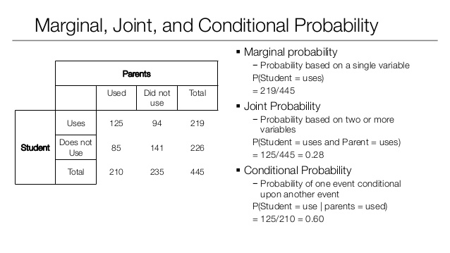
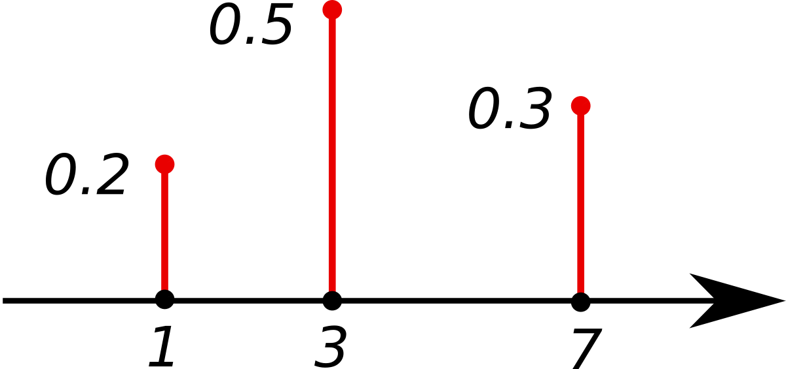
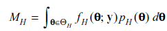

# FOGALOMTÁR A BAYES STATISZTIKÁHOZ {-}

## Bayesiánus valószínűség (szubjektív valószínűség)

A Bayesiánus valószínűség (vagy szubjektív valószínűség) egy azt megadó
személy tapasztalataiból és véleményéből származó valószínűség - így
minden ember esetében más.

Példa: Az a kijelentés, hogy "Szerintem 60%, hogy meg fogok bukni a
vizsgámon." egy Bayesiánus (szubjektív) valószínűséget foglal magába. Ez
az állítás tartalmazza a személy hiedelmeit, ugyanakkor előzetes tudást
is az adott eseményre vonatkozóan, mivel feltételezhetően a személy nem
aludta ki magát, vagy nem tanult a vizsgára. A [[frekventista
valószínűséggel]{.ul}](https://en.wikipedia.org/wiki/Frequentist_probability)
szemben ez a valószínűség nem arra vonatkozik, hogy a történelemben hány
százalék volt az elbukott vizsgák aránya.

[[Wikipédia]](https://en.wikipedia.org/wiki/Bayesian_probability)

[[Investopedia]](http://www.investopedia.com/terms/s/subjective_probability.asp)

## Valószínűségszámítási alapfogalmak

###  Marginális valószínűség (Marginal probability) p(A) 

Annak a valószínűsége, hogy A esemény előfordul: p(A)\
\
Feltétlen valószínűségként is gondolhatunk rá, mivel nem függ egy másik
esemény bekövetkezésétől.\
\
Pl.: Annak a valószínűsége, hogy egy pakliból piros lapot húzunk p(A)=
0.5; Annak a valószínűsége, hogy 4-es lapot húzunk p(B)= 1/13

### Együttes valószínűség (Joint probability) p(A,B) (olvasd:p(A és B))

Annak a valószínűsége, hogy két (független) esemény egymással együtt
fordul elő. Ez kettő vagy több esemény metszetének a valószínűsége.

Ha például két pakliból húzunk egy-egy lapot, annak az együttes
valószínűsége, hogy az egyikből kárót, a másikból pedig 4-est húzunk,
(¼)\*(1/13), mivel a káró húzásának valószínűsége, ¼, a négyes húzásáé
pedig 1/13.

### Feltételes valószínűség (Conditional probability): p(A\|B) (olvasd: p(A ha B igaz))

Annak a valószínűsége, hogy A esemény megtörténik ha B feltétel
teljesül.\
\
Pl.: Ha piros kártyát húztál, mekkora annak a valószínűsége, hogy ez a
piros kártya négyes lesz?

Másképpen megfogalmazva, ez annak a valószínűsége, hogy a piros
lapjaidból piros négyest húzol. (Itt a **B feltétel**, ami teljesül az,
hogy piros lapot húzunk, az **A esemény** pedig az, hogy 4-es lapot
húzunk.)

**p(A\|B)=p(A,B)/p(B)**

Átfogalmazva: p(négyest húzol \| piros kártyát húzol) = p(piros négyest
húzol)/ p(piros lapot húzol)

Mivel egy pakliban 2 piros négyes van és 26 piros lap-->

p(négyest húzol\| piros kártyát húzol)= 2/26= 1/13.

Egy másik példa a valószínűség típusokra:

{width="6.5in" height="3.6527777777777777in"}

[[Forrás]](https://www.slideshare.net/eugeneyan/statistical-inference-probability-and-distribution)

### Valószínűség típusok ([[http://sites.nicholas.duke.edu/statsreview/probability/jmc/]](http://sites.nicholas.duke.edu/statsreview/probability/jmc/)) 

Egy világos magyarázata a feltételes valószínűségnek
[[itt]](https://learnbayes.org/index.php?option=com_content&view=article&id=69:condprob&catid=79&Itemid=479)
található.

## Bayes tétel (Bayes' theorem, Bayes' rule, Bayes' law) 

(integrál formában lásd.: posterior)

A Bayes-tétel egy esemény előfordulásának valószínűségét írja le, az azt
befolyásoló tényezők ismeretének fényében. Megmutatja, hogyan alakítsuk
át hipotéziseinket megfigyeléseink (az adatok) alapján.

{width="2.1041666666666665in"
height="0.4791666666666667in"}

P ( A ) = A előfordulásának valószínűsége, semmilyen más eseményre
tekintet nélkül, önmagában.

P ( B ) = B előfordulásának valószínűsége, semmilyen más eseményre
tekintet nélkül, önmagában.

P (A | B ) = A megfigyelésének valószínűsége, ha B jelen van.

P ( B | A ) = B megfigyelésének valószínűsége, ha A jelen van.

A Bayes-tétel alapján, ahhoz, hogy meghatározzuk A előfordulásának
valószínűségét B jelenlétében \[P (A I B )\], szükségünk van B
előfordulásának valószínűségére, ha A van jelen \[P ( B I A )\], A
előfordulásának valószínűségére \[P ( A )\] és B előfordulásának
valószínűségére \[P ( B )\]. Ez így bonyolultnak tűnhet, de egy példán
keresztül sokkal könnyebb megérteni:

Például szeretnénk egy klinikán a rákban szenvedő embereket
diagnosztizálni.

Legyen A esemény: "A beteg rákos"

Legyen B esemény: "A beteg rendszeresen dohányzik"

Az eddigiek alapján tudjuk, hogy a klinikán megforduló betegek 10%-a
rákos, így ismerjük azt, hogy P(A)=0.1. Szeretnénk megtudni P(A\|B)
valószínűségét (vagyis azt, hogy mekkora a valószínűsége annak, hogy
valaki, aki rendszeresen dohányzik, rákos). Ezt önmagában nehéz lenne
kiszámolni, azonban valószínűleg tudjuk P(B) valószínűségét (hiszen a
klinikán tudhatjuk hány betegünk dohányzik). Tegyük fel, hogy P(B)=0.5.
P(B\|A)-t is ismerjük, a feljegyzéseinkből tudhatjuk hány dohányos volt
a diagnosztizáltak között. Tegyük fel, hogy P(B\|A)=0.8.

Használhatjuk a tételt, hogy elvégezzük az alábbi számítást:

P(A\|B) = (0.8 \* 0.1)/0.5 = 0.16

Kiderítettük, hogy az adataink alapján annak a valószínűsége, hogy
valaki, aki rendszeresen dohányzik, rákos 16%.

[[Wikipedia]](https://en.wikipedia.org/wiki/Bayes%27_theorem)

[[Brilliant.org]](https://brilliant.org/wiki/bayes-theorem/)

[[Learnbayes.org]](https://learnbayes.org/index.php?option=com_content&view=article&id=70:bayes-theorem&catid=79&Itemid=479)

[[Betterexplained.org]](https://betterexplained.com/articles/an-intuitive-and-short-explanation-of-bayes-theorem/)

## Bayesiánus következtetés (Bayesian inference)

[[Wikipedia]](https://en.wikipedia.org/wiki/Bayesian_inference)

A Bayesiánus következtetés során a hipotéziseink valószínűségét
alakítjuk át ahogy egyre több információ és adat kerül a birtokunkba
megfigyeléseink által. A Bayesiánus következtetés során eljutunk a prior
valószínűségtől a posteriorhoz, az adatok és a választott statisztikai
modellünk használatával.

Ahogy azt már előbb említettük, a Bayesiánus valószínűség fogalma a
személyes hiedelmeink számszerűsítésén alapszik.

Vegyünk példának egy egyszerű pénzfeldobást. Előre 50% valószínűséggel
feltételezzük (azt hisszük), hogy a pénzérménk meg van cinkelve, ezért
az 70%-os valószínűséggel lesz fej. Ezután 100-szor feldobjuk az érmét,
hogy megnézzük, hogyan viselkedik valójában az érme. Miután ez az
információ a rendelkezésünkre áll, az előzetes elképzeléseinket
megerősítheti, meggyengítheti, de akár változatlanul is hagyhatja.

A Bayesiánus következtetésben előzetes hiedelmeinknek
([[prior]](https://docs.google.com/document/d/1tCfZkxueFzbxmvtmTzBkmOuwAAHg1_Q33zj_h6qcvrk/edit?mode=html#heading=h.pk3h60h007dk))
evidencia fényében történő újraértékelését végezzük el. Az adatok
önmagukban még nem szolgálnak evidenciaként, hanem mindig az adott
elképzelés/hipotézis viszonyában értelmezhetőek. Részletesebb
magyarázatért lásd az [[evidenciáról]](#evidencia), illetve a
[[likelihoodról]](#likelihood) szóló részt. Előzetes
elképzeléseinkből utólagos elképzeléseinkig
([[posterior]](#posterior-valószínűségek)) az adatokon keresztül
[[Bayes tételét]](#bayes-tétel-bayes-theorem-bayes-rule-bayes-law)
alkalmazva jutunk el.

{width="5.833333333333333in"
height="4.375in"}

Az
[[ábrán]](http://www0.cs.ucl.ac.uk/staff/gridgway/kalman/bayesian_update/bayesian_update.html)
a prior eloszlás, a poszterior eloszlás, a kapott adatok és a likelihood
függvény látható egymás viszonyában.

## Evidencia

A Bayesiánus következtetésnél az adatokat használjuk, hogy a prior
(előzetes) elképzeléseinkből a posterior (utólagos) elképzeléseinkig
eljussunk, tehát hogy átalakítsák a meggyőződéseinket. Az adatok
magukban nem evidenciák, az evidencia csak az adatok és a hipotézisek
viszonyában lehetséges, ezért a Bayesiánus következtetésnél
likelihood-ot használunk, ami annak a mértékét mutatja meg, hogy a
kapott adatok mennyire valószínűek egy-egy adott hipotézis alatt. Más
szóval az adatok alapján kapunk egy képet arról, hogy mely hipotézisek
magyarázzák jobban az adatainkat. Részetesebb leírásért lásd a
[[Likelihood]](#likelihood) és a [[Bayes
faktor]](#bayes-faktor-b-vagy-bf) számításához használt
[[Marginális likelihood]](#marginális-likelihood) bekezdést.

##  Hipotézis

Egy elméletet úgy kell megalkotni, hogy a hihetősége kiértékelhető
legyen és komponensei valahogyan a világot reprezentálják. Ezek a
komponensek a hipotézisek. A hipotézisek bizonyos adatokat prediktálnak.
Az elmélet annál jobb, minél helyesebbek ezek a predikciók. (Az
adatvezérelt módszerek kivételt képeznek.) Amennyiben nem fogalmazható
meg empirikus predikció az adatokra, úgy a hipotézis alulspecifikált.

Egy hipotézist általában valószínűségi eloszlások formájában határozunk
meg, azaz modellt alkotunk a mintájukra. A hipotézis adott tartományban
elhelyezkedő értékekhez valószínűségi értékeket rendel.

Maguk a hipotézisek lehetnek teljesen bizonytalanok. Egy teljesen
bizonytalan hipotézisnél nem tudjuk, hogy melyik értéket részesítsük
előnyben, minden értékhez ugyanakkora valószínűségi érték tartozik (ezt
hívják [[uniform
eloszlásnak]](https://en.wikipedia.org/wiki/Uniform_distribution_(continuous))).
A hipotéziseink lehetnek kevésbé specifikusabbak, amikor ugyan egy
értéket előnyben részesítünk a többivel szemben, de a valószínűségek
viszonylag egyenletesen oszlanak el. Egy specifikus hipotézis esetén egy
értékhez kiemelkedően magas, a többi értékhez pedig elenyészően kis
valószínűséget rendelünk. Ilyen esetben a valószínűségi eloszlásunk a
preferált értéknél kiemelkedően csúcsosodik, és elég hamar ellaposodik.

**Egzakt hipotézis** (másnéven ponthipotézis) esetén a hipotézis egy
konkrét értéket prediktál pl. Pontosan 0 és csak 0 hatást vár a
nullhipotézis.

Számszerűsíthetjük, hogy az egyes hipotézisek (H) mennyire prediktálják
a lehetséges adatokat p(D \| H), ahol D az adatokat jelöli. Ez a
likelihood (Morey et al., 2016). A hipotézis általában egy elképzelés
arról, hogy bizonyos mennyiség/mennyiségek eloszlása milyen a
populációban (lásd. [[Prior]](#prior)).

## Sűrűségfüggvény (Probability Density Function, PDF)

Egy folyamatos változónak egy olyan eloszlása, ahol az X tengely minden
értékéhez megfelelő valószínűségi érték tartozik. A görbe alatti terület
mindig 1.

{width="4.1875in" height="2.0208333333333335in"}

## Valószínűségi tömegfüggvény (probability mass function, PMF)

A sűrűségfüggvény párja diszkrét valószínűségi változókra.

{width="3.557292213473316in"
height="1.6664785651793526in"}

## Prior

A prior valószínűségi eloszlást mi határozzuk meg, tapasztalatainkból,
elvárásainkból, még a megfigyeléseink és az adatok megszerzése előtt.
Két hipotézist a prior valószínűségi eloszlásaik alapján hasonlítunk
össze, és az adatok fényében eldöntjük, hogy a két összehasonlított
prior közül melyik modellezi jobban a valóságot.

Például szeretnénk meghatározni, hogy átlagosan milyen magasak az
óvodások. A hipotézisünk prior eloszlása minden egyes (átlag)magassághoz
egy valószínűséget rendel. Ezután veszünk egy 100 fős mintát, ahol
mindenkinek megmérjük a magasságát és átlagot számítunk (adatok). Az
adatok alapján már meghatározható a likelihood függvény. Ha a prior
eloszlás a legtöbb valószínűséget olyan értékekhez rendeli, amik távol
esnek a megfigyelt adatoktól, akkor ennek a hipotézisnek az átlagos
likelihoodja kisebb, mint annak, aminél a prior az adatokhoz közelebb
eső valószínűségeket rendel.\
A Bayes faktorral már összehasonlítható a két hipotézis. (lásd.
Likelihood, Bayes faktor)

**2. Verzió (számítógépes)**
Bayesiánus analízishez szükséges definiálni, hogy mekkora hatást
várnánk ha a H1 igaz. A *BayesFactor* csomag a *standardizált hatás
méret* (δ) lehetséges értékit egy eloszlásban adja meg.
3 különböző skálájú beépített prior van a csomagban (ld ábra):
**Medium** = 0.71
**Wide =** 1
**Ultrawide** = 1.41
Ha nem állítjuk át, akkor a medium-mal számol.
Minél kisebb a prior skálája, annál inkább hasonlít a H~1~ a H~0~-ra
(és a B közelít az 1-hez)
Minél nagyobb a prior skálája, a B annál inkább favorizálja a H~0~-t.
([[Morey
blog]](http://bayesfactor.blogspot.hu/2014/02/bayes-factor-t-tests-part-2-two-sample.html))
Lehet specifikus priorokat is megadni (ha lehet, mindig jobb, ha így
járunk el). Bár gyakran felhozzák a kritikusok, de a specifikációk nem
tudják nagyon torzítani a kapott képet. Pl. az alábbi ábra A. részén 3
sikerességi becslés szerepel, mint prior, a B. ábra pedig azt mutatja,
hogy már 20 próba esetén is a posterior-ok elég hasonlóan néznek ki. A
**Bayesian Updating** lényege, hogy az adatok függvényében az
elképzeléseink mindig konvergálni és pontosítódni fognak. Ugyanakkor
minden adat csak két elképzelés viszonyáról tud valamit állítani.

[[Wikipedia]](https://en.wikipedia.org/wiki/Prior_probability)

[[Gelman cikk a
priorhoz]](http://www.stat.columbia.edu/~gelman/research/published/p039-_o.pdf)

## Likelihood

A likelihood nem valószínűség, önmagában nincs jelentése. Viszont
alkalmas hipotézisek összehasonlítására. Egy hipotézis (H) likelihoodja
az adatok (D) alapján: L(H\|D)=k ·P(D\|H), ahol k egy tetszőleges
pozitív konstans. ( Hipotézisek összehasonlításakor a konstansok kiejtik
egymást, mivel k az adatra jellemző.)

But, crucially, since this term is in both the numerator and denominator
the information contained in the way the data are obtained disappears
from the likelihood ratio. This result leads to the conclusion that the
sampling plan should be irrelevant to the evaluation of statistical
evidence, which is something that makes likelihood and Bayesian methods
particularly flexible

###  A likelihood törvény alapján

Egy statisztikai modellen belül egy D\* adathalmaz jobban alátámaszt egy
H1 hipotézist, mint egy H2 hipotézist, ha L(H1\|D\*)>L(H2\|D\*).

###  A likelihood elv

A likelihood elv kimondja, hogy a likelihood függvény minden olyan
információt tartalmaz, ami releváns a statisztikai bizonyíték
kiértékelése szempontjából.\
\
Ha egyszerre több hipotézis likelihoodját(akár az összes hipotézisét)
szeretnénk összehasonlítani, akkor ábrázoljuk a teljes likelihood
függvényt. Pl.: az ábra alább azon D adatok likelihood függvénye, ahol
pénz feldobásnál 10 dobásból 6 fejet dobunk. H1 szerint a fej dobás
valószínűsége ½, H2 szerint (trükkös pénz) 0.75. (H1-et és H2-t két pont
jelzi). (Az ábrát konvenció szerint skáláztuk egy konstanssal, így a
leginkább alátámasztott érték likelihoodja 1).\
{width="4.052083333333333in"
height="3.3020833333333335in"}\
\
A függőleges szaggatott vonal megmutatja, hogy az adatok melyik
hipotézist támasztják inkább alá. Bármely két hipotézis **likelihood
ratio**-ja a görbén lévő magasságuk aránya (önmagában egyik magasságnak-
likelihoodnak- sincs értelme!). A likelihood ratio megmutatja, hogy
hányszor valószínűbb, hogy az adatok az egyik hipotézist támasztják alá,
mint a másikat. A bizonyítékok relatívak: bár a normális pénzt jobban
támogatják az adatok nem azt jelenti, hogy minden trükkös pénzzel
szemben így van (csak az esetén, amit vizsgáltunk)! Ugyanis a legjobban
alátámasztott hipotézis csak gyengén alátámasztott lesz ha egy
közvetlenül előtte vagy utána lévő hipotézissel hasonlítjuk össze
(L(.6)/L(.61) ≈ 1.1)!\
\
A **Bayes faktor** a likelihood ratio kiterjesztése: egy súlyozott
átlagos likelihood ratio, ami az adott hipotézis prior eloszlásán
alapul. (Amikor a hipotézis ponthipotézis a likelihood ratio ugyanaz,
mint a BF!) A likelihood ratio-t a prior eloszlás minden pontjában
kiszámítjuk és súlyozzuk az adott értékhez tartozó valószínűséggel. Ha a
prior eloszlás a legtöbb valószínűséget olyan értékekhez rendeli, amik
távol esnek a megfigyelt adatoktól, akkor ennek a hipotézisnek az
átlagos likelihoodja kisebb, mint annak, aminél a prior az adatokhoz
közelebb eső valószínűségeket rendel.

[[https://alexanderetz.com/2015/04/15/understanding-bayes-a-look-at-the-likelihood/]{.ul}](https://alexanderetz.com/2015/04/15/understanding-bayes-a-look-at-the-likelihood/)

[[https://learnbayes.org/index.php?option=com_content&view=article&id=71:likelihood&catid=80&Itemid=479]{.ul}](https://learnbayes.org/index.php?option=com_content&view=article&id=71:likelihood&catid=80&Itemid=479)

## Marginális likelihood

{width="2.53125in"
height="0.4791666666666667in"}
A marginális likelihood (másnéven integrált likelihood) egy likelihood
függvény. A marginális szó arra utal, hogy a $\Theta$ paraméter(ek)
szerint integráltuk a kifejezést, így $\Theta$"marginalizálódik"
(eltűnik belőle). $\Theta$~H~ a H hipotézis alatti paramétert jelenti
(azaz egy vektor, ami tartalmazza a hipotézisünk összes paraméterét
pl. Variancia, átlag stb. ). Y az adatokat tartalmazó vektor. f~H~ az
adatok sűrűségfüggvénye H hipotézis alatt (egyszerűbb jelöléssel
=P(D\|H) ). Összefoglalva a marginális likelihood tekinthető úgy mint
a likelihoodok folytonos átlaga, amit a P~H~ priorral/priorokkal
súlyozunk. Ha a prior eloszlás olyan paramétere értékeken súlyozódik,
amik távol esnek az adatoktól, akkor a kapcsolódó kicsi likelihood
értékek csökkentik az átlagot. Így azért, hogy egy modell marginális
likelihoodja versenyképes legyen, a prior eloszlás nem súlyozódhat
ésszerűtlen paraméter értékeken.
A marginális likelihoodot modell evidenciának is nevezzük és a
poszterior elolszás illetve a Bayes faktor kiszámításához használjuk.
[[https://en.wikipedia.org/wiki/Marginal_likelihood]](https://en.wikipedia.org/wiki/Marginal_likelihood)

[[http://pcl.missouri.edu/sites/default/files/Rouder.bf\_.pdf]{.ul}](http://pcl.missouri.edu/sites/default/files/Rouder.bf_.pdf)

## Posterior valószínűségek

Ez arra vonatkozik, hogy mi a valószínűsége a hipotéziseknek az adatok
(x) ismeretében Pr(H0\|x), Pr(H1\|x). Hányadosuk a posterior odds, ami
megmondja, hogy mennyivel valószínűbb az egyik hipotézis, mint a másik.
A posterior eloszlás a Bayes tétel alapján:

{width="2.53125in" height="0.5729166666666666in"}

$\Theta$ a hipotézis (modell) paramétere. A tört nevezője a **marginális
likelihood**. Szerepe biztosítani, hogy a posterior érvényes
valószínűségi eloszlás legyen (azaz a területe 1 legyen). A posterior
alakját nem befolyásolja.

[[Wikipedia]](https://en.wikipedia.org/wiki/Conjugate_prior)

[[Quora.com]](https://www.quora.com/What-is-the-difference-between-marginal-likelihood-and-posterior)


##  Bayes faktor (B vagy BF)

Ahogyan a likelihoodról szóló részben is le van írva, az adatok
valószínűsége egyetlen prior hipotézis alatt nézve nem informatív. A
bayesiánus hipotézistesztelésnél az adataink fényében egyszerre két
hipotézisünket hasonlítjuk össze, és azt vizsgáljuk, hogy azok melyik
alatt valószínűbbek, azaz a likelihood törvény alapján melyiket
támogatják jobban. A Bayes faktor egy mutató, amely annak a mértékét
fejezi ki, hogy egy hipotézisünket milyen mértékben támogatnak jobban az
adataink, mint a másikat.

A Bayes faktor kiszámolása úgy történik, hogy megnézzük, hogy a kapott
adataink mennyire valószínűek az egyik prior (H~a~) alatt, illetve a
másik prior (H~b~) alatt, és ezt a két számot elosztjuk egymással. A
Bayes faktor azt számszerűsíti, hogy a legközelebbi megfigyeléskor
melyik modell fogja valószínűbben előrejelezni az adatokat.

**Hivatalos jelölés: B = p(D\|H~a~) / p(D\|H~b~)=**
$$$\frac{P(\Theta{}_{1}^{}|H{a_{}^{})\ P(D|\Theta{}_{1},\ Ha{)\ d\Theta}_{1}}_{}}{P(\Theta_{2}|{H_{}^{}}_{b})\ P(D|{\Theta{}_{2},H}_{b})d\Theta{}_{2}}$$$

(olvasd: A Bayes faktor egyenlő annak az arányával, hogy az adatok (D)
mennyire valószínűek az "a" hipotézisünk (H~a~) és a "b" hipotézisünk
(H~b~) alatt , **Bayes faktor=marginal likelihood ratio**)

A Bayes faktor csak akkor egyezik meg a (sima) likelihood ratioval, ha
egzakt hipotézisekről van szó, különben az integrál formát használjuk,
azaz a marginális likelihoodokat (modell evidenciákat) hasonlítjuk
össze (**lásd. Poszterior**).

A Bayes faktornál összehasonlított prior hipotézisek általában a
klasszikus hipotézistesztelésből átvett nullhipotézis és alternatív
hipotézis szokott lenni. A klasszikus (frekventista) hipotézistesztelés
által használt valószínűség és a bayesiánus valószínűség alapvető
különbségeiből adódik, hogy az alternatív hipotézist máshogyan ragadja
meg a két módszer. Míg az alternatív hipotézis a klasszikus
hipotézistesztelésnél a nullhipotézis elvetéséből áll, a bayesiánus
hipotézis esetében egy bizonytalan valószínűségi eloszlás formájában
fogalmazzák meg (lásd Cauchy eloszlás). Habár a klasszikus
hipotézistesztelés bayesiánus változatát sokan támadják, lehetővé teszi
azt, hogy számszerűen megmondjuk, a null- vagy az alternatív
hipotézisünket támogatják a megfigyeléseink.

Ahogyan azt fent említettük, a Bayes faktor számszerűen értelmezhető
úgy, hogy az adatok mennyire támogatják az egyik hipotézist a másikkal
szemben. Egy Bayes faktor, amiben a null hipotézisünk alatt 5-ször
valószínűbbek az adataink (megfigyeléseink), mint az alternatív
hipotézisünk alatt, értelmezhető úgy, hogy az adataink 5-ször jobban
támogatják a null, mint az altenatív hipotézisünket.

Abban, hogy mit is jelent pontosan, hogy 5-ös, 10-es stb. Bayes faktort
kapunk, nincs teljes megegyezés a szakemberek között, viszont az alábbi
táblázat egy egyszerű kiindulópontot biztosít az értelmezéséhez.

A táblázatban a H1 az alternatív hipotézist, a H0 pedig a
nullhipotézist jelöli.

{width="6.104166666666667in"
height="1.6979166666666667in"}

Egy érthető magyarázata a Bayes faktornak példával a [[BayesFactor
blogon]](http://bayesfactor.blogspot.hu/2014/02/the-bayesfactor-package-this-blog-is.html?m=1)
taláálható.

> **Mire jó a Bayes faktor, és mire nem jó?**

-   **Modellek összehasonlítására:** modelljeink nem igazak vagy
    > hamisak, hanem azokat tudjuk egymáshoz hasonlítani a rendelkezésre
    > álló adatok alapján [[(Rouder et
    > al., 2016)]{.ul}](https://www.dropbox.com/s/7kpion5dqacpwai/Rouder%20et%20al.%202016%20psy%20sci%20bayes.pdf?dl=0).

```{=html}
<!-- -->
```
-   **Nem mondja meg, hogy a null hipotézis (mennyire) igaz**: a B két
    > modellt hasonlít össze (ebből egyik lehet a null hipotézist
    > reprezentáló modell), és megmutatja, hogy az adatok milyen
    > mértékben támogatják az egyik modellt a másikhoz képest. Tehát a B
    > egy relatív bizonyítékot ad és az eredménye nem értelmezhető
    > önmagában a nullára (Bővebben Morey bolgján
    > [[itt]](https://richarddmorey.org/2015/03/two-things-to-stop-saying-about-null-hypotheses/)).

-   **Replikációs kísérletek értékelésére**: egy replikáció csak akkor
    > sikertelen, ha az adatok a nullát támogatják az alternatívával
    > szemben, az inkonklúzív eredményeket nem szabad sikerként vagy nem
    > támogató eredményként kezelni. Emiatt érdemes a B-t használni
    > replikációk eredményének értelmezésére ([[Data
    > colada]](http://datacolada.org/47); [[Verhagen & EJ,
    > 2014]](http://web.archive.org/web/20151026061603/http:/www.ejwagenmakers.com/2014/VerhagenWagenmakers2014.pdf)).

> **Kritika**

-   **Nem minden esetben lehet megadni a modell predikcióit**: például
    > nem volt még hasonló kutatás és így az elvárható hatásmértékről
    > nincs semmi információ. Megoldás lehet az ilyen esetekre a default
    > Cauchy eloszlás, ami a legtöbb (pszichológiában elvárt)
    > hatásmértéket lefedi (lásd [[Rouder et
    > al., 2016)]](https://www.dropbox.com/s/7kpion5dqacpwai/Rouder%20et%20al.%202016%20psy%20sci%20bayes.pdf?dl=0)

-   **Default Cauchy eloszlás az alternatív modell reprezentálására**:

```{=html}
<!-- -->
```
-   a skála-paraméter (lásd [[Cauchy
    > eloszlás]](https://en.wikipedia.org/wiki/Cauchy_distribution))
    > növekedésével egyre jobban a null modellt favorizálja
    > ([[blog]](https://replicationindex.wordpress.com/2016/07/25/bayes-ratios-a-principled-approach-to-bayesian-hypothesis-testing/))

-   Kifejezetten nagy hatásokat is valószínűsít, emiatt túlzottan növeli
    > a null modell támogatottságát (utal rá [[Rouder et al., 2009 p.
    > 232]](https://www.dropbox.com/s/tvn7lj9r5hgu0t3/Rouderetal09.pdf?dl=0))

-   A tudományban nincs default elmélet vagy hatásmérték, így minden
    > esetben ki kell értékelni, hogy a hipotézisünk reprezentálására
    > alkalmazott modell megfelelően alátámasztott-e. Amikor
    > lehetőségünk van rá, építsük be az elméletről vagy domain-ről
    > rendelkezésünkre álló tudást az alternatív modellbe, és térjünk el
    > a default prior eloszlástól ([[Dienes, 2014
    > p.6]}](https://www.dropbox.com/s/xcvz494zos30esa/Dienes_%20Bayes.pdf?dl=0);
    > [[Rouder et al., 2009 p.
    > 232]](https://www.dropbox.com/s/tvn7lj9r5hgu0t3/Rouderetal09.pdf?dl=0))

[[Wikipedia]](https://en.wikipedia.org/wiki/Bayes_factor)

[PLOS cikk](https://journals.plos.org/plosone/article?id=10.1371/journal.pone.0182651)

## Hihetőségi Intervallum (Credible Interval)

Más nevén: Posterior Probability Interval (PPI)

Értelmezése: az a régió, amibe a populáció egy adott paramétere 95%
szubjektív valószínűséggel esik bele. Ehhez le kell generálni a
*poszterior eloszlást* és abból következik, hogy hol a belső 95%.

[[Posterior]](https://en.wikipedia.org/wiki/Posterior_probability),
[[Likelihood]](https://en.wikipedia.org/wiki/Likelihood_function),
[[Conjugate prior]](https://en.wikipedia.org/wiki/Conjugate_prior),
[[Posterior
predictive]](https://en.wikipedia.org/wiki/Posterior_predictive_distribution),
[[Hyperparameter]](https://en.wikipedia.org/wiki/Hyperparameter),
[[Hyperprior]](https://en.wikipedia.org/wiki/Hyperprior),
[[Principle of
indifference]](https://en.wikipedia.org/wiki/Principle_of_indifference)

**Közömbösségi elv (Principle of indifference)**

Ha dobókockával dobunk, akkor minden dobás független egymástól és a
lehetőségek kizárják egymást (nem dobhatunk egyszerre kettő vagy több
számot egy kockával), viszont ugyanakkor magába foglalja az összes
lehetőséget, mivel a dobókocka egy dobásnál biztosan valamelyik oldalára
fog érkezni és kizárólag a dobókockán szereplő értékeket kaphatjuk. Ezen
felül normális esetben annak a lehetőségét, hogy az egyik számot dobjuk,
az elnevezésükön kívül (1-est vagy 6-ost dobtam) semmi sem különbözteti
meg. Az alább leírt "közömbösségi elv" szerint ha a dobókockához hasonló
feltételek teljesülnek, minden lehetőség ugyan akkora valószínűséget fog
kapni.

Absztraktabban megfogalmazva: A közömbösségi elv kimondja, ha van *n*
darab egymástól független, egymást kizáró lehetőség, amelyeknek a
valószínűségeinek összege 1, és a nevükön kívül mindenben megegyeznek
(azonos elven kapjuk őket, szintaktikailag hasonlóak), akkor minden
ilyen lehetőséghez 1/*n*-nel megegyező valószínűséget kell rendelni.

A bayesiánus valószínűségszámításban ez a legegyszerűbb [[nem-informatív
prior]](https://en.wikipedia.org/wiki/Prior_probability#Uninformative_priors).

## Konjugált prior

Vegyünk egy $\Theta$paraméter által meghatározott valószínűségi eloszlás
családot (pl. exponenciális eloszlások családja). Ha az összes
lehetséges poszterior eloszlás ugyanabba a családba esik, mint a prior
eloszlás, akkor a prior és poszterior **konjugált eloszlások**, és a
priort a (likelihood függvényre nézve) **konjugált priornak** nevezzük.
A poszterior eloszlás:

{width="2.53125in" height="0.5729166666666666in"}

A konjugált prior fogalmának bevezetése algebrai könnyebbséget jelent,
ugyanis ekkor a prior és a poszterior hasonló algebrai alakot vesz fel.
Azaz a poszterior mindig **zárt alakú** **kifejezés**(olyan matematikai
kifejezés, amit véges számú művelettel ki tudunk számolni) lesz.
Különben numerikus integrálást kéne végeznünk, ami csak közelítő
megoldást adhat és nagy számítási kapacitást igényel. (lásd. **MCMC
módszerek**)

Fontos megjegyezni, hogy itt alapvetően nem a prioron van a hangsúly,
hanem azon az eloszlás családon, amit a probléma modellezéséhez
használunk.

Összefoglalva bonyolult számítások esetén érdemes megnézni, hogy a
standard eloszlások (pl. Beta, binomiális, gamma stb.) valamelyike,
esetleg azok kombinációi illeszkedik e a modellhez. Így konjugált
priorokkal megbecsülhetjük a priorunkat.

[[wikipedia]](https://en.wikipedia.org/wiki/Conjugate_prior)

[[https://www.chrisstucchio.com/blog/2013/magic_of_conjugate_priors.html]{.ul}](https://www.chrisstucchio.com/blog/2013/magic_of_conjugate_priors.html)

## A maximum entrópia elve (Principle of maximum entropy)

A legnagyobb entrópia elve alapján, amikor nem ismerjük pontosan egy
valószínűségi eloszlás minden paraméterét, akkor azt az eloszlást kell
válasszuk, amelynél a legnagyobb az eloszlás be nem jósló ereje
(unpredictibility). Amikor az eloszlás entrópiájáról beszélünk, akkor
lényegében azt mutatjuk meg, hogy mennyire informatív az eloszlás. Annak
az eloszlásnak, ami az esetek 100%-ban helyesen jósolja be az adott
eseményt 0 az entrópiája. Ezzel szemben az uniform eloszlás alatt minden
esemény ugyanakkora valószínűséggel fordul elő, így ennek a legnagyobb
az entrópiája, ez a legkevésbé informatív eloszlás.

[[érthető
magyarázat]](http://corysimon.github.io/articles/the-principle-of-maximum-entropy/)

[[wikipedia]](https://en.wikipedia.org/wiki/Principle_of_maximum_entropy)

## Empirikus Bayes módszer

Az empirikus Bayes módszer, más néven a Maximum Marginal Likelihood
módszer, a prior eloszlás paramétereit (a hiperparamétereket) a
legvalószínűbb értékeikre állítjuk.

[[wikipedia]](https://en.wikipedia.org/wiki/Empirical_Bayes_method)

## Cromwell szabály

A Cromwell szabály szerint a prior valószínűség nem szabad 0 vagy 1
legyen, kivéve ha igen-nem döntésről van szó, hiszen a Bayes tétel
alapján ebben az esetben a posterior valószínűség is mindenképp 0 vagy 1
lesz. Tehát az evidenciának semmilyen hatása nincs a véleményünkre.

[[wikipedia]](https://en.wikipedia.org/wiki/Cromwell%27s_rule)

## Bernstein--von Mises tétel

A Bernstein-von Mises tétel alapján mondható el, hogy a posterior
eloszlás a gyakorlatban független a prior eloszlástól, amennyiben elég
információt szolgáltat a megfigyelt adatunk. (És ha a Cromwell szabály
érvényesül.)

[[wikipedia]](https://en.wikipedia.org/wiki/Bernstein%E2%80%93von_Mises_theorem)

## Bayes-féle információs kritérium (másnéven Schwarz kritérium)

Újabb paramétereket beemelve egy modellbe, meg tudjuk növelni a modell
illeszkedését. Túl sok paraméter esetén azonban ez a folyamat a
visszájára fordul (overfitting). A BIC segítségével ki tudjuk választani
különböző modellek közül azt, amelyik legjobban illeszkedik az
adatokhoz. A kisebb BIC jobb illeszkedést jelent.

Gyakorlatban a következő határvonalakat használják a különbségtételre
modell szelekciónál, de a BIC érték önmagában is értelmezhető:

========================================\
BIC (Model A -- Model B) , ha BIC(A) \> BIC(B)\
\-\-\-\-\-\-\-\-\-\-\-\-\-\-\-\-\-\-\-\-\-\-\-\-\-\-\-\-\-\-\-\-\-\-\-\-\-\-\-\-\-\-\-\-\-\-\-\-\-\-\-\-\-\-\-\-\-\-\-\-\-\-\--\
\< 2.0 Gyenge\
2.0 -- 5.9 Pozitív és a B-t támogatja\
6.0 -- 9.9 Erős és a B-t támogatja\
≥ 10.0 Nagyon erős és a B-t támogatja\
========================================

[[wikipedia]](https://en.wikipedia.org/wiki/Bayesian_information_criterion)

[[határértékek]](http://epid.blogspot.hu/2012/11/the-rule-of-thumb-aic-signficance-levels.html)

## Uniform eloszlás

Diszkrét: A felvehető értékek egyenlő eséllyel fordulhatnak elő. Például
egy dobókocka eldobásakor elméletileg minden oldal egyenlő
valószínűséggel (⅙) lehet a legfelső oldal a kocka megállásakor, az
oldalak száma pedig véges.

Folytonos: Két előre meghatározott intervallum között bármely érték
egyenlő eséllyel fordulhat elő (a függvény minden értéke maximum- és
minimumhely is egyben, ábrázolva egy vízszintes egyenes vonal).

## Lagrange szorzó (Lagrange Multiplier)

A Lagrange szorzó megmondja egy adott függvény maximumát vagy minimumát
az adott korlátok között.

[[Wikipedia]](https://en.wikipedia.org/wiki/Lagrange_multiplier)

[[Példa]](http://www.slimy.com/~steuard/teaching/tutorials/Lagrange.html)

## Maximum Likelihood becslés ([[MLE]](https://en.wikipedia.org/wiki/Maximum_likelihood_estimation))

*Etz cikk:*

A kutatókat természetükből adódóan érdekelheti, hogy melyik az a
hipotézis, amelyik a legjobban prediktálja az adataikat. Ezt a kérdést a
Maximum Likelihood becslés módszere tudja megválaszolni. Mivel az adatok
valószínűsége egy hipotézis alatt arányos annak likelihoodjával, a
hipotézis, amely alatt a kapott adataink a legvalószínűbbek, rendelkezik
a legmagasabb likelihooddal az összes hipotézis közül.

*Marci ezt találta:*

Az MLE egy olyan eljárás, melynek során megfigyelések alapján
megbecsülhetjük a statisztikai modellünk paramétereit úgy, hogy
maximalizáljuk a likelihoodját a megfigyeléseinknek. A módszer többek
között feltételezi a paraméterek prior uniform eloszlását. Például, ha
meg akarjuk tudni egy pingvin populációban a pingvinek magasságának
átlagát és szórását, feltételezve, hogy a magasságok eloszlása normál
eloszlás, de nincs időnk megmérni az összeset, akkor egy kisebb minta
megmérése után tudunk becslést adni az átlagra és a szórásra.
Problémája: Overfitting

*Márknak így magyarázták el:* Modellillesztésnél, ha pontos az x
tengelyen mért változó (pl.: időt mérünk és a mérések pontosan X
másodpercnyi időközönként történnek), ezen felül az y tengelyen a mérési
hibák hosszútávú eloszlása normáleloszlást követ, akkor a [[központi
határeloszlás
tétele]](https://hu.wikipedia.org/wiki/Centr%C3%A1lis_hat%C3%A1reloszl%C3%A1s-t%C3%A9tel)
szerint az a modell lesz a legvalószínűbb mindközül, amelynek a
reziduális négyzetösszege a legkisebb.

## Maximum a posteriori becslés

([[MPE]](https://en.wikipedia.org/wiki/Maximum_a_posteriori_estimation))

Egy paraméterre adott pontbecslést lehet az eljárás segítségével adni
(ebben különbözik a legtöbb Bayesiánus eljárástól, hiszen azok
valószínűségi eloszlásokat használnak többnyire). A módszer eredménye a
mérések végén rendelkezésünkre álló posterior eloszlás módusza lesz.
Hasonló eljárás, mint az MLE, tekinthető a
[[regularizációjának]](https://en.wikipedia.org/wiki/Regularization_(mathematics)).
A különbség a két eljárás között az, hogy az MPE használ prior
eloszlást, míg az MLE nem. Problémája: a pontbecslés miatt nem tudjuk
meghatározni, hogy mennyire vagyunk biztosak az eredményben.

## Markov-lánc Monte-Carlo (MCMC) módszerek 

-A Markov-lánc Monte Carlo egy olyan módszer, amely a komplex
eloszlásokból történő mintavételezés problémájára nyújt megoldást*.*

***-Kifejezetten hasznosnak bizonyul a bayesiánus modellek poszterior
eloszlálának kiértékelésében.***

Az MCMC kifejezetten hasznos a bayesiánus következtetésben, főleg a
poszterior eloszlások szempontjából, mivel azokat sokszor nehéz
analitikus módszerekkel vizsgálni (csak komplex integrálással). Ezekben
az esetekben az MCMC lehetőséget nyújt arra, hogy megbecsüljük a
poszterior eloszlásnak olyan aspektusait, amelyek direkt módon nem
kiszámíthatóak.

A **Monte--Carlo** egy olyan módszer, amely során az eloszlásból vett
random mintákkal becsüljük meg az eloszlás tulajdonságait. Az MCMC
**Markov-lánc** tulajdonsága az, hogy ezeket a mintákat egy speciális
szekvencia-folyamattal kapjuk. Minden random minta egy kiindulópont,
amely segítségével a következő random mintát kapjuk (innen a "lánc"
elnevezés). Egy különleges tulajdonsága ennek a láncnak, hogy minden
random minta függ az azt megelőző random mintától, viszont független
azoktól a mintáktól, amik annál előbb voltak (ez az ún. "Markov
tulajdonság").

(Példa feladadat és az eljárás lépései+ R kód a 2. cikkben!).

[[https://jeremykun.com/2015/04/06/markov-chain-monte-carlo-without-all-the-bullshit/]](https://jeremykun.com/2015/04/06/markov-chain-monte-carlo-without-all-the-bullshit/)

[[https://link.springer.com/article/10.3758/s13423-016-1015-8]{.ul}](https://link.springer.com/article/10.3758/s13423-016-1015-8)

## Bayesiánus lineáris regresszió

([[BLR]](https://en.wikipedia.org/wiki/Bayesian_linear_regression))

Bayesiánus megfelelője az MLE-nek és az MPE-nek, megoldást nyújt azokra
a problémákra, amik ezeknél felmerülnek, hiszen egyszerre használ priort
és fejezi ki a bizonytalanságunkat a számolás végén.

Wiki leírás: A Bayesiánus lineáris regresszió, ahogyan a nevében is
szerepel, a lineáris regressziónak a Bayesiánus következtetés
szempontjából történő megközelítése. Ezzel a módszerel a regresziós
modellünk paramétereinek (béta és szórás) megkaphatjuk a poszterior
valószínűségét úgy, hogy azokra prior eloszlást állítunk és az adatokból
kapott likelihood függvénnyel Bayes tétele alapán átalakítjuk.

## Bayesiánus becslés vagy bayesiánus cselekvés

([[wiki]](https://en.wikipedia.org/wiki/Bayes_estimator))

Olyan döntési szabály, vagy becslés, ami minimalizálja a veszteség
függvény (lásd lejjebb) posterior várható értékét. Erre példa, hogy az
IMDB a filmek értékelésének összegzésekor használ egy standard számot,
ami az értékelések számát jelöli, aszerint korrigálja az eredményt, hogy
a leadott szavazatok száma milyen közel van ehhez az értékhez.

## Veszteség függvény (Loss function)

([[statlect]](https://www.statlect.com/glossary/loss-function))

Pontbecslésnél használatos fogalom. A definíciója nem más, mint a
becslés és a tényleges paraméter közötti hibák térképezése és valós
számokká alakítása. A veszteség függvény használható az illeszkedés
mértékének jelzésére.

## Közelítő Bayesiánus Eljárások

([[ABC]](https://en.wikipedia.org/wiki/Approximate_Bayesian_computation))

Olyan statisztikai eljárások, amik bayesiánus alapúak. Ezek túllépnek a
szigorúan likelihood függvény alapú számításokon, mivel olyan
modellekhez használatosak, ahol már nem lehetséges alkalmazni a
likelihood függvényt, mivel túl komplexek. Az ABC csoportba tartozó
számítások tartalmaznak olyan következtetéseket, amik növelik a hiba
nagyságát, ezek csökkentésére használják a bayesiánus becsléseket.

## Jeffreys-Lindley paradoxon

([[wiki]](https://en.wikipedia.org/wiki/Lindley%27s_paradox))

Tualjdonképpen nem is paradoxon.

Azt a szituációt nevezik Lindley paradoxonnak (Jeffreys könyvében került
elő), amikor egy elmélet tesztelésére felállított kísérlet eredményét
frekventista és bayesiánus módszerekkel vizsgálva más-más eredményre
jutunk. Nevezetesen azt, amikor a frekventista elemzéssel szignifikáns
eredményt kapunk, tehát elvetjük a H0-t, a bayesiánus módszer pedig
ezzel ellenkezőleg a H0-t támogatja..

## Hiperparaméter

A hiperparaméterek a prior eloszlás paraméterei, amelyeket így meg
tudunk különböztetni a vizsgált modell paramétereitől (pl.a vizsgált
átlagtól vagy hatásmérettől). Például egy Cauchy eloszlás
hiperparamétere az r. A hiperparaméter lehet egyetlen érték, de egy
eloszlással is ábrázolhatjuk - ebben az esetben hiperpriorról beszélünk.

[[Wikipedia]](https://en.wikipedia.org/wiki/Hyperparameter)

## Bayesiánus hálózat (Bayesian network)

A Bayesiánus hálozat egy irányított körmentes gráf, azaz ha az egyik
csomóponttól elindulunk, nem juthatunk vissza hozzá. A csomópontok olyan
események, amelyeknek mind vannak különböző paramétereik, állapotaik. Az
ezeket összekötő vonalak jelzik a közöttük lévő kapcsolatokat, ezek
iránya pedig a kazualitást, melyik hat melyikre.

Szemléltetés: [[Bayesian Belief Networks for
dummies]](https://www.slideshare.net/GiladBarkan/bayesian-belief-networks-for-dummies)

[[Wikipedia]](https://en.wikipedia.org/wiki/Bayesian_network)

## Savage-Dickey density ratio

A Savage-Dickey density ratio egy alternatív számítási módja a Bayes
faktornak. A JASP elemzések ábrái is ezt a módszert mutatják. Ez a
módszer a feljebb leírt Bayes faktor módszertől eltérően nem a
marginális likelihood arány, hanem a prior és a poszterior eloszlás
likelihoodjának aránya a nullánál (vagy bármilyen paraméternél, amit a
nullhipotézis prediktál). Röviden, ez az arány azt fejezi ki, hogy a
nulláról alkotott előzetes elképzeléseink (prior hipotézis) hogyan
módosultak az adatok ismeretében, amit a poszterior eloszlás ír le.
Minél alacsonyabb a poszterior hipotézis likelihoodja a nullánál a
priorhoz képest, az adatok annál jobban az alternatív hipotézist fogják
támogatni, és ez fordítva is igaz.

{width="3.6478871391076115in"
height="2.8906255468066493in"}

Az ábrán látható, hogy míg a prior hipotézis viszonylag magas
valószínűséget rendel a 0-hoz, az adatok ismeretében a poszterior
hipotézis alatt már kevésbé valószínű, hogy ezt az értéket kapjuk.
Ahogyan az alábbi egyenlet leírja, a H0 irányában kapott Bayes faktor
kifejezhető úgy, mint a nullhipotézis által prediktált paraméternek a
valószínűsége a poszterior hipotézis alatt(a számlálóban) osztva a
nullhipotézis által prediktált paraméter valószínűségével a prior
hipotézis alatt (nevező).

{width="3.3034339457567805in"
height="0.6510422134733158in"}

De miért csak egy prior hipotézisünk van? Ennek a módszernek az egyik
jellegzetessége, hogy a hipotézisek modelljét frekventista
nullhipotézisteszteléshez hasonlóan állítja fel. Itt a nullhipotézis
(H0) ponthipotézis formájában jelenik meg, és azt prediktálja, hogy a
vizsgált paraméter (például egy hatásméret) egyenlő lesz a nullával, az
alternatív hipotézis pedig azt modellezi, hogy a vizsgált paraméter nem
lesz egyenlő a nullával. Mivel az alternatív hipotézis a bayesiánus
hipotézistesztelésben nem a nullhipotézis elvetéséből jön létre, egy
nem-informatív vagy egy diffúz prior eloszlással modellezzük azt (a
Bayes faktornál általában uniform vagy Cauchy prior eloszlásokat szoktak
használni). A null- és az alternatív hipotézis itt egymásba vannak
ágyazva, azaz a nullhipotézis az alternatív hipotézis prior eloszlásának
azt a pontját képezi, amely a nullánál szerepel. Erre a jelenségre az
angol szakirodalom "nested modell"-ként hivatkozik.

[[https://lirias.kuleuven.be/bitstream/123456789/277829/1/CP.pdf]](https://lirias.kuleuven.be/bitstream/123456789/277829/1/CP.pdf)
