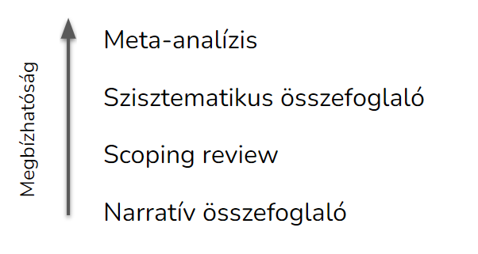
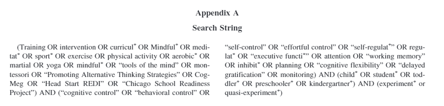
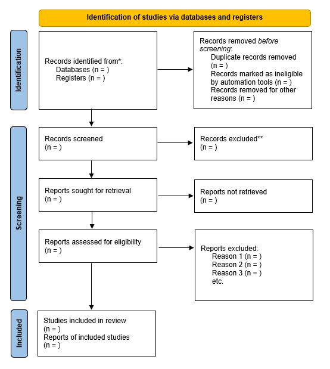
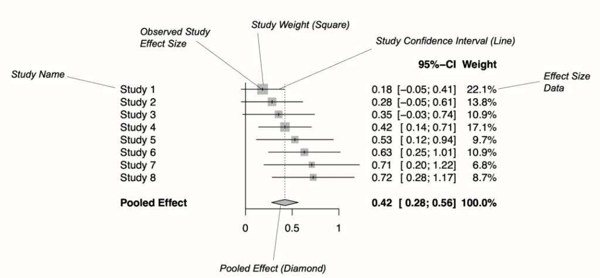
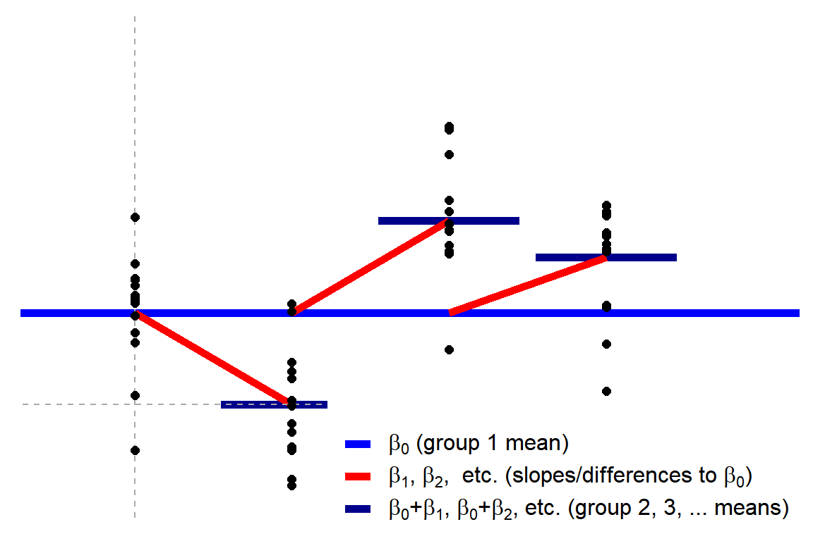
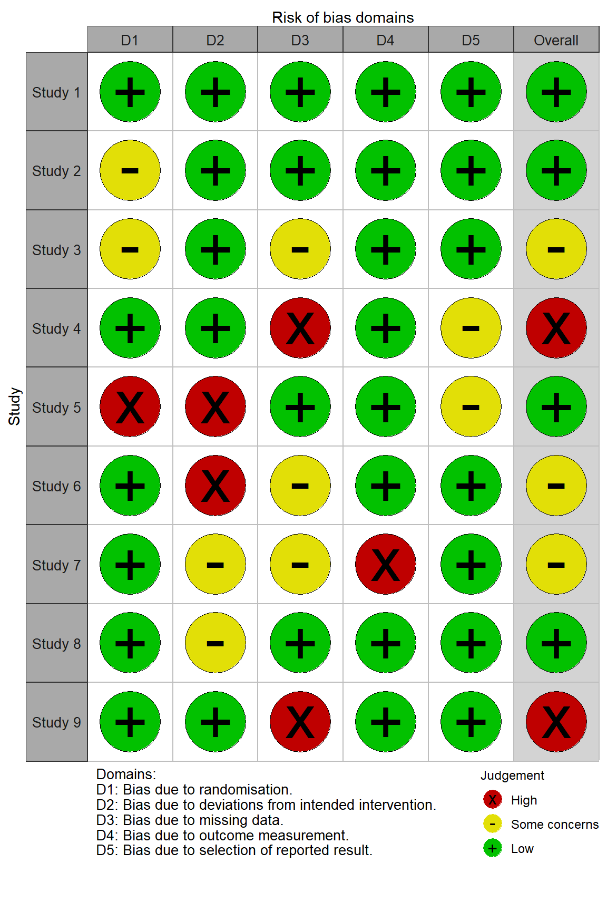
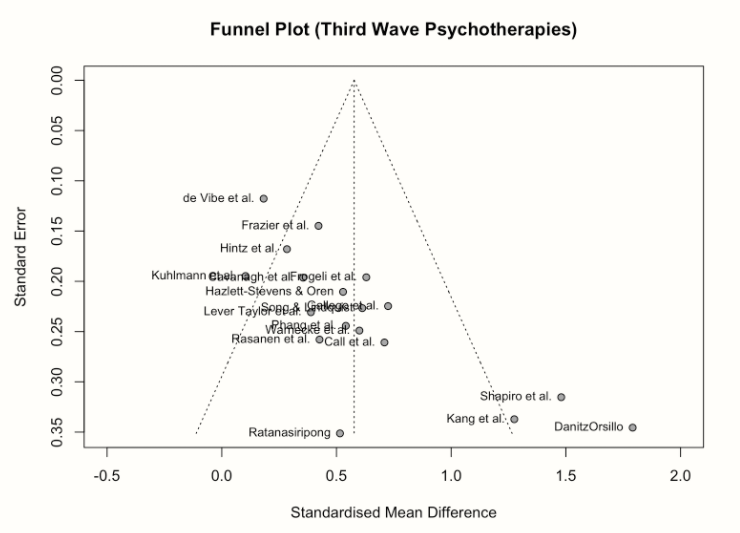

#Szisztematikus összefoglaló és meta-analízis készítése {-}

A szakirodalmi összefoglaló célja, hogy egy terület kutatásait
összegezze. Az így kinyert eredmények több kutatás eredményeit
összesítik, ezért nagyobb bizonyító erővel bírhatnak egy egyszeri
kutatásnál. A bizonyítékok hiearachiájában a --- megfelelő módon
elkészített --- összefoglaló tanulmányok rendelkeznek a legnagyobb
tudományos bizonyító erővel (lásd 1. Ábra). Továbbá a szakirodalmi
összefoglalók azt is lehetővé teszik, hogy megfigyeljünk olyan
összefüggéseket, amelyek az egyes kutatások szintjén észrevétlenek
maradnának. Így például lehetséges egy kezelés hatékonyságának és
biztonságosságának felmérése (pl. ritka mellékhatások rejtve maradhatnak
egy kis kutatásban, de láthatóvá válhatnak több tanulmány alapján), egy
hatás általánosíthatóságának vagy specifikusságának vizsgálata (pl. egy
terápia működik tapasztalt és tapasztalatlan terapeutákkal is),
következtetés háttérmechanizmusokra (pl. a laboratóriumi stresszorok
akkor okoznak kortizol választ, ha van bennük szociális komponens vagy
kontrollvesztés), egy területről meta-információk gyűjtésére (pl. mikor
volt népszerű egy kutatási terület). A kvantitatív szakirodalmi
összesítő tanulmányok (meta-analízis) segítségével pontosabban
megbecsülhetjük egy hatás nagyságát is. A szakirodalmi összefoglalók ún.
másodlagos kutatások, azaz nem saját adatokat gyűjtenek, hanem más
tanulmányok összesítésével és szintézisével jutnak következtetésekre.

**1. Ábra. Bizonyítékok hierarchiája**

{width="5.624601924759405in"
height="3.6718755468066493in"}

## Összefoglaló tanulmány fajták

A szakirodalmi összefoglalók többfélék lehetnek az elkészítés módjától
és a használt módszertől függően. A **narratív összefoglaló** egy olyan
tanulmány, ami egy szakterületet egy meghatározott cél alapján összesít,
például bemutatja a terület fő elméleteinek fejlődését. A felhasznált
kutatásokat nem szisztematikus keresés alapján, hanem egyéb szempontok
szerint vonja be a tanulmányba. Jellemzően egy szakterületet
összefoglalásakor csak a legfontosabb tanulmányokat tárgyalja. A
**scoping review** (szakirodalmi feltérképezés) célja, hogy egy terület
kutatásaiban jelentkező módszertani kérdéseket összesítse. Tehát
jellemzően nem a kutatások eredményeire kíváncsi, hanem arra, hogy
milyen módszerekkel, mintákkal, eszközökkel vizsgálták a korábbi
kutatások a területet. A scoping review-k hasznosak lehetnek egy
szisztematikus irodalmi összefoglaló megalapozására, illetve annak
szükségességének vagy megvalósíthatóságának felmérésére. A
**szisztematikus összefoglaló** készítése során előre meghatározott
szabályok alapján egy szakterület összes releváns kutatását
összegyűjtik, majd ezeket a kutatásokat rendszerezik és kvalitatívan
összesítik. A **meta-analízis** a szisztematikus összefoglalóban
foglaltakon túlmenően a kutatások eredményeit kvantitatívan is
összesítik, azaz számszerű becslést készítenek arról, hogy egy
hatásnagyság mekkora lehet a populációban.

**2. Ábra. Az összefoglaló tanulmány fajták és azok bizonyító erejének
összefüggése**

{width="3.682292213473316in"
height="1.9633453630796152in"}

### Narratív összefoglalók

A narratív összefoglaló egy terület legfontosabb eredményeibe nyújt
betekintést, anélkül, hogy az olvasótól elvárná a szakterület beható
ismeretét. Ez az összefoglaló fajta a többihez képest kevésbé tervezés
és erőforrás igényes. Például nem szükséges hozzá protokollt írni, vagy
több kutatót bevonni a tanulmányok kiválasztásához és adatkinyeréshez.
Akkor is elvégezhető, ha csak kevés kutatás létezik egy területen.
Ugyanezek miatt azonban a módszer jelentős hátránya lehet, hogy a
tanulmányok szubjektív beválogatása miatt nagyobb hangsúlyt kap a kutató
által felállított narratíva, ami bizonyos esetekben torz képet festhet
egy területről. Emellett a módszer nem igyekszik kvalitatív vagy
kvantitatív összesítésre, így nehéz megfelelően súlyozni az egymásnak
ellentmondó eredményeket. Mindezek miatt a narratív összefoglalók
ritkábban jelennek meg folyóiratcikként, a leggyakrabban
könyvfejezetként vagy monográfiaként publikálhatóak.

### Scoping review

Főleg arra való, hogy feltérképezzük egy terület lefedettségét, illetve
azt, hogy az adott területen milyen kérdések tisztázatlanok, vagy milyen
módszereket használnak. Egy scoping review-ban így többnyire nagyobb
hangsúlyt kap a cikkek módszertanának az áttekintése, mint a fő kutatási
kérdések összegzése. Egy sikeres scoping review segíthet eldönteni, hogy
egy szisztematikus irodalmi összefoglaló milyen kérdésekre tegye a
hangsúlyt.

### Szisztematikus összefoglaló

Célja egy területen rendelkezésre álló összes hozzáférhető bizonyíték
áttekintése. A bevont cikkek egy előzetes protokoll alapján,
szisztematikus kiválasztási folyamat során kerülnek a tanulmányba. A
kiválasztott cikkeket kategorizálják és a legfontosabb eredményeit
összegyűjtik, és kvalitatívan értékelik. A cikkeket gyakran osztályozzák
is, például aszerint, hogy mennyire erős bizonyító erővel bírnak. A
szisztematikus összefoglalók alkalmasak lehetnek egy terület
eredményeinek és módszertani jellemzőinek bemutatására. Azonban
kvantitatív összesítés híján az egymásnak ellentmondó eredmények
összesített értékelését nehéz elvégezni. Az olyan területeken, ahol túl
kevés az eredmény egy meta-analízis elvégzésére, gyakran szisztematikus
összefoglalót készítenek.

### Meta-analízis

A meta-analízis a szisztematikus összefoglaló olyan formája, ahol az
egyes kutatásokban található számszerű eredmények statisztikai
módszerekkel összesítésre kerülnek. Így egy terület kutatásait
összegyűjtve lehetővé válik a populációban lévő hatások pontosabb,
számszerű becslése. Ezen túlmenően arra is lehetőség nyílik, hogy a
kutatásokban lévő hatáskülönbségeket megfigyeljük, és azokat
megpróbáljuk megmagyarázni a cikkekben lévő módszertani különbségek
alapján. Így olyan összefüggések is feltárhatóak, amelyeket az egyes
kutatások nem vizsgáltak.

A meta-analízis készítése többnyire kevés anyagi költséggel jár, azonban
jelentős személyi ráfordítást igényelhet a kutatás időtartama miatt,
valamint azért, mert számos lépést csak több résztvevő közreműködésével
lehet elvégezni. A meta-analízisek azonban a többi cikkformához képest
jobb idézettségre számíthatnak, és ennek megfelelően a folyóitatok is
szívesen publikálják őket. Természetesen egy meta-analízis eredményei
csak annyira megbízhatóak, amennyire a bennefoglalt cikkek azt engedik.

## A szisztematikus összefoglaló és meta-analízis készítésének lépései

Az alábbiakban a meta-analízis készítésének lépéseit írjuk le. A fejezet
későbbi részében pedig ezeknek a lépéseknek a kivitelezéséről lesz
bővebben szó.

1.  Kutatási kérdés azonosítása

2.  Protokoll pre-regisztrációja

    a.  Előzetes irodalomkeresés

    b.  Kiválasztási protokoll megtervezése

    c.  Pilot keresés, hogy optimalizáljuk a protokollt

3.  Irodalomgyűjtés

    a.  Online adatbázisok

    b.  Témával kapcsolatos folyóiratok

    c.  "Szürke irodalom" (nem lektorált kutatások) --- a publikációs
        > torzítás ellensúlyozása miatt

        i.  Preprintek (pl. psyarxiv.com, biorxiv.org)

        ii. Céges "white paper"-ök (cégek saját, lektorálatlan
            > tanulmányai)

        iii. Disszertációk és szakdolgozatok (Proquest D&T,
             > [[thesiscommons.org]{.ul}](https://thesiscommons.org/))

        iv. Témával foglalkozó kutatók megkeresése a publikálatlan
            > tanulmányok miatt

4.  Cikkek beválogatása és kizárása

    a.  Duplikátumok eltávolítása

    b.  Első szűrés cím és absztrakt alapján.

    c.  Második szűrés teljes cikk elolvasása alapján.

    d.  Harmadik szűrés, ha egy cikk nem tartalmazza a szükséges
        > információkat.

5.  Adatok kinyerése a cikkből / kódolás

    a.  Tanulmány jellemzők (típus: RCT, keresztmetszeti, forrás: cikk,
        > könyvfejezet, disszertáció).

    b.  Minta jellemzők (életkor, férfi arány, klinikai státusz).

    c.  Cikk minőségének megállapítása (ld. Risk of Bias).

    d.  Hatásméretek (meta-analízis esetén).

6.  Adatok kvantitatív elemzése (meta-analízis esetén)

    a.  Hatásméretek összesítése, populáció hatás becslése.

    b.  Heterogenitás megállapítása.

    c.  Moderátorelemzés, meta-regresszió és alcsoport elemzések.

7.  Eredmények robusztusságának vizsgálata (meta-analízis esetén)

    a.  Szenzitivitás elemzés: lehetséges torzító tényezőkre, kutatások
        > minőségére.

    b.  Outlierek felfedezése.

    c.  Publikációs torzítás felmérése és korrekciója.

## Ellenőrző listák (checklistek) a szisztematikus összefoglalók készítéséhez

A szisztematikus összefoglalók és meta-analízisek készítéséhez
segítséget nyújthatnak az ellenőrző-listák. Ezek segítenek ellenőrizni,
hogy minden fontos részletet megemlítsünk a tanulmányban. Tartalmazza
mindazokat a követelményeket, amelyek biztosítják egy szisztematikus
összefoglaló jó minőségét és átláthatóságát. Létezik több ilyen
ellenőrző lista, mint pl. az Amerikai Pszichológusok Szövetségének a
listája (MARS), azonban a PRISMA checklist a legelterjedtebb [(Page et
al., 2021)](https://paperpile.com/c/47ntK5/aBiE), ezért ebben a
fejezetben is ezt tekintjük mérvadónak. Számos folyóiratnál követelmény,
hogy a PRISMA követelményeinek eleget tegyen a publikálásra leadott
tanulmány.

## Összefoglaló írásának lépései

## A kutatás céljának meghatározása

A kutatás céljainak a meghatározásához --- más típusú kutatásokhoz
hasonlóan --- használható az ún. PICOS (vagy PICOT) rendszer. Ez a
betűszó a hipotézisek legfontosabb részeinek meghatározásához
használható:

-   P (populáció): kikre vonatkozik a kérdés?

-   I (indikátor): minek a hatását vizsgáljuk?

-   C (comparison / összehasonlítás): mihez hasonlítjuk a változást?

-   O (outcome / kimenetel): mit mérünk?

-   T (time / idő) vagy néha S(study design; kutatási felépítés)

## Protokoll írása és regisztrációja

A statisztikai következtetések akkor lehetnek hitelesek, ha a
hipotézisek alkotása más adatok alapján történik, mint a hipotézisek
igazolása [(Lakens et al., 2016)](https://paperpile.com/c/47ntK5/Ymxc).
Ez praktikusan azt jelenti, hogy a hipotéziseket és tervezett
statisztikai eljárásokat azelőtt kell rögzíteni, mielőtt az adatok
elemzése megkezdődik [(Watt & Kennedy,
2016)](https://paperpile.com/c/47ntK5/lasZ). Ezért alakult ki, hogy a
metaanalízis készítés első és egyik legfontosabb lépése a protokoll
megírása, ami előre rögzíti a kutatás kulcskérdéseit, az adatgyűjtés
módjait, a tervezett statisztikai elemzéseket. A metaanalízis protokoll
megkönnyíti a kutatók későbbi munkáját, mivel egyértelmű szabályokat és
eljárásmódokat szolgáltat a kutatás során felmerülő kérdésekre. Emellett
megakadályozza, hogy a kutatók az adatok ismeretében állítsanak fel új
hipotéziseket, ami téves pozitív következtetésekhez vezethet [(Simmons
et al., 2011)](https://paperpile.com/c/47ntK5/tfwd).

A metaanalízis protokoll készítéséhez a PRISMA-P útmutató nyújt keretet
[(Moher et al., 2015)](https://paperpile.com/c/47ntK5/d0PX). A
protokollban alá kell támasztani a metaanalízis létjogosultságát és
formálisan rögzíteni kell a kutatási kérdéseket a PICO (résztvevők,
intervenciók, komparátorok, kimeneti változók) alapján. Továbbá le kell
írni a cikkek beválogatási és kizárási kritériumait, és rögzíteni a
kivonni kívánt változókat, és az adatelemzés tervezett módjait,
beleértve az eredmények robusztusságára vonatkozó intézkedéseket is.

A kutatások (pre)regisztráció néhány területen (pl. klinikai
gyógyszerkutatások) már most is kötelező, és a pszichológiában is sok
helyen normává válik [(Nosek & Lindsay,
2018)](https://paperpile.com/c/47ntK5/AQwD). A pre-regisztrált kutatást
sokan megbízhatóbbnak tekintik, mint a nem preregisztráltat, ezért
könnyebb publikálni, és az idézettsége is magasabb lehet. A
pre-regisztrált tanulmányok könnyebben publikálhatóak, akkor is, ha az
adatok nem támasztják alá a hipotéziseket.

A metaanalízis protokoll közzétehető lektorált cikk formájában olyan
folyóiratnál, ami befogad ilyen jellegű kéziratokat. Ennek előnye, hogy
a kutatás megkezdése előtt értékes visszajelzéseket kaphatunk a
protokollról, amelyek összességében jobbá teszik a kutatást. A protokoll
kevésbé formális, ám szintén elfogadott közzétételi módja a
preregisztrációs[^1] adatbázisba, vagy preprint szerverre való feltöltés
(pl. osf.io, PsyArXiv.com). A z elektronikus felületek rögzítik a
feltöltés és az esetleges módosítások pontos dátumát, így rögzítik a
kutatók témával kapcsolatos elsőségét is.

## Irodalomgyűjtés

Az összefoglaló alapjául szolgáló közlemények többsége
folyóiratcikkekből, könyv fejezetekből és disszertációkból áll. Ezen
lektorált források mellett az utóbbi időben a egyre gyakoribb a
lektorálatlan preprintek és kéziratok összegyűjtése is egy adott
témában. A közlemények elsődleges forrásának számítanak a kiadói
adatbázisok (pl. SpringerLink, Science Direct), az aggregáló adatbázisok
(pl. Web of Science, EBSCO, Google scholar), preprint szerverek (pl.
psyarxiv, biorxiv), szakdolgozat repozitóriumok (ProQuest D&T, Thesis
commons), és for-profit tudományos hálózati oldalak (ResearchGate,
Academia.edu).

Másodlagos forrásként használhatóak a beválogatott közlemények
irodalomjegyzékei, korábbi összefoglaló tanulmányok, illetve a
tudományterületen gyakran publikáló kutatók ajánlásai.

### Kulcsszavak meghatározása

Az irodalomkutatás egyik legfontosabb lépése a kulcsszavak megtalálása
és a keresőkifejezés (search term) létrehozása. A keresőkifejezés olyan,
többnyire univerzális szintaxis alapján létrehozott "utasítás", ami az
online adatbázis keresőjében hatékonyan azonosítja a számunkra fontos
közleményeket, míg a számunkra irrelevánsakat kiszűri. A keresőkifejezés
tartalmazza a kulcsszavakat, szűrő kritériumokat (pl. a közlemény
nyelvét, legkorábbi dátumát, stb.), valamint operátorokat és
behelyettesítő karaktereket, amelyek segítségével szűkíthetjük vagy
tágíthatjuk a keresésünk hatókörét. A legfontosabb logikai kifejezések,
joker karakterek, operátorok (a teljesség igénye nélkül):

-   \*: behelyettesítő karakter, használatával pl. csak egy szó elejét
    > kell megadni, pl. child\*.

-   AND, OR (néha & és \|): és / vagy logikai operátorok.

-   idézőjel (""), ami azt jelzi, hogy a benne foglalt szöveget szó
    > szerint kell érteni, és a keresés csak egyben értelmezhető.
    > Egyébként a szóközzel elválasztott szavak esetén minden szó külön
    > kifejezésnek számítana.

-   zárójel (): csoportképzés, ami akkor hasznos, ha logikai
    > operátorokat teszünk a kulcsszavak közé és ezeket a kifejezéseket
    > egy hierarchiába szervezzük.

Érdemes a keresőkifejezést előzetes keresések során finomítani. A végső,
szisztematikus keresésre szolgáló keresőkifejezést fontos szó szerint
elmenteni, mert azt meg kell adnunk a publikációban. A keresőkifejezések
az egyes adatbázisok szintaxisában való kisebb eltérések miatt néha
minden adatbázishoz külön kell megadnunk. A publikációban azt is le kell
írni, hogy mikor végezték legutoljára a keresést.

**1. Táblázat. Példa a Keresőszavak meghatározására a PICOS alapján**

  ------------------------------------------------------------------------------------
  **Populáció /  **Független   **Kontroll /    **Kimeneti   **Study      **Idő /
  Population**   változó /     Control**       változó /    design**     Time**
                 Indicator**                   Outcome**                 
  -------------- ------------- --------------- ------------ ------------ -------------
  anxiet\*       Home based    wait-list       STAI         RCT          Max 12 hónap
                 CBT                                                     utánkövetés

  child\*                      "treatment as   CESD         experiment   
                               usual"                                    

                                               BDI                       
  ------------------------------------------------------------------------------------

**3. Ábra. Keresőkifejezés példa**

Forrás: [(Kassai et al.,
2019)](https://paperpile.com/c/47ntK5/KZQd)
{width="6.267716535433071in"
height="1.5in"}

## Cikkek szűrése

Még a legjobban megírt keresőkifejezés esetén is számos olyan forrást
fogunk találni, amelyek valójában nem felelnek meg a beválogatási
kritériumoknak. Így egy beválogatási folyamat során el kell dönteni,
hogy melyik forrást tartjuk meg, és melyiket szűrjük ki. A cikkek
beválogatását a regisztrációban meghatározott módon kell elvégezni,
olyan módon, hogy minél kevésbé érvényesülhessenek a kutatók szubjektív
torzításai. Ezért a PRISMA checklist előírja, hogy minden forrás
beválogatásáról legalább két egymástól független kutató döntsön. A
beválogatási és kizárási kritériumokat minél pontosabban kell
megfogalmazni. Például meg kell határozni a publikáció típusát (pl.
folyóiratcikk, könyvfejezet), a kutatás felépítését (pl. RCT,
keresztmetszeti), a minta tulajdonságait (pl. csak felnőtt, csak
szorongó), az alkalmazott kezelést vagy manipulációt és a kontroll
helyzetet (pl. CBT vs. várólistás kontroll), a kimeneti változót /
konstruktumot (pl. depresszió pontszám), és a kutatás időtávját (pl. 2-6
hónapos utánkövetés). Ezek mellett további beválogatási kritériumok is
meghatározhatóak (pl. nyelv, időszak, stb.). A cikkek szűrését nagyban
megkönnyíti és felgyorsítja a kizárási kritériumok meghatározása, ezért
ezeket is érdemes konkrétan megfogalmazni. Újabban a gépi tanuló
algoritmusok elterjedése azt is lehetővé teszi, hogy ezt a folyamatot
részben vagy egészben automatizáljuk.

A kiválasztási folyamatot pontosan dokumentálni kell, és a publikációban
a PRISMA folyamatdiagramon számszerűen meg kell határozni, hogy a szűrés
melyik szakaszban hány kutatás esett ki a szűrőn.

**4. Ábra. PRISMA folyamatábra sablon**

{width="4.619750656167979in"
height="5.161776027996501in"}

Forrás:
[[http://www.prisma-statement.org/PRISMAStatement/FlowDiagram]{.ul}](http://www.prisma-statement.org/PRISMAStatement/FlowDiagram)

## Adatok kinyerése

A beválogatott cikkekből ki kell nyerni a szükséges adatokat és
információkat. Ez a meta-analízis készítés legnehezebb és
leghosszadalmasabb része, mivel általában a legtöbb információt csak a
forrás alapos átolvasása során lehet megtalálni. Továbbá gyakran nem is
fellelhető meg minden szükséges adat. Ilyenkor fel lehet keresni a
szerzőket, akik jobb esetben odaadják a kért információkat. Ha nem
találunk meg egy kulcsfontosságú adatot a forrásban, akkor az adott
kutatást ki zárnunk az elemzésből. Az adatkinyerést nehezíti, hogy azt a
PRISMA checklist szerint --- a szűréshez hasonlóan --- több egymástól
független kutatónak kell végeznie.

A kinyerhető adatok köre igen széles lehet. A meta-analízis elvégzéséhez
szükséges hatásméreteken túl a többi között ki lehet gyűjteni a mintára
vonatkozó adatokat (pl. férfiak aránya a mintában, átlagéletkor),
változókra vonatkozó adatokat (használt skála), a kutatás felépítésével
kapcsolatos adatokat, cikkre vonatkozó meta-adatokat (pl. kiadási év,
forrás típusa). Ezek mellett lehetséges az is, hogy a forrás bizonyos
jellemzőit független kutatók kódolják valamilyen szempontrendszer
szerint. Például egy feladat leírása alapján a kódolóknak kell
eldönteni, hogy a kutatásban alkalmazott feladatban volt-e versengés.

Fontos megjegyezni, hogy a kinyert és kódolt adatok általában a teljes
cikkre vonatkoznak. ha ezektől eltérünk --- pl. a jól elhatárolható
almintákat vesszük alapegységnek --- azt a kódolási tervben kell
meghatározni.

Objektív adatok kinyerése során a cikkben lévő számszerű értékeket kell
megtalálnunk és rögzítenünk. Ilyen lehet a kutatásban résztvevők száma,
neme, valamint a hatásméretek. Gyakran leleményesnek kell lennünk, mert
a cikkek nem közlik a számunkra lényeges számadatokat. Vagy ezeket a
számokat nem abban a formában találjuk meg, ahogy szükségünk lenne
rájuk, így ezeket nekünk kell kiszámolnunk más információk alapján.
Például ha a forrás nem közli a számunkra fontos hatásméretet, akkor
nekünk kell összesítő statisztikák alapján kiszámolnunk azt.
Előfordulhat az is, hogy nem a pontos számot találjuk meg, hanem egy
ábra alapján kell becslést tennünk az értékekre.

Lehetséges az is, hogy a cikkben lévő információt valamilyen kritérium
szerint kutatók kódolják. Például megítélik, hogy a cikkben szereplő
stresszor tartalmaz-e interperszonális elemet, kihívást, fizikai
fájdalmat, stb. [(Denson et al.,
2009)](https://paperpile.com/c/47ntK5/c8gL). A kódolás lehetséges
másodlagos forrásból származó információk alapján is, pl. videojátékok
életkori besorolása egy konkrét minősítő szervezet véleménye alapján. Ha
kutatók kódolnak adatokat, azokat fontos legalább két független
kódolóval elvégeztetni, és utána ellenőrizni a kódolók közötti
megbízhatóságot (inter-rater reliability). A kódolók közötti
reliabilitás megállapítására több módszer is létezik. Ezek közül a
Krippendorff alfa mutató a legflexibilisebb, mert használható
mindenfajta mérési szintű változóra, és bármennyi független kódolóra
[(Krippendorff, 2011)](https://paperpile.com/c/47ntK5/F4Py). Emellett az
értelmezése hasonló a pszichológusok által jól ismert Cronbach alfa
mutatóra. Ehhez hasonlóan 0 és 1 között vehet fel értéket, a jó egyezést
a 0.8, megfelelő egyezést a 0.67 feletti érték jelenti, míg az
alacsonyabb Krippendorff alfa rossz egyezést jelent. Az utóbbi esetben
meg kell határoznunk a döntési szabályt a kódolási protokollban. Például
lehetséges --- ám időigényes --- stratégia az adatok újrakódolása, a
vitás kódolás csoportos újrakódolása konszenzus alapján, vagy dönthet
egyszemélyben egy kijelölt kutató is.

### Kódolási struktúra

A kódolási struktúra annak a meghatározása, hogy a kódolók milyen adatok
gyűjtsenek ki, és azokat milyen módon rögzítsék. Az kódolási struktúrát
azelőtt kell meghatározni, mielőtt elkezdődnek az adatok kigyűjtése és
kódolása. A legjobb, ha a kódolási struktúrát egy üres táblázat
tartalmazza, amelyben azonban már látszanak a változónevek, instrukciók
a változók gyűjtésével kapcsolatban, valamint példák a lehetséges
értékekre. A kódolást meg kell tanítani a közreműködő kutatóknak, ehhez
érdemes egy kódolási instrukciót készíteni.

### Hatásméret (effect size)

A meta-analízisben a fő kimeneti változó a hatásméret. A hatásméret
annak a számszerűsített mutatója, mennyire erős egy összefüggés, vagy
mekkora a különbség két csoport illetve mérés között. A hatásméret
független az elemszámtól, ezért érdemes a becslés bizonytalanságával
(pl. konfidencia intervallum) együtt közölni. A hatásméret létezhet
nyers formában, pl. két csoport átlagának különbségeként. Ekkor a
mértékegysége megegyezik az eredeti mérés mértékegységével. Azonban így
nem összehasonlíthatóak és összevonhatóak a hatásméretek más kutatásból
származó hatásméretekkel. A meta-analízisekben a hatásméretek mindig
standardizált formában jelennek meg. Ezek jellemzője, hogy mértékegysége
független az eredeti mérés mértékegységétől, így az értéknek abszolút
jelentése van. Az eredeti források gyakran nem közlik a hatásméretet
olyan formában, amilyenre egy konkrét meta-analízisben szükség van.
Ezért az adat-kinyerési fázis során egyéb adatok alapján kell kiszámolni
a hatásméretet.

Három fő hatásméret mutató "család" van. Az egyiket a csoportok közötti
különbségekre a másikat a személyen belüli változásokra, a harmadikat a
változók közötti összefüggésekre használjuk. Az egyes hatásméretek
többféleképpen is kiszámíthatóak a nyers vagy összesített adatokból
[(Harrer et al., 2021)](https://paperpile.com/c/47ntK5/cXeG)[^2]. A
legtöbb hatásméret átalakítható egymásba, pl. a különbség hatásméret
összefüggés hatásméretté.

#### Öszefüggés hatásméretek

##### Folytonos kimeneti változók hatásméretei

A legismertebb összefüggés hatásméret a Pearson-féle r, avagy
korrelációs koefficiens. Párosított kvantitatív adatok összefüggésének
erősségét mutatja. Értéke -1 és 1 között van, előbbi jelzi a tökéletes
fordított arányosságot, utóbbi a tökéletes egyenes arányosságot. A 0
jelenti az összefüggés hiányát. Ehhez hasonló mutató a Spearman rho (ρ),
ami a nyers értékek helyett az értékek sorrendjének (rangjának)
korrelációja.

A korrelációs együtthatóhoz hasonló hatásméret mutató a lineáris
regresszió során kapott standardizált béta együttható. Ennek értelmezése
hasonló a korrelációs együtthatóhoz, azonban ha a regressziós modell más
prediktorokat is tartamaz, akkor az értéke eltérhet attól. Emiatt a
standardizált béták csak akkor összehasonlíthatóak, ha ugyanazok a
prediktorok találhatóak az összes többi modellben is.

Az η^2^(eta-négyzet): Azt jelzi az eta-négyzet, hogy a függő változó
varianciájából mennyit magyaráz meg egy prediktor, miközben a többi
független változóra kontrollálunk. Ez mindig túl fogja becsülni a
hatásméretet, mivel a minta varianciáját magyarázza, nem a populációét,
bár ahogy nő a minta, csökkenni fog ez a torzítás. Ennek egy változata a
részleges eta-négyzet (η^2^~p~), ami a hatás arányát mutatja, plusz a
hiba varianciát, ami a hatásnak tulajdonítható.

Az ⍵^2^ (omega-négyzet): Egy kevésbé torzító változata az
eta-négyzetnek. Az általános formáját alapvetően kevés elrendezésben
lehet felhasználni, de publikálták többfajta kiegészítését, variációját
is, ami felhasználható a dizájnok széles skáláján.

A Cohen-féle f^2^ szintén az F-teszthez, ANOVA-hoz, és többszörös
regresszióhoz használatos.

##### Diszkrét kimeneti változók hatásméretei

Az esélyhányados (Odds ratio, OR) annak az esélye, hogy a kimeneti
esemény megtörténik egy prediktor esemény bekövetkezése esetén, a
prediktor esemény hiányához képest. Azt mutatja, hogy hányszorosa
változik az esélye az eseménynek ha a prediktor jelen van. Folytonos
prediktor esetén pedig azt mutatja, hogy a prediktor értékének 1-gyel
való növekedése hányszorosára növeli a kimeneti esemény bekövetkezését.

A relatív kockázat (Relative Risk vagy Risk ratio) az esélyhányadoshoz
hasonlóan a kapcsolat erősségét mutatja a prediktor és a kimeneti
változó között. Annak a kockázatát mutatja, hogy egy esemény mennyivel
valószínűbb az egyik csoportban egy másik csoporthoz képest.

Míg az esélyhányados az esélyek hányadosa, a relatív kockázat a
valószínűségek hányadosa. Ezek a hatásméret mutatók hasonlóan
értelmezendőek: értéktartományuk 0 és végtelen között van, ahol az 1-es
érték jelenti az összefüggés hiányát (a prediktor nem befolyásolja a
bekövetkezés valószínűségét). Ha hányados nagyobb egynél, akkor a
prediktor a hányados arányában növeli a kimeneti esemény bekövetkezési
esélyét. Ha a hányados kisebb mint 1, akkor a prediktor csökkenti a
kimeneti esemény bekövetkezésének esélyét a hányados arányában.

#### Csoportok közötti különbség hatásméretek

A legismertebb különbség hatásméret a Cohen d (más néven standardizált
átlagkülönbség, SMD). Azt mutatja meg, hogy hány szórással nagyobb az
egyik (pl. kezelt) csoport átlaga a másik (pl. kontroll) csoporthoz
képest? Például a férfi-nő magasságkülönbség Cohen d-ben kifejezve d =
1.4.

Az előző hatásméret-mutató kis mintákra és egyenlőtlen varianciákra
korrigált változata a Hedge's g. Hasonlóképpen, a Glass-féle delta (Δ)
csak az egyik csoport szórását használja az arányosításnál.

#### Változás hatásméretek (személyen belüli hatásméretek)

A változás hatásméretek két mérés kölönbségén alapulnak (pl. kezelés
előtti és utáni mérések különbsége). Ez nem egyenlő az átlagok
különbségével, hanem az egyénen belüli különbségek átlaga. Ha a
forrásban csak a mérésenkénti átlagok és szórások állnak a
rendelkezésre, akkor a változás hatásméret kiszámításához azt is
szükséges tudni, hogy mennyire korrelálnak egymással az egyes mérések.
Ezen információk a hiányában csak becslést tudunk alkalmazni a
hatásméretre. Például feltételezhetjük, hogy az összefüggés a két mérés
között r = .5.

#### Arány mint hatásméret

Az említett standardizált hatásméret mutatók mellett előfordulhat, hogy
egy jelenség populációban való előfordulását (prevalenciáját) akarjuk
megbecsülni egy meta-analízis segítségével. Az arány vagy százalék
tulajdonképpen megfelel a hatásméret kritériumának, hiszen egy
standardizált mutató, aminek értelmezése független a kontextustól. A
százalékokat azonban nem lehet szimplán összeátlagolni, mert úgy az
alacsony vagy magas prevalencia esetén a konfidencia intervallumok
könnyen átléphetik az elméleti minimumot (0%) vagy maximumot, valamint
ebben az esetben nem vesszük figyelembe a mintaméreteket. Ezért logit
transzformációt kell alkalmazni a hatásméretek összesítésénél. Ehhez
számítható standard hiba vagy konfidencia intervallum is, ami soha nem
lépi át a 0 vagy 1 értéket [(Harrer et al.,
2021)](https://paperpile.com/c/47ntK5/cXeG).

**2. Táblázat. Legfontosabb hatásméretek nagyságrendjének értelmezése**

  ----------------------------------------------------------------------------
  **Nagyságrend**   **d, g,    **f^2^**   **r, ρ,    **η^2^,      **OR, RR\***
                    Δ**                   β**        ⍵^2^**       
  ----------------- ---------- ---------- ---------- ------------ ------------
  Kicsi             \< 0.2     \< .15     \< .1      \< .01       \< 1.5 /
                                                                  \>.7

  Közepes           \~ 0.5     \~ .4      \~ .25     \~ .06       \~ 2.5 /
                                                                  \~.4

  Nagy              \> 0.8     \> .6      \> .4      \> .14       \> 4.3 / \<
                                                                  .23
  ----------------------------------------------------------------------------

**Megjegyzés.** A nagy hatásméret olyan, amit akár "szabad szemmel" is
láthatunk. Pl. ha szétnézünk egy konferencia teremben, szabad szemmel is
látható, hogy a férfiak átlagosan magasabbak a nőknél. \*: Az OR/RR
értelmezésénél az első szám a pozitív összefüggésre, a második a negatív
összefüggésre vonatkozik.

Forrás: [(Ben-Shachar et al.,
2020)](https://paperpile.com/c/47ntK5/vTUR)

## Hatásméretek összesítése

A meta-analízis során az egyes forrásokból származó hatásméretekből
szeretnénk megbecsülni az összesített hatásméretet (pooled effect size).
Az összesítés nem egyszerűen a hatásméretek átlagolásával történik,
hanem egy statisztikai modell segítségével, ami a valódi hatásméret
megtalálására irányul. A metaanalízis végső célja, hogy megbecsülje azt
a hatásméretet, amely a tanulmányok összességét jellemzi, még akkor is,
ha a megfigyelt hatásméretek tanulmányonként eltérőek. A felhasznált
modellnek meg kell magyaráznia, hogy miért és mekkora mértékben
különböznek a megfigyelt hatásméretek, annak ellenére, hogy csak
egyetlen átfogó hatás van.

Kétfajta modell létezik, amely erre a kérdésre próbál választ adni: a
fix-hatás (fixed effect) és a véletlen-hatás (random effect). Bár a két
modell különböző előfeltevéseken alapul, mégis szoros kapcsolat van
közöttük [(Borenstein et al.,
2013)](https://paperpile.com/c/47ntK5/uh9F).

### Fix-hatás modell 

A fix-hatás modell azt feltételezi, hogy minden hatásméret egyetlen,
homogén populációból származik. Eszerint minden tanulmánynak ugyanaz a
valódi hatásmérete, és az ettől való eltérések oka kizárólag a
mintavételezési hibából eredeztethető. Mivel a nagy számok törvénye
alapján tudjuk, hogy a nagyobb elemszám nagyobb precizitással --- azaz a
valós hatásmérettől való kisebb eltéréssel --- jár, ezért a nagyobb
kutatásokat nagyobb súllyal kell figyelembe venniük a hatásméretek
összesítésekor. Ezért a fix-hatás modell az összesített hatásméretek
kiszámításakor a hatásméretek súlyozott átlagát használja [(Borenstein
et al., 2013)](https://paperpile.com/c/47ntK5/uh9F). A fix-hatás modell
nem alkalmas egy egész területre vonatkoztatható következtetések
levonására. Jellemzően akkor indokolt a használata, ha egy laboron belül
több, azonos módszertannal készült tanulmány összesített hatásméretét
szeretnénk kiszámítani. Ezt szokták meta-analitikus összesítésnek
(meta-analytic summary) nevezni.

### Véletlen-hatás modell

A véletlen-hatás modell feltételezése szerint a hatásméretek nem csak a
mintavételezési hiba miatt térnek el a valós hatásmérettől, hanem amiatt
is, mert az egyes tanulmányok között módszertani különbségek vannak.
Például a kimeneti változót különböző módon mérik, vagy a kezelés
típusa, intenzitása, vagy hossza nem azonos. Ebből adódóan a tanulmányok
közötti heterogenitásra számíthatunk. Ezért a véletlen-hatás modell nem
csupán egyetlen ("valódi") összesített hatásméretet próbál megbecsülni,
hanem a valódi hatások eloszlásának átlagát. A véletlen-hatás modellben
a hatásméretek súlyozása nemcsak a mintamérettől, hanem a kutatások
közötti varianciától is függ. Ezt a varianciát (τ^2^; tau-négyzet)
először meg kell becsülnünk. Ennek a becslésnek az elvégzésére több
módszer is létezik (pl. restricted maximum likelihood, REML;
DerSimonian-Laird, stb.), amelyeknek a részleteit lásd Veroniki és mtsai
[(2016)](https://paperpile.com/c/47ntK5/6Fs6/?noauthor=1). A
véletlen-hatás modell nagyobb általánosíthatóságot enged meg, ami miatt
az egész területre vonatkoztathatóak a következtetései.

### Az összefüggő hatásméretek problematikája

Előfordulhat, hogy egy forrásból több hatásméretet is ki szeretnénk
nyerni. Ez például akkor fordulhat elő, ha több időpontból is vannak a
kutatásban hatásméretek, vagy ha ugyanazt a kimeneti változót többféle
módszerrel is mérte a kutatás. Az azonos forrásból származó mérések
általában közelebb állnak egymáshoz, hiszen ugyanazt a módszert és
mintát használták az adatgyűjtéshez. Ez azzal jár, hogy ezek között a
hatásméretek között kisebb lesz a különbség (azaz alacsonyabb a
variancia). Ha az azonos forrásból származó hatásméreteket külön
kutatásként tennénk be a meta-analízisbe, az az adott forrástból
származó hatásméret felülreprezentáltságát okozhatja, ami torzíthatja a
az összesített hatásméretet. Ezért a közös forrásból származó, és
ugyanarra a kimeneti változóra vonatkozó hatásméreteket vagy összevonjuk
(pl. átlagoljuk), vagy kiválasztunk egyet (szisztematikusan valamilyen
elv, pl. legjobb reliabilitású mérőeszköz alapján, vagy
véletlenszerűen). A másik megoldás, hogy többszintű meta-analízist
alkalmazunk, ami lehetővé teszi, az azonos forrásból származó
hatásméretek összetartozásának figyelembe vételét a statisztikai
modellben. Ez a megközelítés hasonlóan működik a pszichológiában gyakran
használt kevert hatású modellekhez (mixed-effect models) [(Harrer et
al., 2021)](https://paperpile.com/c/47ntK5/cXeG).

### A meta-analízis eredményeinek ábrázolása

A meta-analízis eredményeit a leggyakrabban ún. forest plot segítségével
ábrázolják (ld. lent). Ez az ábrázolás tartalmazza a források neveit és
a hozzá kapcsolódó hatásméretet és konfidencia intervallumot, valamint a
mintaméretet vagy a kutatás súlyát az összesített hatásméretben. Az
egyes források alatt az összesített hatásmérethez kapcsolódó becslések
találhatóak. Az ábra jellemzően tartalmaz egy függőleges referencia
vonalat is, amely az x-tengelyen azt a pontot jelöli, amely a hatás
hiányának felel meg (arány hatásméreteknél az 1, egyébként a 0).
Amennyiben az összesített hatásméret konfidencia intervalluma nem fed át
a referencia értékkel, akkor azt mondhatjuk, hogy a vizsgált hatás
valószínűleg létezik.

A hatásméreteket és a konfidenciaintervallumokat általában lineáris
skálán jelenítik meg. Ha azonban az összefoglaló mérőszám egy arányszám
(például esélyhányados vagy kockázati hányados), akkor az x-tengelyen
általában logaritmikus skálát használnak. Ez azt jelenti, hogy az 1
körüli értékek szorosabban helyezkednek el egymás mellett, mint az 1-nél
jóval alacsonyabb vagy magasabb értékek.

**5. Ábra Forest plot**

Forrás: [(Harrer et al.,
2021)](https://paperpile.com/c/47ntK5/cXeG){width="6.267716535433071in"
height="2.9166666666666665in"}

## Hatásméretek heterogenitása

Az előzőekből következően az egyes kutatások által mért hatások
variábilisek. Így a véletlen-hatás metaanalízis elvégzéséhez nem csak a
hatásméretekre van szükség, hanem azok bizonytalanságának mutatójára is
(hatásméretek standard hibája). Ez kiszámítható magából a hatásméretből
és az elemszámból (változás hatásméretnél a mérések közötti korreláció
is szükséges).

A meta-analízisbe kerülő hatásméretek variabilitásnak két forrása van.
Az egyik a korábban említett mintavételezési hiba, a másik a kutatások
közötti heterogenitás (between-study heterogenity). Amikor a tanulmányok
közötti heterogenitást akarjuk számszerűsíteni, a nehézséget az jelenti,
hogy meghatározzuk, hogy az eltérés mekkora része vezethető vissza a
mintavételi hibára, és mekkora része a valódi hatásméretbeli
különbségekre. Amennyiben van jelentős heterogenitás a kutatások között,
használhatunk moderátor elemzést vagy alcsoport elemzést (ld. később).

### A heterogenitás mérése

A tanulmányok mintavételi hibáját a tanulmányok közötti tényleges
heterogenitástól hagyományosan a Q statisztika segítségével
különböztetik meg. A Q statisztika értékét arra lehet használni, hogy
ellenőrizzük, van-e többlet variabilitás az adatainkban, vagyis
nagyobb-e variabilitás, mint ami csak a mintavételi hiba miatt várható.
Ha ez a helyzet, akkor feltételezhetjük, hogy a fennmaradó eltérés a
vizsgálatok közötti heterogenitásból adódik. Bár a Q-statisztikát
gyakran használják a metaanalízisekben, ez egy torz mérőszám lehet. A
Q-statisztika értéke és szignifikanciája ugyanis nagymértékben függ a
metaanalízis méretétől, és így annak statisztikai erejétől [(Harrer et
al., 2021)](https://paperpile.com/c/47ntK5/cXeG). Ezért nem elég
kizárólag a Q statisztika szignifikanciáját vizsgálni a heterogenitás
megállapításához.

A Q statisztika hiányosságainak a kiküszöbölésére jöttek létre további
mutatók, amelyek számszerűsítik a kutatások közötti heterogenitást. Ezek
a mutatók is Q statisztikán alapulnak, azonban korrigálnak a
hatásméretek számára. I^2^ azt mutatja meg, hogy a hatásméretek
variabilitásának hány százaléka marad megmagyarázatlanul a
mintavételezési hiba által. Pl. ha az I^2^ = 90%, azt jelenti, hogy a
hatásméretben lévő variabilitás 90%-a a kutatások populációjának
varianciájából ered, nem a mintavételezési hibából. Ennek a mutatónak az
előnye, hogy az értéke nem növekszik a tanulmányok számának növelésével,
és könnyű megérteni a jelentését (I^2^ = 25%: alacsony, 50% közepes, 75%
jelentős heterogenitás).

A H^2^ szintén a Q statisztikán alapul, és hasonlít az I^2^-höz. Ha
nincs kutatások közötti heterogenitás, akkor az értéke 1 vagy kisebb. Az
1-nél nagyobb érték heterogenitást jelez.

A hatásméretek varianciája (tau-négyzet, τ^2^) és szórása (tau, τ)
szintén lényeges, ezekből ki lehet számítani a hatásméret körüli
konfidencia intervallumokat.

### A heterogenitás forrásai

A kutatások közötti heterogenitás számos forrásból származhat. Egyrészt
lehet elrendezés alapú: ha "almákat akarunk körtékkel" összehasonlítani.
Azaz nem kellően összehasonlíthatóak egymással a kutatások. Ez hibát
jelent, amit ki kell javítanunk. Pl. csak összehasonlítható kutatásokat
és kimeneti változókat használunk. A heterogenitás lehet statisztikai
alapú, amikor a hatást bizonyos kutatások közötti különbségek moderálják
pl. minta életkora, nemi eloszlása, használt kezelés típusa. Ezen felül
lehetnek outlinerek kiugró hatásméretek, amelyek jelentősen eltérnek a
többi hatásmérettől (ld. később).

## Moderátor elemzések

Habár a hatásméretek heterogenitásának mérésére többféle módszer
létezik, ezek a megközelítések nem mondják meg, hogy miért találunk
túlzott változékonyságot az adatokban. Különböző módszerek lehetővé
teszik számunkra, hogy hipotéziseket teszteljünk arra vonatkozóan, hogy
egyes tanulmányok miért rendelkeznek nagyobb vagy kisebb valódi
hatásmérettel, mint mások. Így olyan kérdéseket is megválaszolhatunk,
amelyek az egyes tanulmányokban külön-külön nem voltak tesztelhetőek.
Például, hogy van-e szerepe a terápia hatékonyságára annak, hogy
pontosan milyen kezelést kaptak a résztvevők, van-e szerepe annak, hogy
csoportban vagy egyénileg kaptak kezelést, van-e szerepe a résztvevők
életkorának, a kezelés hosszának, stb. Ezeket az elemzéseket a
meta-analízisben moderátor-elemzésnek hívják, mert a hatásméret eleve
már egy változók közötti hatást ír le. Moderátor elemzést csak akkor
érdemes vagy lehet végezni, ha számottevő heterogenitás van a
hatásméretekben, illetve kellően sok kutatás áll rendelkezésre. A
moderátorok hatását tesztelhetjük meta-regresszióval vagy alcsoport
elemzéssel. Az előbbit elsősorban folytonos, míg az utóbbit diszkrét
mérési szintű moderátorokkal lehet elvégezni. Mint az alábbiakban
látható, valójában a meta-regresszió alkalmazható alcsoportok átlagos
hatásméretének összehasonlítására is, ezért ez egy általánosabban
használható módszer.

### Meta-regresszió

A meta-regresszió során a kimeneti változó a hatásméret, a prediktor
pedig az a változó, aminek a hatását szeretnénk vizsgálni.
meta-regresszió során tesztelhetőek olyan hipotézisek, amelyek az
eredeti tanulmányokban nem voltak tesztelhetőek. Például több
keresztmetszeti kutatás eredményeit összesítve, és a minták átlagos
életkorát prediktorként használva megállapítható, hogy az eredményeket
moderálta-e az életkor.

A meta-regresszió nevéhez híven egy regresszió, ami legtöbb
tulajdonságát tekintve egy (generalizált) lineáris regresszióhoz
hasonlít. Azonban a hétköznapi OLS regressziótól eltérően az egyes
tanulmányok az elemszámuknak megfelelő súllyal kerülnek a modellbe.
Számítható a modellhez R^2^ érték, ami megmutatja, hogy a
heterogenitásnak hány százalékát sikerült megmagyarázni. Továbbá hasonló
korlátai és feltételei vannak, mint a sima regressziónak. Csakúgy, mint
a lineáris regressziónál, itt is van lehetőség kontrollváltozók (pl.
confounderek) használatára, vagy interakciók tesztelésére.

Nemcsak folytonos prediktorokat használhatunk a meta-regresszió során,
hanem vizsgálhatjuk diszkrét moderátorok hatását is. A lineáris
regresszióhoz hasonlóan ilyenkor a prediktor változó dummy kódolásával
egy többszintű változóból több kétszintű változó jön létre. Ezt sok
statisztikai program automatikusan elvégzi helyettünk. Ilyenkor az
eredeti változó egyes szintjei külön kétszintű prediktorokként jelennek
meg a modellben. Amennyiben egy regresszióba kétszintű prediktort
teszünk, a tengelymetszethez (intercept) tartozó becslés a baseline
csoport átlagával fog megegyezni, a dőléshez (slope) tartozó becslés
pedig a két csoport közötti átlagkülönbséggel. Ennek a nullától való
eltérését tesztelve megtudhatjuk, hogy statisztikailag szignifikáns-e az
eltérés [(Lindeløv, 2019)](https://paperpile.com/c/47ntK5/NE7Y).

**6. Ábra Két csoport különbségének ábrázolása regresszióként**

{width="5.097904636920385in"
height="2.620297462817148in"}

Forrás: [(Lindeløv, 2019)](https://paperpile.com/c/47ntK5/NE7Y)

Az eredetileg többszintű diszkrét változók esetében ugyanez a logika
érvényesül. Ilyenkor az egyik szint --- jellemzően a sorrendben első ---
lesz az alapszint, és egyben az intercepthez tartozó becslés. A változó
további diszkrét szintjeihez tartozó slope-ok az egyes csoportok
alapszinttől való eltéréseit mutatják. Ezek nullától való eltérése
külön-külön tesztelhető.

**7. Ábra Több csoport különbségének ábrázolása regresszióként**

{width="4.0791240157480315in"
height="2.7194061679790025in"}

Forrás: [(Lindeløv, 2019)](https://paperpile.com/c/47ntK5/NE7Y)

A meta-regresszióhoz szükséges minimális elemszám a lineáris
regresszióhoz hasonlóan attól függ, hogy hány moderátort vizsgálunk
egyszerre. Fontos adalék, hogy ha diszkrét moderátor változót
használunk, akkor a változó minden szintje egy külön prediktornak
minősül, ami kevés kutatás esetén lehetetlenné teheti a meta-regresszió
elvégzését. Például ahhoz, hogy egy négyszintű diszkrét változó moderáló
hatását vizsgáljuk, minimum 5 kutatásra van szükség.

### Alcsoport elemzés (subgroup analysis)

Alcsoport elemzés segítségével csoportok hatásmérete közötti
különbségeket hasonlíthatunk össze, azaz kategorikus változók mentén
hasonlítjuk össze az összesített hatásméreteket. Az alcsoportokon belüli
tanulmányokat a legtöbb esetben véletlen-hatású modellel vonjuk össze.
Ezt követően egy Q tesztet alkalmazunk az alcsoportok összesített
eredményei alapján annak megállapítására, hogy a csoportok
szignifikánsan különböznek-e egymástól. Az alcsoport elemzés eredménye
praktikusan megegyezik az eredménye a meta-regresszió eredményével, ha
ott kategorikus prediktort használunk.

## Robusztusság ellenőrzése

A meta-analízis során fontos, hogy ellenőrizzük, hogy az eredményeink
megbízhatóak-e, azaz nem valamilyen torzító tényezőnek köszönhetőek. Ez
különösen fontos amiatt, mert egy meta-analízisben az elemszám
(kutatások száma) jelentősen kisebb, mint egy elsődleges kutatásban.
Továbbá előfordulhat, hogy egy gyengébb kutatás nagyobb résztvevőszáma
miatt nagyobb súllyal kerül be a modellbe, így a végső eredmény
torzított lesz. Ezért a szisztematikus torzításokat meg kell próbálnunk
kiszűrni, ellensúlyozni, vagy jobb híján beszámolni róluk.

### Kiugró hatásméretek (outlierek)

Az outlierek egy meta-analízisben olyan hatásméretek, amelyek a
többiektől távol esnek. Azonosításuk egyszerűbb, mint az elsődleges
kutatásokban, mert abból indulunk ki, hogy a meta-analízis összesített
hatásmérete maga a populáció hatásméret, így ha az összesített
hatásméret konfidencia intervallumával nem fed át egy kutatás
hatásméretének konfidencia intervalluma, azt outliernek tekinthetjük. Az
outliereket általában biztonságosabb kizárni a meta-analízisből, mert a
kiugró hatásméret valószínűsíthetően olyan kutatásból származik, ami az
összes többitől jelentősen eltér. Az outlier keresés rekurzív folyamat,
azaz ha kizárunk egy outliert, akkor újraszámolva az összesített
hatásméretet, új outliert találhatunk [(Viechtbauer & Cheung,
2010)](https://paperpile.com/c/47ntK5/cQq8).

### Szenzitivitás elemzés

A szenzitivitás elemzések az eredmények robusztusságát hivatottak
bizonyítani. Azaz azt, hogy a kapott összefüggések nem valamilyen
torzítás eredményeként születtek-e. A gyakorlatban a szenzitivitás
elemzésnek számít minden olyan elemzés, ami megmutatja, hogy az
eredmények más módszerek használatával is lényegében változatlanok
maradnak. A szenzitivitás elemzések gyakorlatilag olyan moderátor
elemzések, amelyben a prediktorok valamilyen meta-tulajdonságára
vonatkozó változók. Ilyen lehet a kutatások minősége/megbízhatósága, a
kutatás publikálásának évszáma, a kutatás származási országa, vagy a
labor, ahonnan az egyes kutatások származnak.

## Cikkek minőségének mérése

Minden meta-analízis csak annyira megbízható, amennyire az azt alkotó
cikkek.

Azok a cikkek, amelyek nem elég körültekintően készültek, torz eredményt
mutathatnak.

A torzító tényezőkre lehet következtetni a bevont források alapján.

Egyes kutatás fajtákra léteznek különböző ellenőrző listák, amelyek
alapján felmérhető a kutatás minősége [(ld. Ma et al.,
2020)](https://paperpile.com/c/47ntK5/rahq/?prefix=ld.). Az alábbiakban
a randomizált klinikai kutatások (RCT-k) minőségével kapcsolatos
megfontolásokat tárgyaljuk.

### Torzítás fajtái és forrásai az RCT-kben

A randomizált klinikai kutatások során a torzítás öt (+1) fő területen
jelenhet meg.

1.  Kiválasztási torzítás (selection bias): különbségek az
    > összehasonlított csoportok tulajdonságaiban. A torzítás a nem
    > véletlenszerű besorolásból vagy a besorolás tényének ismeretéből
    > származhat (blinding hiánya).

2.  Teljesítmény torzítás (performance bias): különbségek a kezelésben
    > (pl. intervencióban). A torzítás a besorolás tényének ismeretéből
    > származhat (blinding hiánya).

3.  Detekciós torzítás (detection bias): Szisztematikus különbségek a
    > csoportok között az eredmények meghatározásában. Akkor fordulhat
    > elő, ha a csoportok különböznek a kimeneti információk gyűjtésének
    > módjában vagy a kimenetek ellenőrzésének módjában.

4.  Lemorzsolódási torzítás (attrition bias): csoport különbségek a
    > lemorzsolódásban. A hiányos adatok mennyiségétől, természetétől,
    > és kezelésétől függ.

5.  Beszámolási torzítás (reporting bias): Abból ered, hogy a kutatás
    > megtervezésében, lebonyolításában, elemzésében vagy terjesztésében
    > részt vevő felek szelektíven hozzák nyilvánosságra vagy
    > visszatartják az információkat.

6.  Egyéb torzítások (other bias): olyan torzítások, amelyeket más
    > torzítások nem fednek le.

Ezeknek a torzító tényezőknek a lehetőségét a publikáció alapján
mérlegelni lehet. Ez alapján mindegyik torzításról meg kell ítélni, hogy
ezekre alacsony, némi, magas, vagy ismeretlen mértékű a torzítás
rizikója. A Cochrane Risk of Bias eszköz ezt segít felmérni [(Higgins et
al., 2011)](https://paperpile.com/c/47ntK5/OE7S). Ezután tanulmányonként
vagy összesítve is láthatjuk az egyes torzítások kockázatát.

**8. Ábra. A torzítási kockázatok ábrázolása forrásonként**

**9. Ábra. A torzítási kockázatok összesített ábrázolása az összes
tanulmányra**{width="3.2031255468066493in"
height="4.798946850393701in"}

{width="6.106737751531059in"
height="1.8368044619422572in"}

## Publikációs torzítások (publication bias)

A szisztematikus összefoglalók és meta-analízisek minőségét befolyásolja
az, hogy az adott területen van-e jelentős torzítás a az eredmények
közlésésében. A publikációs torzítás azért okozhat problémát a
meta-analízisekben, mert a populáció hatásméret becslésében
szisztematikus eltérést okozhat, például ha nem egyenlő arányban
hiányoznak kutatások a hipotéziseket alátámasztó és cáfoló eredmények
közül.

A közlési torzítások közé tartozik a publikációs torzítás (publication
bias), amibe a késleltetett publikálási torzítás (delayed publication
bias/time-lad bias/ pipeline bias) és az elhelyezkedésből fakadó
torzítások tartoznak (location bias).

A késleltetett publikálási torzítás azt jelenti, hogy a szignifikáns
eredményeket tartalmazó kutatásokat nem csak nagyobb számban
publikálják, hanem gyorsabban is átmennek a publikálási folyamaton
[(Stern & Simes, 1997)](https://paperpile.com/c/47ntK5/HW4k). A
hipotéziseket nem igazoló kutatásokat a kutatók gyakran nem közlik, ami
hozzájárul az ún. asztalfiók problémához, ami a szignifikáns eredmények
túlsúlyát okozza a publikált tanulmányokban.

Az elhelyezkedésből fakadó torzítások közé tartozik a nyelvi torzítás,
ami szerint a szignifikáns eredmények nagyobb valószínűséggel jelennek
meg angol nyelvű szaklapokban. Szintén ide tartozik az idézési torzítás,
ami szerint a szignifikáns eredményeket nagyobb valószínűséggel idézik
máshol.

A közlési torzítások közé sorolható a szelektív eredmény közlés
(selective outcome reporting), ami azt jelenti, hogy a szerzők több
statisztikai teszt eredményei közül csak a szignifikáns eredményeket
írják bele a cikkbe. Szintén ide sorolható még a szelektív analízis
közlés torzítása is, ami akkor lép fel, amikor az adatokat indoklás
nélkül transzformálják, összesítik. A többszörös publikációs torzítás
azt jelenti, hogy a \"sikeres\" tanulmányok eredményeit nagyobb
valószínűséggel közlik több folyóiratcikkben, ami megkönnyíti, hogy
legalább egyet találjunk közülük. A tanulmányok eredményeinek több
cikkben történő közlésének gyakorlatát \"szalámi szeletelésnek\" (salami
slicing) is nevezik.

Habár a publikációs torzítást egy adott terület sajátja, így nem tudjuk
teljesen kiküszöbölni, lehetőségünk van megbecsülni a mértékét
[(Renkewitz & Keiner, 10/2019)](https://paperpile.com/c/47ntK5/hHCR). A
meta-analízisek készítése során fontos, hogy a közési torzítást
megpróbáljuk megbecsülni, és ha szükséges, korrigáljuk a kapott
összesített hatásméretet a hiányzó kutatások becsült eredményeivel.

### Publikációs torzítás azonosítása

Számos publikációs torzítási módszer a kis tanulmányok hatásainak
elképzelésén alapul. Ezek a megközelítések azt feltételezik, hogy csak a
nagy hatásmérettel rendelkező kis tanulmányok kapnak szignifikáns
eredményeket, és ezért kerülnek publikálásra. A publikációs torzítás
mérésére számos módszer létezik, amelyek közül itt csak néhányra térünk
ki. Az egyéb módszerekhez lásd többek között Renkewitz és Keiner
[(10/2019)](https://paperpile.com/c/47ntK5/hHCR/?noauthor=1) valamint
Harrer és mtsai
[(2021)](https://paperpile.com/c/47ntK5/cXeG/?noauthor=1) tanulmányait.

Az egyik leggyakrabban használt eszköz a publikációs torzítás becslésére
és ábrázolására a tölcsér ábra (funnel plot) használata. Ez a kis
kutatások torzító hatását segít megbecsülni (small study bias). Mivel a
kis mintaméret statisztikailag a nagyobb mérési hibát jelent, ezért az
ilyen források gyakrabban jelentenek szélsőséges hatásméretet. Az ábrán
az x tengelyen az egyes tanulmányok hatásméretét (a standardizált
átlagos különbségként kifejezve), az y tengelyen pedig a standard hibát
(a nagytól a kicsiig) mutatja. Az értelmezés megkönnyítése érdekében a
grafikon tartalmazza azt az idealizált tölcsér formát is, amelyet a
hatásméretektől elvárunk, ha nincs torzítás. A tölcsér közepén lévő
függőleges vonal az átlagos hatásméretet mutatja. Small study bias
hiányában a hatásméreteknek nagyjából a grafikonon látható tölcsér által
lehatárolt alakot kell követniük, azaz a hatásméreteknek szimmetrikusan
és tölcsérszerűen kell szétterülnie. Ha van torzítás, akkor a
hatásméretek eloszlása aszimmetrikus.

**10. Ábra. Tölcsér ábra (funnel plot) torzítási hiba esetén**

Az aszimmetria és a statisztikai szignifikancia kapcsolatának
vizsgálatára jó módszer a kontúros tölcsér diagramok használata. Az
ilyen ábrák segíthetnek megkülönböztetni a publikációs torzítást az
aszimmetria más formáitól. A kontúros tölcsér diagramok szürke sávjai az
jelzik, hogy az egyes tanulmányok hatásméretei a szignifikancia melyik
szintjét érik el. Különösen a p\< 0,05 és p\< 0,01 sávok fontosak, mivel
az ebbe a területbe eső hatásméreteket hagyományosan szignifikánsnak
tekintik. Amennyiben a hatásméretek
{width="4.729166666666667in"
height="3.1121719160104986in"}

**11. Ábra. Kontúros tölcsér ábra (contour-enhanced funnel plot)
torzítási hiba
esetén**{width="4.770833333333333in"
height="3.03125in"}

### Publikációs torzítás statisztikai vizsgálata és korrekciója

#### Egger teszt

A kis tanulmány torzítás egy számszerűsített mérése az Egger teszt, ami
gyakorlatilag egy lineáris regresszió, ahol a súlyozott hatásméretet
prediktáljuk a vizsgálat precizitásával (a hatásméret standard hibájának
reciprokával). Ebben a modellben azt vizsgáljuk, hogy a regresszió
tengelymetszete (intercept) jelentősen eltér-e a nullától, ahol a nulla
érték a nulla precizitásnak felel meg (azaz ha a tanulmány standard
hibája végtelenül nagy). Ha az eltérés szignifikáns, az kis tanulmány
torzításra utalhat. Ennek a magyarázata az, hogy ha a nagy hatásmérettel
rendelkező kis tanulmányok jelentősen felülreprezentáltak a
meta-analízisben, az sok alacsony pontosságú tanulmányt jelent. Ekkor a
prediktált érték nulla pontosság esetén nagyobb lesz, mint nulla, ami
jelentős interceptet eredményez.

Mivel az Egger teszt regresszión alapul, ezért kevés tanulmány esetén a
tesztnek túl alacsony lehet a statisztikai ereje az érvényes
következtetéshez. Egy általános hüvelykujj szabály szerint legalább 10
hatásméret esetén alkalmazható a módszer [(Harrer et al.,
2021)](https://paperpile.com/c/47ntK5/cXeG).

#### Trim-and-fill módszer

Habár a publikációs torzítás nem mérhető közvetlenül, a kis tanulmányok
hatását használhatjuk helyettesítő eszközként, amely a publikációs
torzításra utalhat. A tölcsér diagram aszimmetriájának kiigazítására
szolgáló egyik legelterjedtebb módszer a Duval és Tweedie féle
trim-and-fill módszer. A módszer lényege, hogy a \"hiányzó\" hatásokat
addig számítja be, amíg a tölcsér diagram szimmetrikus nem lesz. Az így
kapott \"kibővített\" adathalmaz összesített hatásmérete jelenti a
becslést a kis tanulmányok hatásainak korrekciója során. A korrekció a
tölcsér ábrán szélsőségeken elhelyezkedő hatásméretek levágásával és
azok tükrözésével létrehozott új hatásméretekkel való feltöltésével
történik. Így megbecsülhető az a valós hatásméret, ami kiigazítja a
publikációs torzításból eredő felnagyított hatásméretet. A mesterségesen
beillesztett hatásméreteket a tölcsér diagramon is ábrázolhatjuk.

#### PET-PEESE

Mint az előző technikák, a PET-PEESE is a kis tanulmány torzítás
becslésére irányul [(Stanley,
2017)](https://paperpile.com/c/47ntK5/tZ8U). Valójában két módszer
kombinációja: a precíziós hatásvizsgálat (PET) és a precíziós
hatásbecslés standard hibával (PEESE).

A PET egy olyan regressziós eljárás, ami lényegét tekintve nagyon
hasonló az Egger teszt működéséhez. A PEESE is egy regressziós eljárás,
két dologban különbözik a PET-től: (1) a regressziós modellben a fő
független változó a hatásméret varianciája (2) amíg a PET egy lineáris
modellt illeszt a hatásméret és a standard hiba kapcsolatára, a PEESE
egy négyzetes kapcsolatot feltételez. Ennek a modellezésnek az az oka,
hogy a kis mintájú (ezáltal alacsony statisztikai erővel és magas
standard hibával rendelkező) elemzések eredményei inkább akkor kerülnek
publikálásra, amikor nagy hatásméreteket kapnak, míg a nagyobb
mintaméretű (ezáltal magas statisztikai erővel és alacsony standard
hibával rendelkező) elemzések eredményei a megbízhatóságuk miatt kis
hatásnál is nagyobb valószínűséggel lesznek leközölve. A publikációs
torzítás tehát nő a standard hibával, és ennek a kapcsolatnak a
modellezésére a négyzetes függvény a legalkalmasabb.

A PET módszer pontosabb becslést ad, ha a valós hatás nulla, a PEESE
módszer pedig ha az különbözik a nullától. A két módszer ellenkező
torzítását kiküszöbölve a PET-PEESE módszer a PET-becslés statisztikai
szignifikanciáját veszi annak alapjául, hogy végül a PET vagy a PEESE
eredményét vegyék végső becslésnek. Ha a PET-becslés nem szignifikáns (a
becsült hatásméret nem megkülönböztethető a nullától), akkor a PET
eredményt veszik a végső becslésnek, máskülönben a PEESE-t [(Carter et
al., 2019)](https://paperpile.com/c/47ntK5/lArz).

## Meta-analízis szoftverek

Anélkül, hogy a használható eszközök teljes spektrumát megpróbálnánk
lefedni, az alábbiakban a jelenleg legszélesebb körben használt
eszközöket mutatjuk be, előnyben részesítve az ingyenes és nyílt
forráskódú programokat.

A protokoll írástól az eredmények elemzéséig teljeskörű támogatást nyújt
a RevMan program [(Cochrane Reviews,
2014)](https://paperpile.com/c/47ntK5/bpLG). Azonban a Cochrane
összefoglalók speciális formai és tartalmi követelményeire szabott
szoftver sok esetben nem felel meg minden kutatói igénynek, ezért számos
kutató több különböző programot használ a metaanalízis készítésének
különböző fázisaiban. A cikkek gyűjtését, rendszerezését és szűrését
táblázatkezelőben (Pl. Google Sheets, Microsoft Excel) vagy referencia
kezelő szoftverrel (pl. Zotero, Mendeley, Endnote, stb.) célszerű
végezni [(Lorenzetti & Ghali,
2013)](https://paperpile.com/c/47ntK5/XjcV). Az adatok összesítését,
hatásméretek kiszámítását és elemzését végezhetjük kifejezetten
metaanalízis elemző szoftverrel mint például a Comprehensive
Meta-analysis (CMA) program [(Borenstein et al.,
2013)](https://paperpile.com/c/47ntK5/uh9F), vagy általánosabb
statisztikai programcsomaggal, mint pl. JASP [(JASP Team,
2018)](https://paperpile.com/c/47ntK5/0o0W), jamovi [(jamovi project,
2018)](https://paperpile.com/c/47ntK5/j8iQ) vagy IBM SPSS [(Field &
Gillett, 2010)](https://paperpile.com/c/47ntK5/l1xq). A metaanalízis
végzéséhez az egyik legrugalmasabb keretet az R statisztikai
programnyelv biztosítja, amelyen keresztül számos, metaanalízis
végzésére szolgáló csomag elérhető. Ezek közül a metafor [(Viechtbauer,
2010)](https://paperpile.com/c/47ntK5/zR5F) a legelterjedtebb és
legjobban dokumentált [(Quintana,
2015)](https://paperpile.com/c/47ntK5/FEeD).

## Irodalomjegyzék

[Ben-Shachar, M., Lüdecke, D., & Makowski, D. (2020). *Automated
Interpretation of Indices of Effect
Size*.](http://paperpile.com/b/47ntK5/vTUR)
<https://easystats.github.io/effectsize/articles/interpret.html>

[Borenstein, M., Hedges, L., Higgins, J., & Rothstein, H. (2013).
*Comprehensive Meta-Analysis* (Version 3) \[Computer software\].
Biostat.](http://paperpile.com/b/47ntK5/uh9F)
<https://www.meta-analysis.com/>

[Carter, E. C., Schönbrodt, F. D., Gervais, W. M., & Hilgard, J. (2019).
Correcting for Bias in Psychology: A Comparison of Meta-Analytic
Methods. *Advances in Methods and Practices in Psychological Science*,
*2*(2), 115--144.
https://doi.org/](http://paperpile.com/b/47ntK5/lArz)[10.1177/2515245919847196](http://dx.doi.org/10.1177/2515245919847196)

[Cochrane Reviews. (2014). *Review Manager (RevMan)* (Version 5.3)
\[Computer software\]. The Cochrane
Collaboration.](http://paperpile.com/b/47ntK5/bpLG)

[Denson, T. F., Spanovic, M., & Miller, N. (2009). Cognitive appraisals
and emotions predict cortisol and immune responses: a meta-analysis of
acute laboratory social stressors and emotion inductions. *Psychological
Bulletin*, *135*(6), 823--853.
https://doi.org/](http://paperpile.com/b/47ntK5/c8gL)[10.1037/a0016909](http://dx.doi.org/10.1037/a0016909)

[Field, A. P., & Gillett, R. (2010). How to do a meta-analysis. *The
British Journal of Mathematical and Statistical Psychology*, *63*(3),
665--694.
https://doi.org/](http://paperpile.com/b/47ntK5/l1xq)[10.1348/000711010X502733](http://dx.doi.org/10.1348/000711010X502733)

[Harrer, M., Cuijpers, P., Furukawa, T. A., & Ebert, D. D. (2021).
*Doing Meta-Analysis with R*.
https://doi.org/](http://paperpile.com/b/47ntK5/cXeG)[10.1201/9781003107347](http://dx.doi.org/10.1201/9781003107347)

[Higgins, J. P. T., Altman, D. G., Gøtzsche, P. C., Jüni, P., Moher, D.,
Oxman, A. D., Savovic, J., Schulz, K. F., Weeks, L., Sterne, J. A. C.,
Cochrane Bias Methods Group, & Cochrane Statistical Methods Group.
(2011). The Cochrane Collaboration's tool for assessing risk of bias in
randomised trials. *BMJ* , *343*, d5928.
https://doi.org/](http://paperpile.com/b/47ntK5/OE7S)[10.1136/bmj.d5928](http://dx.doi.org/10.1136/bmj.d5928)

[jamovi project. (2018). *jamovi* (Version 0.9) \[Computer
software\].](http://paperpile.com/b/47ntK5/j8iQ)
<https://www.jamovi.org>

[JASP Team. (2018). *JASP* (Version 0.9) \[Computer
software\].](http://paperpile.com/b/47ntK5/0o0W)
<https://jasp-stats.org/>

[Kassai, R., Futo, J., Demetrovics, Z., & Takacs, Z. K. (2019). A
meta-analysis of the experimental evidence on the near- and far-transfer
effects among children's executive function skills. *Psychological
Bulletin*, *145*(2), 165--188.
https://doi.org/](http://paperpile.com/b/47ntK5/KZQd)[10.1037/bul0000180](http://dx.doi.org/10.1037/bul0000180)

[Krippendorff, K. (2011). *Computing Krippendorff's
alpha-reliability*.](http://paperpile.com/b/47ntK5/F4Py)
<https://repository.upenn.edu/asc_papers/43/>

[Lakens, D., Hilgard, J., & Staaks, J. (2016). On the reproducibility of
meta-analyses: six practical recommendations. *BMC Psychology*, *4*.
https://doi.org/](http://paperpile.com/b/47ntK5/Ymxc)[10.1186/s40359-016-0126-3](http://dx.doi.org/10.1186/s40359-016-0126-3)

[Lindeløv, J. K. (2019). *Common statistical tests are linear
models*.](http://paperpile.com/b/47ntK5/NE7Y)
<https://lindeloev.github.io/tests-as-linear/>

[Lorenzetti, D. L., & Ghali, W. A. (2013). Reference management software
for systematic reviews and meta-analyses: an exploration of usage and
usability. *BMC Medical Research Methodology*, *13*, 141.
https://doi.org/](http://paperpile.com/b/47ntK5/XjcV)[10.1186/1471-2288-13-141](http://dx.doi.org/10.1186/1471-2288-13-141)

[Ma, L.-L., Wang, Y.-Y., Yang, Z.-H., Huang, D., Weng, H., & Zeng, X.-T.
(2020). Methodological quality (risk of bias) assessment tools for
primary and secondary medical studies: what are they and which is
better? *Military Medical Research*, *7*(1), 7.
https://doi.org/](http://paperpile.com/b/47ntK5/rahq)[10.1186/s40779-020-00238-8](http://dx.doi.org/10.1186/s40779-020-00238-8)

[Moher, D., Shamseer, L., Clarke, M., Ghersi, D., Liberati, A.,
Petticrew, M., Shekelle, P., Stewart, L. A., & PRISMA-P Group. (2015).
Preferred reporting items for systematic review and meta-analysis
protocols (PRISMA-P) 2015 statement. *Systematic Reviews*, *4*, 1.
https://doi.org/](http://paperpile.com/b/47ntK5/d0PX)[10.1186/2046-4053-4-1](http://dx.doi.org/10.1186/2046-4053-4-1)

[Nosek, B. A., & Lindsay, D. S. (2018). Preregistration becoming the
norm in psychological science. *APS
Observer*.](http://paperpile.com/b/47ntK5/AQwD)
<https://www.psychologicalscience.org/observer/preregistration-becoming-the-norm-in-psychological-science/comment-page-1>

[Page, M. J., McKenzie, J. E., Bossuyt, P. M., Boutron, I., Hoffmann, T.
C., Mulrow, C. D., Shamseer, L., Tetzlaff, J. M., Akl, E. A., Brennan,
S. E., Chou, R., Glanville, J., Grimshaw, J. M., Hróbjartsson, A., Lalu,
M. M., Li, T., Loder, E. W., Mayo-Wilson, E., McDonald, S., ... Moher,
D. (2021). The PRISMA 2020 statement: an updated guideline for reporting
systematic reviews. *BMJ* , *372*, n71.
https://doi.org/](http://paperpile.com/b/47ntK5/aBiE)[10.1136/bmj.n71](http://dx.doi.org/10.1136/bmj.n71)

[Quintana, D. S. (2015). From pre-registration to publication: a
non-technical primer for conducting a meta-analysis to synthesize
correlational data. *Frontiers in Psychology*, *6*.
https://doi.org/](http://paperpile.com/b/47ntK5/FEeD)[10.3389/fpsyg.2015.01549](http://dx.doi.org/10.3389/fpsyg.2015.01549)

[Renkewitz, F., & Keiner, M. (10/2019). How to Detect Publication Bias
in Psychological Research: A Comparative Evaluation of Six Statistical
Methods. *Zeitschrift Für Psychologie*, *227*(4), 261--279.
https://doi.org/](http://paperpile.com/b/47ntK5/hHCR)[10.1027/2151-2604/a000386](http://dx.doi.org/10.1027/2151-2604/a000386)

[Simmons, J. P., Nelson, L. D., & Simonsohn, U. (2011). False-positive
psychology: undisclosed flexibility in data collection and analysis
allows presenting anything as significant. *Psychological Science*,
*22*(11), 1359--1366.
https://doi.org/](http://paperpile.com/b/47ntK5/tfwd)[10.1177/0956797611417632](http://dx.doi.org/10.1177/0956797611417632)

[Stanley, T. D. (2017). Limitations of PET-PEESE and Other Meta-Analysis
Methods. *Social Psychological and Personality Science*, *8*(5),
581--591.
https://doi.org/](http://paperpile.com/b/47ntK5/tZ8U)[10.1177/1948550617693062](http://dx.doi.org/10.1177/1948550617693062)

[Stern, J. M., & Simes, R. J. (1997). Publication bias: evidence of
delayed publication in a cohort study of clinical research projects.
*BMJ* , *315*(7109), 640--645.
https://doi.org/](http://paperpile.com/b/47ntK5/HW4k)[10.1136/bmj.315.7109.640](http://dx.doi.org/10.1136/bmj.315.7109.640)

[Veroniki, A. A., Jackson, D., Viechtbauer, W., Bender, R., Bowden, J.,
Knapp, G., Kuss, O., Higgins, J. P. T., Langan, D., & Salanti, G.
(2016). Methods to estimate the between-study variance and its
uncertainty in meta-analysis. *Research Synthesis Methods*, *7*(1),
55--79.
https://doi.org/](http://paperpile.com/b/47ntK5/6Fs6)[10.1002/jrsm.1164](http://dx.doi.org/10.1002/jrsm.1164)

[Viechtbauer, W. (2010). Conducting Meta-Analyses in R with the metafor
Package. *Journal of Statistical Software*, *36*(1), 1--48.
https://doi.org/](http://paperpile.com/b/47ntK5/zR5F)[10.18637/jss.v036.i03](http://dx.doi.org/10.18637/jss.v036.i03)

[Viechtbauer, W., & Cheung, M. W.-L. (2010). Outlier and influence
diagnostics for meta-analysis. *Research Synthesis Methods*, *1*(2),
112--125.
https://doi.org/](http://paperpile.com/b/47ntK5/cQq8)[10.1002/jrsm.11](http://dx.doi.org/10.1002/jrsm.11)

[Watt, C. A., & Kennedy, J. E. (2016). Options for Prospective
Meta-Analysis and Introduction of Registration-Based Prospective
Meta-Analysis. *Frontiers in Psychology*, *7*, 2030.
https://doi.org/](http://paperpile.com/b/47ntK5/lasZ)[10.3389/fpsyg.2016.02030](http://dx.doi.org/10.3389/fpsyg.2016.02030)

[^1]: A preregisztráció egy időbélyegzővel ellátott, nyilvánosan
    hozzáférhető rögzített kutatási terv, ami legkésőbb az adatok
    elemzése előtt készül el.

[^2]: Az egyes hatásméretek kiszámításához pl. ezt az online forrást
    ajánljuk
    [[https://bookdown.org/MathiasHarrer/Doing_Meta_Analysis_in_R/formula.html]{.ul}](https://bookdown.org/MathiasHarrer/Doing_Meta_Analysis_in_R/formula.html)
