**ELTE PPK**

[\[Metaanalízis vademecum\]](https://docs.google.com/document/d/1k4DsNl8oCs3NPrU6Ask46qbtUPogY_lAhKViV6piT7U/edit?mode=html#heading=h.t83vel3be1zp)

[\[Meta-analízis workshop - 1. nap\]](https://docs.google.com/presentation/d/1xrbn_EB4G3P76OrgEzrX2sRB0IYMNZb9AvlsERt-sEY/edit#slide=id.p)

[\[Meta-analízis workshop - 2. nap\]](https://docs.google.com/presentation/d/1f7B43XufTRfHV8eiwu3mg7Sue4MJvV1OBg6XNCCU9Vc)

[\[Meta-analízis workshop\]](https://docs.google.com/document/d/11I0_ZVjS2o8AS5K-JttyHG-2_Z8g-xnH2sjIWR5i3V0/edit)

---

[\[Statisztikai vademecum\]](https://docs.google.com/document/d/1RCPzh3GqXojEPPfYYgyI4uV52tjFSdECx_NCXoS0SDc/edit?mode=html#heading=h.7bd67wbeq6fn)

[\[Registered Report Vademecum\]](https://docs.google.com/document/d/155LyJXyGsCp5rx00ulW0NabYdg19ifzM9JIbBzWTQOQ/edit?mode=html#heading=h.g6ssb1irxam4)

[\[Best practices vademecum\]](https://docs.google.com/document/d/1j9oSB1YWY3KclN-IfoxQ7H0rTvccI4-iCk640r-lYzk/edit?mode=html#heading=h.9tncyej87ts7)


<!--chapter:end:index.Rmd-->

# FOGALOMTÁR A LINEÁRIS REGRESSZIÓHOZ {-}

## Hasznos linkek

Markdown dokumentum az explorátoros modellépítésről R-ben egy egyszerű
példán keresztül:

[[https://htmlpreview.github.io/?https://github.com/nthun/courses-multivariate-statistics-in-R-2017-fall/blob/master/wine_linear_regression_solution.nb.html]](https://htmlpreview.github.io/?https://github.com/nthun/courses-multivariate-statistics-in-R-2017-fall/blob/master/wine_linear_regression_solution.nb.html)

15 regresszió-típus

[[https://www.r-bloggers.com/15-types-of-regression-you-should-know/]](https://www.r-bloggers.com/15-types-of-regression-you-should-know/)


## A regresszióról általánosságban

A regresszió egy statisztikai eljárás, melynek során egy adott változó
értékeit megpróbáljuk **bejósolni** egy vagy több másik változó értékei
alapján. A változót, amit bejósolni próbálunk **kimeneti** (outcome)
vagy **függő** (dependent) változónak hívjuk, a többi változót, amelyek
alapján a becslést végezzük pedig **prediktor** (predictor) vagy
**független** (independent) változóknak. Ezt úgy tesszük, hogy egy
modellt illesztünk az adatokra, ami a kimeneti változó értékeit a
prediktor változók értékei alapján becsli meg, majd megnézzük, hogy a
modellünk mennyire illeszkedik az adatokhoz, azaz a modell által becsült
értékek mennyire vannak közel a tényleges értékekhez. A regresszió a
korrelációval ellentétben lehetőséget ad **ok-okozati kapcsolatok**
statisztikai kimutatására is.

Forrás: Field, A., Miles, J. and Field, Z. (2012). *Discovering
statistics using R*. London: Sage. (7.2.)

## Legkisebb négyzetek módszere

A legkisebb négyzetek módszerével azt az egyenest találhatjuk meg, amely
a **legjobban illeszkedik** az adatainkra, azaz az egyenes és a kapott
adatok közötti távolság összege a legkisebb az összes lehetséges egyenes
közül. Egy modell illeszkedésének a pontosságát megvizsgálhatjuk úgy,
hogy megnézzünk minden kapott adat vertikális távolságát az egyenestől
(azaz a modell által jósolthoz képest mekkora az eltérés/pontatlanság).
Regresszióban ezeket a különbségeket **reziduálisoknak/maradék
hibáknak** nevezzük. Ezek a hibák egyes esetekben pozitív értéket
vesznek fel (az adat az egyenes fölé esik), máskor negatívat (az egyenes
alá esik). Ha ezeket a reziduálisokat összeadnánk, kiegyenlítenék
egymást, ezért azokat négyzetre emeljük, és ezeket adjuk össze. Minél
kisebb ezeknek az összege, a modellünk (az egyenes) annál jobban
reprezentálja az adatokat, így az az egyenes a legjobb, amely esetében a
legkisebb a reziduálisok négyzetösszege - a legkisebb négyzetek módszere
pedig ezt az egyenest találja meg számunkra.

[[Ezen a linken]](http://www.dangoldstein.com/regression.html)
játékosan is ki lehet próbálni hogyan működik a legkisebb négyzetek
módszere.

Forrás: Field, A., Miles, J. and Field, Z. (2012). *Discovering
statistics using R*. London: Sage. (7.2.2.)

## R és R^2^

Ahhoz, hogy megmondjuk, mennyire hatékony a legjobb modell, amit
találtunk az adataink bejóslásához, össze kell hasonlítanunk a
megmagyarázandó variancia mennyiségét a megmagyarázottal. Az előbbit
számszerűsíthetjük a lehető legegyszerűbb modell (az átlag)
reziduális-összegeként. Az utóbbit pedig jelzi a legjobb modellünk
reziduális összege. Az utóbbit osztva az előbbivel megkapjuk az R^2^-et.
Ennek a négyzetgyöke a Pearson féle korrelációs koefficiens (r).

A többszörös regressziónál konceptuálisan hasonlóan állítjuk elő a
megmagyarázandó és a megmagyarázott értékeket, az R^2^ helyett viszont
többszörös R^2^-et számolunk, ami a modell által bejósolt és a
megfigyelt értekek között fennálló korrelációs értéket jelzi.

(Field 7.2.3.)

## F statisztika

Minél nagyobb az R^2^, annál nagyobb a megmagyarázott variancia, azonban
az R^2^ segítségével másképp is értékelhetjük a modellünket: az
F-statisztikával. Az F-statisztika egyéb teszt statisztikákhoz hasonlóan
a szisztematikus (megmagyarázott) variancia és a nem szisztematikus
variancia hányadosa - azaz a modell és a modellben található hiba
aránya. Tehát egy jó modellnek nagy F-ratio-val kell rendelkeznie
(legalább F = 1), míg egy kevésbé jobb modellnek kisebbel.

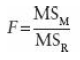{width="0.8333333333333334in" height="0.625in"}

MS~M~ = mean squares of the model = a modelltől való eltérések négyzetre
emelve és összeadva, majd átlagolva

MS~R~ = residual mean squares

## A prediktorok hatékonyságának megítélése

### A regressziós koefficiensek/ béták (hiányzik)

A regressziós modellben minden prediktornak van egy regressziós
együtthatója (béta), ami az egyszerű regressziónál a regressziós egyenes
meredekségét jelöli. Béta értéke megmutatja, hogy a prediktorban
létrejött egységnyi változás hatására mennyit változik a kimeneti
változó.

A lineáris regressziós modellek jóságának méréséhez a kiindulópontot, az
"abszolút nullát" az a modell adja, amelyik a prediktor változótól
függetlenül mindig a minta átlagát adja vissza. Ezt egy regressziós
grafikonon egy vízszintes egyenessel lehetne ábrázolni, mivel a
prediktor változó (vízszintes tengely) változásának hatására a bejósolt
érték (függőleges tengely) nem változik, mivel mindig a minta átlaga
lesz a "jóslás" eredménye. Ebben az esetben a regressziós együttható
(*b*) és ezáltal a regressziós egyenes meredeksége 0. Ez nyilvánvalóan
nem egy hatékony bejóslás, de jó kiindulópont a regressziós modellek
megítéléséhez.

Ahhoz hogy egy modell hasznos legyen, a regressziós együtthatónak (*b*)
szignifikánsan különböznie kell 0-tól. Ennek eldöntésére t-tesztet
használunk. Nullhipotézisnek az előzőek alapján az az esetet választjuk,
amikor *b* nulla. Ha a teszt szignifikáns, akkor valószínűsíthető, hogy
*b* nem nulla, tehát a prediktor változó hasznosan hozzájárul a
predikcióhoz.

Amire ténylegesen kíváncsiak vagyunk, az az, hogy a *b* értéke magas -e
a hibához képest. A hibát úgy kapjuk meg, hogy megnézzük mekkora a
különböző mintákban b értéke. Ha ábrázoljuk ezeknek a mintáknak a
gyakorisága eloszlását, akkor a standard hiba, az eloszlás szórása. A
t-teszt képlete:

$t = \frac{b{}_{\text{observed}}}{\text{SE}{{\text{\ b}_{}}_{}}_{}}$

(Andy Field könyv 7.2.4 fejezet)

## Többváltozós regresszió

A többváltozós lineáris regresszió az egyszerű lineáris regresszió
logikai kiterjesztése arra az esetre, amikor több prediktor változónk
van. A regressziós egyenlet a következő:

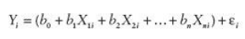{width="3.2291666666666665in"
height="0.5208333333333334in"}

Ahol, Y a függő változó, b1 az első prediktor (X1i) együtthatója, b2 a
második prediktor (X2i) együtthatója, bn az n-ik prediktoré (Xni), b0 az
intercept, $\varepsilon i$ pedig Y prediktált és megfigyelt értéke közti
különbség az i-ik résztvevő esetén. Így az egyenlet lényegében azonos az
egyszerű lineáris regresszió egyenletével, csak most minden további
prediktor változóhoz hozzárendelünk egy együtthatót. Az együtthatók
keresése itt is a legkisebb négyzetek elve alapján történik.
Algebrailag, a prediktor változók olyan lineáris kombinációját keressük,
ami maximálisan korrelál a függő változóval. Geometriailag (amíg
egyszerű lineáris regressziónál az adatokra legjobban illeszkedő egyenes
megtalálása volt a cél), most az n+1 dimenziós térben adott pontokhoz
legjobban illeszkedő hipersíkot keressük (ahol n a prediktor változók
számát jelöli).

Az következő ábra egy két prediktor változóból álló három dimenziós
modellt ábrázol (szaggatott vonal jelöli a regressziós síkot):

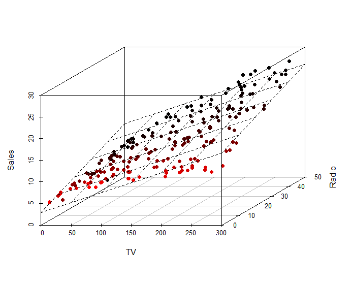{width="3.910617891513561in"
height="3.0781255468066493in"}

## Regressziós módszerek

Amennyiben komplex regressziós modellt szeretnénk felállítani több
prediktor (független) változóval, felmerül a kérdés, hogy pontosan mely
változókat alkalmazzuk. Mivel a regressziós együttható értéke a bevitt
változóktól függ, különös megfontolást igényel, hogy mely változókat
vigyük be a modellbe. A már meglévő modellekbe új változókat az elméleti
háttér figyelembevételével érdemes beilleszteni.

### Hierarchikus módszer

A hierarchikus módszer lényege, hogy a módszert alkalmazó kutató a
korábbi munkákra alapozva választja ki, hogy mely független változókat
milyen sorrendben viszi be a modellbe. Általában véve a már ismert
független változók prioritást élveznek, ezután következnek az újak,
amelyek hatása még nem ismert. Ezen új változók bevihetők egyszerre,
lépésenként, vagy hierarchikusan (azaz a becsült hatásnagyság
alapján).

### Kényszerített bevitel ("forced entry")

Ebben a módszerben a független változók egyszerre kerülnek a modellbe,
ez esetben a hierarchikus módszerhez képest a kutató nem hoz döntést a
prediktorok sorrendjéről, viszont fontos, hogy a változók bevitelét
itt is az elméleti háttér indokolja. Egyes kutatók szerint az egyetlen
helyes módja az elméleti tesztelésnek, mivel a lépésenkénti bevitelt
az adatok random variációja oly módon befolyásolja, hogy az eredmény
ritkán lesz replikálható.

### Lépésről lépésre történő regresszió (Stepwise methods)

Ebben a regressziós módszerben a független változók sorrendjét pusztán
matematikai szempontok alapján döntjük el. Ennek a sorrendnek három
fajtája lehet: előrefele történő (forward) hátrafele történő
(backward) és mindkét irányba történő (both).

Az **előre fele történő** regresszió során a modellbe először a
konstans (b0) kerül be. Ezután a program megkeresi azt a független
változót ami a legjobban bejósolja a függő változót. Ezt úgy teszi
meg, hogy azt választja ki, amelyiknek a legnagyobb korrelációja van a
függő változóval. Ha ez a változó ténylegesen fejleszti a modell
képességét, hogy bejósolja a függő változót, akkor ezt a független
változót megtartja, és keres egy második változót. A feltétele ennek a
változónak a kiválasztására, hogy ennek legyen a legnagyobb
fél-parciális (semi partial) korrelációja a függő változóval.
Képzeljük el, hogy az első változó 40%-át megmagyarázza a függő
változó varianciájának, tehát 60% még megmagyarázásra vár. A program
azt a változót keresi meg, amelyik a legjobban meg tudja magyarázni a
fennmaradó 60%-ot, a meglévő 40-ben már nem érdekelt. Így ez a
fél-parciális korreláció azt mutatja meg, hogy mennyi „új variancia"
van megmagyarázva a második független változó által. Az a változó,
amelyik a legtöbb fennmaradó varianciát magyarázza meg, hozzáadódik a
modellhez, és ha hozzájárul a jósló erejéhez, akkor meg is lesz
tartva. Ezután egy másik független változó következik.

Az R programnak el kell döntenie, hogy mikor áll le független változók
hozzáadásával, és ezt az Akaike információs kritérium (AIC) alapján
teszi meg (minél alacsonyabb az AIC értéke, annál jobb a modell). Egy
független változót akkor tartunk meg, hogyha az javítja, azaz
csökkenti az AIC értékét. Hogyha már nincs olyan változó ami csökkenti
az AIC értékét, akkor a modell elkészült.

A **hátrafele történő** módszer az ellentétje az előrefelének abban az
értelemben, hogy a program először belerakja az összes változót, és
utána megnézi, hogy lemegy-e az AIC, ha kivesz egyesével változókat.
Hogyha egy változót eltávolít, akkor a fennmaradó változók
hozzájárulása kiértékelődik, és a folyamat folytatódik, ameddig egy
változó eltávolítása az AIC emelkedését nem eredményezi.

Az **mindkét irányba haladó módszer** úgy indul, mint az előrefelé
irányuló, azzal a különbséggel, hogy minden egyes alkalommal, amikor
egy változót hozzáad, egy eltávolítási tesztet végez el, hogy
megtalálhassa a legkevésbé hasznos független változót. Így
folyamatosan újravizsgálja a regressziós egyenletet, hogy találjon
felesleges változókat, amiket el lehet távolítani.

Ha lépésről lépésre történő módszer mellett döntünk, akkor a hátrafelé
történő módszer előnyösebb az előrefele történőnél. Ez az elfojtó
hatások (suppressor effects) miatt van, ami akkor történik meg, ha egy
független változónak van hatása, de csak ha a másik változó állandó
(konstans). Az előrefele történő kiválasztás során nagyobb eséllyel
hagy ki változókat, amelyek szupresszor hatásban vannak. Így ez
nagyobb eséllyel követ el II-es típusú hibát (azaz kihagy egy
változót, ami ténylegesen bejósolja a függő változót).

Jó ismerni ezeket, de nem ajánlottak!

```{=html}
<!-- -->
```
### All subsets methods 

A lépésről lépésre történő módszerek nagy hibája, hogy az alapján
dönti el egy változóról, hogy az beleillik-e egy modellbe, hogy addig
milyen változók vannak már a modellben. Ennél jobb módszer az all
subsets módszere. Ahogy a neve is mutatja, ez a módszer kipróbálja az
összes lehetséges kombinációját a független változóknak, hogy
megnézze, melyik illik a legjobban a modellbe (amit Mallow's Cp
statisztikája határoz meg). Ennek a módszernek a problémája, hogy
ahogy nő a független változók száma, úgy exponenciálisan nő a
lehetséges modellek száma. Szerencsére a számítógépek már nem olyan
lassúak mint régen, tehát ez a módszer is járható utat kínál.

### A megfelelő módszer kiválasztása

Vannak bizonyos megfontolások, amelyek szem előtt tartandók. Ha
rendelkezésre áll biztos szakirodalmi háttér, érdemes támaszkodni rá,
amikor a változókról vagy azok sorrendjéről döntünk. Az első
(konfirmatív) vizsgálatot követően a statisztikailag elhanyagolható
változókat kihagyhatjuk. Fontos továbbá, hogy ne vigyünk be túl sok
változót (regressziós együttható!), és szakirodalmilag kellően
megalapozott változókkal dolgozzunk.

## AIC (Akaike Information Criteria) és BIC (Bayesian Information Criteria)

Többszörös regresszió esetén a modell illeszkedésének egyik mutatója az
R^2^, ami a kimeneti változó valódi értékei és a modell által bejósolt
értékek közötti korreláció négyzete. A probléma ezzel a mutatóval, hogy
amennyiben több prediktor változót adunk a modellhez, minden esetben
magasabb lesz az értéke. Ennél fogva pusztán ez alapján nehéz pontos
képet kapni több modell magyarázó erejéről, és választani közülük. Az
Akaike Information Criteria (AIC) egy alternatív illeszkedési mutató,
ami számításba veszi a modellben lévő prediktorok számát. Az AIC
egyenlete a következő:

AIC = n*ln(SSE/n) + 2k

ahol az n a modell eseteinek száma, az ln a természetes logaritmus, az
SSE (Sum of Square Errors) a hibák négyzetének összege, a k pedig a
prediktor változók száma. Az egyenlet végén szereplő +2k komponens miatt
egy több prediktort tartalmazó, de jobban nem illeszkedő modell értéke
magasabb lesz, mint egy hasonlóan illeszkedő, de kevesebb változót
tartalmazó modell esetében.

Tehát minél alacsonyabb az AIC értéke, annál jobban illeszkedik a modell
az adatokhoz, és ami lényeges, ez a módszer figyelembe veszi a prediktor
változók számát is. Így az AIC alapján pontosabban tudunk választani
alternatív modellek között. Fontos viszont tisztában lenni vele, hogy az
AIC értékek csakis ugyanazon adatokra vonatkozó modellek esetén
összehasonlíthatóak.

Legalább 2-vel kell csökkennie az AIC-nak, hogy jobbnak hívjunk egy
modellt egy másiknál.

A Bayesiánus statisztikában létezik egy ehhez nagyon hasonló kritérium,
amit BIC-nek nevezünk, ami nem meglepő módon a Bayesian Information
Criterium rövidítése. Ez szintén a modell illeszkedésének mértéke, ami a
modell paramétereit is számításba veszi és szintén, minél alacsonyabb az
értéke, annál jobb a modell illeszkedése.

## A modell általánosításának feltételei

Ahhoz, hogy a regressziót általánosítani tudjuk a populációra (tehát
hogy megpróbáljuk bizonyítani, nemcsak a mintánkra igaz a felállított
modell), számos kritériumnak teljesülnie kell:

1\. Változók típusai: Az összes független változónak kategoriálisnak
(nominális vagy ordinális, maximum két kategóriával!), vagy folytonosnak
(skála típusú) kell lennie. A függő változó pedig szintén folytonos
változó kell legyen. Emellett szintén fontos, hogy a változón elért
értékek a mintán ne legyenek behatárolva egy bizonyos intervallumra a
skálán belül.

2\. A független változók értékeinek varianciája ne legyen nulla.

3\. A független változók között ne legyen magas korreláció.

4\. A független változók ne korreláljanak egyéb, a regresszióba be nem
vont változókkal.

5\. A reziduálisoknak a független változó összes szintjén ugyanakkora
varianciával kell rendelkezniük - homoszkedaszticitás kritériuma (a
regressziós egyenesen haladva a variancia ne változzon az egyes
szinteket összehasonlítva).

6\. Független hibák:

A reziduális értékeknek függetleneknek kell lenniük bármely két
megfigyelésnél (azaz nincs autokorreláció). Ezt a feltevést a
**Durbin-Watson teszt**tel tehetjük próbára, ami a hibák közötti
sorozatos korrelációt méri (pontosabban azt, hogy a szomszédos
reziduális értékek korrelálnak-e). A teszt eredménye 0-tól 4-ig
terjedhet, ahol a 2 jelenti azt, hogy nincs korreláció a reziduális
értékek között. A 2-nél alacsonyabb értékek pozitív, a 2-nél magasabb
értékek pedig negatív korrelációt jeleznek. A bevett gyakorlat szerint
az egynél kisebb vagy háromnál nagyobb értékek egyértelműen aggodalomra
adnak okot. Ámbár a kettőhöz közel álló értékek is problémásak lehetnek
a mintától és a modelltől függően (mivel a Durbin-Watson teszt eredménye
függ a független változók és a megfigyelések számától is). Azonban
legyünk nagyon óvatosak a Durbin-Watson teszttel, mivel a kapott
eredmény függ az adatok sorrendjétől **--** ha átrendezzük az adatokat,
más eredményt kapunk.

7\. Normál eloszlású hibák:

Az a feltevésünk, hogy a reziduális értékek a modellben random, normál
eloszlású változók, és az átlaguk nulla. Ez a feltételezés azt jelenti,
hogy a különbség a modell és a megfigyelt adatok közt leggyakrabban
nulla, vagy nagyon közel van a nullához, és hogy nullánál jelentősen
nagyobb különbségek csak esetenként fordulnak elő. (Pár ember
összekeveri ezt azzal, hogy a független változóknak normál
eloszlásúaknak kell lenniük, de ez nem így van.)

8\. Az a feltevésünk, hogy a kimeneti változó összes értéke független.

9\. Az a feltevésünk, hogy az összefüggés, amit modellezünk, lineáris.
Ha egy nem lineáris összefüggést modellezünk egy lineáris modellel, ez
érthető módon korlátozza az eredményeink általánosíthatóságát.

## Keresztvalidálás (cross-validation)

A keresztvalidálás egy, a regressziós modellek általánosításához
(generalizálásához) használt eljárás. Az eljárás során azt vizsgáljuk,
hogy a modellünk (ugyanazokkal a független és függő változókkal) egy
másik mintára alkalmazva milyen jó előrejelzéseket ad. A
keresztvalidálásnak két módszere van: (1) igazított R^2^, (2) adatok
szétválasztása.

-   **Igazított (adjusted) R^2**

Ez az érték az ún. "shrinkage"-et mutatja, azaz hogy a modell prediktív
ereje mennyire csökkent a másik mintára alkalmazva.

Amíg a sima R^2 azt mondja meg, hogy az adott mintára illesztett
modellünk az össz varianciából (reziduálisokból) mennyit magyaráz meg,
az igazított R^2 azt mutatja, hogy mennyi varianciát magyarázna, ha a
modellt abból a populációból kaptuk volna, amiből a mintát vettük.

-   **Adatok szétválasztása**

Ez a módszer abból áll, hogy az adatokat random módon két részre
szedjük, és az egyik részre kapott regressziós modellt az adatok másik
felére illesztjük. A stepwise regressziós eljárásoknál ajánlott a
modellt az adatok 80%-ára lefuttatni, majd a maradék 20%-ra
ráilleszteni. A két mintán kapott béták és R^2^ -ek összehasonlításával
megnézhetjük, hogy a modellünk milyen jól általánosítható.

Forrás: Andy Field

## Mintaméret a regresszióban 

A két leghasználhatóbb hüvelykujjszabály a regresszióelemzéshez gyűjtött
mintaméret meghatárotására a következő:

**Prediktorok száma alapján**

Ha a regressziós modellünkben *k* darab prediktorunk van, akkor 50 +
8*k* vagy 104+*k* adatot gyűjtsünk. Azt az egyenletet alkalmazzuk,
amelyik alapján nagyobb mintaméret jön ki.

**Hatásméret alapján**

Ha nagy hatást akarunk kimutatni, akkor 80 fő elég a mintánkba (20
predikor változóig). Ha közepes hatást várunk, akkor 200 fő elég (20
prediktor változóig). Ha a mérni kívánt hatás kicsi, akkor 6 predikor
változóig 600 fő elegendő, hogy azt kimutassuk. A hatásméretekről
bővebben a [[Metaanalízis
vademecumban]](https://docs.google.com/document/d/1k4DsNl8oCs3NPrU6Ask46qbtUPogY_lAhKViV6piT7U/edit)
lehet olvasni.

Forrás: Field, A., Miles, J. and Field, Z. (2012). *Discovering
statistics using R*. London: Sage. (7.7.2.3)

## Multikollinearitás

Multikollinearitás akkor lép fel, amikor erős korreláció van kettő vagy
több prediktor változó között a regressziós modellben. Tökéletes
kollinearitás (amikor a korreláció 1) a való életben szinte soha sem
fordul elő, viszont valamennyi korreláció majdnem mindig van a prediktor
változók között.

**Megbízhatatlan b**

A kollinearitással együtt nő a b regressziós együttható standard hibája,
ami azt jelenti, hogy különböző mintákban jelentősen eltérő értékeket
vehet fel. Azért megbízhatatlan, mert általa a mintánk kevéssé
megbízhatóan reprezentálja a populációt. Ebből adódik, hogy a modellünk
nem konzisztensen fogja bejósolni az eredményeket.

**Az R mértékét csökkenti**

Ha kettő vagy több prediktor változó korrelál egymással, az egyben azt
is jelenti, hogy osztoznak a megmagyarázott variancia egy bizonyos
részén. Tegyük fel, hogy van két, egymással erősen korreláló prediktor
változónk egy modellben: szülői szigor és a közoktatásban eltöltött évek
száma. Ha a depressziót vesszük kimeneti változónak, akkor lehet, hogy a
szülői szigor és az iskolában töltött évek együtt a variancia 82%-át
megmagyarázzák, de ha csak azt nézzük, hogy a szülői szigor mennyire
játszik közre, azt tapasztalhatjuk, hogy a varianciának csak a 2%-át
magyarázza. Ilyen esetben a változó **egyedi varianciája** alacsony.

**A prediktorok fontossága**

Multikollinearitás esetén a korreláló változók közül nem lehet
megállapítani, melyik játszik jelentős szerepet. Az előző példára
visszatérve, nem tudjuk megmondani, hogy a szülői szigor vagy az
iskolában eltöltött évek száma külön-külön mennyire jelentős
előrejelzője a depressziónak.

**VIF/ tolerance**

Ahelyett, hogy korrelációkat számolnánk a prediktor változókra (ami sok
prediktor esetén követhetetlen), a "variance inflation factor"-t
(**VIF**) érdemes használni. A VIF azt jelöli, hogy egy prediktor szoros
lineáris kapcsolatban áll-e másik változókkal. Ha egy prediktor VIF
értéke meghaladja a 10-et, az arra utal, hogy korrelál más változókkal.
Ha az átlag VIF meghaladja az 1-et, akkor fennáll a veszélye, hogy a
regressziós modellt torzítja a multikollinearitás.

Ha a VIF-nek a reciprokát vesszük (1/VIF), az ún. **tolerance** értéket
kapjuk, ami 1/10 alatt utal súlyos multikollinearitásra, de 2/10 alatt
már aggodalomra adhat okot.

Forrás: Field, A., Miles, J. and Field, Z. (2012). *Discovering
statistics using R*. London: Sage. (7.7.2.4)

## Cook's distance vagy Cook's D

A regresszióban a Cook's distance-t arra használjuk, hogy meghatározzuk,
melyik megfigyelések meghatározóak, és melyik megfigyelések nem
meghatározóak (outlierek) a regressziós modellünk szempontjából. A
Cook's distance függvénye figyelembe veszi a leverage-et és a
reziduálisokat is. Általános ökölszabály, hogy egy megfigyelés, aminek a
Cook's D értéke háromszor nagyobb, mint az átlag, az egy outlier. Ha a
Cook's D \> 1, akkor a megfigyelés meghatározó.

## Shiny App-ek 

Többváltozós regresszió:

[[https://gallery.shinyapps.io/multi_regressio]](https://gallery.shinyapps.io/multi_regression/)

Multikollinearitás hatása a regresszió eredményére:

[n/<https://gallery.shinyapps.io/collinearity/>]

Influence analysis:

[[https://omaymas.shinyapps.io/Influence_Analysis/]](https://omaymas.shinyapps.io/Influence_Analysis/)

## Regresszió--elemzés (Regression diagnostics)

Lényege, hogy megnézzük illik-e a kialakított modell (regressziós
egyenes) az adatainkhoz, hogy kevés eset befolyásolja-e csak, valamint
az influential cases és az outlierek megtalálása.

Outlier (szélsőséges érték): lényegesen eltér a többi adattól, ezért
torzítást okoz a modellben. A modellben az outlier az interceptet és az
együtthatót is befolyásolja (ezt ábrázolva a regressziós egyenes
metszéspontját és a dőlési szögét). Mivel az outlier jelentősen eltér a
modell által jósolt értéktől, valószínű, hogy arra bukkantunk, ha egy
reziduális feltűnően nagy értékkel rendelkezik.

Reziduálisok: a modellben lévő hibákat reprezentálják. A regresszió
grafikus ábrázolásakor reziduálsok alatt a regressziós egyenes és az
adatpont távolságát értjük.

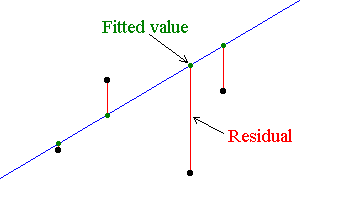{width="2.901042213473316in"
height="1.8468842957130358in"}

Minél nagyobb a reziduálisok értéke, annál rosszabbul reprezentálja az
adatokat a modell. Két alapvető fajtája a normál, vagy nem standardizált
reziduális és a standardizált reziduális. A nem standardizált
reziduálisoknál megnézhetjük, melyik tűnik különösen nagynak, azt
azonban nem tudjuk definiálni, mi számít *különösen nagynak*. Erre jók a
standarizált reziduálisok. Ezekkel már összes tudjuk hasonlítani a
reziduálisokat a modellek között,

Influential cases/ befolyásoló esetek -- Olyan adatok, amelyek
eltávolításával az eredményünk jelentősen megváltozna (egyes adatok,
nagyobb mértékben befolyásolják az eredményünket, mint mások). Ez a hiba
a legkisebb négyzetek módszerének az eredménye.

Kiszűrésükre alkalmas eljárások:

illesztett előrejelzett érték (adjusted predicted value) - előrejelzés
készítése a kétséges adat/ok nélkül. Amennyiben az eredmény közel azonos
az eredeti eredményünkhöz, a modellünk stabilnak mondható, mert nem csak
bizonyos adatok befolyása alatt áll. Az illesztett előrejelzett érték és
az eredeti előrejelzett érték (original predicted value) közti
különbséget DDFIT-nek nevezzük.

Studentized residual - Az illesztett előrejelzett érték és az eredeti
megfigyelt érték (original observed value) különbsége, majd ez a
különbség osztva a standard hibával.

Cook's distance/Cook-féle D-statisztika/ Cook-távolság - arra alkalmas
hogy megnézzük, egyetlen eset befolyását a modellre mint egészre. Cook
és Weisberg alapján azok az értékek vehetők számításba, amelyek értéke
nagyobb mint 1.

Hat values/leverage - a megfigyelt értékek befolyásának mértékét
határozza meg. Értékei 0 (nincs befolyásolás) és 1 (teljes mértékű
befolyásolás) között mozognak.

DFBeta - paraméterek közötti különbség, mikor minden esetet számba
veszünk, és mikor egy bizonyos esetet nem veszünk számba. R-ben
használatos. Nagymértékű befolyással rendelkező esetek kiszűrésére
alkalmas.

Azok alapján, hogy milyen eredményeket kapunk, nem feltétlenül szükséges
a kérdéses esetek eltávolítása vagy kizárása az elemzésünkből annak
érdekében, hogy kedvezőbb eredményeket kapjunk. Tanácsos ezeket az
eseteket tovább tanulmányozni.

Field, 7.7.1

## A multilevel (többszintű) regresszióról (19.2)

### Hierarchikus adatok (19.2.)

A való világban az adatok nem egy szinten, hanem hierarchikusan,
egymásba ágyazva vannak jelen, és az adatok felsőbb szintjei hatással
vannak az alsó szintekre. (Erre az egymásba ágyazottságra az angol
szakirodalom "nested"-ként hivatkozik.)

Mit is jelent ez? Ha például egy világszintű depressziókutatást akarunk
csinálni, figyelembe kell vennünk azt, hogy az egyes adatok milyen
országból származnak, mivel az egy országból származó adatok minden
bizonnyal hasonlóbbak lesznek egymáshoz, mint a különböző országból
származóak. A többszintű regresszió során ezeket a "kontextuális"
hatásokat kívánjuk figyelembe venni.

### Osztályon belüli korreláció (Intraclass Correlation (ICC), 19.2.1.)

Azt, hogy a kontextuális változók (pl. A példánkban az ország) a
kimeneti változó mekkora varianciáját magyarázzák meg, az osztályon
belüli korreláció, angolul az Intraclass Correlation (ICC) mondja meg.
Magas ICC-nél a kontextuális hatásoknak (pl. az országnak) nagy hatása
van a kimeneti változóra (pl. a depresszióra). Ebben az esetben az
osztályokon belüli variabilitás nagy, az osztályok közötti pedig kisebb.
Kis ICC-nél ennek a fordítottja teljesül.

### A többszintű regresszió előnyei (19.2.2.)

1)  A regressziós egyenesek homogenitásának nem kell teljesülnie, azaz a
    > prediktor és a kimeneti változó kapcsolata csoportonként
    > változhat. Ezzel a változékonysággal a többszintű regresszióban
    > tudatosan számolunk (lásd: random hatások).

2)  Az egyes eseteknek a hagyományos többváltozós regresszióval szemben
    > nem kell függetlennek lenniük egymástól. Az ICC-ről szóló részben
    > látható, hogy a többszintű regresszió során az egyes csoporttagok
    > értékei között fennálló összefüggést is figyelembe vesszük.

3)  A többszintű regressziós elemzésben vannak olyan módszerek, amelyek
    > a hiányzó adatok behelyettesítésére jó becsléseket tudnak adni a
    > meglévő adatokból, ezért nem kell minden esetet kizárni, ahol
    > vannak hiányzó adatok. (Ez nagyon jó, de természetesen nincs olyan
    > statisztikai módszer, ami erre tökéletes megoldást nyújt. A
    > hiányzó adatok minimalizálására már a kísérlet megtervezésénél és
    > kivitelezésénél is kell ügyelni.)

## Fix és random hatások (19.3.2)

Egy hatás egy kísérletben fix, ha minden kísérleti feltétel (amire
kíváncsiak vagyunk), jelen van a kísérletben. Pl.: mérjük egy gyógyszer
hatását alacsony és magas dózisban. Random hatásról akkor beszélünk, ha
a kísérleti feltételeink (az alacsony és a magas dózis) a lehetséges
kísérleti feltételeknek csak egy random mintáját tartalmazzák. Pl.
mérhettünk volna nagyon magas dózist is, mert ez is egy lehetséges
kísérleti feltétel. Ez a különbségtétel azért fontos, mert a fix
hatásokat csak a konkrét kísérleti elrendezésre általánosíthatjuk, a
random hatásokat viszont a kísérleti elrendezésen túlra is.

## Fix és random együtthatók

Lineáris regresszió esetén valamilyen független változó (pl. szakmában
eltöltött évek) segítségével akarunk egy függő változót (pl. fizetés)
bejósolni, a kettő közötti összefüggésre építünk egy lineáris modellt.
Ez a legegyszerűbb esetben, ahol egy változóval akarunk prediktálni, két
számmal írható le, az intercepttel (*β*0) és egy együtthatóval (*β*1).

*salary**i*=*β*0+*β*1∗*experience**i*

Ebben az egyszerű modellben feltételezzük, hogy a minta elemei között ez
a két szám fix, tehát a kezdő fizetés (intercept, *β*0), és a
fizetésnövekedés mértéke (slope/meredekség, *β*1) minden egyes embernél
ugyanaz lesz. Erről intuitívan is érezhetjük, hogy egy túl erős
feltételezés, ami a modellünk pontosságát hátrányosan érinti. Egy mérnök
kezdő fizetése és fizetésének növekedésének üteme is jelentősen el fog
térni egy általános iskolai tanárétól (sajnos\...).

Az ilyen jellegű különbségek figyelembe vételére, és ezáltal pontosabb
modell megalkotására használható a többszintű (hiearchikus) modellezés.

**Random interceptek módszere**

Az egyik módszer, amivel ezt megtehetjük, ha figyelembe vesszük, hogy a
különböző csoportok (mérnökök, tanárok, buszsofőrök, stb) különböző
kezdő fizetéssel rendelkeznek, vagyis megengedjük, hogy az egyes
csoportoknak csoportonként különböző interceptjük legyen, azonos
meredekség (*β*1) mellett. A fix *β*0 konstans helyett tehát
csoporttagságtól függő konstansokat keresünk. A regressziós egyenletünk
így a következőre változik:

*salary**i*=*β*0*j*\[*i*\]+*β*1∗*experience**i*

Ez már érezhetően jobban megfogja a vizsgált összefüggés lényegét, de
még mindig érezzük, hogy egy utcaseprő fizetése nem fog olyan ütemben
nőni, mint egy programozóé.

**Random meredekségek**

Ebben az esetben hasonló dolgot csinálunk, csak itt a kezdő fizetések
variálása helyett a fizetésnövekedés mértéke közötti különbségekben
próbáljuk a csoportok közötti különbségeket megfogni. Tehát egy fix
intercept (*β*0) mellett keresünk csoportonként olyan meredekségeket,
amik az adott csoportot a legjobban jellemzik. Így kapjuk a következő
egyenletet:

*salary**i*=*β*0+*β*1*j*\[*i*\]∗*experience**i*

**Random meredekség és intercept**

A két módszer kombinálásával érhetjük el a lehető legoptimálisabb
modellt, ahol az intercept és a meredekség is az adott csoportra lesz
jellemző.

*salary**i*=*β*0*j*\[*i*\]+*β*1*j*\[*i*\]∗*experience**i*

Nagyon ajánlott interaktív weboldal:
http://mfviz.com/hierarchical-models/

## A többszintes regressziós modell

A többszintes modell egy olyan regressziós modell, amiben megengedjük,
hogy akár az intercept, akár a regressziós együtthatók (béta) vagy
mindkettő változzon a különböző kontextusokban (azaz random együtthatók
lehetnek). A lényegi különbség az egyszintes regresszióhoz képest, hogy
minden random együttható esetén megbecsüljük a paraméter variabilitását
és magát a paramétert is.

2 esetet különíthetünk el:

1, Fixed effects model (Fix hatások modell): Egyszintes modell, így
minden hatás és együttható fix benne.

2, Random effects model (Random hatások modell): Többszintes modell, így
vannak benne random hatások és együtthatók. Több más elnevezése is van
pl.: Multilevel model, Hierarchical model, Mixed effects model

(Angolul ezért gyakran az együtthatókra a modell nevével utalnak pl.:
random effects coefficients)

A random modellek bevezetése (képlet magyarázat):

1, [random intercept:]

Adjunk hozzá egy olyan u1j komponenst az intercept-hez, ami a
variabilitását méri. Ekkor az intercept a korábban megszokott b0 helyett
a (b0+u0j) alakot ölti, ahol j a változó azon szintjeit tükrözi, amik
között az intercept változik. A \"változó szintjei\" kifejezés itt
azokat a különböző kontextusokat jelöli, amik között a változhat a
random paraméter. pl.: különböző klinikákat. Ekkor a regressziós
egyenlet:

Yij=(b0+u0j)+b1Xij+eij

2, [random regressziós együttható]:

Az előző esethez hasonlóan jelölje most az együttható variabilitását
u1j. Ekkor az együttható korábban megszokott b1 helyett a (b1+u1j)
alakot ölti. Ekkor a regressziós egyenlet:

Yij=b0+(b1+u1j)X1i+eij

3, [random intercept és regressziós együttható:]

Az 1, és 2, eset kombinációja alapján a regressziós egyenlet n db random
prediktorváltozó esetén:

Yij=(b0+u0j)+(b1+u1j)X1i+\...+(bn+unj)Xni+eij

A többszintes modell nem feltétlenül jobb, mint az egyszintes. Ugyanis
sok torzítást vezethetünk be a modellbe a magasabb szintekkel, és nem
alkalmasak ok-okozati kapcsolatok megállapítására sem. A megfelelő
modell kiválasztása mindig megfontolt, statisztikailag alátámasztott
döntést igényel. Erre alkalmas pl.: a **Hausman teszt**.

Erről a problémáról és a megfelelő modell kiválasztásáról bővebben:

[[http://hummedia.manchester.ac.uk/institutes/methods-manchester/docs/FEMM2013.pdf]{.ul}](http://hummedia.manchester.ac.uk/institutes/methods-manchester/docs/FEMM2013.pdf)

## A többszintű regressziós modellek illeszkedésének vizsgálata és összehasonlítása

A többszintű regressziónál 3 különböző módszert alkalmazhatunk a modell
illeszkedésének, illetve az illeszkedés javulásának mérésére: AIC, BIC
és a Khí-négyzet likelihood ratio. Mindhárom módszer a -2LL -t használja
fel az egyenletében. A -2LL magyarázata [[itt
található]](#a-modell-értékelése-8.3.2).

Az AIC és a BIC önmagukban nem értelmezhetőek... folytatni.

AIC=-2LL+2k ahol a k a prediktorok száma

BIC=-2LL+2kxlog(n) ahol az n a modell eseteinek száma

## Kovariancia struktúrák típusai (19.4.2)

Ha random hatások vagy ismételt elrendezésű megfigyelések vannak a
modellünkben, el kell döntsük, hogy milyen kovariancia struktúrát
alkalmazzunk az adatainkhoz. Ha mindkettő van, akkor akár külön-külön is
megadhatunk kovariancia struktúrákat. A kovariancia struktúra
specifikálja a variancia-kovariancia mátrix alakját. ( A
variancia-kovariancia mátrixban a főátló elemei varianciák, a többi elem
pedig kovariancia. ) Ebből többféle mátrix is létezik és meg kell
mondanunk a programnak, hogy melyiket használja. Azonban sok esetben mi
sem tudjuk. Ezért érdemes többféle meghatározott kovariancia
struktúrával is lefuttatni a modellt, amit utána leellenőrzünk, hogy
milyen jól illeszkedik az adatokhoz (pl AIC vagy BIC).

A variancia-kovariancia mátrix általános alakja:

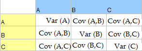{width="3.0520833333333335in" height="1.09375in"}

Itt A, B és C különböző változók (regresszió esetén prediktorok).
Látható, hogy a mátrix minden esetben négyzetes és szimmetrikus. A
kovariancia két változó összefüggését jelenti, akárcsak a korreláció.\
A kovariancia stuktúra azért fontos, mert a program ebből kiindulva
becsüli meg a modell paramétereit. Ha túlságosan leegyszerűsítjük a
modellt, akkor nagyobb eséllyel követünk el elsőfajú hibát (egy
paramétert szignifikánsként kezelünk, amikor nem az), ha pedig
túlbonyolítjuk a modellt, akkor nagyobb eséllyel követünk el másodfajú
hibát (egy paramétert nem találunk szignifikánsnak, amikor az az). A
következőkben négy kovariancia struktúrát fogunk megismerni:

### Variancia komponensek:

Ez a kovariancia szerkezet nagyon egyszerű; azt feltételezi, hogy minden
random hatás független (ezért 0-k a kovariancia értékek a mátrixban). A
random hatások varianciájáról azt feltételezzük, hogy ugyanolyanok
(ezért 1 az átló) és az összege ezeknek egyenlő a kimeneti változó
varianciájával. Néha függetlenségi modellnek is hívják.\
{width="0.9375in" height="0.90625in"}

### Diagonális: 
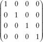{width="1.3333333333333333in" height="1.0416666666666667in"}

Ez a modell ugyanolyan mint a variancia komponensek modellje azzal a
különbséggel, hogy a variancia komponenseket heterogénnek tételezzük
fel, ezért mások a komponensek az átlóban. De ez is azt feltételezi,
hogy függetlenek és ezért a kovarianciák egyenlőek 0-val.

### AR(1): 
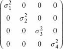{width="1.2916666666666667in" height="1.0416666666666667in"}

Ez a jelölés az elsőrendű autoregresszív struktúra kifejezést rövidíti.
Pongyolán fogalmazva ez azt jelenti, hogy a varianciák kapcsolata
szisztematikus módon változik. Hogyha a mátrix sorait és oszlopait
időpontokként képzeljük el, akkor abból az következik, hogy a korreláció
ismételt mérések között egymás melletti pontokon a legnagyobb. (1. sor
1. oszlop a korreláció 1. 1. sor 2. oszlop a korreláció p. 1. sor 3.
oszlop korreláció p2, tehát csökken ahogy az idő telik.) A varianciákról
azt feltételezzük, hogy homogének de ennek a struktúrának van egy
változata ahol heterogén. Ezt legtöbbször ismételt elrendezésű adatoknál
használjuk.

### Strukturálatlan: 
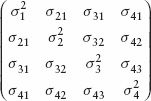{width="1.5729166666666667in" height="1.0520833333333333in"}

Ez a kovariancia struktúra teljesen általános. A kovarianciákról azt
feltételezzük, hogy teljesen bejósolhatatlanok, nem követnek semmilyen
szisztematikus mintát.


###Források:

[[http://statstudent.tumblr.com/post/108699142671/simple-linear-regression-methods-ii-week-of]{.ul}](http://statstudent.tumblr.com/post/108699142671/simple-linear-regression-methods-ii-week-of)

[[https://www.seas.upenn.edu/\~ese302/extra_mtls/REGRESSION_OUTLIERS.pdf]{.ul}](https://www.seas.upenn.edu/~ese302/extra_mtls/REGRESSION_OUTLIERS.pdf)

Field, A., Miles, J. and Field, Z. (2012). *Discovering statistics using
R*. London: Sage. (7.7.1)

[[https://link.springer.com/chapter/10.1007/978-0-585-25657-3_36]{.ul}](https://link.springer.com/chapter/10.1007/978-0-585-25657-3_36)

[[https://support.minitab.com/en-us/minitab/18/help-and-how-to/modeling-statistics/anova/supporting-topics/anova-statistics/what-is-the-variance-covariance-matrix/]{.ul}](https://support.minitab.com/en-us/minitab/18/help-and-how-to/modeling-statistics/anova/supporting-topics/anova-statistics/what-is-the-variance-covariance-matrix/)

## Előfeltevések (19.5.1.)

A többszintű (multilevel) lineáris modell a regresszió kiterjesztése,
ezért az összes regresszióra érvényes előfeltevés érvényes itt is.

Ellentmondásos viszont a tény hogy a függetlenségre tett feltételezések
illetve a függetlenség hibái a többszintű modell bevezetésével
megoldhatóak, mert ennek a modellnek a célja pont az, hogy bevegye a
magasabb szintű korrelációkat. Tehát ha a függetlenség problémáját egy
2-ik vagy 3-ik szintű változó okozza, akkor a többszintű modell
bevezetésével ezt meg lehet oldani (bár nem minden esetben).

A szokásos feltételezéseket a szokásos módon kell ellenőrizni.

2 extra feltételezés a többszintű modellben: **random együttthatók**nak
köszönhető.

A random együtthatók normál eloszlást kell, hogy kövessenek a modellben.

1, az interceptek a különböző kontextusokban, az egész modellben normál
eloszlást követnek

2, A meredekségek a különböző kontextusokban, az egész modellben normál
eloszlást követnek

A **multikollinearitás** problémát jelenthet, ha vannak a szintek között
átfedések/interakciók (cross-level interactions)→ központositott
változók segítséget nyújthatnak ezeknek a megoldásában (bővebben a
19.5.3. fejezetben kifejtve).

Forrás: Field, A., Miles, J. and Field, Z. (2012). *Discovering
statistics using R*. London: Sage.

## Minta méret és statisztikai erő (19.5.2.)

A többszintes regresszió esetén nehéz döntést hozni a statisztikai
erőről, mivel gyakran fix és random hatások együtthatóit is szeretnénk
detektálni. Lényegében **minél több adatot** gyűjtünk, **annál jobb lesz
a modell** (Kreft and de Leeuw, 1998). Az új szintek bevezetésével több
paraméter becslésére van szükség, és ennek megfelelően nagyobb minta
szükséges hozzá.

Ha a szintek közötti kapcsolatokat/interakciókat(cross-level
interactions) akarjuk vizsgálni akkor jobb, ha több mint 20 csoportunk
is van a magasabb szintű változókon belül, és a csoportok nagysága nem
lehet "túl kicsi".

Normál minta mérettel a számításokat lehet korrigálni a többszintű
analízis eleméhez (Twisk 2006), de csak óvatosan.

Forrás: Field, A., Miles, J. and Field, Z. (2012). *Discovering
statistics using R*. London: Sage.

## Központosított változók/ Centred variables (19.5.3.)

A központosítás vagy centrálás során egy fix pont körüli szóródás
alapján alapján transzformálunk egy változót. Ez a fix pont bármelyik
értéke lehet a változónak, de általában az átlagot szoktuk használni.

2 fajtáját használjuk a centrálásnak a multilevel modellezésben: a grand
mean és a group mean centrálást. Grand mean centrálás esetén egy változó
minden értékéből kivonjuk a változó összes értékének az átlagát. Group
mean centrálás esetén egy változó minden értékéből kivonjuk a változó
egy alcsoportjának (méghozzá annak, amibe az éppen számolt eset
beletartozik) átlagát. Azaz a világközi depressziókutatásos példánkban a
grand mean centrálás azt jelentené, hogy kivonjuk az egyes emberek
depressziópontjaiból az összes depressziópont átlagát, míg a group mean
centrálás azt jelentené, hogy az egyes emberek depressziópontjaiból az
ugyanazon országba tartozó emberek depressziópontjainak az átlagát
vonjuk ki. Csoport átlag centrálásnál tehát gyakran egy első szintű
változó egy második szintű változó átlaga körül van centrálva. A
centrálás például abban az esetben válik jelentőségteljessé, amikor egy
olyan változót vizsgálunk, amelynek nincs 0 értéke. Ugyanis a
regresszióban az intercept mindig egy változó 0 értékénél helyezkedik
el, azonban ez sokszor értelmetlen. Pl. nincs olyan, hogy valakinek 0 a
szívfrekvenciája. Azonban centrálással el tudjuk érni azt, hogy az
intercept azt az értéket mutassa, amit akkor kapunk a függő változón, ha
a prediktor átlagát nézzük (több változónál pedig azt az értéket mutatja
mikor az összes változónak az átlagát látjuk).

### Mikor centráljunk?

-ha multikollinearitás van a független változók között

-ha a független változóknak nincs értelmes 0 pontjuk

-ha a centrált független változókkal végzett multilevel modellek
stabilabbak

### Group mean vagy grand mean jobb?

Enders és Tofighi szerint ha az első szinten mért változók közötti
kapcsolat érdekel minket akkor group meant használjunk (pl. műtét és az
azt követő életminőség összefüggése), illetve ha kereszt szint
(cross-level) interakciók érdekelnek bennünket (pl. a klinika és a műtét
interakciós hatása a műtétet követő életminőségre)

Grand meant használjunk, ha a második szintű változó érdekel jobban, de
kontrollálni akarsz az első szintre (pl. a klinika hatását mérni a műtét
utáni életminőségre kontrollálva a műtét típusára)

Mindkettő használható, ha arra vagyunk kíváncsiak, a változó az első és
a második szinten különböző hatással bír-e (pl. különbözik-e a műtét
életminőségre való hatása a kliens és a klinika szintjén?

Forrás: Field, A., Miles, J. and Field, Z. (2012). *Discovering
statistics using R*. London: Sage.

## Szükségünk van-e multilevel modellre? (19.6.6)

Az első lépés a multilevel analízisben az, hogy felmérjük, szükség van-e
rá egyáltalán. (Ha nincs, vagy csak kevés a bizonyíték a szignifikáns
varianciára a kontextusok között, akkor nincs rá szükség.)\
Ennek a kérdésnek az eldöntése elég egyszerű: illesszünk egy alapvető
modellt az adatokra, amibe csak az interceptet vesszük bele. Ezután
csináljunk egy olyan modell, amiben az interceptek variálódhatnak a
kontextusok között, majd összehasonlítjuk ezt a kettőt (az AIC, BIC,
illetve az ANOVA segítségével), hogy megtudjuk, a variálódás
következtében jobban illik-e az utóbbi modell az adatokra.

## Növekedési modellek (19.7)

Számos területen fontosak: pszichológia, orvostudomány, fizika, kémia,
közgazdaságtan. A növekedési modell lényege, hogy megmutatja, egy
változó értékei hogyan alakulnak az idő folyamán; azt a modellt
keressük, amelyik a legpontosabban jellemzi a változást.

###  Növekedési görbék (polinomok)

A polinomok (amelyek többtagú algebrai kifejezések) függvényei, a
növekedési görbék lehetnek lineárisak (elsőfokúak), négyzetesek
(másodfokúak), vagy köbösek (harmadfokúak). A növekedési görbékre
jellemző, hogy a kitevő növekedésével a görbék maguk is drámaian
megnőnek, így a négyzetes (vagy köbös) polinomoknál magasabb növekedési
trend a valóságban igen valószerűtlen.

## Az eredmények publikálása

Mivel a modellek rendkívül különbözőek lehetnek, így nehéz általános
formát ajánlani a leíráshoz. Általában véve érdemes a végső modell
felépítését megelőző lépéseket is röviden összefoglalni, valamint a
modellek random hatásairól is beszámolni, például a varianciák és a
hozzájuk tartozó konfidencia intervallumok és χ2 tesztek leírásával.

A végső modellről való beszámolásra két út van. Vagy a szövegben
foglaljuk össze az eredményeket, a b, t és df értékekkel, valamint a
random hatások esetében az előbb említett varianca adatokkal
kiegészítve. Vagy egy táblázatban közöljük ezeket.

Forrás: Field, A., Miles, J. and Field, Z. (2012). *Discovering
statistics using R*. London: Sage. (19.8.)

Még:

Moderáció

Mediáció

Confounder

Suppressor

## Logisztikus Regresszió

## Mit tud a logisztikus regresszió?

A logisztikus regresszióelemzés során bizonyos prediktor változókból nem
egy folytonos kimeneti változóra következtetünk, hanem nominális
(kategorikus) változókra.

A legegyszerűbb esetben a prediktorokból arra kell következtetnünk, hogy
egy személy, állat stb. két lehetséges kategória közül melyikbe esik
bele. Ezt **binomiális logisztikus regresszió**nak hívjuk. Egy teljesen
triviális binomiális logisztikus regressziós helyzet az, amikor egy
hónapban elfogyasztott sör mennyiségéből, a test szőrrel való
lefedettségének százalékos arányából és a vér tesztoszterontartalmából
megpróbáljuk bejósolni, hogy az illető mekkora valószínűséggel férfi
vagy nő.

Ha már több kimeneti változó van, például, hogy egy kisgyerekből mekkora
valószínűséggel lesz orvos, pedagógus, zenész vagy sportoló, azt az
esetet multinomiális logisztikus regressziónak hívjuk.

Forrás: Andy Field könyv

## A logisztikus regresszió egyenlete

Kategorikus adatokra azért használunk logisztikus regressziót, és nem
lineáris regressziót, mert a lineáris regressziónak az egyik
alapfeltétele, hogy a prediktor és az outcome között lineáris legyen a
kapcsolat, ez pedig kategorikus adatoknál nem teljesül. A nemlineáris
adatoknak a lineárissá történő alakítását általában logaritmikus
transzformációval szokták megoldani, és a logisztikus regresszió is
pontosan ezt csinálja.

Ahogy az már említésre került, a logisztikus regresszió során az X
prediktor változókból nem az Y outcome változó értékére vagyunk
kíváncsiak, hanem az Y változó valószínűségére, azaz P(Y)-ra.

Egyetlen prediktor esetén így néz ki a logisztikus regresszió egyenlete:

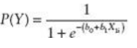{width="2.375in" height="0.8333333333333334in"}

Az egyenletben P(Y) az outcome valószínűségét jelöli, "e" a természetes
logaritmus alapja (a logaritmikus transzformáció miatt), és a zárójelben
hatványként szereplő "-(b~0~+b~1~X~1i~)" pedig az intercept és a
prediktor változó és az ahhoz tartozó béta.

Ez több prediktorral kiegészítve így néz ki:

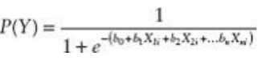{width="3.5in" height="0.9375in"}

A lényeg az, hogy az "e" hatványkitevőjeként most már egy olyan egyenlet
szerepel, amit a többváltozós regressziónál írunk fel.

Forrás: Andy Field könyv

## Log-likelihood (8.3.1)

Hasonlóképpen a hagyományos regresszióhoz, a logisztikus regressziós
modellek illeszkedését is a tényleges és a modell által jósolt értékek
összehasonlításával mérhetjük. A logisztikus regresszióban ezt
log-likelihood statisztikának hívjuk, és az egyenlete a következő:

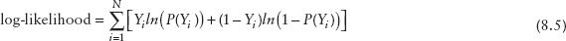{width="5.895833333333333in"
height="0.4270833333333333in"}

Az Y~i~ az i-edik eset tényleges értéke, ami lehet 0, azaz nem történt
meg az esemény, vagy 1, azaz megtörtént az esemény. A P(Y~i~) az i-edik
eset jósolt értékét jelenti, ami egy 0 és 1 közötti szám lehet, és az
esemény bekövetkeztének valószínűségét jelöli. A log-likelihood-ot tehát
a valós és bejósolt értékek valószínűségeinek esetenkénti összeadásával
kapjuk meg. Hasonlóan a hagyományos regresszió reziduális
négyzetértékeihez (Residual sum of squares), a statisztika a modell
által nem megmagyarázott információ mérőeszköze, ennél fogva minél
nagyobb az értéke, annál rosszabb a modell illeszkedése.

Forrás: Field, A., Miles, J. and Field, Z. (2012). *Discovering
statistics using R*. London: Sage. (8.3.1.)

## A modell értékelése (8.3.2)

A lineáris regresszióhoz hasonlóan a logisztikus regressziós modellünk
hasznosságát is szeretnénk kiértékelni, amit úgy érünk el, hogy a lehető
legrosszabb modellhez hasonlítjuk a modellünket. A modellünket a már
imént ismertetett log-likelihood írja le, azonban (kényelmi szempontok
miatt) ezt át szokás alakítani egy másik mutatóvá, a khí-négyzet
eloszlású "-2LL" mutatóvá. Neve kiszámításának módjából következik (= -
2 x log-likelihood).

Lineáris regressziónál a legrosszabb (baseline) modellünk az átlag volt,
ehhez hasonlítottuk új modellünket. Logisztikus regresszió esetében az
átlag értelmezhetetlen, így másik baseline modellre van szükségünk.
Mivel itt a bejósolt események vagy megtörténnek, vagy nem történnek
meg, így a baseline modellünk a leggyakrabban előforduló opció lesz. A
baseline modell és az új modellünk összehasonlításához kivonjuk a
baseline modell "-2LL" értékéből az új modell "-2LL" értékét, amivel
megkapjuk a likelihood ratio-t.

## Assessing the model: R and R^2 (8.3.3.)

R-statistics/ R-statisztika:. Parciális korreláció a kimeneti változó és
az egyes prediktorváltozók között. Értékei -1 és 1 között mozognak.
Pozitív érték esetén a kimeneti és prediktor változók között egyenes
arányosság van, negatív érték esetén fordított arányosság. Ha egy
változónak kicsi az R értéke, csak kis mértékben járul hozzá az
eredményhez.

R egyenlete: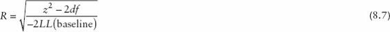{width="5.895833333333333in"
height="0.4895833333333333in"}

ahol -2LL: az alapmodelltől való eltérést jelenti, z^2^: Wald
statisztika

Mivel R értéke a Wald statisztikától függ, nem megbízható, ezért
vigyázni kell vele és négyzetre emelése nem ajánlatos.

A lineáris regresszióban használatos R^2^ analógja Hosmer és Lemeshow
által:

R^2^~L~ = -2LL(model) / -2LL(baseline)

A modell Kí-négyzete (a baseline-tól való eltérést mutatja) osztva a
baseline -- 2LL-vel.

Leírásának más módja: R^2^~L~ = (-2LL(baseline))-(-2LL(new)) /
-2LL(baseline)

R^2^~L~ annak a mutatója, hogy mennyit javul a modell a prediktor
változók figyelembevételével. 0 és 1 között mozoghat. 0 -- a prediktorok
nem jelzik előre a kimenetelt. 1 -- a modell tökéletesen bejósolja a
kimenetelt.

Cox és Snell képlete :

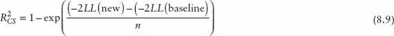{width="5.895833333333333in"
height="0.5416666666666666in"}

Ez viszont soha nem fogja elérni maximumot (1-et), ezért Nagelkerke
átírta:

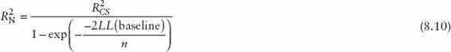{width="5.895833333333333in" height="0.6875in"}

ahol n a mintaméretet jelöli. Ezek elviekben ugyanazt számolják: a
lineáris regresszióban használatos az R^2^ --hez hasonlóan a modell
szignifikanciájának mértékét adják meg.

Forrás: Field, A., Miles, J. and Field, Z. (2012). *Discovering
statistics using R*. London: Sage. (8.3.3.)

## A modell értékelése (8.3.4)

A logisztikus regresszió során pont úgy, mint a lineáris regresszióban,
az AIC és a BIC mutatóit tudjuk a modell illeszkedésének meghatározására
használni, hogy kiküszöböljük azt a problémát, hogyha minél több
változót teszünk a modellbe, az R^2^ egyre nagyobbá válik.

Egyenletük:

AIC=-2LL+2k ahol a k a prediktorok száma

BIC=-2LL+2kxlog(n) ahol az n a modell eseteinek száma

Forrás: Andy Field

## A prediktorok modellhez való hozzájárulásának felbecslése (8.3.5)

A lineáris regresszióhoz hasonlóan itt is kíváncsiak vagyunk arra, az
egyes prediktorok egyenként hogyan járulnak hozzá a modellhez.
Logisztikus regresszióban azonban nem a t, hanem a z statisztikát
használjuk ennek meghatározására, amely normál eloszlást követ. Ez a
statisztika is azt mutatja meg, a prediktor b koefficense szignifikánsan
eltér-e a 0-tól. Ha mindez tejesül, feltehetjük, hogy a prediktor
szignifikánsan hozzájárul a függő változó bejóslásához.

Egyenlet: z=b/SEb

Azonban vigyázni kell a z statisztikával, ugyanis ha a b nagy, akkor a
standard hiba megnő, így a z alulbecsült lesz, ami 2-es típusú hibához
vezethet (elutasítjuk a prediktort, mint a függő változó szignifikáns
bejóslóját, holott igazából az lenne). Mivel Abraham Wald fejlesztette
ki a z statisztikát, így Wald statisztikának is szoktuk hívni.

Forrás: Andy Field

## Odds ratio (8.3.6)

Először definiáljuk az odds-t. Ez a vizsgált esemény (jelen példában
teherbe esés) bekövetkezésének valószínűségének és nem bekövetkezésének
valószínűségének aránya. Tehát ha 0.5 a bekövetkezés valószínűsége,
akkor 0.5 a be nem következés valószínűsége is, 0.5/0.5 = 1, az odds
tehát 1 : 1. Ha 0.8 a bekövetkezés esélye, akkor 0.2 a be nem
következésé, 0.8/0.2 = 4, az odds tehát 4 : 1.

Az odds ratio arra ad választ, hogy a prediktor változó egységnyi
változtatásának hatására miként változik az odds. Nominális prediktor
változó esetén ez a következőképp néz ki. Tegyük fel, hogy a prediktor
változónk, X jelöli, hogy a legutóbbi szeretkezés alkalmával
használtak-e óvszert (0 = nem használtak, 1 = használtak), az odds pedig
a teherbe esés esélyét adja meg. Az odds ratio kiszámolásához először ki
kell számolnunk a teherbe esés odds-át, abban az esetben, ha nem
használnak óvszert (ezt az odds-ot hívjuk O0-nak), majd abban az
esetben, ha használnak óvszert (ez legyen O1). Az odds ratio ebben az
esetben O1/O0.

Ebből következik, hogy 1-nél nagyobb odds ratio esetén a prediktor
változó növekedésére a vizsgált odds is növekszik, 1-nél kisebb odds
ratio esetén pedig csökken. Jelen példánál feltételezhető, hogy 1-nél
kisebb lesz az odds ratio, vagyis óvszer használata esetén a teherbe
esés esélye csökkenni fog az óvszer nélküli esélyhez képest.

Az odds ratio értéke amúgy a B exponenciálva, vagyis e^B^ (e a
B-ediken), vagy megfordítva, B egyenlő az odds ratio természetes
logaritmusával (B = ln(odds ratio)).

## A logisztikus regresszió előfeltételei (8.4.1)

1, lineáris kapcsolat van a folyamatos változó(k) és a kimeneti változó
logja között\
2, A reziduális értékeknek függetleneknek kell lenniük bármely két
megfigyelésnél (azaz nincs autokorreláció). Ezt a feltevést a
Durbin-Watson teszttel tehetjük próbára, ami a hibák közötti sorozatos
korrelációt méri.\
3, A független változók között ne legyen magas korreláció (azaz ne
legyen mutikollinearitás).

## A logisztikus regresszió sajátos problémái (8.4.2. és 8.4.3)

A logisztikus regressziós elemzés nem mindig eredményes. Előfordul, hogy
program nem talál helyes megoldást és ez vagy hibaüzenetekben, vagy
implauzibilisen nagy standard hibákban jelenik meg. Ennek két oka lehet,
mindkettő az esetek és a változók arányával kapcsolatos:

1, hiányzó információ:

Amikor a mintát különböző kategóriákra osztjuk és egy vagy több
kategória kombinációja üres,

az problémát fog okozni. Elemzés előtt ezért kontingencia táblázatot
kell készítenünk

(más néven kereszttáblázat) és ellenőriznünk kell, hogy mindegyik
cellában van e elég elem. (Bővebben: kereszttáblázat-elemzés)

Fontos, hogy a fenti állítás folytonos prediktorokra is igaz, amennyiben
annak egy konkrét értékét/tartományát mint külön kategóriát vizsgáljuk.

Pl.: A tüdőrák valószínűségét akarjuk bejósolni az alapján, hogy valaki
dohányzik -e, illetve eszik e paradicsomot. Adatokat gyűjtünk olyan
emberektől, akik dohányoznak és paradicsomot esznek. De ez önmagában nem
elég, a dohányzás és a paradicsom evés összes kombinációjából kell
adatot gyűjteni! (ez 4 kombinációt jelent igen/nem válaszok esetén)

2, teljes szeparáció:

Ha a kimeneti változót tökéletesen képes bejósolni egy prediktor, vagy
prediktorok kombinációja, akkor az elemzés logisztikus regressziónál
szintén összeomlik. Ezt a jelenséget teljes szeparációnak nevezik. Ennek
az az oka, hogy ekkor az adatok a kimeneti változó egyik vagy a másik
értékét veszik fel, ezért lehetetlen a kettő közötti értékekre
predikciót tenni (mivel ott egyáltalán nincs adat). Ugyanis végtelen
számú valid predikciót tehetünk és lehetetlen dönteni arról, hogy melyik
a legjobb. Ez a probléma leggyakrabban, akkor fordul elő, amikor túl sok
prediktorváltozót akarunk túl kevés adatra illeszteni. Ezt a problémát
úgy oldhatjuk meg, hogy több adatot gyűjtünk, de néha a választ egy
egyszerűbb modell alkalmazásával is megtalálhatjuk.

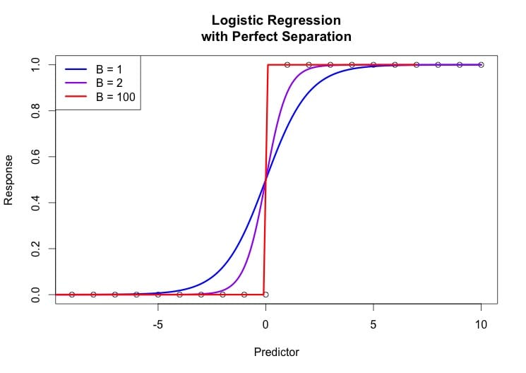{width="4.776042213473316in"
height="3.3857884951881014in"}

Példa teljes szaparációra: a 3 görbe azt jelzi, hogy nem dönthető el
egyértelműen, milyen predikciót tegyünk a kimeneti változó két értéke
közti adatokra

## Hogyan közöljük a logisztikus regresszió eredményét? (8.7)

Andy Field szerint ugyanúgy, mint a lineáris regresszió esetében.
Legalább a béta értékeket, és azok standard hibáit, a szignifikancia
értékeket, és általános statisztikákat a modellről (r2, goodness of
fit). Emellett fontosak még a konfidencia intervallumok, és az odds
ratio is. Ha pedig a konstanst is közlöd, az olvasó az egész regressziós
modellt újraépítheti, ha szeretné. Érdemes a nem szignifikáns változókat
is közölni, hiszen ez is értékes információkkal szolgálhat.

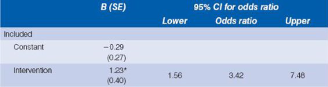{width="4.947916666666667in" height="1.3125in"}

R2=.06 (Hosmer-Lemeshow), .08 (Cox-Snell), .11 (Nagelkerke). Modell
χ2(1)=9.93, p\<.01 \* p\<.01

\*gal jelöljük a szignifikáns értékeket, és a tizedespont elé nem
teszünk 0-át ha az érték amúgy sem vehet fel 1-nél nagyobb értékeket
(pl. p érték, és r2 esetében)

Forrás: Andy Field

[[https://www.r-bloggers.com/15-types-of-regression-you-should-know/]](https://www.r-bloggers.com/15-types-of-regression-you-should-know/)

<!--chapter:end:01-chapter.Rmd-->

# FOGALOMTÁR A BAYES STATISZTIKÁHOZ {-}

## Bayesiánus valószínűség (szubjektív valószínűség)

A Bayesiánus valószínűség (vagy szubjektív valószínűség) egy azt megadó
személy tapasztalataiból és véleményéből származó valószínűség - így
minden ember esetében más.

Példa: Az a kijelentés, hogy "Szerintem 60%, hogy meg fogok bukni a
vizsgámon." egy Bayesiánus (szubjektív) valószínűséget foglal magába. Ez
az állítás tartalmazza a személy hiedelmeit, ugyanakkor előzetes tudást
is az adott eseményre vonatkozóan, mivel feltételezhetően a személy nem
aludta ki magát, vagy nem tanult a vizsgára. A [[frekventista
valószínűséggel]{.ul}](https://en.wikipedia.org/wiki/Frequentist_probability)
szemben ez a valószínűség nem arra vonatkozik, hogy a történelemben hány
százalék volt az elbukott vizsgák aránya.

[[Wikipédia]](https://en.wikipedia.org/wiki/Bayesian_probability)

[[Investopedia]](http://www.investopedia.com/terms/s/subjective_probability.asp)

## Valószínűségszámítási alapfogalmak

###  Marginális valószínűség (Marginal probability) p(A) 

Annak a valószínűsége, hogy A esemény előfordul: p(A)\
\
Feltétlen valószínűségként is gondolhatunk rá, mivel nem függ egy másik
esemény bekövetkezésétől.\
\
Pl.: Annak a valószínűsége, hogy egy pakliból piros lapot húzunk p(A)=
0.5; Annak a valószínűsége, hogy 4-es lapot húzunk p(B)= 1/13

### Együttes valószínűség (Joint probability) p(A,B) (olvasd:p(A és B))

Annak a valószínűsége, hogy két (független) esemény egymással együtt
fordul elő. Ez kettő vagy több esemény metszetének a valószínűsége.

Ha például két pakliból húzunk egy-egy lapot, annak az együttes
valószínűsége, hogy az egyikből kárót, a másikból pedig 4-est húzunk,
(¼)\*(1/13), mivel a káró húzásának valószínűsége, ¼, a négyes húzásáé
pedig 1/13.

### Feltételes valószínűség (Conditional probability): p(A\|B) (olvasd: p(A ha B igaz))

Annak a valószínűsége, hogy A esemény megtörténik ha B feltétel
teljesül.\
\
Pl.: Ha piros kártyát húztál, mekkora annak a valószínűsége, hogy ez a
piros kártya négyes lesz?

Másképpen megfogalmazva, ez annak a valószínűsége, hogy a piros
lapjaidból piros négyest húzol. (Itt a **B feltétel**, ami teljesül az,
hogy piros lapot húzunk, az **A esemény** pedig az, hogy 4-es lapot
húzunk.)

**p(A\|B)=p(A,B)/p(B)**

Átfogalmazva: p(négyest húzol \| piros kártyát húzol) = p(piros négyest
húzol)/ p(piros lapot húzol)

Mivel egy pakliban 2 piros négyes van és 26 piros lap-->

p(négyest húzol\| piros kártyát húzol)= 2/26= 1/13.

Egy másik példa a valószínűség típusokra:

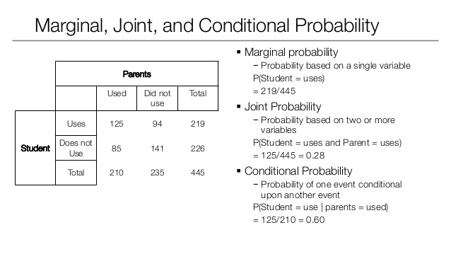{width="6.5in" height="3.6527777777777777in"}

[[Forrás]](https://www.slideshare.net/eugeneyan/statistical-inference-probability-and-distribution)

### Valószínűség típusok ([[http://sites.nicholas.duke.edu/statsreview/probability/jmc/]](http://sites.nicholas.duke.edu/statsreview/probability/jmc/)) 

Egy világos magyarázata a feltételes valószínűségnek
[[itt]](https://learnbayes.org/index.php?option=com_content&view=article&id=69:condprob&catid=79&Itemid=479)
található.

## Bayes tétel (Bayes' theorem, Bayes' rule, Bayes' law) 

(integrál formában lásd.: posterior)

A Bayes-tétel egy esemény előfordulásának valószínűségét írja le, az azt
befolyásoló tényezők ismeretének fényében. Megmutatja, hogyan alakítsuk
át hipotéziseinket megfigyeléseink (az adatok) alapján.

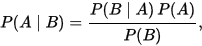{width="2.1041666666666665in"
height="0.4791666666666667in"}

P ( A ) = A előfordulásának valószínűsége, semmilyen más eseményre
tekintet nélkül, önmagában.

P ( B ) = B előfordulásának valószínűsége, semmilyen más eseményre
tekintet nélkül, önmagában.

P (A | B ) = A megfigyelésének valószínűsége, ha B jelen van.

P ( B | A ) = B megfigyelésének valószínűsége, ha A jelen van.

A Bayes-tétel alapján, ahhoz, hogy meghatározzuk A előfordulásának
valószínűségét B jelenlétében \[P (A I B )\], szükségünk van B
előfordulásának valószínűségére, ha A van jelen \[P ( B I A )\], A
előfordulásának valószínűségére \[P ( A )\] és B előfordulásának
valószínűségére \[P ( B )\]. Ez így bonyolultnak tűnhet, de egy példán
keresztül sokkal könnyebb megérteni:

Például szeretnénk egy klinikán a rákban szenvedő embereket
diagnosztizálni.

Legyen A esemény: "A beteg rákos"

Legyen B esemény: "A beteg rendszeresen dohányzik"

Az eddigiek alapján tudjuk, hogy a klinikán megforduló betegek 10%-a
rákos, így ismerjük azt, hogy P(A)=0.1. Szeretnénk megtudni P(A\|B)
valószínűségét (vagyis azt, hogy mekkora a valószínűsége annak, hogy
valaki, aki rendszeresen dohányzik, rákos). Ezt önmagában nehéz lenne
kiszámolni, azonban valószínűleg tudjuk P(B) valószínűségét (hiszen a
klinikán tudhatjuk hány betegünk dohányzik). Tegyük fel, hogy P(B)=0.5.
P(B\|A)-t is ismerjük, a feljegyzéseinkből tudhatjuk hány dohányos volt
a diagnosztizáltak között. Tegyük fel, hogy P(B\|A)=0.8.

Használhatjuk a tételt, hogy elvégezzük az alábbi számítást:

P(A\|B) = (0.8 \* 0.1)/0.5 = 0.16

Kiderítettük, hogy az adataink alapján annak a valószínűsége, hogy
valaki, aki rendszeresen dohányzik, rákos 16%.

[[Wikipedia]](https://en.wikipedia.org/wiki/Bayes%27_theorem)

[[Brilliant.org]](https://brilliant.org/wiki/bayes-theorem/)

[[Learnbayes.org]](https://learnbayes.org/index.php?option=com_content&view=article&id=70:bayes-theorem&catid=79&Itemid=479)

[[Betterexplained.org]](https://betterexplained.com/articles/an-intuitive-and-short-explanation-of-bayes-theorem/)

## Bayesiánus következtetés (Bayesian inference)

[[Wikipedia]](https://en.wikipedia.org/wiki/Bayesian_inference)

A Bayesiánus következtetés során a hipotéziseink valószínűségét
alakítjuk át ahogy egyre több információ és adat kerül a birtokunkba
megfigyeléseink által. A Bayesiánus következtetés során eljutunk a prior
valószínűségtől a posteriorhoz, az adatok és a választott statisztikai
modellünk használatával.

Ahogy azt már előbb említettük, a Bayesiánus valószínűség fogalma a
személyes hiedelmeink számszerűsítésén alapszik.

Vegyünk példának egy egyszerű pénzfeldobást. Előre 50% valószínűséggel
feltételezzük (azt hisszük), hogy a pénzérménk meg van cinkelve, ezért
az 70%-os valószínűséggel lesz fej. Ezután 100-szor feldobjuk az érmét,
hogy megnézzük, hogyan viselkedik valójában az érme. Miután ez az
információ a rendelkezésünkre áll, az előzetes elképzeléseinket
megerősítheti, meggyengítheti, de akár változatlanul is hagyhatja.

A Bayesiánus következtetésben előzetes hiedelmeinknek
([[prior]](https://docs.google.com/document/d/1tCfZkxueFzbxmvtmTzBkmOuwAAHg1_Q33zj_h6qcvrk/edit?mode=html#heading=h.pk3h60h007dk))
evidencia fényében történő újraértékelését végezzük el. Az adatok
önmagukban még nem szolgálnak evidenciaként, hanem mindig az adott
elképzelés/hipotézis viszonyában értelmezhetőek. Részletesebb
magyarázatért lásd az [[evidenciáról]](#evidencia), illetve a
[[likelihoodról]](#likelihood) szóló részt. Előzetes
elképzeléseinkből utólagos elképzeléseinkig
([[posterior]](#posterior-valószínűségek)) az adatokon keresztül
[[Bayes tételét]](#bayes-tétel-bayes-theorem-bayes-rule-bayes-law)
alkalmazva jutunk el.

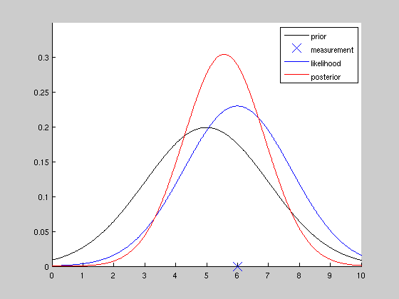{width="5.833333333333333in"
height="4.375in"}

Az
[[ábrán]](http://www0.cs.ucl.ac.uk/staff/gridgway/kalman/bayesian_update/bayesian_update.html)
a prior eloszlás, a poszterior eloszlás, a kapott adatok és a likelihood
függvény látható egymás viszonyában.

## Evidencia

A Bayesiánus következtetésnél az adatokat használjuk, hogy a prior
(előzetes) elképzeléseinkből a posterior (utólagos) elképzeléseinkig
eljussunk, tehát hogy átalakítsák a meggyőződéseinket. Az adatok
magukban nem evidenciák, az evidencia csak az adatok és a hipotézisek
viszonyában lehetséges, ezért a Bayesiánus következtetésnél
likelihood-ot használunk, ami annak a mértékét mutatja meg, hogy a
kapott adatok mennyire valószínűek egy-egy adott hipotézis alatt. Más
szóval az adatok alapján kapunk egy képet arról, hogy mely hipotézisek
magyarázzák jobban az adatainkat. Részetesebb leírásért lásd a
[[Likelihood]](#likelihood) és a [[Bayes
faktor]](#bayes-faktor-b-vagy-bf) számításához használt
[[Marginális likelihood]](#marginális-likelihood) bekezdést.

##  Hipotézis

Egy elméletet úgy kell megalkotni, hogy a hihetősége kiértékelhető
legyen és komponensei valahogyan a világot reprezentálják. Ezek a
komponensek a hipotézisek. A hipotézisek bizonyos adatokat prediktálnak.
Az elmélet annál jobb, minél helyesebbek ezek a predikciók. (Az
adatvezérelt módszerek kivételt képeznek.) Amennyiben nem fogalmazható
meg empirikus predikció az adatokra, úgy a hipotézis alulspecifikált.

Egy hipotézist általában valószínűségi eloszlások formájában határozunk
meg, azaz modellt alkotunk a mintájukra. A hipotézis adott tartományban
elhelyezkedő értékekhez valószínűségi értékeket rendel.

Maguk a hipotézisek lehetnek teljesen bizonytalanok. Egy teljesen
bizonytalan hipotézisnél nem tudjuk, hogy melyik értéket részesítsük
előnyben, minden értékhez ugyanakkora valószínűségi érték tartozik (ezt
hívják [[uniform
eloszlásnak]](https://en.wikipedia.org/wiki/Uniform_distribution_(continuous))).
A hipotéziseink lehetnek kevésbé specifikusabbak, amikor ugyan egy
értéket előnyben részesítünk a többivel szemben, de a valószínűségek
viszonylag egyenletesen oszlanak el. Egy specifikus hipotézis esetén egy
értékhez kiemelkedően magas, a többi értékhez pedig elenyészően kis
valószínűséget rendelünk. Ilyen esetben a valószínűségi eloszlásunk a
preferált értéknél kiemelkedően csúcsosodik, és elég hamar ellaposodik.

**Egzakt hipotézis** (másnéven ponthipotézis) esetén a hipotézis egy
konkrét értéket prediktál pl. Pontosan 0 és csak 0 hatást vár a
nullhipotézis.

Számszerűsíthetjük, hogy az egyes hipotézisek (H) mennyire prediktálják
a lehetséges adatokat p(D \| H), ahol D az adatokat jelöli. Ez a
likelihood (Morey et al., 2016). A hipotézis általában egy elképzelés
arról, hogy bizonyos mennyiség/mennyiségek eloszlása milyen a
populációban (lásd. [[Prior]](#prior)).

## Sűrűségfüggvény (Probability Density Function, PDF)

Egy folyamatos változónak egy olyan eloszlása, ahol az X tengely minden
értékéhez megfelelő valószínűségi érték tartozik. A görbe alatti terület
mindig 1.

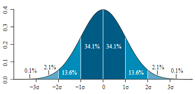{width="4.1875in" height="2.0208333333333335in"}

## Valószínűségi tömegfüggvény (probability mass function, PMF)

A sűrűségfüggvény párja diszkrét valószínűségi változókra.

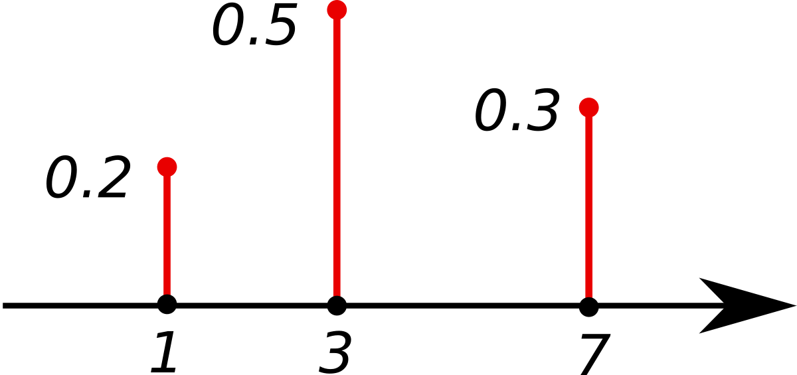{width="3.557292213473316in"
height="1.6664785651793526in"}

## Prior

A prior valószínűségi eloszlást mi határozzuk meg, tapasztalatainkból,
elvárásainkból, még a megfigyeléseink és az adatok megszerzése előtt.
Két hipotézist a prior valószínűségi eloszlásaik alapján hasonlítunk
össze, és az adatok fényében eldöntjük, hogy a két összehasonlított
prior közül melyik modellezi jobban a valóságot.

Például szeretnénk meghatározni, hogy átlagosan milyen magasak az
óvodások. A hipotézisünk prior eloszlása minden egyes (átlag)magassághoz
egy valószínűséget rendel. Ezután veszünk egy 100 fős mintát, ahol
mindenkinek megmérjük a magasságát és átlagot számítunk (adatok). Az
adatok alapján már meghatározható a likelihood függvény. Ha a prior
eloszlás a legtöbb valószínűséget olyan értékekhez rendeli, amik távol
esnek a megfigyelt adatoktól, akkor ennek a hipotézisnek az átlagos
likelihoodja kisebb, mint annak, aminél a prior az adatokhoz közelebb
eső valószínűségeket rendel.\
A Bayes faktorral már összehasonlítható a két hipotézis. (lásd.
Likelihood, Bayes faktor)

**2. Verzió (számítógépes)**
Bayesiánus analízishez szükséges definiálni, hogy mekkora hatást
várnánk ha a H1 igaz. A *BayesFactor* csomag a *standardizált hatás
méret* (δ) lehetséges értékit egy eloszlásban adja meg.
3 különböző skálájú beépített prior van a csomagban (ld ábra):
**Medium** = 0.71
**Wide =** 1
**Ultrawide** = 1.41
Ha nem állítjuk át, akkor a medium-mal számol.
Minél kisebb a prior skálája, annál inkább hasonlít a H~1~ a H~0~-ra
(és a B közelít az 1-hez)
Minél nagyobb a prior skálája, a B annál inkább favorizálja a H~0~-t.
([[Morey
blog]](http://bayesfactor.blogspot.hu/2014/02/bayes-factor-t-tests-part-2-two-sample.html))
Lehet specifikus priorokat is megadni (ha lehet, mindig jobb, ha így
járunk el). Bár gyakran felhozzák a kritikusok, de a specifikációk nem
tudják nagyon torzítani a kapott képet. Pl. az alábbi ábra A. részén 3
sikerességi becslés szerepel, mint prior, a B. ábra pedig azt mutatja,
hogy már 20 próba esetén is a posterior-ok elég hasonlóan néznek ki. A
**Bayesian Updating** lényege, hogy az adatok függvényében az
elképzeléseink mindig konvergálni és pontosítódni fognak. Ugyanakkor
minden adat csak két elképzelés viszonyáról tud valamit állítani.

[[Wikipedia]](https://en.wikipedia.org/wiki/Prior_probability)

[[Gelman cikk a
priorhoz]](http://www.stat.columbia.edu/~gelman/research/published/p039-_o.pdf)

## Likelihood

A likelihood nem valószínűség, önmagában nincs jelentése. Viszont
alkalmas hipotézisek összehasonlítására. Egy hipotézis (H) likelihoodja
az adatok (D) alapján: L(H\|D)=k ·P(D\|H), ahol k egy tetszőleges
pozitív konstans. ( Hipotézisek összehasonlításakor a konstansok kiejtik
egymást, mivel k az adatra jellemző.)

But, crucially, since this term is in both the numerator and denominator
the information contained in the way the data are obtained disappears
from the likelihood ratio. This result leads to the conclusion that the
sampling plan should be irrelevant to the evaluation of statistical
evidence, which is something that makes likelihood and Bayesian methods
particularly flexible

###  A likelihood törvény alapján

Egy statisztikai modellen belül egy D\* adathalmaz jobban alátámaszt egy
H1 hipotézist, mint egy H2 hipotézist, ha L(H1\|D\*)>L(H2\|D\*).

###  A likelihood elv

A likelihood elv kimondja, hogy a likelihood függvény minden olyan
információt tartalmaz, ami releváns a statisztikai bizonyíték
kiértékelése szempontjából.\
\
Ha egyszerre több hipotézis likelihoodját(akár az összes hipotézisét)
szeretnénk összehasonlítani, akkor ábrázoljuk a teljes likelihood
függvényt. Pl.: az ábra alább azon D adatok likelihood függvénye, ahol
pénz feldobásnál 10 dobásból 6 fejet dobunk. H1 szerint a fej dobás
valószínűsége ½, H2 szerint (trükkös pénz) 0.75. (H1-et és H2-t két pont
jelzi). (Az ábrát konvenció szerint skáláztuk egy konstanssal, így a
leginkább alátámasztott érték likelihoodja 1).\
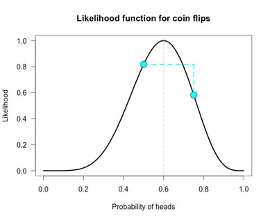{width="4.052083333333333in"
height="3.3020833333333335in"}\
\
A függőleges szaggatott vonal megmutatja, hogy az adatok melyik
hipotézist támasztják inkább alá. Bármely két hipotézis **likelihood
ratio**-ja a görbén lévő magasságuk aránya (önmagában egyik magasságnak-
likelihoodnak- sincs értelme!). A likelihood ratio megmutatja, hogy
hányszor valószínűbb, hogy az adatok az egyik hipotézist támasztják alá,
mint a másikat. A bizonyítékok relatívak: bár a normális pénzt jobban
támogatják az adatok nem azt jelenti, hogy minden trükkös pénzzel
szemben így van (csak az esetén, amit vizsgáltunk)! Ugyanis a legjobban
alátámasztott hipotézis csak gyengén alátámasztott lesz ha egy
közvetlenül előtte vagy utána lévő hipotézissel hasonlítjuk össze
(L(.6)/L(.61) ≈ 1.1)!\
\
A **Bayes faktor** a likelihood ratio kiterjesztése: egy súlyozott
átlagos likelihood ratio, ami az adott hipotézis prior eloszlásán
alapul. (Amikor a hipotézis ponthipotézis a likelihood ratio ugyanaz,
mint a BF!) A likelihood ratio-t a prior eloszlás minden pontjában
kiszámítjuk és súlyozzuk az adott értékhez tartozó valószínűséggel. Ha a
prior eloszlás a legtöbb valószínűséget olyan értékekhez rendeli, amik
távol esnek a megfigyelt adatoktól, akkor ennek a hipotézisnek az
átlagos likelihoodja kisebb, mint annak, aminél a prior az adatokhoz
közelebb eső valószínűségeket rendel.

[[https://alexanderetz.com/2015/04/15/understanding-bayes-a-look-at-the-likelihood/]{.ul}](https://alexanderetz.com/2015/04/15/understanding-bayes-a-look-at-the-likelihood/)

[[https://learnbayes.org/index.php?option=com_content&view=article&id=71:likelihood&catid=80&Itemid=479]{.ul}](https://learnbayes.org/index.php?option=com_content&view=article&id=71:likelihood&catid=80&Itemid=479)

## Marginális likelihood

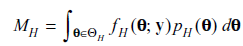{width="2.53125in"
height="0.4791666666666667in"}
A marginális likelihood (másnéven integrált likelihood) egy likelihood
függvény. A marginális szó arra utal, hogy a $\Theta$ paraméter(ek)
szerint integráltuk a kifejezést, így $\Theta$"marginalizálódik"
(eltűnik belőle). $\Theta$~H~ a H hipotézis alatti paramétert jelenti
(azaz egy vektor, ami tartalmazza a hipotézisünk összes paraméterét
pl. Variancia, átlag stb. ). Y az adatokat tartalmazó vektor. f~H~ az
adatok sűrűségfüggvénye H hipotézis alatt (egyszerűbb jelöléssel
=P(D\|H) ). Összefoglalva a marginális likelihood tekinthető úgy mint
a likelihoodok folytonos átlaga, amit a P~H~ priorral/priorokkal
súlyozunk. Ha a prior eloszlás olyan paramétere értékeken súlyozódik,
amik távol esnek az adatoktól, akkor a kapcsolódó kicsi likelihood
értékek csökkentik az átlagot. Így azért, hogy egy modell marginális
likelihoodja versenyképes legyen, a prior eloszlás nem súlyozódhat
ésszerűtlen paraméter értékeken.
A marginális likelihoodot modell evidenciának is nevezzük és a
poszterior elolszás illetve a Bayes faktor kiszámításához használjuk.
[[https://en.wikipedia.org/wiki/Marginal_likelihood]](https://en.wikipedia.org/wiki/Marginal_likelihood)

[[http://pcl.missouri.edu/sites/default/files/Rouder.bf\_.pdf]{.ul}](http://pcl.missouri.edu/sites/default/files/Rouder.bf_.pdf)

## Posterior valószínűségek

Ez arra vonatkozik, hogy mi a valószínűsége a hipotéziseknek az adatok
(x) ismeretében Pr(H0\|x), Pr(H1\|x). Hányadosuk a posterior odds, ami
megmondja, hogy mennyivel valószínűbb az egyik hipotézis, mint a másik.
A posterior eloszlás a Bayes tétel alapján:

{width="2.53125in" height="0.5729166666666666in"}

$\Theta$ a hipotézis (modell) paramétere. A tört nevezője a **marginális
likelihood**. Szerepe biztosítani, hogy a posterior érvényes
valószínűségi eloszlás legyen (azaz a területe 1 legyen). A posterior
alakját nem befolyásolja.

[[Wikipedia]](https://en.wikipedia.org/wiki/Conjugate_prior)

[[Quora.com]](https://www.quora.com/What-is-the-difference-between-marginal-likelihood-and-posterior)


##  Bayes faktor (B vagy BF)

Ahogyan a likelihoodról szóló részben is le van írva, az adatok
valószínűsége egyetlen prior hipotézis alatt nézve nem informatív. A
bayesiánus hipotézistesztelésnél az adataink fényében egyszerre két
hipotézisünket hasonlítjuk össze, és azt vizsgáljuk, hogy azok melyik
alatt valószínűbbek, azaz a likelihood törvény alapján melyiket
támogatják jobban. A Bayes faktor egy mutató, amely annak a mértékét
fejezi ki, hogy egy hipotézisünket milyen mértékben támogatnak jobban az
adataink, mint a másikat.

A Bayes faktor kiszámolása úgy történik, hogy megnézzük, hogy a kapott
adataink mennyire valószínűek az egyik prior (H~a~) alatt, illetve a
másik prior (H~b~) alatt, és ezt a két számot elosztjuk egymással. A
Bayes faktor azt számszerűsíti, hogy a legközelebbi megfigyeléskor
melyik modell fogja valószínűbben előrejelezni az adatokat.

**Hivatalos jelölés: B = p(D\|H~a~) / p(D\|H~b~)=**
$$$\frac{P(\Theta{}_{1}^{}|H{a_{}^{})\ P(D|\Theta{}_{1},\ Ha{)\ d\Theta}_{1}}_{}}{P(\Theta_{2}|{H_{}^{}}_{b})\ P(D|{\Theta{}_{2},H}_{b})d\Theta{}_{2}}$$$

(olvasd: A Bayes faktor egyenlő annak az arányával, hogy az adatok (D)
mennyire valószínűek az "a" hipotézisünk (H~a~) és a "b" hipotézisünk
(H~b~) alatt , **Bayes faktor=marginal likelihood ratio**)

A Bayes faktor csak akkor egyezik meg a (sima) likelihood ratioval, ha
egzakt hipotézisekről van szó, különben az integrál formát használjuk,
azaz a marginális likelihoodokat (modell evidenciákat) hasonlítjuk
össze (**lásd. Poszterior**).

A Bayes faktornál összehasonlított prior hipotézisek általában a
klasszikus hipotézistesztelésből átvett nullhipotézis és alternatív
hipotézis szokott lenni. A klasszikus (frekventista) hipotézistesztelés
által használt valószínűség és a bayesiánus valószínűség alapvető
különbségeiből adódik, hogy az alternatív hipotézist máshogyan ragadja
meg a két módszer. Míg az alternatív hipotézis a klasszikus
hipotézistesztelésnél a nullhipotézis elvetéséből áll, a bayesiánus
hipotézis esetében egy bizonytalan valószínűségi eloszlás formájában
fogalmazzák meg (lásd Cauchy eloszlás). Habár a klasszikus
hipotézistesztelés bayesiánus változatát sokan támadják, lehetővé teszi
azt, hogy számszerűen megmondjuk, a null- vagy az alternatív
hipotézisünket támogatják a megfigyeléseink.

Ahogyan azt fent említettük, a Bayes faktor számszerűen értelmezhető
úgy, hogy az adatok mennyire támogatják az egyik hipotézist a másikkal
szemben. Egy Bayes faktor, amiben a null hipotézisünk alatt 5-ször
valószínűbbek az adataink (megfigyeléseink), mint az alternatív
hipotézisünk alatt, értelmezhető úgy, hogy az adataink 5-ször jobban
támogatják a null, mint az altenatív hipotézisünket.

Abban, hogy mit is jelent pontosan, hogy 5-ös, 10-es stb. Bayes faktort
kapunk, nincs teljes megegyezés a szakemberek között, viszont az alábbi
táblázat egy egyszerű kiindulópontot biztosít az értelmezéséhez.

A táblázatban a H1 az alternatív hipotézist, a H0 pedig a
nullhipotézist jelöli.

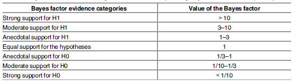{width="6.104166666666667in"
height="1.6979166666666667in"}

Egy érthető magyarázata a Bayes faktornak példával a [[BayesFactor
blogon]](http://bayesfactor.blogspot.hu/2014/02/the-bayesfactor-package-this-blog-is.html?m=1)
taláálható.

> **Mire jó a Bayes faktor, és mire nem jó?**

-   **Modellek összehasonlítására:** modelljeink nem igazak vagy
    > hamisak, hanem azokat tudjuk egymáshoz hasonlítani a rendelkezésre
    > álló adatok alapján [[(Rouder et
    > al., 2016)]{.ul}](https://www.dropbox.com/s/7kpion5dqacpwai/Rouder%20et%20al.%202016%20psy%20sci%20bayes.pdf?dl=0).

```{=html}
<!-- -->
```
-   **Nem mondja meg, hogy a null hipotézis (mennyire) igaz**: a B két
    > modellt hasonlít össze (ebből egyik lehet a null hipotézist
    > reprezentáló modell), és megmutatja, hogy az adatok milyen
    > mértékben támogatják az egyik modellt a másikhoz képest. Tehát a B
    > egy relatív bizonyítékot ad és az eredménye nem értelmezhető
    > önmagában a nullára (Bővebben Morey bolgján
    > [[itt]](https://richarddmorey.org/2015/03/two-things-to-stop-saying-about-null-hypotheses/)).

-   **Replikációs kísérletek értékelésére**: egy replikáció csak akkor
    > sikertelen, ha az adatok a nullát támogatják az alternatívával
    > szemben, az inkonklúzív eredményeket nem szabad sikerként vagy nem
    > támogató eredményként kezelni. Emiatt érdemes a B-t használni
    > replikációk eredményének értelmezésére ([[Data
    > colada]](http://datacolada.org/47); [[Verhagen & EJ,
    > 2014]](http://web.archive.org/web/20151026061603/http:/www.ejwagenmakers.com/2014/VerhagenWagenmakers2014.pdf)).

> **Kritika**

-   **Nem minden esetben lehet megadni a modell predikcióit**: például
    > nem volt még hasonló kutatás és így az elvárható hatásmértékről
    > nincs semmi információ. Megoldás lehet az ilyen esetekre a default
    > Cauchy eloszlás, ami a legtöbb (pszichológiában elvárt)
    > hatásmértéket lefedi (lásd [[Rouder et
    > al., 2016)]](https://www.dropbox.com/s/7kpion5dqacpwai/Rouder%20et%20al.%202016%20psy%20sci%20bayes.pdf?dl=0)

-   **Default Cauchy eloszlás az alternatív modell reprezentálására**:

```{=html}
<!-- -->
```
-   a skála-paraméter (lásd [[Cauchy
    > eloszlás]](https://en.wikipedia.org/wiki/Cauchy_distribution))
    > növekedésével egyre jobban a null modellt favorizálja
    > ([[blog]](https://replicationindex.wordpress.com/2016/07/25/bayes-ratios-a-principled-approach-to-bayesian-hypothesis-testing/))

-   Kifejezetten nagy hatásokat is valószínűsít, emiatt túlzottan növeli
    > a null modell támogatottságát (utal rá [[Rouder et al., 2009 p.
    > 232]](https://www.dropbox.com/s/tvn7lj9r5hgu0t3/Rouderetal09.pdf?dl=0))

-   A tudományban nincs default elmélet vagy hatásmérték, így minden
    > esetben ki kell értékelni, hogy a hipotézisünk reprezentálására
    > alkalmazott modell megfelelően alátámasztott-e. Amikor
    > lehetőségünk van rá, építsük be az elméletről vagy domain-ről
    > rendelkezésünkre álló tudást az alternatív modellbe, és térjünk el
    > a default prior eloszlástól ([[Dienes, 2014
    > p.6]}](https://www.dropbox.com/s/xcvz494zos30esa/Dienes_%20Bayes.pdf?dl=0);
    > [[Rouder et al., 2009 p.
    > 232]](https://www.dropbox.com/s/tvn7lj9r5hgu0t3/Rouderetal09.pdf?dl=0))

[[Wikipedia]](https://en.wikipedia.org/wiki/Bayes_factor)

[PLOS cikk](https://journals.plos.org/plosone/article?id=10.1371/journal.pone.0182651)

## Hihetőségi Intervallum (Credible Interval)

Más nevén: Posterior Probability Interval (PPI)

Értelmezése: az a régió, amibe a populáció egy adott paramétere 95%
szubjektív valószínűséggel esik bele. Ehhez le kell generálni a
*poszterior eloszlást* és abból következik, hogy hol a belső 95%.

[[Posterior]](https://en.wikipedia.org/wiki/Posterior_probability),
[[Likelihood]](https://en.wikipedia.org/wiki/Likelihood_function),
[[Conjugate prior]](https://en.wikipedia.org/wiki/Conjugate_prior),
[[Posterior
predictive]](https://en.wikipedia.org/wiki/Posterior_predictive_distribution),
[[Hyperparameter]](https://en.wikipedia.org/wiki/Hyperparameter),
[[Hyperprior]](https://en.wikipedia.org/wiki/Hyperprior),
[[Principle of
indifference]](https://en.wikipedia.org/wiki/Principle_of_indifference)

**Közömbösségi elv (Principle of indifference)**

Ha dobókockával dobunk, akkor minden dobás független egymástól és a
lehetőségek kizárják egymást (nem dobhatunk egyszerre kettő vagy több
számot egy kockával), viszont ugyanakkor magába foglalja az összes
lehetőséget, mivel a dobókocka egy dobásnál biztosan valamelyik oldalára
fog érkezni és kizárólag a dobókockán szereplő értékeket kaphatjuk. Ezen
felül normális esetben annak a lehetőségét, hogy az egyik számot dobjuk,
az elnevezésükön kívül (1-est vagy 6-ost dobtam) semmi sem különbözteti
meg. Az alább leírt "közömbösségi elv" szerint ha a dobókockához hasonló
feltételek teljesülnek, minden lehetőség ugyan akkora valószínűséget fog
kapni.

Absztraktabban megfogalmazva: A közömbösségi elv kimondja, ha van *n*
darab egymástól független, egymást kizáró lehetőség, amelyeknek a
valószínűségeinek összege 1, és a nevükön kívül mindenben megegyeznek
(azonos elven kapjuk őket, szintaktikailag hasonlóak), akkor minden
ilyen lehetőséghez 1/*n*-nel megegyező valószínűséget kell rendelni.

A bayesiánus valószínűségszámításban ez a legegyszerűbb [[nem-informatív
prior]](https://en.wikipedia.org/wiki/Prior_probability#Uninformative_priors).

## Konjugált prior

Vegyünk egy $\Theta$paraméter által meghatározott valószínűségi eloszlás
családot (pl. exponenciális eloszlások családja). Ha az összes
lehetséges poszterior eloszlás ugyanabba a családba esik, mint a prior
eloszlás, akkor a prior és poszterior **konjugált eloszlások**, és a
priort a (likelihood függvényre nézve) **konjugált priornak** nevezzük.
A poszterior eloszlás:

{width="2.53125in" height="0.5729166666666666in"}

A konjugált prior fogalmának bevezetése algebrai könnyebbséget jelent,
ugyanis ekkor a prior és a poszterior hasonló algebrai alakot vesz fel.
Azaz a poszterior mindig **zárt alakú** **kifejezés**(olyan matematikai
kifejezés, amit véges számú művelettel ki tudunk számolni) lesz.
Különben numerikus integrálást kéne végeznünk, ami csak közelítő
megoldást adhat és nagy számítási kapacitást igényel. (lásd. **MCMC
módszerek**)

Fontos megjegyezni, hogy itt alapvetően nem a prioron van a hangsúly,
hanem azon az eloszlás családon, amit a probléma modellezéséhez
használunk.

Összefoglalva bonyolult számítások esetén érdemes megnézni, hogy a
standard eloszlások (pl. Beta, binomiális, gamma stb.) valamelyike,
esetleg azok kombinációi illeszkedik e a modellhez. Így konjugált
priorokkal megbecsülhetjük a priorunkat.

[[wikipedia]](https://en.wikipedia.org/wiki/Conjugate_prior)

[[https://www.chrisstucchio.com/blog/2013/magic_of_conjugate_priors.html]{.ul}](https://www.chrisstucchio.com/blog/2013/magic_of_conjugate_priors.html)

## A maximum entrópia elve (Principle of maximum entropy)

A legnagyobb entrópia elve alapján, amikor nem ismerjük pontosan egy
valószínűségi eloszlás minden paraméterét, akkor azt az eloszlást kell
válasszuk, amelynél a legnagyobb az eloszlás be nem jósló ereje
(unpredictibility). Amikor az eloszlás entrópiájáról beszélünk, akkor
lényegében azt mutatjuk meg, hogy mennyire informatív az eloszlás. Annak
az eloszlásnak, ami az esetek 100%-ban helyesen jósolja be az adott
eseményt 0 az entrópiája. Ezzel szemben az uniform eloszlás alatt minden
esemény ugyanakkora valószínűséggel fordul elő, így ennek a legnagyobb
az entrópiája, ez a legkevésbé informatív eloszlás.

[[érthető
magyarázat]](http://corysimon.github.io/articles/the-principle-of-maximum-entropy/)

[[wikipedia]](https://en.wikipedia.org/wiki/Principle_of_maximum_entropy)

## Empirikus Bayes módszer

Az empirikus Bayes módszer, más néven a Maximum Marginal Likelihood
módszer, a prior eloszlás paramétereit (a hiperparamétereket) a
legvalószínűbb értékeikre állítjuk.

[[wikipedia]](https://en.wikipedia.org/wiki/Empirical_Bayes_method)

## Cromwell szabály

A Cromwell szabály szerint a prior valószínűség nem szabad 0 vagy 1
legyen, kivéve ha igen-nem döntésről van szó, hiszen a Bayes tétel
alapján ebben az esetben a posterior valószínűség is mindenképp 0 vagy 1
lesz. Tehát az evidenciának semmilyen hatása nincs a véleményünkre.

[[wikipedia]](https://en.wikipedia.org/wiki/Cromwell%27s_rule)

## Bernstein--von Mises tétel

A Bernstein-von Mises tétel alapján mondható el, hogy a posterior
eloszlás a gyakorlatban független a prior eloszlástól, amennyiben elég
információt szolgáltat a megfigyelt adatunk. (És ha a Cromwell szabály
érvényesül.)

[[wikipedia]](https://en.wikipedia.org/wiki/Bernstein%E2%80%93von_Mises_theorem)

## Bayes-féle információs kritérium (másnéven Schwarz kritérium)

Újabb paramétereket beemelve egy modellbe, meg tudjuk növelni a modell
illeszkedését. Túl sok paraméter esetén azonban ez a folyamat a
visszájára fordul (overfitting). A BIC segítségével ki tudjuk választani
különböző modellek közül azt, amelyik legjobban illeszkedik az
adatokhoz. A kisebb BIC jobb illeszkedést jelent.

Gyakorlatban a következő határvonalakat használják a különbségtételre
modell szelekciónál, de a BIC érték önmagában is értelmezhető:

========================================\
BIC (Model A -- Model B) , ha BIC(A) \> BIC(B)\
\-\-\-\-\-\-\-\-\-\-\-\-\-\-\-\-\-\-\-\-\-\-\-\-\-\-\-\-\-\-\-\-\-\-\-\-\-\-\-\-\-\-\-\-\-\-\-\-\-\-\-\-\-\-\-\-\-\-\-\-\-\-\--\
\< 2.0 Gyenge\
2.0 -- 5.9 Pozitív és a B-t támogatja\
6.0 -- 9.9 Erős és a B-t támogatja\
≥ 10.0 Nagyon erős és a B-t támogatja\
========================================

[[wikipedia]](https://en.wikipedia.org/wiki/Bayesian_information_criterion)

[[határértékek]](http://epid.blogspot.hu/2012/11/the-rule-of-thumb-aic-signficance-levels.html)

## Uniform eloszlás

Diszkrét: A felvehető értékek egyenlő eséllyel fordulhatnak elő. Például
egy dobókocka eldobásakor elméletileg minden oldal egyenlő
valószínűséggel (⅙) lehet a legfelső oldal a kocka megállásakor, az
oldalak száma pedig véges.

Folytonos: Két előre meghatározott intervallum között bármely érték
egyenlő eséllyel fordulhat elő (a függvény minden értéke maximum- és
minimumhely is egyben, ábrázolva egy vízszintes egyenes vonal).

## Lagrange szorzó (Lagrange Multiplier)

A Lagrange szorzó megmondja egy adott függvény maximumát vagy minimumát
az adott korlátok között.

[[Wikipedia]](https://en.wikipedia.org/wiki/Lagrange_multiplier)

[[Példa]](http://www.slimy.com/~steuard/teaching/tutorials/Lagrange.html)

## Maximum Likelihood becslés ([[MLE]](https://en.wikipedia.org/wiki/Maximum_likelihood_estimation))

*Etz cikk:*

A kutatókat természetükből adódóan érdekelheti, hogy melyik az a
hipotézis, amelyik a legjobban prediktálja az adataikat. Ezt a kérdést a
Maximum Likelihood becslés módszere tudja megválaszolni. Mivel az adatok
valószínűsége egy hipotézis alatt arányos annak likelihoodjával, a
hipotézis, amely alatt a kapott adataink a legvalószínűbbek, rendelkezik
a legmagasabb likelihooddal az összes hipotézis közül.

*Marci ezt találta:*

Az MLE egy olyan eljárás, melynek során megfigyelések alapján
megbecsülhetjük a statisztikai modellünk paramétereit úgy, hogy
maximalizáljuk a likelihoodját a megfigyeléseinknek. A módszer többek
között feltételezi a paraméterek prior uniform eloszlását. Például, ha
meg akarjuk tudni egy pingvin populációban a pingvinek magasságának
átlagát és szórását, feltételezve, hogy a magasságok eloszlása normál
eloszlás, de nincs időnk megmérni az összeset, akkor egy kisebb minta
megmérése után tudunk becslést adni az átlagra és a szórásra.
Problémája: Overfitting

*Márknak így magyarázták el:* Modellillesztésnél, ha pontos az x
tengelyen mért változó (pl.: időt mérünk és a mérések pontosan X
másodpercnyi időközönként történnek), ezen felül az y tengelyen a mérési
hibák hosszútávú eloszlása normáleloszlást követ, akkor a [[központi
határeloszlás
tétele]](https://hu.wikipedia.org/wiki/Centr%C3%A1lis_hat%C3%A1reloszl%C3%A1s-t%C3%A9tel)
szerint az a modell lesz a legvalószínűbb mindközül, amelynek a
reziduális négyzetösszege a legkisebb.

## Maximum a posteriori becslés

([[MPE]](https://en.wikipedia.org/wiki/Maximum_a_posteriori_estimation))

Egy paraméterre adott pontbecslést lehet az eljárás segítségével adni
(ebben különbözik a legtöbb Bayesiánus eljárástól, hiszen azok
valószínűségi eloszlásokat használnak többnyire). A módszer eredménye a
mérések végén rendelkezésünkre álló posterior eloszlás módusza lesz.
Hasonló eljárás, mint az MLE, tekinthető a
[[regularizációjának]](https://en.wikipedia.org/wiki/Regularization_(mathematics)).
A különbség a két eljárás között az, hogy az MPE használ prior
eloszlást, míg az MLE nem. Problémája: a pontbecslés miatt nem tudjuk
meghatározni, hogy mennyire vagyunk biztosak az eredményben.

## Markov-lánc Monte-Carlo (MCMC) módszerek 

-A Markov-lánc Monte Carlo egy olyan módszer, amely a komplex
eloszlásokból történő mintavételezés problémájára nyújt megoldást*.*

***-Kifejezetten hasznosnak bizonyul a bayesiánus modellek poszterior
eloszlálának kiértékelésében.***

Az MCMC kifejezetten hasznos a bayesiánus következtetésben, főleg a
poszterior eloszlások szempontjából, mivel azokat sokszor nehéz
analitikus módszerekkel vizsgálni (csak komplex integrálással). Ezekben
az esetekben az MCMC lehetőséget nyújt arra, hogy megbecsüljük a
poszterior eloszlásnak olyan aspektusait, amelyek direkt módon nem
kiszámíthatóak.

A **Monte--Carlo** egy olyan módszer, amely során az eloszlásból vett
random mintákkal becsüljük meg az eloszlás tulajdonságait. Az MCMC
**Markov-lánc** tulajdonsága az, hogy ezeket a mintákat egy speciális
szekvencia-folyamattal kapjuk. Minden random minta egy kiindulópont,
amely segítségével a következő random mintát kapjuk (innen a "lánc"
elnevezés). Egy különleges tulajdonsága ennek a láncnak, hogy minden
random minta függ az azt megelőző random mintától, viszont független
azoktól a mintáktól, amik annál előbb voltak (ez az ún. "Markov
tulajdonság").

(Példa feladadat és az eljárás lépései+ R kód a 2. cikkben!).

[[https://jeremykun.com/2015/04/06/markov-chain-monte-carlo-without-all-the-bullshit/]](https://jeremykun.com/2015/04/06/markov-chain-monte-carlo-without-all-the-bullshit/)

[[https://link.springer.com/article/10.3758/s13423-016-1015-8]{.ul}](https://link.springer.com/article/10.3758/s13423-016-1015-8)

## Bayesiánus lineáris regresszió

([[BLR]](https://en.wikipedia.org/wiki/Bayesian_linear_regression))

Bayesiánus megfelelője az MLE-nek és az MPE-nek, megoldást nyújt azokra
a problémákra, amik ezeknél felmerülnek, hiszen egyszerre használ priort
és fejezi ki a bizonytalanságunkat a számolás végén.

Wiki leírás: A Bayesiánus lineáris regresszió, ahogyan a nevében is
szerepel, a lineáris regressziónak a Bayesiánus következtetés
szempontjából történő megközelítése. Ezzel a módszerel a regresziós
modellünk paramétereinek (béta és szórás) megkaphatjuk a poszterior
valószínűségét úgy, hogy azokra prior eloszlást állítunk és az adatokból
kapott likelihood függvénnyel Bayes tétele alapán átalakítjuk.

## Bayesiánus becslés vagy bayesiánus cselekvés

([[wiki]](https://en.wikipedia.org/wiki/Bayes_estimator))

Olyan döntési szabály, vagy becslés, ami minimalizálja a veszteség
függvény (lásd lejjebb) posterior várható értékét. Erre példa, hogy az
IMDB a filmek értékelésének összegzésekor használ egy standard számot,
ami az értékelések számát jelöli, aszerint korrigálja az eredményt, hogy
a leadott szavazatok száma milyen közel van ehhez az értékhez.

## Veszteség függvény (Loss function)

([[statlect]](https://www.statlect.com/glossary/loss-function))

Pontbecslésnél használatos fogalom. A definíciója nem más, mint a
becslés és a tényleges paraméter közötti hibák térképezése és valós
számokká alakítása. A veszteség függvény használható az illeszkedés
mértékének jelzésére.

## Közelítő Bayesiánus Eljárások

([[ABC]](https://en.wikipedia.org/wiki/Approximate_Bayesian_computation))

Olyan statisztikai eljárások, amik bayesiánus alapúak. Ezek túllépnek a
szigorúan likelihood függvény alapú számításokon, mivel olyan
modellekhez használatosak, ahol már nem lehetséges alkalmazni a
likelihood függvényt, mivel túl komplexek. Az ABC csoportba tartozó
számítások tartalmaznak olyan következtetéseket, amik növelik a hiba
nagyságát, ezek csökkentésére használják a bayesiánus becsléseket.

## Jeffreys-Lindley paradoxon

([[wiki]](https://en.wikipedia.org/wiki/Lindley%27s_paradox))

Tualjdonképpen nem is paradoxon.

Azt a szituációt nevezik Lindley paradoxonnak (Jeffreys könyvében került
elő), amikor egy elmélet tesztelésére felállított kísérlet eredményét
frekventista és bayesiánus módszerekkel vizsgálva más-más eredményre
jutunk. Nevezetesen azt, amikor a frekventista elemzéssel szignifikáns
eredményt kapunk, tehát elvetjük a H0-t, a bayesiánus módszer pedig
ezzel ellenkezőleg a H0-t támogatja..

## Hiperparaméter

A hiperparaméterek a prior eloszlás paraméterei, amelyeket így meg
tudunk különböztetni a vizsgált modell paramétereitől (pl.a vizsgált
átlagtól vagy hatásmérettől). Például egy Cauchy eloszlás
hiperparamétere az r. A hiperparaméter lehet egyetlen érték, de egy
eloszlással is ábrázolhatjuk - ebben az esetben hiperpriorról beszélünk.

[[Wikipedia]](https://en.wikipedia.org/wiki/Hyperparameter)

## Bayesiánus hálózat (Bayesian network)

A Bayesiánus hálozat egy irányított körmentes gráf, azaz ha az egyik
csomóponttól elindulunk, nem juthatunk vissza hozzá. A csomópontok olyan
események, amelyeknek mind vannak különböző paramétereik, állapotaik. Az
ezeket összekötő vonalak jelzik a közöttük lévő kapcsolatokat, ezek
iránya pedig a kazualitást, melyik hat melyikre.

Szemléltetés: [[Bayesian Belief Networks for
dummies]](https://www.slideshare.net/GiladBarkan/bayesian-belief-networks-for-dummies)

[[Wikipedia]](https://en.wikipedia.org/wiki/Bayesian_network)

## Savage-Dickey density ratio

A Savage-Dickey density ratio egy alternatív számítási módja a Bayes
faktornak. A JASP elemzések ábrái is ezt a módszert mutatják. Ez a
módszer a feljebb leírt Bayes faktor módszertől eltérően nem a
marginális likelihood arány, hanem a prior és a poszterior eloszlás
likelihoodjának aránya a nullánál (vagy bármilyen paraméternél, amit a
nullhipotézis prediktál). Röviden, ez az arány azt fejezi ki, hogy a
nulláról alkotott előzetes elképzeléseink (prior hipotézis) hogyan
módosultak az adatok ismeretében, amit a poszterior eloszlás ír le.
Minél alacsonyabb a poszterior hipotézis likelihoodja a nullánál a
priorhoz képest, az adatok annál jobban az alternatív hipotézist fogják
támogatni, és ez fordítva is igaz.

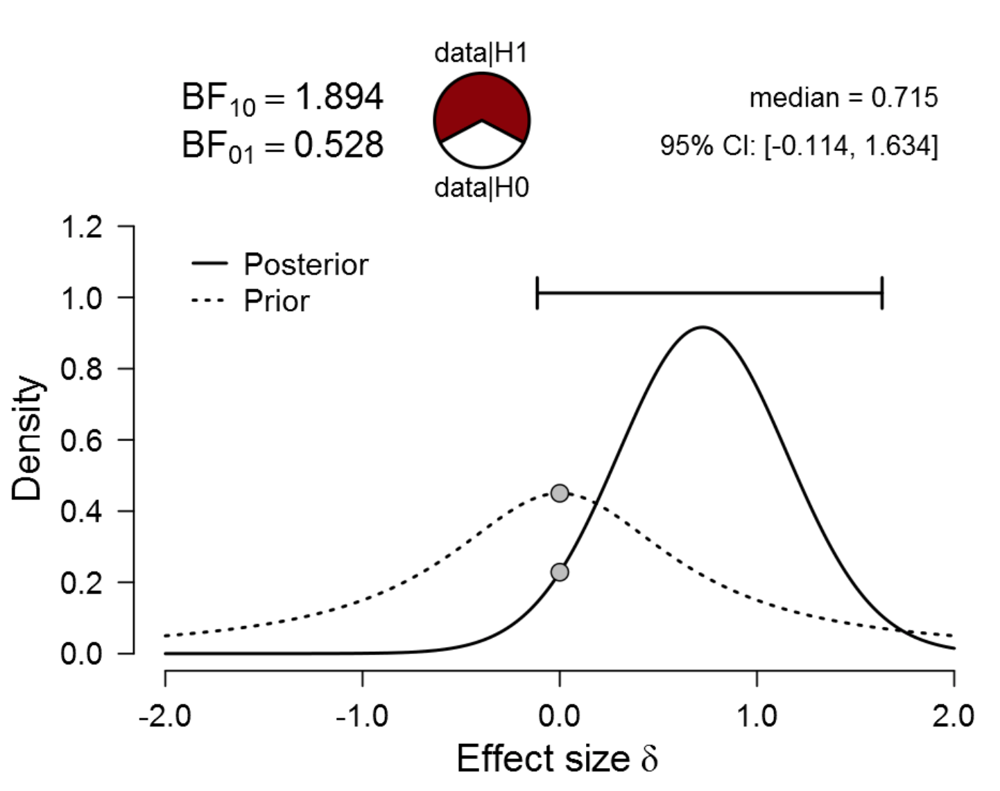{width="3.6478871391076115in"
height="2.8906255468066493in"}

Az ábrán látható, hogy míg a prior hipotézis viszonylag magas
valószínűséget rendel a 0-hoz, az adatok ismeretében a poszterior
hipotézis alatt már kevésbé valószínű, hogy ezt az értéket kapjuk.
Ahogyan az alábbi egyenlet leírja, a H0 irányában kapott Bayes faktor
kifejezhető úgy, mint a nullhipotézis által prediktált paraméternek a
valószínűsége a poszterior hipotézis alatt(a számlálóban) osztva a
nullhipotézis által prediktált paraméter valószínűségével a prior
hipotézis alatt (nevező).

{width="3.3034339457567805in"
height="0.6510422134733158in"}

De miért csak egy prior hipotézisünk van? Ennek a módszernek az egyik
jellegzetessége, hogy a hipotézisek modelljét frekventista
nullhipotézisteszteléshez hasonlóan állítja fel. Itt a nullhipotézis
(H0) ponthipotézis formájában jelenik meg, és azt prediktálja, hogy a
vizsgált paraméter (például egy hatásméret) egyenlő lesz a nullával, az
alternatív hipotézis pedig azt modellezi, hogy a vizsgált paraméter nem
lesz egyenlő a nullával. Mivel az alternatív hipotézis a bayesiánus
hipotézistesztelésben nem a nullhipotézis elvetéséből jön létre, egy
nem-informatív vagy egy diffúz prior eloszlással modellezzük azt (a
Bayes faktornál általában uniform vagy Cauchy prior eloszlásokat szoktak
használni). A null- és az alternatív hipotézis itt egymásba vannak
ágyazva, azaz a nullhipotézis az alternatív hipotézis prior eloszlásának
azt a pontját képezi, amely a nullánál szerepel. Erre a jelenségre az
angol szakirodalom "nested modell"-ként hivatkozik.

[[https://lirias.kuleuven.be/bitstream/123456789/277829/1/CP.pdf]](https://lirias.kuleuven.be/bitstream/123456789/277829/1/CP.pdf)

<!--chapter:end:02-chapter.Rmd-->

#Szisztematikus összefoglaló és meta-analízis készítése {-}

A szakirodalmi összefoglaló célja, hogy egy terület kutatásait
összegezze. Az így kinyert eredmények több kutatás eredményeit
összesítik, ezért nagyobb bizonyító erővel bírhatnak egy egyszeri
kutatásnál. A bizonyítékok hiearachiájában a --- megfelelő módon
elkészített --- összefoglaló tanulmányok rendelkeznek a legnagyobb
tudományos bizonyító erővel (lásd 1. Ábra). Továbbá a szakirodalmi
összefoglalók azt is lehetővé teszik, hogy megfigyeljünk olyan
összefüggéseket, amelyek az egyes kutatások szintjén észrevétlenek
maradnának. Így például lehetséges egy kezelés hatékonyságának és
biztonságosságának felmérése (pl. ritka mellékhatások rejtve maradhatnak
egy kis kutatásban, de láthatóvá válhatnak több tanulmány alapján), egy
hatás általánosíthatóságának vagy specifikusságának vizsgálata (pl. egy
terápia működik tapasztalt és tapasztalatlan terapeutákkal is),
következtetés háttérmechanizmusokra (pl. a laboratóriumi stresszorok
akkor okoznak kortizol választ, ha van bennük szociális komponens vagy
kontrollvesztés), egy területről meta-információk gyűjtésére (pl. mikor
volt népszerű egy kutatási terület). A kvantitatív szakirodalmi
összesítő tanulmányok (meta-analízis) segítségével pontosabban
megbecsülhetjük egy hatás nagyságát is. A szakirodalmi összefoglalók ún.
másodlagos kutatások, azaz nem saját adatokat gyűjtenek, hanem más
tanulmányok összesítésével és szintézisével jutnak következtetésekre.

**1. Ábra. Bizonyítékok hierarchiája**

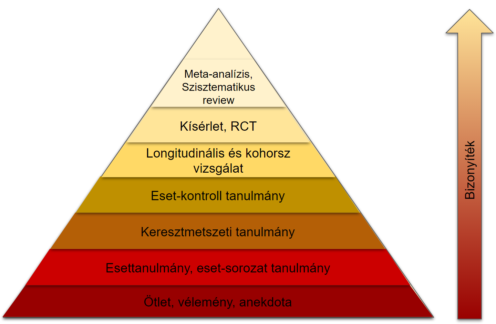{width="5.624601924759405in"
height="3.6718755468066493in"}

## Összefoglaló tanulmány fajták

A szakirodalmi összefoglalók többfélék lehetnek az elkészítés módjától
és a használt módszertől függően. A **narratív összefoglaló** egy olyan
tanulmány, ami egy szakterületet egy meghatározott cél alapján összesít,
például bemutatja a terület fő elméleteinek fejlődését. A felhasznált
kutatásokat nem szisztematikus keresés alapján, hanem egyéb szempontok
szerint vonja be a tanulmányba. Jellemzően egy szakterületet
összefoglalásakor csak a legfontosabb tanulmányokat tárgyalja. A
**scoping review** (szakirodalmi feltérképezés) célja, hogy egy terület
kutatásaiban jelentkező módszertani kérdéseket összesítse. Tehát
jellemzően nem a kutatások eredményeire kíváncsi, hanem arra, hogy
milyen módszerekkel, mintákkal, eszközökkel vizsgálták a korábbi
kutatások a területet. A scoping review-k hasznosak lehetnek egy
szisztematikus irodalmi összefoglaló megalapozására, illetve annak
szükségességének vagy megvalósíthatóságának felmérésére. A
**szisztematikus összefoglaló** készítése során előre meghatározott
szabályok alapján egy szakterület összes releváns kutatását
összegyűjtik, majd ezeket a kutatásokat rendszerezik és kvalitatívan
összesítik. A **meta-analízis** a szisztematikus összefoglalóban
foglaltakon túlmenően a kutatások eredményeit kvantitatívan is
összesítik, azaz számszerű becslést készítenek arról, hogy egy
hatásnagyság mekkora lehet a populációban.

**2. Ábra. Az összefoglaló tanulmány fajták és azok bizonyító erejének
összefüggése**

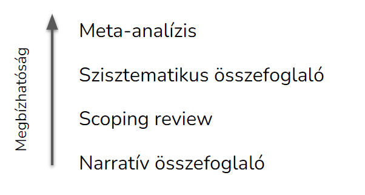{width="3.682292213473316in"
height="1.9633453630796152in"}

### Narratív összefoglalók

A narratív összefoglaló egy terület legfontosabb eredményeibe nyújt
betekintést, anélkül, hogy az olvasótól elvárná a szakterület beható
ismeretét. Ez az összefoglaló fajta a többihez képest kevésbé tervezés
és erőforrás igényes. Például nem szükséges hozzá protokollt írni, vagy
több kutatót bevonni a tanulmányok kiválasztásához és adatkinyeréshez.
Akkor is elvégezhető, ha csak kevés kutatás létezik egy területen.
Ugyanezek miatt azonban a módszer jelentős hátránya lehet, hogy a
tanulmányok szubjektív beválogatása miatt nagyobb hangsúlyt kap a kutató
által felállított narratíva, ami bizonyos esetekben torz képet festhet
egy területről. Emellett a módszer nem igyekszik kvalitatív vagy
kvantitatív összesítésre, így nehéz megfelelően súlyozni az egymásnak
ellentmondó eredményeket. Mindezek miatt a narratív összefoglalók
ritkábban jelennek meg folyóiratcikként, a leggyakrabban
könyvfejezetként vagy monográfiaként publikálhatóak.

### Scoping review

Főleg arra való, hogy feltérképezzük egy terület lefedettségét, illetve
azt, hogy az adott területen milyen kérdések tisztázatlanok, vagy milyen
módszereket használnak. Egy scoping review-ban így többnyire nagyobb
hangsúlyt kap a cikkek módszertanának az áttekintése, mint a fő kutatási
kérdések összegzése. Egy sikeres scoping review segíthet eldönteni, hogy
egy szisztematikus irodalmi összefoglaló milyen kérdésekre tegye a
hangsúlyt.

### Szisztematikus összefoglaló

Célja egy területen rendelkezésre álló összes hozzáférhető bizonyíték
áttekintése. A bevont cikkek egy előzetes protokoll alapján,
szisztematikus kiválasztási folyamat során kerülnek a tanulmányba. A
kiválasztott cikkeket kategorizálják és a legfontosabb eredményeit
összegyűjtik, és kvalitatívan értékelik. A cikkeket gyakran osztályozzák
is, például aszerint, hogy mennyire erős bizonyító erővel bírnak. A
szisztematikus összefoglalók alkalmasak lehetnek egy terület
eredményeinek és módszertani jellemzőinek bemutatására. Azonban
kvantitatív összesítés híján az egymásnak ellentmondó eredmények
összesített értékelését nehéz elvégezni. Az olyan területeken, ahol túl
kevés az eredmény egy meta-analízis elvégzésére, gyakran szisztematikus
összefoglalót készítenek.

### Meta-analízis

A meta-analízis a szisztematikus összefoglaló olyan formája, ahol az
egyes kutatásokban található számszerű eredmények statisztikai
módszerekkel összesítésre kerülnek. Így egy terület kutatásait
összegyűjtve lehetővé válik a populációban lévő hatások pontosabb,
számszerű becslése. Ezen túlmenően arra is lehetőség nyílik, hogy a
kutatásokban lévő hatáskülönbségeket megfigyeljük, és azokat
megpróbáljuk megmagyarázni a cikkekben lévő módszertani különbségek
alapján. Így olyan összefüggések is feltárhatóak, amelyeket az egyes
kutatások nem vizsgáltak.

A meta-analízis készítése többnyire kevés anyagi költséggel jár, azonban
jelentős személyi ráfordítást igényelhet a kutatás időtartama miatt,
valamint azért, mert számos lépést csak több résztvevő közreműködésével
lehet elvégezni. A meta-analízisek azonban a többi cikkformához képest
jobb idézettségre számíthatnak, és ennek megfelelően a folyóitatok is
szívesen publikálják őket. Természetesen egy meta-analízis eredményei
csak annyira megbízhatóak, amennyire a bennefoglalt cikkek azt engedik.

## A szisztematikus összefoglaló és meta-analízis készítésének lépései

Az alábbiakban a meta-analízis készítésének lépéseit írjuk le. A fejezet
későbbi részében pedig ezeknek a lépéseknek a kivitelezéséről lesz
bővebben szó.

1.  Kutatási kérdés azonosítása

2.  Protokoll pre-regisztrációja

    a.  Előzetes irodalomkeresés

    b.  Kiválasztási protokoll megtervezése

    c.  Pilot keresés, hogy optimalizáljuk a protokollt

3.  Irodalomgyűjtés

    a.  Online adatbázisok

    b.  Témával kapcsolatos folyóiratok

    c.  "Szürke irodalom" (nem lektorált kutatások) --- a publikációs
        > torzítás ellensúlyozása miatt

        i.  Preprintek (pl. psyarxiv.com, biorxiv.org)

        ii. Céges "white paper"-ök (cégek saját, lektorálatlan
            > tanulmányai)

        iii. Disszertációk és szakdolgozatok (Proquest D&T,
             > [[thesiscommons.org]{.ul}](https://thesiscommons.org/))

        iv. Témával foglalkozó kutatók megkeresése a publikálatlan
            > tanulmányok miatt

4.  Cikkek beválogatása és kizárása

    a.  Duplikátumok eltávolítása

    b.  Első szűrés cím és absztrakt alapján.

    c.  Második szűrés teljes cikk elolvasása alapján.

    d.  Harmadik szűrés, ha egy cikk nem tartalmazza a szükséges
        > információkat.

5.  Adatok kinyerése a cikkből / kódolás

    a.  Tanulmány jellemzők (típus: RCT, keresztmetszeti, forrás: cikk,
        > könyvfejezet, disszertáció).

    b.  Minta jellemzők (életkor, férfi arány, klinikai státusz).

    c.  Cikk minőségének megállapítása (ld. Risk of Bias).

    d.  Hatásméretek (meta-analízis esetén).

6.  Adatok kvantitatív elemzése (meta-analízis esetén)

    a.  Hatásméretek összesítése, populáció hatás becslése.

    b.  Heterogenitás megállapítása.

    c.  Moderátorelemzés, meta-regresszió és alcsoport elemzések.

7.  Eredmények robusztusságának vizsgálata (meta-analízis esetén)

    a.  Szenzitivitás elemzés: lehetséges torzító tényezőkre, kutatások
        > minőségére.

    b.  Outlierek felfedezése.

    c.  Publikációs torzítás felmérése és korrekciója.

## Ellenőrző listák (checklistek) a szisztematikus összefoglalók készítéséhez

A szisztematikus összefoglalók és meta-analízisek készítéséhez
segítséget nyújthatnak az ellenőrző-listák. Ezek segítenek ellenőrizni,
hogy minden fontos részletet megemlítsünk a tanulmányban. Tartalmazza
mindazokat a követelményeket, amelyek biztosítják egy szisztematikus
összefoglaló jó minőségét és átláthatóságát. Létezik több ilyen
ellenőrző lista, mint pl. az Amerikai Pszichológusok Szövetségének a
listája (MARS), azonban a PRISMA checklist a legelterjedtebb [(Page et
al., 2021)](https://paperpile.com/c/47ntK5/aBiE), ezért ebben a
fejezetben is ezt tekintjük mérvadónak. Számos folyóiratnál követelmény,
hogy a PRISMA követelményeinek eleget tegyen a publikálásra leadott
tanulmány.

## Összefoglaló írásának lépései

## A kutatás céljának meghatározása

A kutatás céljainak a meghatározásához --- más típusú kutatásokhoz
hasonlóan --- használható az ún. PICOS (vagy PICOT) rendszer. Ez a
betűszó a hipotézisek legfontosabb részeinek meghatározásához
használható:

-   P (populáció): kikre vonatkozik a kérdés?

-   I (indikátor): minek a hatását vizsgáljuk?

-   C (comparison / összehasonlítás): mihez hasonlítjuk a változást?

-   O (outcome / kimenetel): mit mérünk?

-   T (time / idő) vagy néha S(study design; kutatási felépítés)

## Protokoll írása és regisztrációja

A statisztikai következtetések akkor lehetnek hitelesek, ha a
hipotézisek alkotása más adatok alapján történik, mint a hipotézisek
igazolása [(Lakens et al., 2016)](https://paperpile.com/c/47ntK5/Ymxc).
Ez praktikusan azt jelenti, hogy a hipotéziseket és tervezett
statisztikai eljárásokat azelőtt kell rögzíteni, mielőtt az adatok
elemzése megkezdődik [(Watt & Kennedy,
2016)](https://paperpile.com/c/47ntK5/lasZ). Ezért alakult ki, hogy a
metaanalízis készítés első és egyik legfontosabb lépése a protokoll
megírása, ami előre rögzíti a kutatás kulcskérdéseit, az adatgyűjtés
módjait, a tervezett statisztikai elemzéseket. A metaanalízis protokoll
megkönnyíti a kutatók későbbi munkáját, mivel egyértelmű szabályokat és
eljárásmódokat szolgáltat a kutatás során felmerülő kérdésekre. Emellett
megakadályozza, hogy a kutatók az adatok ismeretében állítsanak fel új
hipotéziseket, ami téves pozitív következtetésekhez vezethet [(Simmons
et al., 2011)](https://paperpile.com/c/47ntK5/tfwd).

A metaanalízis protokoll készítéséhez a PRISMA-P útmutató nyújt keretet
[(Moher et al., 2015)](https://paperpile.com/c/47ntK5/d0PX). A
protokollban alá kell támasztani a metaanalízis létjogosultságát és
formálisan rögzíteni kell a kutatási kérdéseket a PICO (résztvevők,
intervenciók, komparátorok, kimeneti változók) alapján. Továbbá le kell
írni a cikkek beválogatási és kizárási kritériumait, és rögzíteni a
kivonni kívánt változókat, és az adatelemzés tervezett módjait,
beleértve az eredmények robusztusságára vonatkozó intézkedéseket is.

A kutatások (pre)regisztráció néhány területen (pl. klinikai
gyógyszerkutatások) már most is kötelező, és a pszichológiában is sok
helyen normává válik [(Nosek & Lindsay,
2018)](https://paperpile.com/c/47ntK5/AQwD). A pre-regisztrált kutatást
sokan megbízhatóbbnak tekintik, mint a nem preregisztráltat, ezért
könnyebb publikálni, és az idézettsége is magasabb lehet. A
pre-regisztrált tanulmányok könnyebben publikálhatóak, akkor is, ha az
adatok nem támasztják alá a hipotéziseket.

A metaanalízis protokoll közzétehető lektorált cikk formájában olyan
folyóiratnál, ami befogad ilyen jellegű kéziratokat. Ennek előnye, hogy
a kutatás megkezdése előtt értékes visszajelzéseket kaphatunk a
protokollról, amelyek összességében jobbá teszik a kutatást. A protokoll
kevésbé formális, ám szintén elfogadott közzétételi módja a
preregisztrációs[^1] adatbázisba, vagy preprint szerverre való feltöltés
(pl. osf.io, PsyArXiv.com). A z elektronikus felületek rögzítik a
feltöltés és az esetleges módosítások pontos dátumát, így rögzítik a
kutatók témával kapcsolatos elsőségét is.

## Irodalomgyűjtés

Az összefoglaló alapjául szolgáló közlemények többsége
folyóiratcikkekből, könyv fejezetekből és disszertációkból áll. Ezen
lektorált források mellett az utóbbi időben a egyre gyakoribb a
lektorálatlan preprintek és kéziratok összegyűjtése is egy adott
témában. A közlemények elsődleges forrásának számítanak a kiadói
adatbázisok (pl. SpringerLink, Science Direct), az aggregáló adatbázisok
(pl. Web of Science, EBSCO, Google scholar), preprint szerverek (pl.
psyarxiv, biorxiv), szakdolgozat repozitóriumok (ProQuest D&T, Thesis
commons), és for-profit tudományos hálózati oldalak (ResearchGate,
Academia.edu).

Másodlagos forrásként használhatóak a beválogatott közlemények
irodalomjegyzékei, korábbi összefoglaló tanulmányok, illetve a
tudományterületen gyakran publikáló kutatók ajánlásai.

### Kulcsszavak meghatározása

Az irodalomkutatás egyik legfontosabb lépése a kulcsszavak megtalálása
és a keresőkifejezés (search term) létrehozása. A keresőkifejezés olyan,
többnyire univerzális szintaxis alapján létrehozott "utasítás", ami az
online adatbázis keresőjében hatékonyan azonosítja a számunkra fontos
közleményeket, míg a számunkra irrelevánsakat kiszűri. A keresőkifejezés
tartalmazza a kulcsszavakat, szűrő kritériumokat (pl. a közlemény
nyelvét, legkorábbi dátumát, stb.), valamint operátorokat és
behelyettesítő karaktereket, amelyek segítségével szűkíthetjük vagy
tágíthatjuk a keresésünk hatókörét. A legfontosabb logikai kifejezések,
joker karakterek, operátorok (a teljesség igénye nélkül):

-   \*: behelyettesítő karakter, használatával pl. csak egy szó elejét
    > kell megadni, pl. child\*.

-   AND, OR (néha & és \|): és / vagy logikai operátorok.

-   idézőjel (""), ami azt jelzi, hogy a benne foglalt szöveget szó
    > szerint kell érteni, és a keresés csak egyben értelmezhető.
    > Egyébként a szóközzel elválasztott szavak esetén minden szó külön
    > kifejezésnek számítana.

-   zárójel (): csoportképzés, ami akkor hasznos, ha logikai
    > operátorokat teszünk a kulcsszavak közé és ezeket a kifejezéseket
    > egy hierarchiába szervezzük.

Érdemes a keresőkifejezést előzetes keresések során finomítani. A végső,
szisztematikus keresésre szolgáló keresőkifejezést fontos szó szerint
elmenteni, mert azt meg kell adnunk a publikációban. A keresőkifejezések
az egyes adatbázisok szintaxisában való kisebb eltérések miatt néha
minden adatbázishoz külön kell megadnunk. A publikációban azt is le kell
írni, hogy mikor végezték legutoljára a keresést.

**1. Táblázat. Példa a Keresőszavak meghatározására a PICOS alapján**

  ------------------------------------------------------------------------------------
  **Populáció /  **Független   **Kontroll /    **Kimeneti   **Study      **Idő /
  Population**   változó /     Control**       változó /    design**     Time**
                 Indicator**                   Outcome**                 
  -------------- ------------- --------------- ------------ ------------ -------------
  anxiet\*       Home based    wait-list       STAI         RCT          Max 12 hónap
                 CBT                                                     utánkövetés

  child\*                      "treatment as   CESD         experiment   
                               usual"                                    

                                               BDI                       
  ------------------------------------------------------------------------------------

**3. Ábra. Keresőkifejezés példa**

Forrás: [(Kassai et al.,
2019)](https://paperpile.com/c/47ntK5/KZQd)
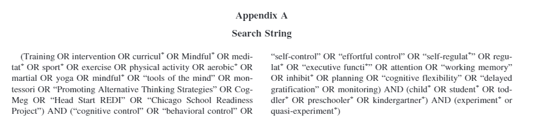{width="6.267716535433071in"
height="1.5in"}

## Cikkek szűrése

Még a legjobban megírt keresőkifejezés esetén is számos olyan forrást
fogunk találni, amelyek valójában nem felelnek meg a beválogatási
kritériumoknak. Így egy beválogatási folyamat során el kell dönteni,
hogy melyik forrást tartjuk meg, és melyiket szűrjük ki. A cikkek
beválogatását a regisztrációban meghatározott módon kell elvégezni,
olyan módon, hogy minél kevésbé érvényesülhessenek a kutatók szubjektív
torzításai. Ezért a PRISMA checklist előírja, hogy minden forrás
beválogatásáról legalább két egymástól független kutató döntsön. A
beválogatási és kizárási kritériumokat minél pontosabban kell
megfogalmazni. Például meg kell határozni a publikáció típusát (pl.
folyóiratcikk, könyvfejezet), a kutatás felépítését (pl. RCT,
keresztmetszeti), a minta tulajdonságait (pl. csak felnőtt, csak
szorongó), az alkalmazott kezelést vagy manipulációt és a kontroll
helyzetet (pl. CBT vs. várólistás kontroll), a kimeneti változót /
konstruktumot (pl. depresszió pontszám), és a kutatás időtávját (pl. 2-6
hónapos utánkövetés). Ezek mellett további beválogatási kritériumok is
meghatározhatóak (pl. nyelv, időszak, stb.). A cikkek szűrését nagyban
megkönnyíti és felgyorsítja a kizárási kritériumok meghatározása, ezért
ezeket is érdemes konkrétan megfogalmazni. Újabban a gépi tanuló
algoritmusok elterjedése azt is lehetővé teszi, hogy ezt a folyamatot
részben vagy egészben automatizáljuk.

A kiválasztási folyamatot pontosan dokumentálni kell, és a publikációban
a PRISMA folyamatdiagramon számszerűen meg kell határozni, hogy a szűrés
melyik szakaszban hány kutatás esett ki a szűrőn.

**4. Ábra. PRISMA folyamatábra sablon**

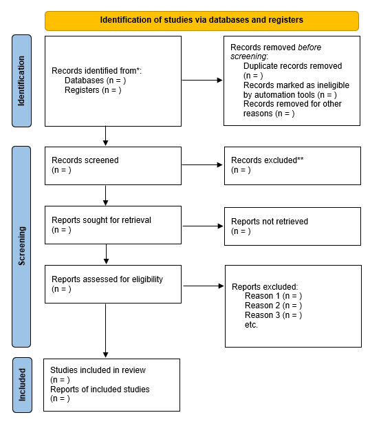{width="4.619750656167979in"
height="5.161776027996501in"}

Forrás:
[[http://www.prisma-statement.org/PRISMAStatement/FlowDiagram]{.ul}](http://www.prisma-statement.org/PRISMAStatement/FlowDiagram)

## Adatok kinyerése

A beválogatott cikkekből ki kell nyerni a szükséges adatokat és
információkat. Ez a meta-analízis készítés legnehezebb és
leghosszadalmasabb része, mivel általában a legtöbb információt csak a
forrás alapos átolvasása során lehet megtalálni. Továbbá gyakran nem is
fellelhető meg minden szükséges adat. Ilyenkor fel lehet keresni a
szerzőket, akik jobb esetben odaadják a kért információkat. Ha nem
találunk meg egy kulcsfontosságú adatot a forrásban, akkor az adott
kutatást ki zárnunk az elemzésből. Az adatkinyerést nehezíti, hogy azt a
PRISMA checklist szerint --- a szűréshez hasonlóan --- több egymástól
független kutatónak kell végeznie.

A kinyerhető adatok köre igen széles lehet. A meta-analízis elvégzéséhez
szükséges hatásméreteken túl a többi között ki lehet gyűjteni a mintára
vonatkozó adatokat (pl. férfiak aránya a mintában, átlagéletkor),
változókra vonatkozó adatokat (használt skála), a kutatás felépítésével
kapcsolatos adatokat, cikkre vonatkozó meta-adatokat (pl. kiadási év,
forrás típusa). Ezek mellett lehetséges az is, hogy a forrás bizonyos
jellemzőit független kutatók kódolják valamilyen szempontrendszer
szerint. Például egy feladat leírása alapján a kódolóknak kell
eldönteni, hogy a kutatásban alkalmazott feladatban volt-e versengés.

Fontos megjegyezni, hogy a kinyert és kódolt adatok általában a teljes
cikkre vonatkoznak. ha ezektől eltérünk --- pl. a jól elhatárolható
almintákat vesszük alapegységnek --- azt a kódolási tervben kell
meghatározni.

Objektív adatok kinyerése során a cikkben lévő számszerű értékeket kell
megtalálnunk és rögzítenünk. Ilyen lehet a kutatásban résztvevők száma,
neme, valamint a hatásméretek. Gyakran leleményesnek kell lennünk, mert
a cikkek nem közlik a számunkra lényeges számadatokat. Vagy ezeket a
számokat nem abban a formában találjuk meg, ahogy szükségünk lenne
rájuk, így ezeket nekünk kell kiszámolnunk más információk alapján.
Például ha a forrás nem közli a számunkra fontos hatásméretet, akkor
nekünk kell összesítő statisztikák alapján kiszámolnunk azt.
Előfordulhat az is, hogy nem a pontos számot találjuk meg, hanem egy
ábra alapján kell becslést tennünk az értékekre.

Lehetséges az is, hogy a cikkben lévő információt valamilyen kritérium
szerint kutatók kódolják. Például megítélik, hogy a cikkben szereplő
stresszor tartalmaz-e interperszonális elemet, kihívást, fizikai
fájdalmat, stb. [(Denson et al.,
2009)](https://paperpile.com/c/47ntK5/c8gL). A kódolás lehetséges
másodlagos forrásból származó információk alapján is, pl. videojátékok
életkori besorolása egy konkrét minősítő szervezet véleménye alapján. Ha
kutatók kódolnak adatokat, azokat fontos legalább két független
kódolóval elvégeztetni, és utána ellenőrizni a kódolók közötti
megbízhatóságot (inter-rater reliability). A kódolók közötti
reliabilitás megállapítására több módszer is létezik. Ezek közül a
Krippendorff alfa mutató a legflexibilisebb, mert használható
mindenfajta mérési szintű változóra, és bármennyi független kódolóra
[(Krippendorff, 2011)](https://paperpile.com/c/47ntK5/F4Py). Emellett az
értelmezése hasonló a pszichológusok által jól ismert Cronbach alfa
mutatóra. Ehhez hasonlóan 0 és 1 között vehet fel értéket, a jó egyezést
a 0.8, megfelelő egyezést a 0.67 feletti érték jelenti, míg az
alacsonyabb Krippendorff alfa rossz egyezést jelent. Az utóbbi esetben
meg kell határoznunk a döntési szabályt a kódolási protokollban. Például
lehetséges --- ám időigényes --- stratégia az adatok újrakódolása, a
vitás kódolás csoportos újrakódolása konszenzus alapján, vagy dönthet
egyszemélyben egy kijelölt kutató is.

### Kódolási struktúra

A kódolási struktúra annak a meghatározása, hogy a kódolók milyen adatok
gyűjtsenek ki, és azokat milyen módon rögzítsék. Az kódolási struktúrát
azelőtt kell meghatározni, mielőtt elkezdődnek az adatok kigyűjtése és
kódolása. A legjobb, ha a kódolási struktúrát egy üres táblázat
tartalmazza, amelyben azonban már látszanak a változónevek, instrukciók
a változók gyűjtésével kapcsolatban, valamint példák a lehetséges
értékekre. A kódolást meg kell tanítani a közreműködő kutatóknak, ehhez
érdemes egy kódolási instrukciót készíteni.

### Hatásméret (effect size)

A meta-analízisben a fő kimeneti változó a hatásméret. A hatásméret
annak a számszerűsített mutatója, mennyire erős egy összefüggés, vagy
mekkora a különbség két csoport illetve mérés között. A hatásméret
független az elemszámtól, ezért érdemes a becslés bizonytalanságával
(pl. konfidencia intervallum) együtt közölni. A hatásméret létezhet
nyers formában, pl. két csoport átlagának különbségeként. Ekkor a
mértékegysége megegyezik az eredeti mérés mértékegységével. Azonban így
nem összehasonlíthatóak és összevonhatóak a hatásméretek más kutatásból
származó hatásméretekkel. A meta-analízisekben a hatásméretek mindig
standardizált formában jelennek meg. Ezek jellemzője, hogy mértékegysége
független az eredeti mérés mértékegységétől, így az értéknek abszolút
jelentése van. Az eredeti források gyakran nem közlik a hatásméretet
olyan formában, amilyenre egy konkrét meta-analízisben szükség van.
Ezért az adat-kinyerési fázis során egyéb adatok alapján kell kiszámolni
a hatásméretet.

Három fő hatásméret mutató "család" van. Az egyiket a csoportok közötti
különbségekre a másikat a személyen belüli változásokra, a harmadikat a
változók közötti összefüggésekre használjuk. Az egyes hatásméretek
többféleképpen is kiszámíthatóak a nyers vagy összesített adatokból
[(Harrer et al., 2021)](https://paperpile.com/c/47ntK5/cXeG)[^2]. A
legtöbb hatásméret átalakítható egymásba, pl. a különbség hatásméret
összefüggés hatásméretté.

#### Öszefüggés hatásméretek

##### Folytonos kimeneti változók hatásméretei

A legismertebb összefüggés hatásméret a Pearson-féle r, avagy
korrelációs koefficiens. Párosított kvantitatív adatok összefüggésének
erősségét mutatja. Értéke -1 és 1 között van, előbbi jelzi a tökéletes
fordított arányosságot, utóbbi a tökéletes egyenes arányosságot. A 0
jelenti az összefüggés hiányát. Ehhez hasonló mutató a Spearman rho (ρ),
ami a nyers értékek helyett az értékek sorrendjének (rangjának)
korrelációja.

A korrelációs együtthatóhoz hasonló hatásméret mutató a lineáris
regresszió során kapott standardizált béta együttható. Ennek értelmezése
hasonló a korrelációs együtthatóhoz, azonban ha a regressziós modell más
prediktorokat is tartamaz, akkor az értéke eltérhet attól. Emiatt a
standardizált béták csak akkor összehasonlíthatóak, ha ugyanazok a
prediktorok találhatóak az összes többi modellben is.

Az η^2^(eta-négyzet): Azt jelzi az eta-négyzet, hogy a függő változó
varianciájából mennyit magyaráz meg egy prediktor, miközben a többi
független változóra kontrollálunk. Ez mindig túl fogja becsülni a
hatásméretet, mivel a minta varianciáját magyarázza, nem a populációét,
bár ahogy nő a minta, csökkenni fog ez a torzítás. Ennek egy változata a
részleges eta-négyzet (η^2^~p~), ami a hatás arányát mutatja, plusz a
hiba varianciát, ami a hatásnak tulajdonítható.

Az ⍵^2^ (omega-négyzet): Egy kevésbé torzító változata az
eta-négyzetnek. Az általános formáját alapvetően kevés elrendezésben
lehet felhasználni, de publikálták többfajta kiegészítését, variációját
is, ami felhasználható a dizájnok széles skáláján.

A Cohen-féle f^2^ szintén az F-teszthez, ANOVA-hoz, és többszörös
regresszióhoz használatos.

##### Diszkrét kimeneti változók hatásméretei

Az esélyhányados (Odds ratio, OR) annak az esélye, hogy a kimeneti
esemény megtörténik egy prediktor esemény bekövetkezése esetén, a
prediktor esemény hiányához képest. Azt mutatja, hogy hányszorosa
változik az esélye az eseménynek ha a prediktor jelen van. Folytonos
prediktor esetén pedig azt mutatja, hogy a prediktor értékének 1-gyel
való növekedése hányszorosára növeli a kimeneti esemény bekövetkezését.

A relatív kockázat (Relative Risk vagy Risk ratio) az esélyhányadoshoz
hasonlóan a kapcsolat erősségét mutatja a prediktor és a kimeneti
változó között. Annak a kockázatát mutatja, hogy egy esemény mennyivel
valószínűbb az egyik csoportban egy másik csoporthoz képest.

Míg az esélyhányados az esélyek hányadosa, a relatív kockázat a
valószínűségek hányadosa. Ezek a hatásméret mutatók hasonlóan
értelmezendőek: értéktartományuk 0 és végtelen között van, ahol az 1-es
érték jelenti az összefüggés hiányát (a prediktor nem befolyásolja a
bekövetkezés valószínűségét). Ha hányados nagyobb egynél, akkor a
prediktor a hányados arányában növeli a kimeneti esemény bekövetkezési
esélyét. Ha a hányados kisebb mint 1, akkor a prediktor csökkenti a
kimeneti esemény bekövetkezésének esélyét a hányados arányában.

#### Csoportok közötti különbség hatásméretek

A legismertebb különbség hatásméret a Cohen d (más néven standardizált
átlagkülönbség, SMD). Azt mutatja meg, hogy hány szórással nagyobb az
egyik (pl. kezelt) csoport átlaga a másik (pl. kontroll) csoporthoz
képest? Például a férfi-nő magasságkülönbség Cohen d-ben kifejezve d =
1.4.

Az előző hatásméret-mutató kis mintákra és egyenlőtlen varianciákra
korrigált változata a Hedge's g. Hasonlóképpen, a Glass-féle delta (Δ)
csak az egyik csoport szórását használja az arányosításnál.

#### Változás hatásméretek (személyen belüli hatásméretek)

A változás hatásméretek két mérés kölönbségén alapulnak (pl. kezelés
előtti és utáni mérések különbsége). Ez nem egyenlő az átlagok
különbségével, hanem az egyénen belüli különbségek átlaga. Ha a
forrásban csak a mérésenkénti átlagok és szórások állnak a
rendelkezésre, akkor a változás hatásméret kiszámításához azt is
szükséges tudni, hogy mennyire korrelálnak egymással az egyes mérések.
Ezen információk a hiányában csak becslést tudunk alkalmazni a
hatásméretre. Például feltételezhetjük, hogy az összefüggés a két mérés
között r = .5.

#### Arány mint hatásméret

Az említett standardizált hatásméret mutatók mellett előfordulhat, hogy
egy jelenség populációban való előfordulását (prevalenciáját) akarjuk
megbecsülni egy meta-analízis segítségével. Az arány vagy százalék
tulajdonképpen megfelel a hatásméret kritériumának, hiszen egy
standardizált mutató, aminek értelmezése független a kontextustól. A
százalékokat azonban nem lehet szimplán összeátlagolni, mert úgy az
alacsony vagy magas prevalencia esetén a konfidencia intervallumok
könnyen átléphetik az elméleti minimumot (0%) vagy maximumot, valamint
ebben az esetben nem vesszük figyelembe a mintaméreteket. Ezért logit
transzformációt kell alkalmazni a hatásméretek összesítésénél. Ehhez
számítható standard hiba vagy konfidencia intervallum is, ami soha nem
lépi át a 0 vagy 1 értéket [(Harrer et al.,
2021)](https://paperpile.com/c/47ntK5/cXeG).

**2. Táblázat. Legfontosabb hatásméretek nagyságrendjének értelmezése**

  ----------------------------------------------------------------------------
  **Nagyságrend**   **d, g,    **f^2^**   **r, ρ,    **η^2^,      **OR, RR\***
                    Δ**                   β**        ⍵^2^**       
  ----------------- ---------- ---------- ---------- ------------ ------------
  Kicsi             \< 0.2     \< .15     \< .1      \< .01       \< 1.5 /
                                                                  \>.7

  Közepes           \~ 0.5     \~ .4      \~ .25     \~ .06       \~ 2.5 /
                                                                  \~.4

  Nagy              \> 0.8     \> .6      \> .4      \> .14       \> 4.3 / \<
                                                                  .23
  ----------------------------------------------------------------------------

**Megjegyzés.** A nagy hatásméret olyan, amit akár "szabad szemmel" is
láthatunk. Pl. ha szétnézünk egy konferencia teremben, szabad szemmel is
látható, hogy a férfiak átlagosan magasabbak a nőknél. \*: Az OR/RR
értelmezésénél az első szám a pozitív összefüggésre, a második a negatív
összefüggésre vonatkozik.

Forrás: [(Ben-Shachar et al.,
2020)](https://paperpile.com/c/47ntK5/vTUR)

## Hatásméretek összesítése

A meta-analízis során az egyes forrásokból származó hatásméretekből
szeretnénk megbecsülni az összesített hatásméretet (pooled effect size).
Az összesítés nem egyszerűen a hatásméretek átlagolásával történik,
hanem egy statisztikai modell segítségével, ami a valódi hatásméret
megtalálására irányul. A metaanalízis végső célja, hogy megbecsülje azt
a hatásméretet, amely a tanulmányok összességét jellemzi, még akkor is,
ha a megfigyelt hatásméretek tanulmányonként eltérőek. A felhasznált
modellnek meg kell magyaráznia, hogy miért és mekkora mértékben
különböznek a megfigyelt hatásméretek, annak ellenére, hogy csak
egyetlen átfogó hatás van.

Kétfajta modell létezik, amely erre a kérdésre próbál választ adni: a
fix-hatás (fixed effect) és a véletlen-hatás (random effect). Bár a két
modell különböző előfeltevéseken alapul, mégis szoros kapcsolat van
közöttük [(Borenstein et al.,
2013)](https://paperpile.com/c/47ntK5/uh9F).

### Fix-hatás modell 

A fix-hatás modell azt feltételezi, hogy minden hatásméret egyetlen,
homogén populációból származik. Eszerint minden tanulmánynak ugyanaz a
valódi hatásmérete, és az ettől való eltérések oka kizárólag a
mintavételezési hibából eredeztethető. Mivel a nagy számok törvénye
alapján tudjuk, hogy a nagyobb elemszám nagyobb precizitással --- azaz a
valós hatásmérettől való kisebb eltéréssel --- jár, ezért a nagyobb
kutatásokat nagyobb súllyal kell figyelembe venniük a hatásméretek
összesítésekor. Ezért a fix-hatás modell az összesített hatásméretek
kiszámításakor a hatásméretek súlyozott átlagát használja [(Borenstein
et al., 2013)](https://paperpile.com/c/47ntK5/uh9F). A fix-hatás modell
nem alkalmas egy egész területre vonatkoztatható következtetések
levonására. Jellemzően akkor indokolt a használata, ha egy laboron belül
több, azonos módszertannal készült tanulmány összesített hatásméretét
szeretnénk kiszámítani. Ezt szokták meta-analitikus összesítésnek
(meta-analytic summary) nevezni.

### Véletlen-hatás modell

A véletlen-hatás modell feltételezése szerint a hatásméretek nem csak a
mintavételezési hiba miatt térnek el a valós hatásmérettől, hanem amiatt
is, mert az egyes tanulmányok között módszertani különbségek vannak.
Például a kimeneti változót különböző módon mérik, vagy a kezelés
típusa, intenzitása, vagy hossza nem azonos. Ebből adódóan a tanulmányok
közötti heterogenitásra számíthatunk. Ezért a véletlen-hatás modell nem
csupán egyetlen ("valódi") összesített hatásméretet próbál megbecsülni,
hanem a valódi hatások eloszlásának átlagát. A véletlen-hatás modellben
a hatásméretek súlyozása nemcsak a mintamérettől, hanem a kutatások
közötti varianciától is függ. Ezt a varianciát (τ^2^; tau-négyzet)
először meg kell becsülnünk. Ennek a becslésnek az elvégzésére több
módszer is létezik (pl. restricted maximum likelihood, REML;
DerSimonian-Laird, stb.), amelyeknek a részleteit lásd Veroniki és mtsai
[(2016)](https://paperpile.com/c/47ntK5/6Fs6/?noauthor=1). A
véletlen-hatás modell nagyobb általánosíthatóságot enged meg, ami miatt
az egész területre vonatkoztathatóak a következtetései.

### Az összefüggő hatásméretek problematikája

Előfordulhat, hogy egy forrásból több hatásméretet is ki szeretnénk
nyerni. Ez például akkor fordulhat elő, ha több időpontból is vannak a
kutatásban hatásméretek, vagy ha ugyanazt a kimeneti változót többféle
módszerrel is mérte a kutatás. Az azonos forrásból származó mérések
általában közelebb állnak egymáshoz, hiszen ugyanazt a módszert és
mintát használták az adatgyűjtéshez. Ez azzal jár, hogy ezek között a
hatásméretek között kisebb lesz a különbség (azaz alacsonyabb a
variancia). Ha az azonos forrásból származó hatásméreteket külön
kutatásként tennénk be a meta-analízisbe, az az adott forrástból
származó hatásméret felülreprezentáltságát okozhatja, ami torzíthatja a
az összesített hatásméretet. Ezért a közös forrásból származó, és
ugyanarra a kimeneti változóra vonatkozó hatásméreteket vagy összevonjuk
(pl. átlagoljuk), vagy kiválasztunk egyet (szisztematikusan valamilyen
elv, pl. legjobb reliabilitású mérőeszköz alapján, vagy
véletlenszerűen). A másik megoldás, hogy többszintű meta-analízist
alkalmazunk, ami lehetővé teszi, az azonos forrásból származó
hatásméretek összetartozásának figyelembe vételét a statisztikai
modellben. Ez a megközelítés hasonlóan működik a pszichológiában gyakran
használt kevert hatású modellekhez (mixed-effect models) [(Harrer et
al., 2021)](https://paperpile.com/c/47ntK5/cXeG).

### A meta-analízis eredményeinek ábrázolása

A meta-analízis eredményeit a leggyakrabban ún. forest plot segítségével
ábrázolják (ld. lent). Ez az ábrázolás tartalmazza a források neveit és
a hozzá kapcsolódó hatásméretet és konfidencia intervallumot, valamint a
mintaméretet vagy a kutatás súlyát az összesített hatásméretben. Az
egyes források alatt az összesített hatásmérethez kapcsolódó becslések
találhatóak. Az ábra jellemzően tartalmaz egy függőleges referencia
vonalat is, amely az x-tengelyen azt a pontot jelöli, amely a hatás
hiányának felel meg (arány hatásméreteknél az 1, egyébként a 0).
Amennyiben az összesített hatásméret konfidencia intervalluma nem fed át
a referencia értékkel, akkor azt mondhatjuk, hogy a vizsgált hatás
valószínűleg létezik.

A hatásméreteket és a konfidenciaintervallumokat általában lineáris
skálán jelenítik meg. Ha azonban az összefoglaló mérőszám egy arányszám
(például esélyhányados vagy kockázati hányados), akkor az x-tengelyen
általában logaritmikus skálát használnak. Ez azt jelenti, hogy az 1
körüli értékek szorosabban helyezkednek el egymás mellett, mint az 1-nél
jóval alacsonyabb vagy magasabb értékek.

**5. Ábra Forest plot**

Forrás: [(Harrer et al.,
2021)](https://paperpile.com/c/47ntK5/cXeG)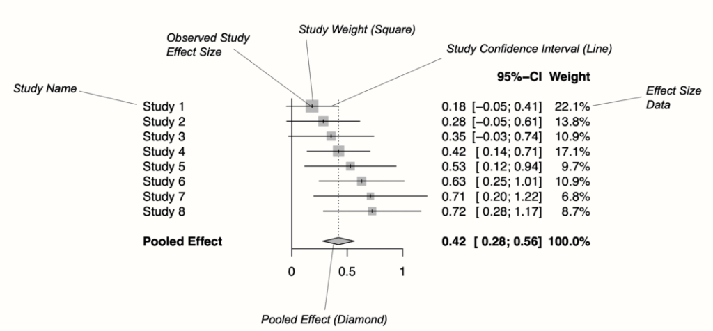{width="6.267716535433071in"
height="2.9166666666666665in"}

## Hatásméretek heterogenitása

Az előzőekből következően az egyes kutatások által mért hatások
variábilisek. Így a véletlen-hatás metaanalízis elvégzéséhez nem csak a
hatásméretekre van szükség, hanem azok bizonytalanságának mutatójára is
(hatásméretek standard hibája). Ez kiszámítható magából a hatásméretből
és az elemszámból (változás hatásméretnél a mérések közötti korreláció
is szükséges).

A meta-analízisbe kerülő hatásméretek variabilitásnak két forrása van.
Az egyik a korábban említett mintavételezési hiba, a másik a kutatások
közötti heterogenitás (between-study heterogenity). Amikor a tanulmányok
közötti heterogenitást akarjuk számszerűsíteni, a nehézséget az jelenti,
hogy meghatározzuk, hogy az eltérés mekkora része vezethető vissza a
mintavételi hibára, és mekkora része a valódi hatásméretbeli
különbségekre. Amennyiben van jelentős heterogenitás a kutatások között,
használhatunk moderátor elemzést vagy alcsoport elemzést (ld. később).

### A heterogenitás mérése

A tanulmányok mintavételi hibáját a tanulmányok közötti tényleges
heterogenitástól hagyományosan a Q statisztika segítségével
különböztetik meg. A Q statisztika értékét arra lehet használni, hogy
ellenőrizzük, van-e többlet variabilitás az adatainkban, vagyis
nagyobb-e variabilitás, mint ami csak a mintavételi hiba miatt várható.
Ha ez a helyzet, akkor feltételezhetjük, hogy a fennmaradó eltérés a
vizsgálatok közötti heterogenitásból adódik. Bár a Q-statisztikát
gyakran használják a metaanalízisekben, ez egy torz mérőszám lehet. A
Q-statisztika értéke és szignifikanciája ugyanis nagymértékben függ a
metaanalízis méretétől, és így annak statisztikai erejétől [(Harrer et
al., 2021)](https://paperpile.com/c/47ntK5/cXeG). Ezért nem elég
kizárólag a Q statisztika szignifikanciáját vizsgálni a heterogenitás
megállapításához.

A Q statisztika hiányosságainak a kiküszöbölésére jöttek létre további
mutatók, amelyek számszerűsítik a kutatások közötti heterogenitást. Ezek
a mutatók is Q statisztikán alapulnak, azonban korrigálnak a
hatásméretek számára. I^2^ azt mutatja meg, hogy a hatásméretek
variabilitásának hány százaléka marad megmagyarázatlanul a
mintavételezési hiba által. Pl. ha az I^2^ = 90%, azt jelenti, hogy a
hatásméretben lévő variabilitás 90%-a a kutatások populációjának
varianciájából ered, nem a mintavételezési hibából. Ennek a mutatónak az
előnye, hogy az értéke nem növekszik a tanulmányok számának növelésével,
és könnyű megérteni a jelentését (I^2^ = 25%: alacsony, 50% közepes, 75%
jelentős heterogenitás).

A H^2^ szintén a Q statisztikán alapul, és hasonlít az I^2^-höz. Ha
nincs kutatások közötti heterogenitás, akkor az értéke 1 vagy kisebb. Az
1-nél nagyobb érték heterogenitást jelez.

A hatásméretek varianciája (tau-négyzet, τ^2^) és szórása (tau, τ)
szintén lényeges, ezekből ki lehet számítani a hatásméret körüli
konfidencia intervallumokat.

### A heterogenitás forrásai

A kutatások közötti heterogenitás számos forrásból származhat. Egyrészt
lehet elrendezés alapú: ha "almákat akarunk körtékkel" összehasonlítani.
Azaz nem kellően összehasonlíthatóak egymással a kutatások. Ez hibát
jelent, amit ki kell javítanunk. Pl. csak összehasonlítható kutatásokat
és kimeneti változókat használunk. A heterogenitás lehet statisztikai
alapú, amikor a hatást bizonyos kutatások közötti különbségek moderálják
pl. minta életkora, nemi eloszlása, használt kezelés típusa. Ezen felül
lehetnek outlinerek kiugró hatásméretek, amelyek jelentősen eltérnek a
többi hatásmérettől (ld. később).

## Moderátor elemzések

Habár a hatásméretek heterogenitásának mérésére többféle módszer
létezik, ezek a megközelítések nem mondják meg, hogy miért találunk
túlzott változékonyságot az adatokban. Különböző módszerek lehetővé
teszik számunkra, hogy hipotéziseket teszteljünk arra vonatkozóan, hogy
egyes tanulmányok miért rendelkeznek nagyobb vagy kisebb valódi
hatásmérettel, mint mások. Így olyan kérdéseket is megválaszolhatunk,
amelyek az egyes tanulmányokban külön-külön nem voltak tesztelhetőek.
Például, hogy van-e szerepe a terápia hatékonyságára annak, hogy
pontosan milyen kezelést kaptak a résztvevők, van-e szerepe annak, hogy
csoportban vagy egyénileg kaptak kezelést, van-e szerepe a résztvevők
életkorának, a kezelés hosszának, stb. Ezeket az elemzéseket a
meta-analízisben moderátor-elemzésnek hívják, mert a hatásméret eleve
már egy változók közötti hatást ír le. Moderátor elemzést csak akkor
érdemes vagy lehet végezni, ha számottevő heterogenitás van a
hatásméretekben, illetve kellően sok kutatás áll rendelkezésre. A
moderátorok hatását tesztelhetjük meta-regresszióval vagy alcsoport
elemzéssel. Az előbbit elsősorban folytonos, míg az utóbbit diszkrét
mérési szintű moderátorokkal lehet elvégezni. Mint az alábbiakban
látható, valójában a meta-regresszió alkalmazható alcsoportok átlagos
hatásméretének összehasonlítására is, ezért ez egy általánosabban
használható módszer.

### Meta-regresszió

A meta-regresszió során a kimeneti változó a hatásméret, a prediktor
pedig az a változó, aminek a hatását szeretnénk vizsgálni.
meta-regresszió során tesztelhetőek olyan hipotézisek, amelyek az
eredeti tanulmányokban nem voltak tesztelhetőek. Például több
keresztmetszeti kutatás eredményeit összesítve, és a minták átlagos
életkorát prediktorként használva megállapítható, hogy az eredményeket
moderálta-e az életkor.

A meta-regresszió nevéhez híven egy regresszió, ami legtöbb
tulajdonságát tekintve egy (generalizált) lineáris regresszióhoz
hasonlít. Azonban a hétköznapi OLS regressziótól eltérően az egyes
tanulmányok az elemszámuknak megfelelő súllyal kerülnek a modellbe.
Számítható a modellhez R^2^ érték, ami megmutatja, hogy a
heterogenitásnak hány százalékát sikerült megmagyarázni. Továbbá hasonló
korlátai és feltételei vannak, mint a sima regressziónak. Csakúgy, mint
a lineáris regressziónál, itt is van lehetőség kontrollváltozók (pl.
confounderek) használatára, vagy interakciók tesztelésére.

Nemcsak folytonos prediktorokat használhatunk a meta-regresszió során,
hanem vizsgálhatjuk diszkrét moderátorok hatását is. A lineáris
regresszióhoz hasonlóan ilyenkor a prediktor változó dummy kódolásával
egy többszintű változóból több kétszintű változó jön létre. Ezt sok
statisztikai program automatikusan elvégzi helyettünk. Ilyenkor az
eredeti változó egyes szintjei külön kétszintű prediktorokként jelennek
meg a modellben. Amennyiben egy regresszióba kétszintű prediktort
teszünk, a tengelymetszethez (intercept) tartozó becslés a baseline
csoport átlagával fog megegyezni, a dőléshez (slope) tartozó becslés
pedig a két csoport közötti átlagkülönbséggel. Ennek a nullától való
eltérését tesztelve megtudhatjuk, hogy statisztikailag szignifikáns-e az
eltérés [(Lindeløv, 2019)](https://paperpile.com/c/47ntK5/NE7Y).

**6. Ábra Két csoport különbségének ábrázolása regresszióként**

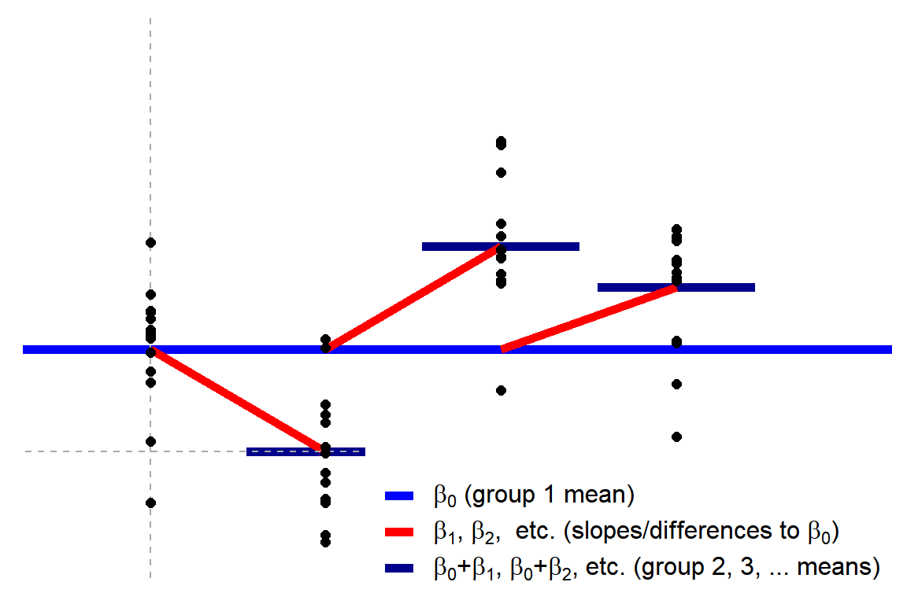{width="5.097904636920385in"
height="2.620297462817148in"}

Forrás: [(Lindeløv, 2019)](https://paperpile.com/c/47ntK5/NE7Y)

Az eredetileg többszintű diszkrét változók esetében ugyanez a logika
érvényesül. Ilyenkor az egyik szint --- jellemzően a sorrendben első ---
lesz az alapszint, és egyben az intercepthez tartozó becslés. A változó
további diszkrét szintjeihez tartozó slope-ok az egyes csoportok
alapszinttől való eltéréseit mutatják. Ezek nullától való eltérése
külön-külön tesztelhető.

**7. Ábra Több csoport különbségének ábrázolása regresszióként**

{width="4.0791240157480315in"
height="2.7194061679790025in"}

Forrás: [(Lindeløv, 2019)](https://paperpile.com/c/47ntK5/NE7Y)

A meta-regresszióhoz szükséges minimális elemszám a lineáris
regresszióhoz hasonlóan attól függ, hogy hány moderátort vizsgálunk
egyszerre. Fontos adalék, hogy ha diszkrét moderátor változót
használunk, akkor a változó minden szintje egy külön prediktornak
minősül, ami kevés kutatás esetén lehetetlenné teheti a meta-regresszió
elvégzését. Például ahhoz, hogy egy négyszintű diszkrét változó moderáló
hatását vizsgáljuk, minimum 5 kutatásra van szükség.

### Alcsoport elemzés (subgroup analysis)

Alcsoport elemzés segítségével csoportok hatásmérete közötti
különbségeket hasonlíthatunk össze, azaz kategorikus változók mentén
hasonlítjuk össze az összesített hatásméreteket. Az alcsoportokon belüli
tanulmányokat a legtöbb esetben véletlen-hatású modellel vonjuk össze.
Ezt követően egy Q tesztet alkalmazunk az alcsoportok összesített
eredményei alapján annak megállapítására, hogy a csoportok
szignifikánsan különböznek-e egymástól. Az alcsoport elemzés eredménye
praktikusan megegyezik az eredménye a meta-regresszió eredményével, ha
ott kategorikus prediktort használunk.

## Robusztusság ellenőrzése

A meta-analízis során fontos, hogy ellenőrizzük, hogy az eredményeink
megbízhatóak-e, azaz nem valamilyen torzító tényezőnek köszönhetőek. Ez
különösen fontos amiatt, mert egy meta-analízisben az elemszám
(kutatások száma) jelentősen kisebb, mint egy elsődleges kutatásban.
Továbbá előfordulhat, hogy egy gyengébb kutatás nagyobb résztvevőszáma
miatt nagyobb súllyal kerül be a modellbe, így a végső eredmény
torzított lesz. Ezért a szisztematikus torzításokat meg kell próbálnunk
kiszűrni, ellensúlyozni, vagy jobb híján beszámolni róluk.

### Kiugró hatásméretek (outlierek)

Az outlierek egy meta-analízisben olyan hatásméretek, amelyek a
többiektől távol esnek. Azonosításuk egyszerűbb, mint az elsődleges
kutatásokban, mert abból indulunk ki, hogy a meta-analízis összesített
hatásmérete maga a populáció hatásméret, így ha az összesített
hatásméret konfidencia intervallumával nem fed át egy kutatás
hatásméretének konfidencia intervalluma, azt outliernek tekinthetjük. Az
outliereket általában biztonságosabb kizárni a meta-analízisből, mert a
kiugró hatásméret valószínűsíthetően olyan kutatásból származik, ami az
összes többitől jelentősen eltér. Az outlier keresés rekurzív folyamat,
azaz ha kizárunk egy outliert, akkor újraszámolva az összesített
hatásméretet, új outliert találhatunk [(Viechtbauer & Cheung,
2010)](https://paperpile.com/c/47ntK5/cQq8).

### Szenzitivitás elemzés

A szenzitivitás elemzések az eredmények robusztusságát hivatottak
bizonyítani. Azaz azt, hogy a kapott összefüggések nem valamilyen
torzítás eredményeként születtek-e. A gyakorlatban a szenzitivitás
elemzésnek számít minden olyan elemzés, ami megmutatja, hogy az
eredmények más módszerek használatával is lényegében változatlanok
maradnak. A szenzitivitás elemzések gyakorlatilag olyan moderátor
elemzések, amelyben a prediktorok valamilyen meta-tulajdonságára
vonatkozó változók. Ilyen lehet a kutatások minősége/megbízhatósága, a
kutatás publikálásának évszáma, a kutatás származási országa, vagy a
labor, ahonnan az egyes kutatások származnak.

## Cikkek minőségének mérése

Minden meta-analízis csak annyira megbízható, amennyire az azt alkotó
cikkek.

Azok a cikkek, amelyek nem elég körültekintően készültek, torz eredményt
mutathatnak.

A torzító tényezőkre lehet következtetni a bevont források alapján.

Egyes kutatás fajtákra léteznek különböző ellenőrző listák, amelyek
alapján felmérhető a kutatás minősége [(ld. Ma et al.,
2020)](https://paperpile.com/c/47ntK5/rahq/?prefix=ld.). Az alábbiakban
a randomizált klinikai kutatások (RCT-k) minőségével kapcsolatos
megfontolásokat tárgyaljuk.

### Torzítás fajtái és forrásai az RCT-kben

A randomizált klinikai kutatások során a torzítás öt (+1) fő területen
jelenhet meg.

1.  Kiválasztási torzítás (selection bias): különbségek az
    > összehasonlított csoportok tulajdonságaiban. A torzítás a nem
    > véletlenszerű besorolásból vagy a besorolás tényének ismeretéből
    > származhat (blinding hiánya).

2.  Teljesítmény torzítás (performance bias): különbségek a kezelésben
    > (pl. intervencióban). A torzítás a besorolás tényének ismeretéből
    > származhat (blinding hiánya).

3.  Detekciós torzítás (detection bias): Szisztematikus különbségek a
    > csoportok között az eredmények meghatározásában. Akkor fordulhat
    > elő, ha a csoportok különböznek a kimeneti információk gyűjtésének
    > módjában vagy a kimenetek ellenőrzésének módjában.

4.  Lemorzsolódási torzítás (attrition bias): csoport különbségek a
    > lemorzsolódásban. A hiányos adatok mennyiségétől, természetétől,
    > és kezelésétől függ.

5.  Beszámolási torzítás (reporting bias): Abból ered, hogy a kutatás
    > megtervezésében, lebonyolításában, elemzésében vagy terjesztésében
    > részt vevő felek szelektíven hozzák nyilvánosságra vagy
    > visszatartják az információkat.

6.  Egyéb torzítások (other bias): olyan torzítások, amelyeket más
    > torzítások nem fednek le.

Ezeknek a torzító tényezőknek a lehetőségét a publikáció alapján
mérlegelni lehet. Ez alapján mindegyik torzításról meg kell ítélni, hogy
ezekre alacsony, némi, magas, vagy ismeretlen mértékű a torzítás
rizikója. A Cochrane Risk of Bias eszköz ezt segít felmérni [(Higgins et
al., 2011)](https://paperpile.com/c/47ntK5/OE7S). Ezután tanulmányonként
vagy összesítve is láthatjuk az egyes torzítások kockázatát.

**8. Ábra. A torzítási kockázatok ábrázolása forrásonként**

**9. Ábra. A torzítási kockázatok összesített ábrázolása az összes
tanulmányra**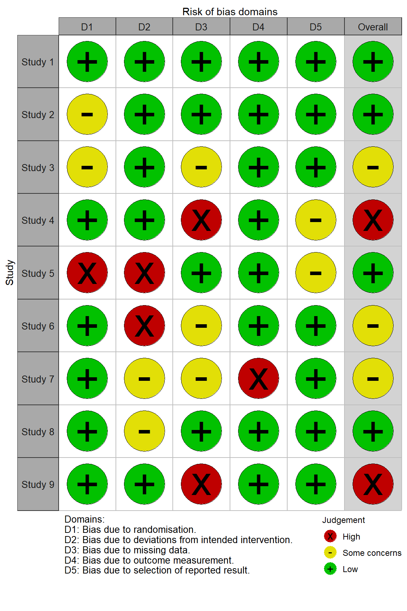{width="3.2031255468066493in"
height="4.798946850393701in"}

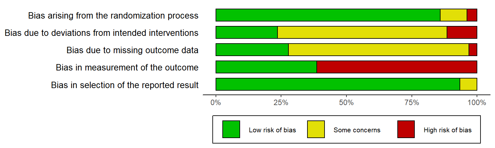{width="6.106737751531059in"
height="1.8368044619422572in"}

## Publikációs torzítások (publication bias)

A szisztematikus összefoglalók és meta-analízisek minőségét befolyásolja
az, hogy az adott területen van-e jelentős torzítás a az eredmények
közlésésében. A publikációs torzítás azért okozhat problémát a
meta-analízisekben, mert a populáció hatásméret becslésében
szisztematikus eltérést okozhat, például ha nem egyenlő arányban
hiányoznak kutatások a hipotéziseket alátámasztó és cáfoló eredmények
közül.

A közlési torzítások közé tartozik a publikációs torzítás (publication
bias), amibe a késleltetett publikálási torzítás (delayed publication
bias/time-lad bias/ pipeline bias) és az elhelyezkedésből fakadó
torzítások tartoznak (location bias).

A késleltetett publikálási torzítás azt jelenti, hogy a szignifikáns
eredményeket tartalmazó kutatásokat nem csak nagyobb számban
publikálják, hanem gyorsabban is átmennek a publikálási folyamaton
[(Stern & Simes, 1997)](https://paperpile.com/c/47ntK5/HW4k). A
hipotéziseket nem igazoló kutatásokat a kutatók gyakran nem közlik, ami
hozzájárul az ún. asztalfiók problémához, ami a szignifikáns eredmények
túlsúlyát okozza a publikált tanulmányokban.

Az elhelyezkedésből fakadó torzítások közé tartozik a nyelvi torzítás,
ami szerint a szignifikáns eredmények nagyobb valószínűséggel jelennek
meg angol nyelvű szaklapokban. Szintén ide tartozik az idézési torzítás,
ami szerint a szignifikáns eredményeket nagyobb valószínűséggel idézik
máshol.

A közlési torzítások közé sorolható a szelektív eredmény közlés
(selective outcome reporting), ami azt jelenti, hogy a szerzők több
statisztikai teszt eredményei közül csak a szignifikáns eredményeket
írják bele a cikkbe. Szintén ide sorolható még a szelektív analízis
közlés torzítása is, ami akkor lép fel, amikor az adatokat indoklás
nélkül transzformálják, összesítik. A többszörös publikációs torzítás
azt jelenti, hogy a \"sikeres\" tanulmányok eredményeit nagyobb
valószínűséggel közlik több folyóiratcikkben, ami megkönnyíti, hogy
legalább egyet találjunk közülük. A tanulmányok eredményeinek több
cikkben történő közlésének gyakorlatát \"szalámi szeletelésnek\" (salami
slicing) is nevezik.

Habár a publikációs torzítást egy adott terület sajátja, így nem tudjuk
teljesen kiküszöbölni, lehetőségünk van megbecsülni a mértékét
[(Renkewitz & Keiner, 10/2019)](https://paperpile.com/c/47ntK5/hHCR). A
meta-analízisek készítése során fontos, hogy a közési torzítást
megpróbáljuk megbecsülni, és ha szükséges, korrigáljuk a kapott
összesített hatásméretet a hiányzó kutatások becsült eredményeivel.

### Publikációs torzítás azonosítása

Számos publikációs torzítási módszer a kis tanulmányok hatásainak
elképzelésén alapul. Ezek a megközelítések azt feltételezik, hogy csak a
nagy hatásmérettel rendelkező kis tanulmányok kapnak szignifikáns
eredményeket, és ezért kerülnek publikálásra. A publikációs torzítás
mérésére számos módszer létezik, amelyek közül itt csak néhányra térünk
ki. Az egyéb módszerekhez lásd többek között Renkewitz és Keiner
[(10/2019)](https://paperpile.com/c/47ntK5/hHCR/?noauthor=1) valamint
Harrer és mtsai
[(2021)](https://paperpile.com/c/47ntK5/cXeG/?noauthor=1) tanulmányait.

Az egyik leggyakrabban használt eszköz a publikációs torzítás becslésére
és ábrázolására a tölcsér ábra (funnel plot) használata. Ez a kis
kutatások torzító hatását segít megbecsülni (small study bias). Mivel a
kis mintaméret statisztikailag a nagyobb mérési hibát jelent, ezért az
ilyen források gyakrabban jelentenek szélsőséges hatásméretet. Az ábrán
az x tengelyen az egyes tanulmányok hatásméretét (a standardizált
átlagos különbségként kifejezve), az y tengelyen pedig a standard hibát
(a nagytól a kicsiig) mutatja. Az értelmezés megkönnyítése érdekében a
grafikon tartalmazza azt az idealizált tölcsér formát is, amelyet a
hatásméretektől elvárunk, ha nincs torzítás. A tölcsér közepén lévő
függőleges vonal az átlagos hatásméretet mutatja. Small study bias
hiányában a hatásméreteknek nagyjából a grafikonon látható tölcsér által
lehatárolt alakot kell követniük, azaz a hatásméreteknek szimmetrikusan
és tölcsérszerűen kell szétterülnie. Ha van torzítás, akkor a
hatásméretek eloszlása aszimmetrikus.

**10. Ábra. Tölcsér ábra (funnel plot) torzítási hiba esetén**

Az aszimmetria és a statisztikai szignifikancia kapcsolatának
vizsgálatára jó módszer a kontúros tölcsér diagramok használata. Az
ilyen ábrák segíthetnek megkülönböztetni a publikációs torzítást az
aszimmetria más formáitól. A kontúros tölcsér diagramok szürke sávjai az
jelzik, hogy az egyes tanulmányok hatásméretei a szignifikancia melyik
szintjét érik el. Különösen a p\< 0,05 és p\< 0,01 sávok fontosak, mivel
az ebbe a területbe eső hatásméreteket hagyományosan szignifikánsnak
tekintik. Amennyiben a hatásméretek
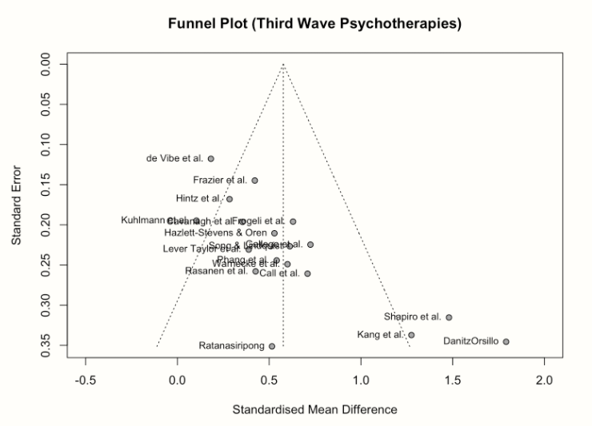{width="4.729166666666667in"
height="3.1121719160104986in"}

**11. Ábra. Kontúros tölcsér ábra (contour-enhanced funnel plot)
torzítási hiba
esetén**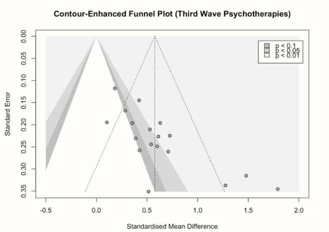{width="4.770833333333333in"
height="3.03125in"}

### Publikációs torzítás statisztikai vizsgálata és korrekciója

#### Egger teszt

A kis tanulmány torzítás egy számszerűsített mérése az Egger teszt, ami
gyakorlatilag egy lineáris regresszió, ahol a súlyozott hatásméretet
prediktáljuk a vizsgálat precizitásával (a hatásméret standard hibájának
reciprokával). Ebben a modellben azt vizsgáljuk, hogy a regresszió
tengelymetszete (intercept) jelentősen eltér-e a nullától, ahol a nulla
érték a nulla precizitásnak felel meg (azaz ha a tanulmány standard
hibája végtelenül nagy). Ha az eltérés szignifikáns, az kis tanulmány
torzításra utalhat. Ennek a magyarázata az, hogy ha a nagy hatásmérettel
rendelkező kis tanulmányok jelentősen felülreprezentáltak a
meta-analízisben, az sok alacsony pontosságú tanulmányt jelent. Ekkor a
prediktált érték nulla pontosság esetén nagyobb lesz, mint nulla, ami
jelentős interceptet eredményez.

Mivel az Egger teszt regresszión alapul, ezért kevés tanulmány esetén a
tesztnek túl alacsony lehet a statisztikai ereje az érvényes
következtetéshez. Egy általános hüvelykujj szabály szerint legalább 10
hatásméret esetén alkalmazható a módszer [(Harrer et al.,
2021)](https://paperpile.com/c/47ntK5/cXeG).

#### Trim-and-fill módszer

Habár a publikációs torzítás nem mérhető közvetlenül, a kis tanulmányok
hatását használhatjuk helyettesítő eszközként, amely a publikációs
torzításra utalhat. A tölcsér diagram aszimmetriájának kiigazítására
szolgáló egyik legelterjedtebb módszer a Duval és Tweedie féle
trim-and-fill módszer. A módszer lényege, hogy a \"hiányzó\" hatásokat
addig számítja be, amíg a tölcsér diagram szimmetrikus nem lesz. Az így
kapott \"kibővített\" adathalmaz összesített hatásmérete jelenti a
becslést a kis tanulmányok hatásainak korrekciója során. A korrekció a
tölcsér ábrán szélsőségeken elhelyezkedő hatásméretek levágásával és
azok tükrözésével létrehozott új hatásméretekkel való feltöltésével
történik. Így megbecsülhető az a valós hatásméret, ami kiigazítja a
publikációs torzításból eredő felnagyított hatásméretet. A mesterségesen
beillesztett hatásméreteket a tölcsér diagramon is ábrázolhatjuk.

#### PET-PEESE

Mint az előző technikák, a PET-PEESE is a kis tanulmány torzítás
becslésére irányul [(Stanley,
2017)](https://paperpile.com/c/47ntK5/tZ8U). Valójában két módszer
kombinációja: a precíziós hatásvizsgálat (PET) és a precíziós
hatásbecslés standard hibával (PEESE).

A PET egy olyan regressziós eljárás, ami lényegét tekintve nagyon
hasonló az Egger teszt működéséhez. A PEESE is egy regressziós eljárás,
két dologban különbözik a PET-től: (1) a regressziós modellben a fő
független változó a hatásméret varianciája (2) amíg a PET egy lineáris
modellt illeszt a hatásméret és a standard hiba kapcsolatára, a PEESE
egy négyzetes kapcsolatot feltételez. Ennek a modellezésnek az az oka,
hogy a kis mintájú (ezáltal alacsony statisztikai erővel és magas
standard hibával rendelkező) elemzések eredményei inkább akkor kerülnek
publikálásra, amikor nagy hatásméreteket kapnak, míg a nagyobb
mintaméretű (ezáltal magas statisztikai erővel és alacsony standard
hibával rendelkező) elemzések eredményei a megbízhatóságuk miatt kis
hatásnál is nagyobb valószínűséggel lesznek leközölve. A publikációs
torzítás tehát nő a standard hibával, és ennek a kapcsolatnak a
modellezésére a négyzetes függvény a legalkalmasabb.

A PET módszer pontosabb becslést ad, ha a valós hatás nulla, a PEESE
módszer pedig ha az különbözik a nullától. A két módszer ellenkező
torzítását kiküszöbölve a PET-PEESE módszer a PET-becslés statisztikai
szignifikanciáját veszi annak alapjául, hogy végül a PET vagy a PEESE
eredményét vegyék végső becslésnek. Ha a PET-becslés nem szignifikáns (a
becsült hatásméret nem megkülönböztethető a nullától), akkor a PET
eredményt veszik a végső becslésnek, máskülönben a PEESE-t [(Carter et
al., 2019)](https://paperpile.com/c/47ntK5/lArz).

## Meta-analízis szoftverek

Anélkül, hogy a használható eszközök teljes spektrumát megpróbálnánk
lefedni, az alábbiakban a jelenleg legszélesebb körben használt
eszközöket mutatjuk be, előnyben részesítve az ingyenes és nyílt
forráskódú programokat.

A protokoll írástól az eredmények elemzéséig teljeskörű támogatást nyújt
a RevMan program [(Cochrane Reviews,
2014)](https://paperpile.com/c/47ntK5/bpLG). Azonban a Cochrane
összefoglalók speciális formai és tartalmi követelményeire szabott
szoftver sok esetben nem felel meg minden kutatói igénynek, ezért számos
kutató több különböző programot használ a metaanalízis készítésének
különböző fázisaiban. A cikkek gyűjtését, rendszerezését és szűrését
táblázatkezelőben (Pl. Google Sheets, Microsoft Excel) vagy referencia
kezelő szoftverrel (pl. Zotero, Mendeley, Endnote, stb.) célszerű
végezni [(Lorenzetti & Ghali,
2013)](https://paperpile.com/c/47ntK5/XjcV). Az adatok összesítését,
hatásméretek kiszámítását és elemzését végezhetjük kifejezetten
metaanalízis elemző szoftverrel mint például a Comprehensive
Meta-analysis (CMA) program [(Borenstein et al.,
2013)](https://paperpile.com/c/47ntK5/uh9F), vagy általánosabb
statisztikai programcsomaggal, mint pl. JASP [(JASP Team,
2018)](https://paperpile.com/c/47ntK5/0o0W), jamovi [(jamovi project,
2018)](https://paperpile.com/c/47ntK5/j8iQ) vagy IBM SPSS [(Field &
Gillett, 2010)](https://paperpile.com/c/47ntK5/l1xq). A metaanalízis
végzéséhez az egyik legrugalmasabb keretet az R statisztikai
programnyelv biztosítja, amelyen keresztül számos, metaanalízis
végzésére szolgáló csomag elérhető. Ezek közül a metafor [(Viechtbauer,
2010)](https://paperpile.com/c/47ntK5/zR5F) a legelterjedtebb és
legjobban dokumentált [(Quintana,
2015)](https://paperpile.com/c/47ntK5/FEeD).

## Irodalomjegyzék

[Ben-Shachar, M., Lüdecke, D., & Makowski, D. (2020). *Automated
Interpretation of Indices of Effect
Size*.](http://paperpile.com/b/47ntK5/vTUR)
<https://easystats.github.io/effectsize/articles/interpret.html>

[Borenstein, M., Hedges, L., Higgins, J., & Rothstein, H. (2013).
*Comprehensive Meta-Analysis* (Version 3) \[Computer software\].
Biostat.](http://paperpile.com/b/47ntK5/uh9F)
<https://www.meta-analysis.com/>

[Carter, E. C., Schönbrodt, F. D., Gervais, W. M., & Hilgard, J. (2019).
Correcting for Bias in Psychology: A Comparison of Meta-Analytic
Methods. *Advances in Methods and Practices in Psychological Science*,
*2*(2), 115--144.
https://doi.org/](http://paperpile.com/b/47ntK5/lArz)[10.1177/2515245919847196](http://dx.doi.org/10.1177/2515245919847196)

[Cochrane Reviews. (2014). *Review Manager (RevMan)* (Version 5.3)
\[Computer software\]. The Cochrane
Collaboration.](http://paperpile.com/b/47ntK5/bpLG)

[Denson, T. F., Spanovic, M., & Miller, N. (2009). Cognitive appraisals
and emotions predict cortisol and immune responses: a meta-analysis of
acute laboratory social stressors and emotion inductions. *Psychological
Bulletin*, *135*(6), 823--853.
https://doi.org/](http://paperpile.com/b/47ntK5/c8gL)[10.1037/a0016909](http://dx.doi.org/10.1037/a0016909)

[Field, A. P., & Gillett, R. (2010). How to do a meta-analysis. *The
British Journal of Mathematical and Statistical Psychology*, *63*(3),
665--694.
https://doi.org/](http://paperpile.com/b/47ntK5/l1xq)[10.1348/000711010X502733](http://dx.doi.org/10.1348/000711010X502733)

[Harrer, M., Cuijpers, P., Furukawa, T. A., & Ebert, D. D. (2021).
*Doing Meta-Analysis with R*.
https://doi.org/](http://paperpile.com/b/47ntK5/cXeG)[10.1201/9781003107347](http://dx.doi.org/10.1201/9781003107347)

[Higgins, J. P. T., Altman, D. G., Gøtzsche, P. C., Jüni, P., Moher, D.,
Oxman, A. D., Savovic, J., Schulz, K. F., Weeks, L., Sterne, J. A. C.,
Cochrane Bias Methods Group, & Cochrane Statistical Methods Group.
(2011). The Cochrane Collaboration's tool for assessing risk of bias in
randomised trials. *BMJ* , *343*, d5928.
https://doi.org/](http://paperpile.com/b/47ntK5/OE7S)[10.1136/bmj.d5928](http://dx.doi.org/10.1136/bmj.d5928)

[jamovi project. (2018). *jamovi* (Version 0.9) \[Computer
software\].](http://paperpile.com/b/47ntK5/j8iQ)
<https://www.jamovi.org>

[JASP Team. (2018). *JASP* (Version 0.9) \[Computer
software\].](http://paperpile.com/b/47ntK5/0o0W)
<https://jasp-stats.org/>

[Kassai, R., Futo, J., Demetrovics, Z., & Takacs, Z. K. (2019). A
meta-analysis of the experimental evidence on the near- and far-transfer
effects among children's executive function skills. *Psychological
Bulletin*, *145*(2), 165--188.
https://doi.org/](http://paperpile.com/b/47ntK5/KZQd)[10.1037/bul0000180](http://dx.doi.org/10.1037/bul0000180)

[Krippendorff, K. (2011). *Computing Krippendorff's
alpha-reliability*.](http://paperpile.com/b/47ntK5/F4Py)
<https://repository.upenn.edu/asc_papers/43/>

[Lakens, D., Hilgard, J., & Staaks, J. (2016). On the reproducibility of
meta-analyses: six practical recommendations. *BMC Psychology*, *4*.
https://doi.org/](http://paperpile.com/b/47ntK5/Ymxc)[10.1186/s40359-016-0126-3](http://dx.doi.org/10.1186/s40359-016-0126-3)

[Lindeløv, J. K. (2019). *Common statistical tests are linear
models*.](http://paperpile.com/b/47ntK5/NE7Y)
<https://lindeloev.github.io/tests-as-linear/>

[Lorenzetti, D. L., & Ghali, W. A. (2013). Reference management software
for systematic reviews and meta-analyses: an exploration of usage and
usability. *BMC Medical Research Methodology*, *13*, 141.
https://doi.org/](http://paperpile.com/b/47ntK5/XjcV)[10.1186/1471-2288-13-141](http://dx.doi.org/10.1186/1471-2288-13-141)

[Ma, L.-L., Wang, Y.-Y., Yang, Z.-H., Huang, D., Weng, H., & Zeng, X.-T.
(2020). Methodological quality (risk of bias) assessment tools for
primary and secondary medical studies: what are they and which is
better? *Military Medical Research*, *7*(1), 7.
https://doi.org/](http://paperpile.com/b/47ntK5/rahq)[10.1186/s40779-020-00238-8](http://dx.doi.org/10.1186/s40779-020-00238-8)

[Moher, D., Shamseer, L., Clarke, M., Ghersi, D., Liberati, A.,
Petticrew, M., Shekelle, P., Stewart, L. A., & PRISMA-P Group. (2015).
Preferred reporting items for systematic review and meta-analysis
protocols (PRISMA-P) 2015 statement. *Systematic Reviews*, *4*, 1.
https://doi.org/](http://paperpile.com/b/47ntK5/d0PX)[10.1186/2046-4053-4-1](http://dx.doi.org/10.1186/2046-4053-4-1)

[Nosek, B. A., & Lindsay, D. S. (2018). Preregistration becoming the
norm in psychological science. *APS
Observer*.](http://paperpile.com/b/47ntK5/AQwD)
<https://www.psychologicalscience.org/observer/preregistration-becoming-the-norm-in-psychological-science/comment-page-1>

[Page, M. J., McKenzie, J. E., Bossuyt, P. M., Boutron, I., Hoffmann, T.
C., Mulrow, C. D., Shamseer, L., Tetzlaff, J. M., Akl, E. A., Brennan,
S. E., Chou, R., Glanville, J., Grimshaw, J. M., Hróbjartsson, A., Lalu,
M. M., Li, T., Loder, E. W., Mayo-Wilson, E., McDonald, S., ... Moher,
D. (2021). The PRISMA 2020 statement: an updated guideline for reporting
systematic reviews. *BMJ* , *372*, n71.
https://doi.org/](http://paperpile.com/b/47ntK5/aBiE)[10.1136/bmj.n71](http://dx.doi.org/10.1136/bmj.n71)

[Quintana, D. S. (2015). From pre-registration to publication: a
non-technical primer for conducting a meta-analysis to synthesize
correlational data. *Frontiers in Psychology*, *6*.
https://doi.org/](http://paperpile.com/b/47ntK5/FEeD)[10.3389/fpsyg.2015.01549](http://dx.doi.org/10.3389/fpsyg.2015.01549)

[Renkewitz, F., & Keiner, M. (10/2019). How to Detect Publication Bias
in Psychological Research: A Comparative Evaluation of Six Statistical
Methods. *Zeitschrift Für Psychologie*, *227*(4), 261--279.
https://doi.org/](http://paperpile.com/b/47ntK5/hHCR)[10.1027/2151-2604/a000386](http://dx.doi.org/10.1027/2151-2604/a000386)

[Simmons, J. P., Nelson, L. D., & Simonsohn, U. (2011). False-positive
psychology: undisclosed flexibility in data collection and analysis
allows presenting anything as significant. *Psychological Science*,
*22*(11), 1359--1366.
https://doi.org/](http://paperpile.com/b/47ntK5/tfwd)[10.1177/0956797611417632](http://dx.doi.org/10.1177/0956797611417632)

[Stanley, T. D. (2017). Limitations of PET-PEESE and Other Meta-Analysis
Methods. *Social Psychological and Personality Science*, *8*(5),
581--591.
https://doi.org/](http://paperpile.com/b/47ntK5/tZ8U)[10.1177/1948550617693062](http://dx.doi.org/10.1177/1948550617693062)

[Stern, J. M., & Simes, R. J. (1997). Publication bias: evidence of
delayed publication in a cohort study of clinical research projects.
*BMJ* , *315*(7109), 640--645.
https://doi.org/](http://paperpile.com/b/47ntK5/HW4k)[10.1136/bmj.315.7109.640](http://dx.doi.org/10.1136/bmj.315.7109.640)

[Veroniki, A. A., Jackson, D., Viechtbauer, W., Bender, R., Bowden, J.,
Knapp, G., Kuss, O., Higgins, J. P. T., Langan, D., & Salanti, G.
(2016). Methods to estimate the between-study variance and its
uncertainty in meta-analysis. *Research Synthesis Methods*, *7*(1),
55--79.
https://doi.org/](http://paperpile.com/b/47ntK5/6Fs6)[10.1002/jrsm.1164](http://dx.doi.org/10.1002/jrsm.1164)

[Viechtbauer, W. (2010). Conducting Meta-Analyses in R with the metafor
Package. *Journal of Statistical Software*, *36*(1), 1--48.
https://doi.org/](http://paperpile.com/b/47ntK5/zR5F)[10.18637/jss.v036.i03](http://dx.doi.org/10.18637/jss.v036.i03)

[Viechtbauer, W., & Cheung, M. W.-L. (2010). Outlier and influence
diagnostics for meta-analysis. *Research Synthesis Methods*, *1*(2),
112--125.
https://doi.org/](http://paperpile.com/b/47ntK5/cQq8)[10.1002/jrsm.11](http://dx.doi.org/10.1002/jrsm.11)

[Watt, C. A., & Kennedy, J. E. (2016). Options for Prospective
Meta-Analysis and Introduction of Registration-Based Prospective
Meta-Analysis. *Frontiers in Psychology*, *7*, 2030.
https://doi.org/](http://paperpile.com/b/47ntK5/lasZ)[10.3389/fpsyg.2016.02030](http://dx.doi.org/10.3389/fpsyg.2016.02030)

[^1]: A preregisztráció egy időbélyegzővel ellátott, nyilvánosan
    hozzáférhető rögzített kutatási terv, ami legkésőbb az adatok
    elemzése előtt készül el.

[^2]: Az egyes hatásméretek kiszámításához pl. ezt az online forrást
    ajánljuk
    [[https://bookdown.org/MathiasHarrer/Doing_Meta_Analysis_in_R/formula.html]{.ul}](https://bookdown.org/MathiasHarrer/Doing_Meta_Analysis_in_R/formula.html)

<!--chapter:end:03-chapter.Rmd-->

